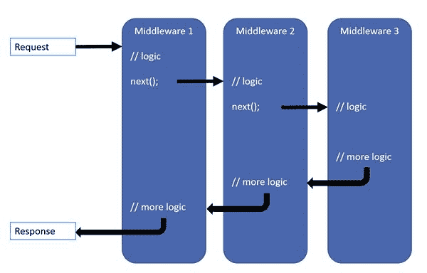
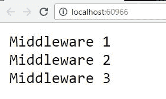
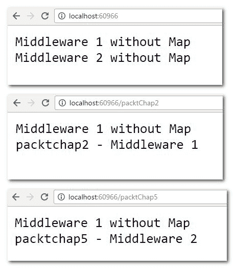
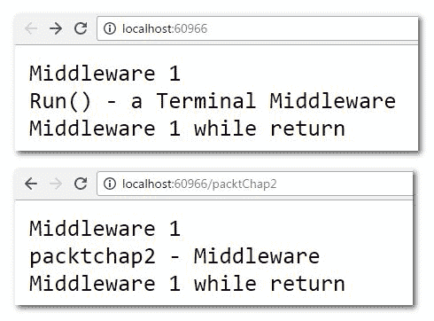
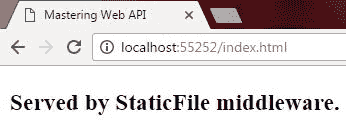
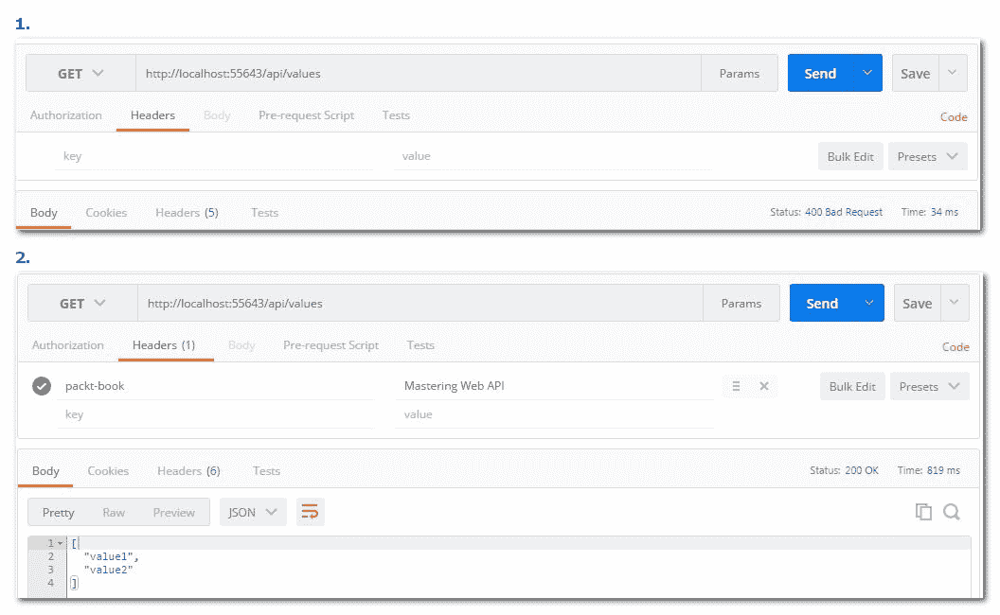
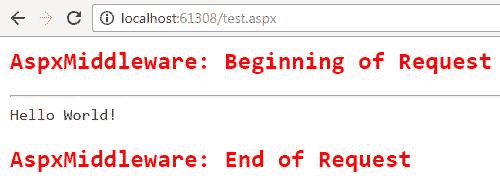
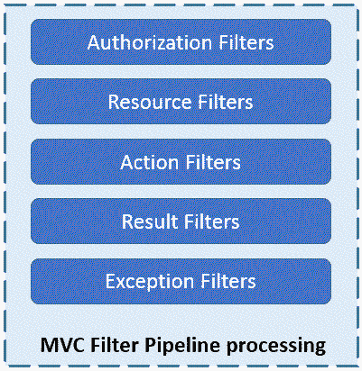

# 中间件和过滤器

任何 web 应用开发框架的成功都取决于其高效处理 HTTP 请求和响应的能力。任何 HTTP 请求都必须经过一系列的验证和确认，才能访问请求的资源。

当大量的同时请求到达 web 服务器时，快速地为它们提供服务而不会在负载下崩溃是设计良好的 web 应用的一个关键因素。这涉及到基于模块化方法设计框架，只有在需要时，我们才能使用功能。

NET Core是开发现代 web 应用的完全模块化方式；它的设计理念是包含您所需的内容，而不是包含所有功能，这使得处理请求变得非常繁重。

中间件和过滤器是 ASP.NET Core的这些特性，它们在 HTTP 请求的处理中起着重要作用。在本章中，您将深入了解这两个特性。

在本章中，我们将介绍以下主题：

*   引入中间件
*   HTTP 请求管道和中间件
*   中间件的顺序
*   内置中间件
*   创建自定义中间件
*   将 HTTP 模块迁移到中间件
*   引入过滤器
*   动作过滤器
*   身份验证和授权筛选器
*   异常过滤器

# 引入中间件

假设您创建了 ASP.NET Core应用（MVC 或 web API）、控制器和连接到数据库的操作方法来获取记录，然后添加了身份验证；一切顺利。

为了好玩，对`Startup`类的`Configure`方法中的代码进行注释并运行应用。令人惊讶的是，不会出现任何构建错误，并且会显示一个空白的浏览器窗口。

导航到任何路线、页面或资源时，始终会返回一个空白屏幕。深入研究这一点，我们可以得出以下结论：

*   `Configure`方法是 HTTP 请求到达时的起点之一
*   当请求到达时，必须有人处理请求并返回响应
*   HTTP 请求在访问资源之前必须经历各种操作，如身份验证、CORS 等

`Startup`类的`Configure`方法是 HTTP 请求管道的中心；此管道中的任何软件组件在 ASP.NET Core中都称为中间件。他们根据在管道中的放置顺序负责请求和响应处理。

每个中间件都可以设计为将请求传递到下一个中间件或结束请求处理管道。请求管道是使用请求委托构建的。请求委托处理每个 HTTP 请求。

Without middleware components, ASP.NET Core does nothing.

`Configure`方法将其中一个参数作为`IApplicationBuilder`。此接口提供了配置应用请求管道的机制。使用`IApplicationBuilder`接口的以下四种扩展方法配置请求委托：

*   `Use()`方法将中间件请求委托添加到应用管道中。请求委托处理程序可以是匿名方法或可重用类。
*   `Run()`方法在应用管道中也称为终端中间件委托。在此之后将不处理任何内容。
*   `Map()`方法根据请求路径的匹配对请求管道进行分支。
*   `Mapwhen()`方法根据给定谓词或条件的结果分支请求管道。

让我们了解各种中间件组件如何与`IApplicationBuilder`协同工作。

# HTTP 请求管道和中间件

ASP.NET Core请求管道处理完全重写了传统 ASP.NET 请求处理。每个请求都通过一系列请求委托进行处理，以返回响应。

ASP.NET Core文档描述了 HTTP 请求处理，如以下屏幕截图所示：



HTTP request processing in ASP.NET Core

蓝色条表示，一旦 HTTP 请求到达管道（即`Configure`方法），中间件组件（内置或定制）就会遇到**中间件 1**组件。请求处理在**//逻辑**中进行，然后使用`next()`将请求按顺序传递给下一个中间件。

请求处理到达**中间件 2**组件，进行处理，并使用`next()`传递到下一个**中间件 3**。这里，在处理请求之后，它没有遇到`next()`，这表示序列在此结束并开始返回响应。

响应按相反顺序处理--**中间件 3**、**中间件 2**和**中间件 1**，因为最终响应返回给客户端。

`IApplicationBuilder`按顺序跟踪请求处理管道；这样，很容易顺利地处理请求和响应。

请求代理的设计应具有特定的重点，而不是将多个代理组合成一个组件。中间件应尽可能精简，以使其可重用。

中间件可以传递请求以进行进一步处理，也可以自行停止传递以处理请求。例如身份验证、CORS、开发人员异常页面等。

# 运行中的中间件

在上一节中，我们研究了中间件请求管道处理的图形表示。在本节中，您将通过编写代码来了解中间件在请求管道中的角色。

创建一个空的 ASP.NET Core应用，并注释掉/删除`Startup`类的`Configure`方法中的默认代码。

我们将编写一段代码来理解上一节中的四种扩展方法：`Use()`、`Run()`、`Map()`和`IApplicationBuilder`的`MapWhen()`。

中间件组件接受`RequestDelegate`方法。它们是处理带有签名的 HTTP 请求的函数，如下所示：

```cs
    public delegate Task RequestDelegate(HttpContext context); 

```

它接受一个参数`HttpContext`并返回`Task`，异步工作。

# 用法（）

当中间件被写为`app.Use(...)`时，一个中间件委托被添加到应用的请求管道中。它可以作为内联委托或在类中编写。

它可以将处理传递到下一个中间件或结束处理它的管道。`Use`扩展方法让代理接受两个参数，第一个参数是`HttpContext`，第二个参数是`RequestDelegate`。

可以编写非常基本的中间件，如以下代码段所示：

```cs
    app.Use(async (context, next) => 
   { 
     await context.Response.WriteAsync("Middleware 1"); 
   }); 

```

运行此代码将在浏览器上显示`Middleware 1`。

该中间件组件确实具有在响应时写入内容的逻辑，但它不会调用任何其他中间件，因为缺少请求委托的第二个参数。

要调用下一个中间件，我们需要调用请求委托`next`的`Invoke()`方法，如下代码所示：

```cs
    public void Configure(IApplicationBuilder app, IHostingEnvironment 
     env, ILoggerFactory loggerFactory) 
    { 
      app.Use(async (context, next) => 
      { 
        await context.Response.WriteAsync("Middleware 1<br/>"); 
        // Calls next middleware in pipeline 
        await next.Invoke(); 
      }); 

      app.Use(async (context, next) => 
      { 
        await context.Response.WriteAsync("Middleware 2<br/>"); 
        // Calls next middleware in pipeline 
        await next.Invoke(); 
      }); 

      app.Use(async (context, next) => 
      { 
        await context.Response.WriteAsync("Middleware 3<br/>"); 
        // No invoke method to pass next middleware 
      }); 

      app.Use(async (context, next) => 
      { 
        await context.Response.WriteAsync("Middleware 4<br/>"); 
        // Calls next middleware in pipeline 
        await next.Invoke(); 
     }); 
   } 

```

我们可以将前面的代码分解如下：

*   `Middleware 1`、`Middleware 2`、`Middleware 3`和`Middleware 4`是简单的内联中间件示例。
*   `Middleware 1`和`Middleware 2`具有调用管道中`next`中间件的请求委托。
*   `Middleware 3`没有`next`调用代码，管道将推断这是最后一个请求委托并停止进一步处理。这就是所谓的**短路**。
*   尽管`Middleware 4`是用`next`调用编写的，但它并没有被称为`Middleware 3`，因为它还并没有通过请求处理。

运行应用以在浏览器中查看中间件响应。`Middleware 4`的响应没有写入，因为管道已经处理过`Middleware 3`是最后一个，并且进一步结束处理，即管道结束处理：



Middleware using app.Use (...)

# 运行（）

`Run()`方法在管道上增加了一个`RequestDelegate`终端。在`Run`之后编写的任何中间件组件都不会被处理，因为 ASP.NET Core将其视为管道处理的结束。

在使用`Use()`编写中间件之前，复制`Configure`方法开头的以下代码段：

```cs
    app.Run(async context => { 
      await context.Response.WriteAsync("Run() - a Terminal Middleware 
      <br/>"); 
    }); 

```

运行应用时，您只会看到执行了`Run()`中间件，而其余的中间件（1,2,3,4）根本没有执行。

一些中间件确实公开了这种方法，并将其视为终端中间件。不应该在代码中使用它来终止请求处理。

Adopt the `Use()` method for request processing because it can either pass or short circuit requests.

# 地图（）

`Map()`方法提供了基于请求路径匹配的中间件管道处理分支能力。`Map()`方法有两个参数：`PathString`和名为`Configuration`的委托人。

下面的代码片段显示了`Map()`正在运行；在`Configure`方法中复制并运行应用：

```cs
    public void Configure(IApplicationBuilder app, 
     IHostingEnvironment env, ILoggerFactory loggerFactory) 
    { 
      app.Use(async (context, next) => 
      { 
        await context.Response.WriteAsync("Middleware 1 without Map 
        <br/>"); 
        await next(); 
      }); 

      // Get executed only on "/packtchap2" 
      app.Map(new PathString("/packtchap2"), branch => 
      { 
        branch.Run(async context => { await 
        context.Response.WriteAsync("packtchap2 - Middleware 1 
        <br/>"); }); 
      }); 

      // Get executed only on "/packtchap5" 
      app.Map(new PathString("/packtchap5"), branch => 
      { 
        branch.Run(async context => { await context.Response.WriteAsync(
          "packtchap5 - Middleware 2 <br/>"); }); 
      }); 

      app.Run(async context => { await context.Response.WriteAsync("
        Middleware 2 without Map <br/>"); }); 
    } 

```

运行应用以查看其运行情况。导航至`http://localhost:60966/packtChap3`和`http://localhost:60966/packtChap5`。

The port number 60966 will be different when it is run on your machine.

我们可以将代码分解如下：

*   `packtchap2`和`packtchap5`中间件只有在分支时才能执行。
*   无论映射分支如何，都会执行`Middleware 1 without Map`。
*   应用上述任何分支时，`Middleware 2 without Map`将不会执行。这很明显，因为管道处理已经改变了方向。

分支中间件可以包含任意数量的中间件组件。下面的屏幕截图显示了`Map()`正在运行：



Map (...) in action

# MapWhen（）

与`Map()`方法类似，但对 URL、请求头、查询字符串等有更多的控制。`MapWhen()`方法在检查`HttpContext`作为参数的任何条件后返回布尔值。

在`Startup`类的`Configure`方法中复制以下代码段：

```cs
    public void Configure(IApplicationBuilder app, IHostingEnvironment env,
      ILoggerFactory loggerFactory) 
    { 
      app.Use(async (context, next) => 
      { 
        await context.Response.WriteAsync("Middleware 1 - Map When <br/>"); 
        await next(); 
      }); 

      app.MapWhen(context => 
        context.Request.Query.ContainsKey("packtquery"), (appbuilder) => 
      { 
        appbuilder.Run(async (context) => 
        { 
          await context.Response.WriteAsync("In side Map When <br/>"); 
        }); 
      }); 
    } 

```

运行此示例将显示以下结果：


MapWhen in action

当 URL 将查询字符串映射到`packtquery`时，请求管道处理分支并执行基于`MapWhen()`的中间件。

# 中间件的顺序

ASP.NET Core请求管道处理通过按照`Startup`类的`Configure`方法中放置的顺序运行中间件组件来工作。

请求处理的图形表示描述了中间件的执行顺序。序列顺序是通过放置`Use`、`Run`、`Map`和`MapWhen`扩展方法代码来创建的。调用下一个中间件决定了中间件的执行顺序。

以下是中间件顺序扮演重要角色的一些现实场景：

*   身份验证中间件应该首先处理请求。只有经过身份验证的请求才允许访问应用。
*   在 WebAPI 项目中，CORS 中间件与初始中间件和身份验证中间件非常适合。
*   自定义中间件可以在访问资源之前执行一些自定义处理，即使请求已通过身份验证。
*   在将 web API 响应返回到客户端之前，需要对其进行修改。

以下代码片段显示了中间件顺序的重要性：

```cs
    public void Configure(IApplicationBuilder app, IHostingEnvironment env,
      ILoggerFactory loggerFactory) 
    { 
      app.Use(async (context, next) => 
      { 
        await context.Response.WriteAsync("Middleware 1<br/>"); 
        // Calls next middleware in pipeline 
        await next.Invoke(); 
        await context.Response.WriteAsync("Middleware 1
          while return<br/>"); 
      }); 

      app.Map(new PathString("/packtchap2"), branch => 
      { 
        branch.Run(async context => { await context.Response.WriteAsync("
          packtchap2 - Middleware 1<br/>"); }); 
      }); 

      app.Run(async context => { 
        await context.Response.WriteAsync("Run() - a Terminal 
          Middleware <br/>"); 
      }); 

      app.Use(async (context, next) => 
      { 
        await context.Response.WriteAsync("Middleware 2<br/>"); 
        // Calls next middleware in pipeline 
        await next.Invoke();                 
      }); 
    } 

```

运行应用以在浏览器中查看结果，如以下屏幕截图所示：



Middleware order in action

我们可以将代码分解如下：

*   使用`Use(...)`编写的中间件在使用`Invoke()`方法传递到下一个中间件之前进行处理
*   执行`Middleware 1`并返回响应
*   使用`Run`编写的中间件得到处理并开始中间件的反向执行，因为`Run()`是终端（end）
*   `Middleware 2`因为前面有`Run()`而从未接到电话
*   只有当`packtchap2`路径字符串有效时，才会执行`Middleware using Map()`

# 内置中间件

ASP.NET Core团队已经编写了许多内置中间件来满足各种各样的需求。一些内置中间件如下所示：

*   **认证**：用于认证支持，如登录、注销等。
*   **CORS**：配置用于 web API 项目的跨源资源共享。
*   **路由**：定义并约束请求路由。[第 5 章](05.html#3EK181-b5b28eac0b2e417189a3e09b61402d4f)*实施路由*的，是专门针对路由的。
*   **会话**：提供对用户会话管理的支持。
*   **静态文件**：支持作为`wwwroot`的一部分提供静态文件和目录浏览服务。

# 使用静态文件中间件

静态文件（HTML、CSS、图像、JS 文件）由 ASP.NET Core应用中的`wwwroot`文件夹提供。在本节中，让我们添加一个内置的静态文件服务中间件，用于加载`wwwroot`文件夹中的所有资产。

创建一个空的 ASP.NET Core项目，也可以从前面的中间件代码示例继续。用于提供静态内容的`Microsoft.AspNetCore.StaticFiles`NuGet 包已经是`Microsoft.AspNetCore.All`的一部分。

打开`Startup`类，在`Configure`方法中添加以下代码使用此`StaticFiles`中间件：

```cs
    app.UseStaticFiles(); 

```

在`wwwroot`中创建一个 HTML 文件`index.html`；这是应用运行时将提供的静态文件：

```cs
    <!DOCTYPE html> 
    <html> 
      <head> 
        <meta charset="utf-8" /> 
        <title>Mastering Web API</title> 
      </head> 
      <body> 
        <h3>Served by StaticFile middleware.</h3>  
      </body> 
    </html> 

```

运行应用时，您会看到`index.html`正在浏览器上服务，如下图所示：



Index.html served by StaticFile middleware

# 编写自定义中间件

对于请求管道处理，每个项目都有自己的特定于业务或领域的需求。内置中间件已经足够好了，但是编写自定义中间件可以让我们更好地控制请求处理策略。

在本节中，我们将编写有关 web API 项目的自定义中间件组件。通过考虑以下几点，可以编写自定义中间件：

*   具有中间件名称的 C#类
*   一个`RequestDelegate`变量--`_next`--用于调用管道中的下一个中间件
*   接受使用 DI 注入的请求委托对象的类构造函数
*   一种以`HttpContext`为参数异步返回`Task`的`Invoke`方法

我们将编写一个带有业务场景的定制中间件，因为每个请求都应该包含`packt-book`头，其值应该是`Mastering Web API`。如果标头值丢失或不正确，则 HTTP 响应应该是错误的请求，如果匹配正确，则 web API 应该返回请求资源。

创建一个名为`PacktHeaderValidator`的 C#类，并在其中复制以下代码：

```cs
    using Microsoft.AspNetCore.Builder; 
    using Microsoft.AspNetCore.Http; 
    using System.Threading.Tasks; 

    namespace custom_middleware 
    { 
      // Custom ASP.NET Core Middleware 
      public class PacktHeaderValidator 
      {     
        private RequestDelegate _next; 

        public PacktHeaderValidator(RequestDelegate next) 
        { 
           _next = next; 
        } 

        public async Task Invoke(HttpContext context) 
        { 
          //If matches pipeline processing continues 
          if (context.Request.Headers["packt-book"].Equals(
            "Mastering Web API")) 
          {    
             await _next.Invoke(context); 
          } 
          else 
          { 
             // Pipeline processing ends 
             context.Response.StatusCode = 400; //Bad request 
          }             
        } 
      } 

      #region ExtensionMethod 
      //Extension Method to give friendly name for custom middleware 
      public static class PacktHeaderValidatorExtension 
      { 
        public static IApplicationBuilder 
          UsePacktHeaderValidator(this IApplicationBuilder app) 
        { 
          app.UseMiddleware<PacktHeaderValidator>(); 
          return app; 
        } 
      } 
      #endregion 
    } 

```

在`Startup`类的`Configure`方法中使用这个新创建的自定义中间件，如下所示：

```cs
    public void Configure(IApplicationBuilder app, IHostingEnvironment env,
      ILoggerFactory loggerFactory) 
    { 
      //Custom middleware added to pipeline 
      app.UsePacktHeaderValidator(); 
      app.UseMvc(); 
    } 

```

我们可以将代码分解如下：

*   `PacktHeaderValidator`类查找`packt-book`头值。
*   如果`packt-book`值匹配，管道过程继续。它返回 web API 控制器数据。
*   如果`packt-book`值不匹配，则管道处理结束。
*   `Configure`方法中增加了中间件`PacktHeaderValidator`。`UseMvc()`中间件操作仅在标头值匹配时执行。

为了测试这个代码示例，我们将使用 Postman 工具进行测试。我们可以传递头值、查看状态代码以及 API 响应：

*   运行（*F5*）在编写自定义中间件的地方投影的 web API
*   打开邮递员工具，使用`GET`访问 URL`http://localhost:55643/api/values`
*   使用有效和无效的标题值进行测试以查看结果，如以下屏幕截图所示：



Custom middleware in action

# 将 HTTP 模块迁移到中间件

在 ASP.NET Core之前，ASP.NET 世界有 HTTP 处理程序和 HTTP 模块的概念。它们是请求管道的一部分，可以在整个请求过程中访问生命周期事件。

它们类似于 ASP.NET Core中的中间件概念。在本节中，我们将把 HTTP 模块迁移到 ASP.NET Core中间件。

编写 HTTP 模块并在`web.config`中注册它们超出了本书的范围；我们将参考这篇 MSDN 文章，*演练：创建和注册自定义 HTTP 模块*（[https://msdn.microsoft.com/en-us/library/ms227673.aspx](https://msdn.microsoft.com/en-us/library/ms227673.aspx) ），并迁移到 ASP.NET Core中间件。

总结本文——当文件扩展名请求为`.aspx`时，HTTP 模块在响应的开始和结束处追加一个字符串。

创建 C#类`AspxMiddleware`，该类会查找包含路径`.aspx`的请求。如果存在，那么它将以适当的文本作为代码的一部分进行响应。还编写了一个扩展方法，用于`Startup`类中的`Configure`方法，如下所示：

```cs
    using Microsoft.AspNetCore.Builder; 
    using Microsoft.AspNetCore.Http; 
    using System.Threading.Tasks; 

    namespace httpmodule_to_middleware 
    { 
      public class AspxMiddleware 
      { 
        private RequestDelegate _next; 
        public AspxMiddleware(RequestDelegate next) 
        { 
          _next = next; 
        } 

        public async Task Invoke(HttpContext context) 
        { 
          if (context.Request.Path.ToString().EndsWith(".aspx")) 
          { 
            await context.Response.WriteAsync("<h2><font color=red>" + 
             "AspxMiddleware: Beginning of Request" + 
             "</font></h2><hr>"); 
          } 

          await _next.Invoke(context); 

          if (context.Request.Path.ToString().EndsWith(".aspx")) 
          { 
            await context.Response.WriteAsync("<hr><h2><font color=red>" + 
              "AspxMiddleware: End of Request</font></h2>"); 
          } 
        } 
      } 

      #region ExtensionMethod 
      //Extension Method to give friendly name for custom middleware 
      public static class AspxMiddlewareExtension 
      { 
        public static IApplicationBuilder UseAspxMiddleware(this
          IApplicationBuilder app) 
        { 
          app.UseMiddleware<AspxMiddleware>(); 
          return app; 
        } 
      } 
      #endregion 
    } 

```

在`Startup`类的`Configure`方法中调用中间件，如下所示：

```cs
    public void Configure(IApplicationBuilder app, IHostingEnvironment env,
      ILoggerFactory loggerFactory) 
    { 
      // Calling HTTP module migrated to middleware 
      app.UseAspxMiddleware(); 
      app.Run(async (context) => 
      { 
        await context.Response.WriteAsync("Hello World!"); 
      }); 
    } 

```

运行应用查看中间件响应，我们将 HTTP 模块的`BeingRequest`和`EndRequest`转换为中间件类，如下图所示：



HTTP modules into Middleware in action

# 引入过滤器

中间件是 ASP.NET Core中一个强大的概念；适当设计的中间件可以减少应用中请求处理的负担。NET Core应用，无论是 MVC 还是 web API，都在 MVC 中间件上工作，处理身份验证、授权、路由、本地化、模型绑定等。

ASP.NET MVC 应用包含控制器和操作，如果需要，控制它们的执行将非常有用。

过滤器帮助我们在执行管道中的特定阶段之前或之后运行代码。它们可以配置为全局运行、每个控制器或每个操作。

# 过滤管道

过滤器在 MVC 上下文中运行；它与 MVC 操作调用管道一起运行，该管道也称为**过滤器管道**。

过滤器管道以以下方式执行：

*   仅当 MVC 中间件接管时启动。这就是过滤器不属于其他中间件的原因。
*   授权过滤器是第一个运行的；如果未经授权，则会立即使管道短路。
*   资源筛选器对授权请求生效。它们可以在请求的开始和结束时运行，然后再离开 MVC 管道。
*   动作是 MVC 的重要组成部分。操作过滤器在控制器的操作执行之前或之后运行。他们可以访问模型绑定参数。
*   每个动作都会返回结果；结果过滤器与结果（之前或之后）一起使用。
*   未捕获的异常必然会发生在应用中，处理它们至关重要。对于这些类型的异常，可以全局应用自定义编写的过滤器来跟踪它们。



MVC Filter pipeline

# 过滤器作用域

过滤器能够将其划分为三个级别，这使它成为 ASP.NET MVC 应用中的一个强大功能。

过滤器可以全局应用，也可以每个控制器或每个操作级别应用：

*   过滤器的写入属性可以应用于任何级别。如果不是真的需要，则在每个控制器或每个操作上应用全局筛选器。
*   控制器属性过滤器应用于控制器及其所有动作方法。
*   操作属性筛选器仅应用于特定操作。这为应用过滤器提供了更大的灵活性。
*   操作执行时的多个筛选器由 order 属性确定。如果出现相同的命令，则执行从全局级别开始，然后是控制器，最后是操作级别。
*   当操作运行时，过滤器的顺序颠倒，即从操作到控制器再到全局过滤器。

# 动作过滤器

动作筛选器是可应用于控制器或特定动作方法的属性。

动作过滤器实现`IActionFilter`或`IAsyncActionFilter`接口。他们可以查看和直接修改操作方法的结果。

让我们使用`IActionFilter`接口创建一个简单的操作过滤器。检查表头录入`publiser-name`；如果其值与`Packt`不匹配，则返回动作结果`BadRequestObjectResult`。

在 ASP.NET Core Web API 项目中添加`CheckPubliserNameAttribute`类。复制以下代码段：

```cs
    using Microsoft.AspNetCore.Mvc; 
    using Microsoft.AspNetCore.Mvc.Filters; 

    namespace filters_demo  
    { 
      //Action Filter example 
      public class CheckPubliserNameAttribute : TypeFilterAttribute 
      { 
        public CheckPubliserNameAttribute() : base(typeof 
          (CheckPubliserName)) 
        { 
        } 
      } 
      public class CheckPubliserName : IActionFilter 
      { 
        public void OnActionExecuted(ActionExecutedContext context) 
        { 
          // You can work with Action Result 
        } 

        public void OnActionExecuting(ActionExecutingContext context) 
        { 
          var headerValue = context.HttpContext.Request.Headers[
            "publiser-name"];             
          if (!headerValue.Equals("Packt")) 
          { 
             context.Result = new BadRequestObjectResult("Invalid Header");                
          } 
        } 
      } 
    } 

```

打开`ValuesController`并将前面代码中创建的`Action`过滤器添加到`Get()`方法中，如下代码所示：

```cs
    [HttpGet] 
    [CheckPubliserName] 
    public IEnumerable<string> Get() 
    { 
      return new string[] { "value1", "value2" }; 
    } 

```

我们可以将代码分解如下：

*   `CheckPubliserName`类实现`IActionFilter`并检查`OnActionExecuting`方法中的头值。
*   在`ValuesController`类中，`Get`方法增加了动作过滤器`CheckPubliserName`。此方法仅在传递有效标头时返回数据。

使用有效标头运行应用以查看响应。

In this example, we can see the difference between middleware and filter, as filter can be applied to the `Action` method or `Controller`.


Action Filter in returns response

# 授权过滤器

这些过滤器控制对操作方法或控制器的访问。它们是第一个在过滤器管道中执行的。一旦`Authorization`过滤器被授权，其他过滤器将被执行。

创建`ProductsController`在 web API 项目中，下面的代码片段在控制器级别添加了`Authorize`属性。表示未经授权不能访问任何操作方法。

`Get()`方法用`AllowAnonymous`属性修饰；它允许访问操作方法：

```cs
    using Microsoft.AspNetCore.Authorization; 
    using Microsoft.AspNetCore.Mvc; 
    using System; 

    namespace filters_demo.Controllers 
    { 
      [Route("api/[controller]")] 
      [Authorize] 
      public class ProductsController : Controller 
      { 
        // GET: api/values 
        [HttpGet] 
        [AllowAnonymous] 
        public string Get() 
        { 
          return "Year is " + DateTime.Now.Year.ToString(); 
        } 

        // GET api/values/5 
        [HttpGet("{id}")] 
        public string Get(int id) 
        {    
          return "value is " + id; 
        } 
      } 
    } 

```

运行应用并使用 Postman 访问产品 API。

# 异常过滤器

在 ASP.NET Core中，异常可以通过两种方式处理：通过`UseExceptionHandler`中间件或使用`IExceptionFilter`接口编写我们自己的异常处理程序。

我们将使用`IExceptionFilter`接口编写一个自定义异常处理程序，在 MVC 服务中全局注册它，并对其进行测试。

创建`PacktExceptionFilter`类，实现`IExceptionFilter`接口和`OnException`方法。此筛选器读取异常并准备将其发送到客户端，如下所示：

```cs
    using Microsoft.AspNetCore.Http; 
    using Microsoft.AspNetCore.Mvc.Filters; 
    using System; 
    using System.Net; 

    namespace filters_demo 
    { 
      // Exception Filter example 
      public class PacktExceptionFilter : IExceptionFilter 
      {  
        public void OnException(ExceptionContext context) 
        { 
          HttpStatusCode status = HttpStatusCode.InternalServerError; 
          String message = String.Empty; 

          var exceptionType = context.Exception.GetType(); 

          if (exceptionType == typeof(ZeroValueException)) 
          { 
             message = context.Exception.Message; 
             status = HttpStatusCode.InternalServerError; 
          } 
          HttpResponse response = context.HttpContext.Response; 
          response.StatusCode = (int)status;             
          var err = message; 
          response.WriteAsync(err); 
        } 
      } 
    } 

```

创建`ZeroValueException`类作为`Exception`类：

```cs
    using System; 
    namespace filters_demo 
    { 
      public class ZeroValueException : Exception 
      { 
        public ZeroValueException(){} 

        public ZeroValueException(string message) 
        : base(message) 
        { } 

        public ZeroValueException(string message, Exception innerException) 
        : base(message, innerException) 
        { } 
      } 
    } 

```

打开`Startup`类，修改`ConfigureServices`方法，将 MVC 服务包含在异常过滤选项中：

```cs
    public void ConfigureServices(IServiceCollection services) 
    {             
      // Exception global filter added 
      services.AddMvc(config => { 
        config.Filters.Add(typeof(PacktExceptionFilter)); 
      }); 
    } 

```

创建`EmployeeController`web API 控制器。下面的代码片段显示，如果`id`是`0`，则`Get()`方法抛出异常：

```cs
    using System; 
    using Microsoft.AspNetCore.Mvc; 

    namespace filters_demo.Controllers 
    { 
      [Route("api/[controller]")] 

      public class EmployeeController : Controller 
      { 
        // GET api/values/5 
        [HttpGet("{id}")] 
        public string Get(int id) 
        { 
          if (id == 0) 
          { 
             throw new ZeroValueException("Employee Id Cannot be Zero"); 
          } 
          return "value is " + id; 
        } 
      }
    } 

```

运行应用，通过将 id 传递为零（0）来访问`Employee`API。应用以异常消息响应我们：


Exception filter in action

# 总结

在本章中，您学习了大量关于中间件、请求管道的知识，并了解了中间件及其顺序。我们编写了定制中间件，并将 HttpModule 迁移到中间件。中间件的概念是请求处理的核心。

您深入了解了过滤器、其管道、排序，并创建了操作过滤器和异常过滤器，还了解了授权过滤器。

在下一章中，我们将着重于编写单元测试和集成测试。