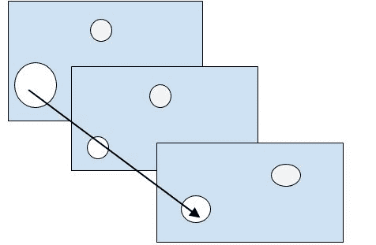
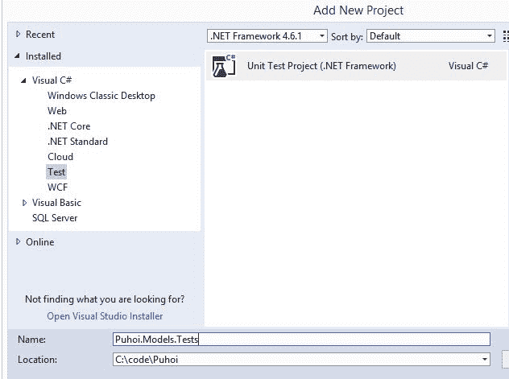
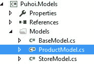
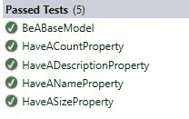
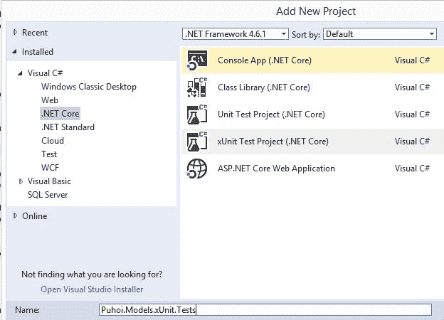

# 执行单元和集成测试

没有一个系统是 100%正确的。每个系统或过程都有缺陷。要知道你写的每件事都是不正确的——它可能会发生变化，需要纠正。世界上一些最好的系统就是围绕这一事实建模的。

特别是航空业，我们知道除了最近发生的事故外，事故很少。他们的风险是围绕系统性故障或瑞士奶酪模型建模的，如下图所示：



系统的每个组件都可能有 bug，这是意料之中的。当孔排成一条直线并暴露出缺陷时，问题就产生了。一路上有一组足够的测试可以帮助解决这个问题。

在本章中，我们将介绍以下主题：

*   测试驱动开发
*   集成 API 测试
*   单元测试

# Bob 叔叔关于测试驱动开发的三条规则

以下是关于**测试驱动开发**（**TDD**的一些指南：

*   仅编写代码以使测试通过
*   编写测试时，编写最小值以使测试失败；这包括未编译的代码
*   编写最少的代码以通过测试

话虽如此，另一条经验法则是红绿重构。

# 红绿重构

写一个测试；如果没有编译，这是红色的。让它过去，那是你的绿色。然后将代码重构，而不是单元测试，重构到你的核心内容，这就是你的重构。

所以红色，绿色，重构，这应该是你的口头禅。

我知道我已经开始了前面章节中的生产代码。如果这是一本关于 TDD 的书，那么我会从测试开始。我们的目标是引入 ASP.NET Core 2.0。

我们将回到我们开始的例子，Puhoi 奶酪，我将重述我们正在存储并可以检索我们拥有的一些存储。商店有一个描述和它拥有的产品数量，以及其他数据。

假设我们想在此基础上进行扩展，并提供一些有关产品的信息。

产品将有名称、一些描述、价格、库存数量和尺寸（目前，我们将保持尺寸简单）。我们开始吧。

首先创建一个测试项目——我们将从我们的模型开始，然后逐步进行：



我为我们的`ProductModel`测试创建了一个新类，如下所示：


让我们编写第一个测试，考虑红绿重构和 TDD 的三条规则。

通过创建一个不存在的新`ProductModel`类，我们有编译错误，这是我们的红色，如下所示：

```cs
    [TestMethod] 
    public void BeABaseModel() 
    { 
      // arrange 
      ProductModel model = new ProductModel(); 

```

要使此测试通过，我们需要创建一个`ProductModel`类：



添加对测试项目的引用，现在我们可以构建我们的测试项目。让我们完成测试：

```cs
    [TestMethod] 
    public void BeABaseModel() 
    { 
      // arrange 
      ProductModel model = new ProductModel(); 

      // act 
      BaseModel baseModel = (BaseModel) model; 

      // assert 
      baseModel.Should().NotBeNull(); 
    } 

```

我使用`FluentAssertions`来表示更受行为驱动的语法；添加对`FluentAssertions`的 NuGet 引用。

将`ProductModel`类固定如下：

```cs
    public class ProductModel : BaseModel 

```

弹回到测试类，并运行它。它应该通过；我们有绿色：


没有什么需要重构的，所以我们将继续进行下一个测试。希望您喜欢第一个测试单元。

让我们开始为模型属性添加测试；我将以`Description`开头，如下所示：

```cs
    [TestMethod] 
    public void HaveADescriptionProperty() 
    { 
      //arrange  
      const string testDescription = "Test Description"; 

      // act 
      ProductModel model = new ProductModel { Description = 
        testDescription };

```

我们有红色的。

将`Description`添加到`ProductModel`类中，如下所示：

```cs
    public class ProductModel : BaseModel  
    { 
      public string Description { get; set;} 

```

然后我通过添加如下断言来完成对`Description`的测试：

```cs
    [TestMethod] 
    public void HaveADescriptionProperty() 
    { 
      //arrange 
      const string testDescription = "Test Description"; 

      // act 
      ProductModel model = new ProductModel { Description = 
      testDescription }; 

      // assert 
      model.Description.Should().Be(testDescription); 
    } 

```

这是一种模式，可以应用于我们需要使用 TDD 的一整套需求的模型。

以下屏幕截图显示了一整套通过测试：



结果模型如下所示：

```cs
    public class ProductModel : BaseModel 
    { 
       public string Description { get; set; } 
       public string Name { get; set; } 
       public int Count { get; set; } 
       public string Size { get; set; } 
    } 

```

接下来，我们继续讨论验证器；与之前一样，我们将使用 Fluent 验证来帮助我们的验证案例。

我创建了一个`Valid`模型，并将其称为`Green`模型，如下所示：

```cs
    public static class GreenProductModel 
    { 
      public static ProductModel Model() 
      { 
        return new ProductModel 
        { 
          Id = Guid.NewGuid(), 
          Name = "Gold Strong Blue Cheese", 
          Description = "Award winning Blue Cheese from Puhoi Valley", 
          Count = 10000, 
          Size = "Small" 
        }; 
      } 
    }  

```

然后我们将创建一个测试，说明当我们有一个绿色模型时，我希望验证计数为零：

```cs
    [TestMethod] 
    public void ReturnNoValidationErrorsForAGreenModel() 
    { 
      // arrange 
      ProductModel model = GreenProductModel.Model(); 

      // act 
      IEnumerable<ValidationResult> validationResult = 
        model.Validate(new ValidationContext(this)); 

```

很好，我们有红色的。现在让我们让我们的模型有一个验证器：

```cs
    public class ProductModel : BaseModel, IValidatableObject 
    { 
      public string Description { get; set; } 
      public string Name { get; set; } 
      public int Count { get; set; } 
      public string Size { get; set; } 

      public IEnumerable<ValidationResult> Validate(ValidationContext
       validationContext) 
      { 
        yield return new ValidationResult(string.Empty); 
      } 
    }  
    [TestMethod] 
    public void ReturnNoValidationErrorsForAGreenModel() 
    { 
      // arrange 
      ProductModel model = GreenProductModel.Model(); 

      // act 
      IEnumerable<ValidationResult> validationResult = 
        model.Validate(new ValidationContext(this)); 

      // assert 
      validationResult.Should().HaveCount(0); 
    } 

```

我的测试结果是红色的，如以下屏幕截图所示：


现在我们必须通过这个测试。

我在`ProductModel`类上使用了`StoreModel`类的 validate 实现，这使我为`ProductModel`类创建了一个验证器，如下所示：

```cs
    public class ProductModelValidator : BaseValidator<ProductModel> 
    { 
      public ProductModelValidator() 
      {  
      } 
    } 

```

由于没有真正的验证器（这很好），这是我通过测试所需的最少代码量：


现在我将采用绿色模型，对其进行一些更改，使其成为红色模型，然后测试验证以获得验证结果。在这种情况下，我们想要不等于零的东西，我们知道我们正在测试我们的模型：

```cs
     [TestMethod] 
     public void ReturnInValidWhenNameIsEmpty() 
     { 
       // arrange  
       ProductModel model = GreenProductModel.Model(); 
       model.Name = string.Empty; 

       //act  
       IEnumerable<ValidationResult> validationResult = 
         model.Validate(new ValidationContext(this)); 

       //assert  
       validationResult.Should().HaveCount(1); 
     } 

```

前面的代码是我们的红色测试。我使用了绿色模型，并将`Name`属性设置为空字符串。调用 validate，我希望验证器返回一个无效。

现在，使测试通过的代码如下所示：

```cs
    public class ProductModelValidator : BaseValidator<ProductModel> 
    { 
      public ProductModelValidator() 
      { 
        RuleFor(p => p.Name).NotEmpty(); 
      } 
    }  

```

这将使我们的测试通过，并为属性的其余验证建立模式。

我鼓励您完成其余的验证。

在编写测试代码之后，我最终得到了以下验证器：

```cs
    public ProductModelValidator() 
    { 
      RuleFor(p => p.Name).NotEmpty(); 
      RuleFor(p => p.Description).NotEmpty(); 
      RuleFor(p => p.Size).NotEmpty(); 
    } 

```

这次所有测试都通过了，如此屏幕截图所示：


# 运行 API 测试

打开 API 项目的命令行，并使用.NET core 工具运行以下命令：

```cs
dotnet run

```


所以我们的 API 在端口`5000`上运行，或者你可以让 API 在 IIS 上运行——我选择这个，因为它更简单，允许我快速让服务器运行 API，并针对它运行一些测试。第一项测试如下：

```cs
    [TestMethod] 
    public async Task ReturnOkForHealthCheck() 
    { 
      // arrange  
      using (HttpClient client = new HttpClient()) 
      { 
        client.BaseAddress = new Uri(_baseUri); 

        //act  
        HttpResponseMessage response = await client.GetAsync("stores/healthcheck"); 

        // assert 
        response.Should().NotBeNull(); 
        response.StatusCode.Should().Be(HttpStatusCode.OK); 
      } 
    }  

```

在前面的测试代码中，我们调用控制器上的`healthcheck`端点，并检查它是否为 null，然后我们可以返回一个`OK`（200）响应。

没什么特别的，但至少有一些测试可以开始。

为了设置基址，我在`app.config`中设置了这个，并在测试初始化时得到这个值：

```cs
    private string _baseUri; 
    private const string _configurationBaseUri = "baseUri"; 

    [TestInitialize] 
    public void TestInit() 
    { 
       _baseUri = ConfigurationManager.AppSettings.Get(_configurationBaseUri); 
    } 

```

最后，在`app.config`文件中设置该值，如下所示：

```cs
    <appSettings> 
      <add key="baseUri" value="http://localhost:5000/api/"/> 
    </appSettings>  

```

# 后创建的测试

```cs
    [TestMethod] 
    public async Task ReturnCreatedForAPost() 
    { 
      // arrange  
      using (HttpClient client = new HttpClient()) 
      { 
        client.BaseAddress = new Uri(_baseUri); 
        //act  
        StoreModel storeModel = GreenStoreModel(); 
        HttpResponseMessage response = await client.PostAsJsonAsync(
          "stores", storeModel); 

        // assert 
        response.Should().NotBeNull(); 
        response.StatusCode.Should().Be(HttpStatusCode.Created); 

        // clean up 
        await DeleteStore(client, storeModel.Id); 
      } 
    } 

```

我们使用标准`HttpClient`将其包装在 using 语句中，这样当我们退出测试时，客户机就可以被清理干净。这里的通用模式也用于其他操作。

# 设置基本 URI

我们使用我们的绿色模型，然后使用客户端的`PostAsJsonAsync`注意，我们不需要对我们的模型做任何事情，只需指向客户端请求 URI，这是我们在测试中建立的。

我们断言响应不应该是空的。此外，我们希望应该创建状态代码。

# 冲突后的考验

通过这个测试，我们检查我们的服务是否以`Conflict`的状态响应。我们怎样才能做到这一点？

发送相同的数据两次，这就是我们要做的。

我们像以前一样得到了我们的绿色模型。使用我们的`HttpClient`调用`post`，虽然这是一个动作，但在这个特定测试的上下文中，它是我们设置的一部分。现在再次呼叫`post`，这就是我们的行动。然后，我们断言我们得到了一个冲突：

```cs
    [TestMethod] 
    public async Task ReturnConflictForAPost() 
    { 
      // arrange  
      using (HttpClient client = new HttpClient()) 
      { 
         client.BaseAddress = new Uri(_baseUri); 

         //arrange  
         StoreModel storeModel = GreenStoreModel(); 
         storeModel.Name = "ConflictStore"; 
         HttpResponseMessage response = await client.PostAsJsonAsync("
           stores", storeModel); 
         response = await client.PostAsJsonAsync("stores", storeModel); 

         // act  
         response = await client.PostAsJsonAsync("stores", storeModel); 

         // assert 
         response.StatusCode.Should().Be(HttpStatusCode.Conflict); 
      } 
    } 

```

# Put 测试

在`Put`测试中，我们执行 post 请求以创建资源。然后使用相同的模型，这是我们的绿色模型，并更改模型的名称。这就是我们要做的：

```cs
    storeModel.Name = "Creamy Cheese"; 

```

现在我们准备使用我们的`HttpClient`调用`put`方法，然后断言我们的响应是 OK：

```cs
    [TestMethod] 
    public async Task ReturnOkForAPut() 
    { 
      // arrange  
      using (HttpClient client = new HttpClient()) 
      { 
        client.BaseAddress = new Uri(_baseUri); 

        //arrange 
        StoreModel storeModel = GreenStoreModel(); 
        storeModel.Id = Guid.NewGuid(); 
        HttpResponseMessage response = await client.PostAsJsonAsync("stores",
          storeModel); 
        storeModel.Name = "Creamy Cheese"; 

         // act  
         string putUri = string.Format("stores/{0}", storeModel.Id); 
         response = await client.PutAsJsonAsync(putUri, storeModel); 

         // assert 
         response.StatusCode.Should().Be(HttpStatusCode.OK); 
      } 
    } 

```

# 删除测试

在`Delete`测试中，我们使用与前面测试相同的模式。我们像以前一样创建资源。然后使用`HttpClient`调用`Delete`，并断言我们得到的响应是 OK：

```cs
    [TestMethod] 
    public async Task ReturnOkForDelete() 
    { 
      // arrange  
      using (HttpClient client = new HttpClient()) 
      { 
        client.BaseAddress = new Uri(_baseUri); 

        //arrange  
        StoreModel storeModel = GreenStoreModel(); 
        storeModel.Id = Guid.NewGuid(); 
        HttpResponseMessage response = await
           client.PostAsJsonAsync("stores", storeModel); 

        // act  
        string deleteUri = string.Format("stores/{0}", storeModel.Id); 
        response = await client.DeleteAsync(deleteUri); 

        // assert 
        response.StatusCode.Should().Be(HttpStatusCode.OK); 
      } 
    } 

```

# xUnit 测试

MS 测试的另一种选择是 xUnit，一个开源单元测试框架。熟悉 nUnit 和 xUnit 的人都会喜欢在.NETCore 和 VisualStudio 中使用它。Microsoft 已将 xUnit 与.NET core SDK 打包，因此您不必将 xUnit 作为单独的软件包安装。

# 模型测试

创建新项目；这将是.NET Core 的类库。

我把它命名为`Puhoi.Models.xUnit.Tests`。我将编写本章前面为模型创建的相同测试，但作为 xUnit 测试，然后我们将查看差异：



我将`GreenProductModel`复制到项目中；可以执行此操作，也可以将文件添加为快捷方式。

为了能够使用 models 项目和公共库（即.NET 程序集），我必须将它们重新创建为.NET 核心程序集。您将在存储库中找到这些文件的副本。

现在，您应该在解决方案资源管理器中看到：


因此，添加对`Puhoi.Models.Core`的引用。

现在我们有了内部核心组件，我们现在需要外部组件。如果您还记得，我们在测试中使用了`FluentAssertions`作为我们的断言。

`FluentAssertions`是预释放，所以您必须记住勾选预释放框：


创建一个新类`ProductModelShould`，并添加以下测试：

```cs
    [Fact] 
    public void BeABaseModel() 
    { 
      // arrange  
      ProductModel model = new ProductModel(); 

      // act  
      BaseModel baseModel = (BaseModel)model; 

      // assert 
      baseModel.Should().NotBeNull(); 
    } 

```

注意我们的测试方法上面的`Fact`属性。此外，该类没有使用`TestClass`装饰。

打开命令窗口，转到测试项目所在的位置，即`..\Puhoi.Models.xUnit.Tests`，运行以下命令：

*   `dotnet restore`
*   `dotnet build`
*   `dotnet test`

我们从命令行恢复`project.json`中的包，编译测试项目，最后运行测试。您可以看到这样做的好处，它可以是对您的环境进行批处理，并最终在您的连续构建和部署上运行。

测试结果将输出到控制台：

```cs
    [TestMethod]
    public void BeABaseModel() 
    { 
      // arrange  
      ProductModel model = new ProductModel(); 

      // act  
      BaseModel baseModel = (BaseModel) model; 

      // assert 
      baseModel.Should().NotBeNull(); 
    } 

```

如果我们比较我们在 MS 测试中编写的测试，除了将`TestMethod`属性替换为`Fact`之外，其他测试都是相同的。

这并不是说您可以进行 MS 测试并交换属性，您还可以进行 xUnit 测试。让我们进一步研究我们编写的一些测试，以及如何将它们转换为 xUnit，并演示 xUnit 可以与.NET 核心程序集一起使用。

# 验证器类

此类验证我们在项目中使用的`model`对象：

```cs
    [Fact]
    public void ReturnNoValidationErrorsForAGreenModel() 
    { 
       // arrange  
       ProductModel model = GreenProductModel.Model(); 

       // act  
       IEnumerable<ValidationResult> validationResult = 
         model.Validate(new ValidationContext(this)); 

       // assert  
       validationResult.Should().HaveCount(0); 
    } 

```

前面的测试看起来非常类似于我们的 MS 测试，没有什么太令人兴奋的。

# API 测试

让我们尝试复制我们的 API 测试。创建一个名为`PuhoiAPI.xUnit.Tests`的新.Net 核心项目，并将`project.json`文件更改如下。

添加具有以下条目的`appsettings.json`文件：

```cs
    { 
      "baseUri": "http://localhost:5000/api/" 
    } 

```

如前所述，添加一个名为`StoresControllerShould`的类。如前所述复制`RedStoreModel`和`GreenStoreModel`。

这是构造器：

```cs
    public StoresControllerShould() 
    { 
       var builder = new ConfigurationBuilder().AddJsonFile("appsettings.json"); 
       var config = builder.Build(); 
       _baseUri = config[_configurationBaseUri]; 
       _jsonSerializer = new JsonSerializer(); 
    } 

```

我们使用`ConfigurationBuilder`类来读取我们的`appsettings`文件，它是 JSON 格式的。

这与我们在 MS 测试中得到的不同。当我们编写第一个测试时，很明显我们为什么需要`JsonSerializer`方法。

我们的`healthcheck`测试如下：

```cs
    [Fact]     
    public async void ReturnOkForHealthCheck() 
    { 
      // arrange  
      using (HttpClient client = new HttpClient()) 
      { 
        client.BaseAddress = new Uri(_baseUri); 

        //act  
        HttpResponseMessage response = await client.GetAsync("stores/healthcheck"); 

        // assert 
        response.Should().NotBeNull(); 
        response.StatusCode.Should().Be(HttpStatusCode.OK); 
      } 
    } 

```

打开 API 项目的命令行，键入`dotnet run`。这将启动托管 API 的 web 服务器。从 Visual Studio 中运行测试，或使用以下命令从命令行运行测试：

*   `dotnet restore`
*   `dotnet build`
*   `dotnet test`

考试会通过的。接下来，让我们编写一个测试，将一些数据发布到 API：

```cs
    [Fact] 
    public async Task ReturnCreatedForAPost() 
    { 
      // arrange  
      using (HttpClient client = new HttpClient()) 
      { 
         client.BaseAddress = new Uri(_baseUri); 
         StoreModel storeModel = GreenStoreModel(); 
         HttpContent httpContent = SerializeModelToHttpContent(
           storeModel); 

         //act  
         HttpResponseMessage response = await client.PostAsync(
           "stores", httpContent); 

         // assert 
         response.Should().NotBeNull(); 
         response.StatusCode.Should().Be(HttpStatusCode.Created); 
         await DeleteStore(client,storeModel.Id); 
      } 
    } 

```

因此，与我们的 MS 测试相比，前面的测试有一些不同之处。我们得到了我们需要的模型，但是我们必须将模型序列化到`HttpContent`。为什么？我们的`HttpClient`in.NET Core与普通的.NET 库不同。`PostSync`方法采用 URI 和`HttpContent`。在此之后，我们的断言是相同的：

```cs
    private HttpContent SerializeModelToHttpContent(object obj) 
    { 
      string storeModelJSon = _jsonSerializer.Serialize(obj); 

      HttpContent stringContent = new StringContent( 
        storeModelJSon, 
        Encoding.UTF8, 
        "application/json"); 

      return stringContent; 
    } 

```

我们使用`JsonSerializer`将对象序列化为字符串。这是转换的一个示例：

```cs
    { 
      "NumberOfProducts":5, 
      "DisplayName":"API ", 
      "Description":"Green Model", 
      "Id":"036c4610-c9c2-47ea-9aff-39e2341916e1", 
      "Name":"Test" 
    } 

```

与 MS 测试相比，这是唯一的区别，对`PUT`也是如此。

```cs
    string putUri = string.Format("stores/{0}", storeModel.Id); 
    response = await client.PutAsync(putUri, httpContent); 

```

Get 保持不变，因为我们不发送任何数据作为有效负载的一部分。

# 总结

在本章中，我们介绍了使用 Bob 叔叔的三条定律进行测试驱动的开发，同时还介绍了红绿重构来帮助我们进行测试驱动的开发。

我们使用更多的行为驱动断言创建了一些断言。然后，我们将所有这些应用于测试我们的 API，就好像我们正在运行集成测试一样。如果您已经设置了自动部署，那么所有这些都是在上下文中进行的，并且您需要确定您的 API 是完全功能的。

然后，我们介绍了 xUnit 测试，以确定何时需要将一些程序集创建为纯.NET 核心程序集。我们验证了我们用 MS 测试创建的东西也可以用 xUnit 创建的理论。

在下一章中，我们将重点介绍如何为 web API 实现不同的安全机制。