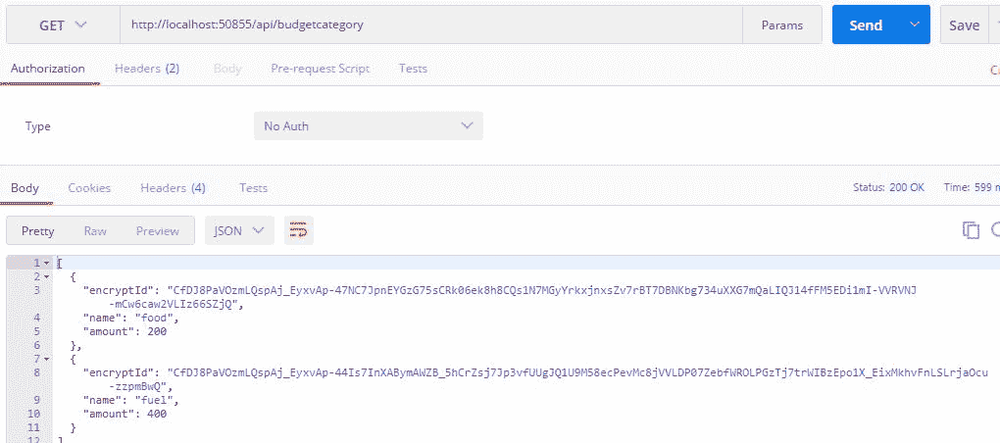
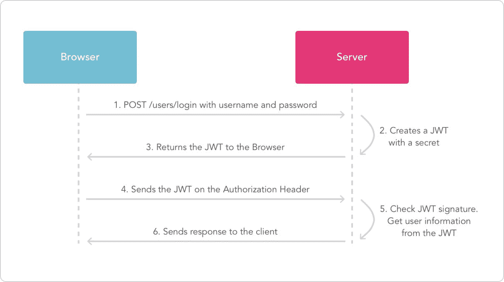
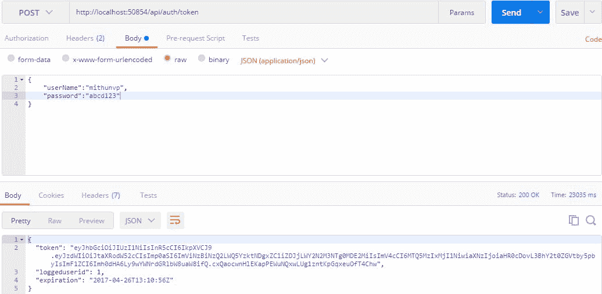
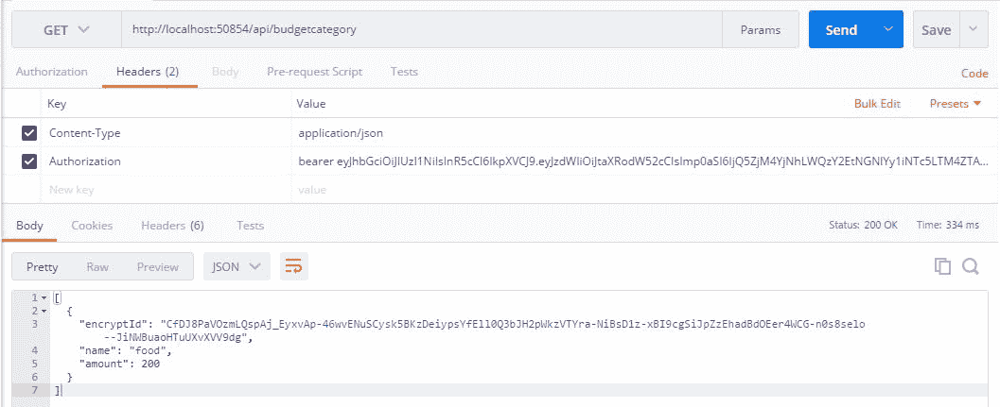
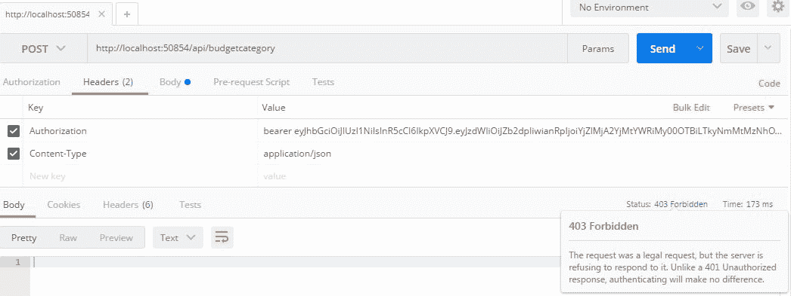
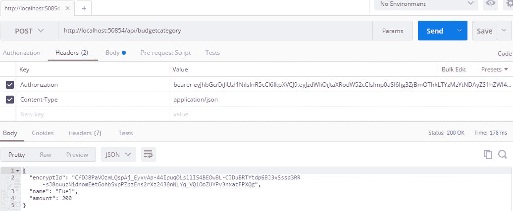
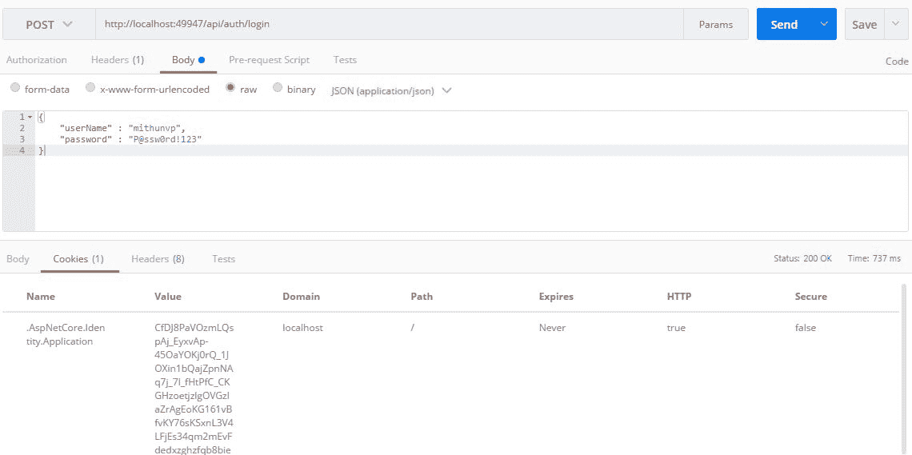

# Web API 安全

Web API 使用数据服务请求，并通过 HTTP（即 internet）使用处理后的数据进行响应。WebAPI 以 CRUD 操作的形式处理机密、个人或业务相关的数据。任何外行都会明白，对数据的 CRUD 操作不应该由每个人执行。

无论是出于积极还是消极的意图，web API 设计都将暴露在外部世界中，以便在未经许可的情况下潜入。web API 的安全性应该是我们的首要任务，重点应该放在谁将访问它，他们将访问什么，以及传输的数据有多安全。

在这个由 web 应用、移动应用、服务器-服务器通信、桌面应用等组成的异构世界中，web API 的安全性应该是无缝的，以避免在切换客户端时遇到麻烦。它应该按照身份验证和授权概念进行设计。

在本章中，我们将介绍以下主题：

*   理解威胁模型和 OWASP
*   应用 SSL
*   科尔斯
*   数据保护 API
*   保护 web API
*   实现 JWT
*   基于索赔的授权
*   webapi 中的身份管理

# 理解威胁模型和 OWASP

从一开始，直到应用在生产中使用，它都会受到各种各样的威胁。这些不同类型的威胁可能会使应用无法成功使用。因此，应对这些威胁非常重要。

# 威胁模型

识别和分类的方法以及应对威胁的过程称为**威胁建模**。这个过程的结果是一个**威胁模型**。这个过程不仅仅与代码审查、遵循编码标准或部署过程有关。

威胁建模更多地包括分析应用的安全性，在 SDLC 的早期阶段开始时更注重结果。这些威胁来自于编写的代码、部署策略、环境、其他应用和硬件故障。

大体上，威胁可以根据其性质分为三类：分解应用、对威胁进行排序，以及策略、应对措施和缓解措施。

分解应用是最基本的部分，因为它有助于更好地理解应用。这涉及到创建使用应用的用例，以及它与外部实体（如软件、补丁、其他应用、服务等）的交互。

丰富的文档帮助我们保持更新，并帮助任何新加入者很快了解应用。可以记录各种类型的信息，例如应用名称、版本、所有者、外部依赖项列表、用户数据输入的入口点、使用的各种资产以及对直接影响应用的各种依赖项的不同信任级别。

**威胁排名**将为我们提供优先威胁列表。该清单将确保持续关注最主要的威胁类别，这可能会减少威胁一再受到影响的可能性。

可以计算威胁的*恐惧（损害+再现性+可利用性+受影响用户+可发现性）*分数，以确定其优先级，Microsoft 恐惧威胁风险排名模型是对威胁进行分类的最佳方法之一。

当威胁袭来时，我们不能坐视不管，思考该怎么办。为此，需要建立相应的应对措施和缓解措施，以便在最短的停机时间内启动并运行应用。

构成通用基础的一些应对措施包括身份验证、授权、配置管理、应用数据备份、错误处理、数据验证和日志记录。还可以根据应用敏感性考虑拒绝服务和提升权限。

有关威胁建模的更多信息，请参见[https://www.owasp.org/index.php/Application_Threat_Modelin](https://www.owasp.org/index.php/Application_Threat_Modelin) 。

# OWASP

在互联网快速发展的几年中，它的使用既有积极的一面，也有消极的一面。负面方面更具挑战性，因为几乎所有类型的行业都使用 web 应用。

Web 应用经常成为漏洞的目标，提供了太多的信息，无法浏览，并且没有安全连接。

OTASP OLD T1，也称为 OutT2A.开放 Web 应用安全项目 AutoT3E.Fund，整理了许多步骤，以维护健康、安全和高效的 Web 应用而不受威胁。

在我们探索 web API（基于 REST 的服务）时，我们将简要探讨其中的几个威胁：

*   密码、会话令牌和 API 密钥（任何敏感信息）不应出现在 URL 中。由于 URL 可以在服务器日志中捕获，这就像是自愿提供信息。
*   使用 OAuth 2.0 或 OpenID Connect 作为身份验证和授权协议。
*   为适当的方法保护 HTTP 方法。有时，保护每个 HTTP（`Get`、`Post`、`Put`和`Delete`是不可取的。RESTful API 需要端点（如产品）在无需身份验证的情况下获取；但是，要添加、更新或删除，我们需要保护这些方法。
*   正确使用授权。在任何给定的应用中，仅仅作为经过身份验证的用户不应该有删除资源的自由。检查用户是否具有适当的角色，否则返回 403 禁止。

*   输入验证起着重要的作用，因为 WebAPI 没有自己的 UI。请求模型验证应该严格，以确保存储正确的数据。

*   应设置 API 速率限制以限制请求数。在暴力攻击期间，这一点尤其重要，以摧毁服务。
*   响应数据应视需要而定。一个产品类可能有 30 个属性，但它不会将所有属性返回给客户机。
*   应验证内容类型，以便不处理不需要的请求。
*   参数化值应传递给数据访问层，以避免 SQL 注入。使用 ORMs 可以解决这个问题。

在设计 web API 时，还可以考虑许多其他因素。通读[https://www.owasp.org/index.php/REST_Security_Cheat_Sheet](https://www.owasp.org/index.php/REST_Security_Cheat_Sheet) 了解更多信息。

# 应用 SSL

当 web API 请求和响应通过 internet（HTTP）传输时，我们可能会加密密码，但其余的应用数据会暴露在 internet 上。中间的人可以在客户端应用和 Web API 应用之间读取这些值。

当连接不安全时，很可能会看到数据被传输；为了克服这个问题，我们可以使用 HTTPS 使用**SSL**（**安全套接字层**）对连接进行加密。应用此方法时，与 web API 的通信应使用 HTTPS 而不是 HTTP 进行。

在 ASP.NET Core 中，可以使用`RequireHttps`属性强制 SSL，或者通过对`IServiceCollection`应用过滤器全局启用 SSL。由于我们的目的是使整个应用安全，因此我们应该应用全局过滤器来使用 HTTPS。

打开`Startup.cs`类，如果使用非开发环境，则将服务配置为使用 HTTPS。我们可以在非开发环境中启用 HTTPS，如以下代码段所示：

```cs
    public void ConfigureServices(IServiceCollection services) 
    { 
      // Add framework services. 
      services.AddMvc(); 

      //Checks if non Development environment, then enables HTTPS attribute 
      if (!env.IsDevelopment()) 
      { 
        services.Configure<MvcOptions>(o => o.Filters.Add(new
          RequireHttpsAttribute())); 
      } 
    } 

```

您可以将 ASP.NET 核心环境变量`ASPNETCORE_ENVIRONMENT`更改为生产或登台，以查看 HTTPS 的运行情况。

First-time users need to at least enable a self-signed certificate to work with HTTPS. Creating, procuring, and enabling SSL on ASP.NET Core on IIS or Nginx is beyond the scope of this book, but plenty of resources exist on internet. Check out the following links for your reference: [https://www.digicert.com/ssl-certificate-installation-microsoft-iis-7.htm](https://www.digicert.com/ssl-certificate-installation-microsoft-iis-7.htm) and [https://www.digicert.com/ssl-certificate-installation-nginx.htm](https://www.digicert.com/ssl-certificate-installation-nginx.htm)

# 科尔斯

**跨源资源共享**（**CORS**允许跨源应用访问该应用。对于 WebAPI，它是一个匿名应用，接收请求并返回响应；但是，当在另一个 web 应用中使用此 web API 时（使用 JavaScript 中的 AJAX 调用 API），客户机将位于不同的域上。

考虑一个例子，Web API 被托管为 AutoT0\. www. PoptDeMo.COM/API Oracle T1。当 web 应用调用时，API 响应为*请求的资源*上不存在访问控制允许来源标头。这意味着不允许您的域访问 API 资源。

此 CORS 概念还可用于限制任何不需要的 web 应用访问 web API。这背后的想法是在 ASP.NET 核心启动处理中添加 CORS 策略，并全局或按控制器应用它们。

在本章中，我们将构建一个演示 ASP.NET 核心 Web API 项目`PersonalBudget`，以跟踪个人支出。添加名称为`BudgetCategoryController`的 web API 控制器。

使用 index.html 页面创建两个简单的 web 应用，并使用`XMLHttpRequest`调用前面的 web API 控制器`BudgetCategoryController`，使用`GET`方法。您将在浏览器控制台中看到类似错误，如以下屏幕截图所示：


CORS error on browser console

现在，让我们将 CORS 策略添加到 web API 项目中。打开`Startup`类并用以下代码更新：

```cs
    public void ConfigureServices(IServiceCollection services) 
    { 
       // Add framework services. 
       services.AddMvc(); 

       //Code removed for brevity 
       services.AddCors(options => 
       { 
          options.AddPolicy("DemoCorsPolicy", 
          c => c.WithOrigins("http://localhost:3000/")); 
       }); 
    }         
    public void Configure(IApplicationBuilder app, IHostingEnvironment env,
       ILoggerFactory loggerFactory) 
    { 
        //Code removed for brevity 
        app.UseMvc(); 
        app.UseCors("DemoCorsPolicy"); 
    } 

```

您可以按如下方式分解前面的代码：

*   添加名称为`DemoCorsPolicy`的 CORS 策略
*   此策略将只允许来源为`localhost:3000`的请求
*   然后将策略放置在`Configure`方法中的 HTTP 管道处理中

*   要允许每个 web 应用访问 web API，请使用`*`而不是域名

运行 web API 和 web 应用；演示 web API 1 可以成功接收响应，演示 web API 2 将接收错误，如前面与 CORS 相关的代码所示。

The CORS policy can include varieties of combinations, such as Origins, Methods, Headers, and so on, making them more flexible.

# 数据保护 API

ASP.NET Core 使用`Microsoft.AspNetCore.DataProtection`处理加密密钥，用于保护在应用和客户端之间发布的状态值。

`Machine.config`密钥不再用于 ASP.NET Core 中的数据保护。数据保护是一个相当广泛的话题；您可以参考 Microsoft 文档（[https://docs.microsoft.com/en-us/aspnet/core/security/data-protection/](https://docs.microsoft.com/en-us/aspnet/core/security/data-protection/) ）了解更多信息。

The Cookie generation takes places using Data Protection APIs.

我们将以加密给定实体的 ID 值为例。

考虑具有由 ID 唯一标识的各种属性的 AuthT0.类。当我们检索预算类别或单个对象的列表时，也应该包含所传递的 ID。由于此 ID 对业务非常敏感，因此我们不必传递保存在数据库中的真实 ID。

对于这类需求，我们可以在响应时加密，在接收请求时解密。我们可以通过数据保护 API 实现这种行为。

继续前面的项目，创建两个类`BudgetCategory`和`BudgetCategoryDTO`，后一个类以`EncryptId`作为字符串，这是 ID 的加密版本。`BudgetCategoryDTO`用于请求和响应操作，对象映射使用`AutoMapper`完成。

数据保护 API 通过`ConfigureServices`方法中`Startup`类中的`services.AddDataProtection()`添加到服务中。创建一个具有属性的`StringConstants`类来保存用于加密和解密的密钥；这称为目的键：

```cs
public class StringConstants 
    { 
        public string IdQryStr => "AppIdString";  
//Name can be anything. 
    } 

```

当我们使用`AutoMapper`进行对象映射时，我们需要借助数据保护 API、`IDataProtectionProvider`接口和目的键将整数 ID 转换为字符串 ID。

使用自定义的`IdProtectorConverter`类型转换器将整数 ID 映射到字符串 ID，这需要在`Configure`方法的 HTTP 管道处理中配置，如下代码所示：

```cs
    public void Configure(IApplicationBuilder app, IHostingEnvironment env,
      ILoggerFactory loggerFactory, 
      IDataProtectionProvider dataprovider, StringConstants strconsts) 
    { 
      loggerFactory.AddConsole(); 
      AutoMapper.Mapper.Initialize(cfg => 
      { 
        cfg.ConstructServicesUsing(type => new
          IdProtectorConverter(dataprovider, strconsts)); 
        cfg.CreateMap<BudgetCategoryDTO, BudgetCategory>(); 
        cfg.CreateMap<BudgetCategory, BudgetCategoryDTO> 
         ().ConvertUsing<IdProtectorConverter>(); 
      }); 
    } 

```

自定义类型转换器`IdProtectorConverter`由`AutoMapper`使用，编写如下：

```cs
    namespace PersonalBudget 
    { 
      public class IdProtectorConverter : ITypeConverter<BudgetCategory,
        BudgetCategoryDTO> 
      { 
        private readonly IDataProtector protector;        
        public IdProtectorConverter(IDataProtectionProvider
          protectionprovider, StringConstants strconsts) 
        { 
          this.protector = protectionprovider.CreateProtector
            (strconsts.IdQryStr); 
        } 
        public BudgetCategoryDTO Convert(BudgetCategory source,
          BudgetCategoryDTO destination, ResolutionContext context) 
        { 
          return new BudgetCategoryDTO 
          { 
             Name = source.Name, 
             Amount = source.Amount, 
             EncryptId = this.protector.Protect(source.Id.ToString()) 
          }; 
        } 
      } 
    } 

```

您可以按如下方式分解前面的代码：

*   `BudgetCategory`是源，`BudgetCategoryDTO`是传递给调用 web API 的客户端的目标
*   `IDataProtectionProvider`和`StringConstants`被 DI 到构造函数中创建`IDataProtector`
*   在`Convert`方法中，使用`this.protector.Protect(source.Id.ToString())`对 ID 值进行加密

现在，客户机接收到一个加密的 ID，他们将发送该 ID 以获取特定记录。此时，我们需要解密此 ID 以传递数据源以获取记录。

我们需要调用`IDataProtector`的`Unprotect`方法将其转换回整数 ID；以下代码段执行此任务：

```cs
    [Route("api/[controller]")] 
    public class BudgetCategoryController : Controller 
    { 
       private readonly PersonalBudgetContext _context; 
       private readonly IDataProtector protector; 

       public BudgetCategoryController(PersonalBudgetContext context, 
          IDataProtectionProvider protectionprovider,
          StringConstants strconsts) 
       { 
          this.protector = protectionprovider.CreateProtector(
            strconsts.IdQryStr); 
          _context = context; 
       } 

       [HttpGet("{id}")] 
       public IActionResult Get(string id) 
       { 
          var decryptId = int.Parse(protector.Unprotect(id)); 
          var item = _context.BudgetCategories.Find(decryptId); 
          if (item == null) 
          { 
              return NotFound(); 
          } 
          var results = Mapper.Map<BudgetCategoryDTO>(item); 
          return Ok(results); 
        } 
    } 

```

运行应用添加几个`BudgetCategory`元素，并使用 Postman 检索其列表。以下屏幕截图显示了加密的 ID：



Data Protection API in action

# 保护 web API

API 控制器类是执行满足业务需求的最基本工作的 web API 应用的核心。我们需要保护它们不被未经授权的访问。

web API（控制器）使用应用于控制器的`Authorize`属性进行保护。除非识别了客户端调用，否则不会提供对控制器操作方法的访问。

以下代码片段显示应用于`BudgetCategoryController`的`Authorize`属性访问此 API 端点，并将导致未经授权的响应（HTTP 401 状态代码）：

```cs
    using Microsoft.AspNetCore.Authorization; 

    namespace PersonalBudget.Controllers 
    {  
      [Authorize] 
      [Route("api/[controller]")] 
      public class BudgetCategoryController : Controller 
      { 
        ... 
      } 
    } 

```

尝试在浏览器或邮递员上访问此端点将导致未经授权的访问，如以下屏幕截图所示：


Shows Unauthorized response on protected API endpoint

# 实现 JWT

**JWT**也称为**JSON 网络令牌**；它们是安全令牌的行业标准，用于作为 JSON 对象在客户端和服务器之间安全地传输信息。

它们因其独立、小型和完整而被广泛使用。由于尺寸较小，它们可以通过 URL、POST 参数或 HTTP 头内部发送。

JSON Web 令牌包含凭证、声明和其他信息。要了解更多关于 JWT 的信息，我建议阅读[https://jwt.io/introduction/](https://jwt.io/introduction/) 。

JWT 如此流行的原因之一是，当它与 web API 一起使用时，使用它们的客户端可以轻松工作，无论是移动应用、混合应用、web 应用，还是任何基于桌面应用或服务的编程语言。

示例 JWT 是一个加密字符串，包含用于安全通信的信息，如以下屏幕截图所示：


JSON web token sample

使用 JWT on web API 进行安全通信的工作流程可以在 JWT.io 网站上的下图中进行说明。这些步骤不言自明。



JWT and web API in action (Image Credit - jwt.io)

# 生成 JWTs

第一步是在 ASP.NET 核心 web API 项目中生成 JSON web 令牌。为此，让我们创建一个 web API 控制器--`AuthController`。

在此`AuthController`中，我们将使用包含用户名和密码的`CredentialsModel`与`AppUsers`进行核对。如果用户存在，那么我们将生成一个 JWT 令牌，作为响应传递。

我们将使用实体框架核心内存提供程序生成数据库上下文和表，并为其种子数据。请参阅[第 9 章](09.html#5J99O1-b5b28eac0b2e417189a3e09b61402d4f)、*与数据库的集成、*中关于使用 EF 6、EF Core 和 Dapper ORM 处理不同数据库的内容。

`AuthController`代码将使用`PersonalBudgetContext`，这是 EF 核心数据库上下文，以及`IConfigurationRoot`，它读取`appsettings.json`文件并包含生成 JWT 的`config`条目：

```cs
    namespace PersonalBudget.Controllers  
    {     
      public class AuthController : Controller 
      { 
        private readonly PersonalBudgetContext _context; 
        private readonly IConfigurationRoot _config; 
        public AuthController(PersonalBudgetContext context,
          IConfigurationRoot config) 
        { 
            _context = context; 
            _config = config; 
        } 

        [HttpPost("api/auth/token")] 
        public IActionResult CreateToken([FromBody] CredentialsModel model) 
        { 
            if (model == null) 
            { 
                return BadRequest("Request is Null"); 
            } 
            var findusr = _context.AppUsers.First(m => m.UserName.Equals(
              model.Username) && m.Password.Equals(model.Password)); 
            if(findusr != null) 
            { 
              var claims = new[] 
              { 
                new Claim(JwtRegisteredClaimNames.Sub, findusr.UserName), 
                new Claim(JwtRegisteredClaimNames.Jti, 
                  Guid.NewGuid().ToString()),                                     
              }; 

              var key = new SymmetricSecurityKey(
                Encoding.UTF8.GetBytes(_config["Tokens:Key"])); 
              var creds = new SigningCredentials(key,
                SecurityAlgorithms.HmacSha256); 

              var token = new JwtSecurityToken( 
                issuer: _config["Tokens:Issuer"], 
                audience: _config["Tokens:Audience"], 
                claims: claims, 
                expires: DateTime.UtcNow.AddMinutes(12), 
                signingCredentials: creds 
              ); 

              return Ok(new 
              { 
                 token = new JwtSecurityTokenHandler().WriteToken(token),                     
                 expiration = token.ValidTo 
              }); 
            } 
            return BadRequest("Failed to generate Token"); 
          } 
       } 
    } 

```

您可以按如下方式分解前面的代码：

*   构造函数使用 DI 获取数据库上下文和配置条目。上下文和配置应该注册在`Startup`类--`ConfigureServices`中。
*   `CreateToken`是生成 JWT 令牌的 HTTP POST 操作方法，取`CredentialsModel`。
*   检查`AppUsers`表中是否存在用户名和密码；如果是，则返回对象。
*   JWT 令牌在生成颁发者、受众、声明、过期和签名凭据之前必须具有这些详细信息。
*   发行人是产生 JWT 的人；在我们的例子中，是 web API。最佳做法是将这些条目保存在配置文件中。
*   声明将帮助我们生成具有适当声明的 JWT，即用户名、唯一密钥或包含的任何其他信息。
*   Expires 是生成的 JWT 的时间有效性。
*   签名凭据是最重要的方面，因为它们包含一个强密钥（将它们放在配置文件中）并使用了安全算法。建议使用非常强的键来创建更好的 JWT。
*   最后，它使用前面的信息生成 JWT 并将其作为响应返回。

运行应用并使用正确的凭据调用 API 端点将产生如下所示的响应：



API endpoint generates JWT

# 验证 JWT

从图*JSON web 令牌示例*中，我们实现了 JSON web 令牌的生成，并将其作为响应返回。现在，当任何客户端（web、移动或桌面）使用前面生成的令牌调用 web API 端点时，我们需要验证这个有效的 JWT 是否由我们的应用生成。

如果验证成功，则允许它访问请求的资源，也就是说，用户现在已通过身份验证。如果我们不验证它，那么我们肯定会得到未经授权的响应。

由于这将是 API 请求到达 HTTP 管道的第一步，我们需要使用`UseJwtBearerAuthentication`中间件在`Startup`类的`Configure`方法中添加验证功能。

在 HTTP 管道处理中添加以下代码，以便对 JWT 进行验证：

```cs
    public void Configure(IApplicationBuilder app, IHostingEnvironment env,
      ILoggerFactory loggerFactory) 
    { 
      //Rest of code for brevity 
      //JWT Validation  
      app.AddJwtBearerAuthentication( "PacktAuthentication",new JwtBearerOptions() 
      { 
         options.ClaimsIssuer = Configuration["Tokens:Issuer"]; 
         options.Audience = Configuration["Tokens:Audience"]; 
         TokenValidationParameters = new TokenValidationParameters() 
         { 
           ValidIssuer = Configuration["Tokens:Issuer"], 
           ValidAudience = Configuration["Tokens:Audience"], 
           ValidateIssuerSigningKey = true, 
           IssuerSigningKey = new SymmetricSecurityKey(
              Encoding.UTF8.GetBytes(Configuration["Tokens:Key"])), 
           ValidateLifetime = true 
         } 
      }); 
    } 

```

您可以按如下方式分解前面的代码：

*   `AddJwtBearerAuthentication`服务接受选项参数`JwtBearerOptions`来验证 JWT。
*   在生成 JWT 令牌时，我们使用了一些参数；现在，需要相同的参数来检查请求中令牌的有效性。
*   参数数据从配置文件中读取。一些参数是`ValidIssuer`、`ValidAudience`和`IssuerSigningKey`。
*   上述参数中的任何更改都将无法验证 JWT，也就是说，不会验证篡改的令牌。
*   一旦成功，请求资源就可以访问。

运行应用，并使用 Postman 在标头中使用令牌调用 API 端点，如以下屏幕截图所示：



JWT validation in action

# 非统组织

OAuth 是用于授权的行业标准协议；它通过为 web 应用、桌面、移动设备等提供特定的授权流来关注客户机开发。

OAuth 的使用需要一个用于基于流的身份验证的 UI。将其与 ASP.NET 核心 Web API 集成的步骤比想象的要简单得多。参见[https://auth0.com/authenticate/aspnet-core-webapi/oauth2](https://auth0.com/authenticate/aspnet-core-webapi/oauth2) ，并按照此处显示的步骤进行操作。

# 基于索赔的授权

在前面的部分中，我们看到了如何使用 JWT 实现身份验证，即根据存储的数据识别用户并允许他们访问 web API 资源。

在大多数应用中，我们只需要允许某些经过身份验证的用户执行任务。这也称为授权。

在 ASP.NET Core中，可以使用授权技术来实现声明。与用于授权的传统角色不同，我们使用 JWT 声明来执行授权。

修改`AppUsers`以包含`IsSuperUser`属性。此属性将指示登录用户是否为超级用户。`AppUsers`类现在包括`IsSuperUser`属性：

```cs
    namespace PersonalBudget.Models   
    { 
      public class AppUser 
      { 
        public int Id { get; set; } 
        public string UserName { get; set; } 
        public string Password { get; set; } 
        public bool IsSuperUser { get; set; } 
      } 
    } 

```

修改`AuthController CreateToken`动作方法，将`IsSuperUser`纳入索赔。这将添加到生成令牌中：

```cs
    var claims = new[] 
    { 
       new Claim(JwtRegisteredClaimNames.Sub, findusr.UserName), 
       new Claim(JwtRegisteredClaimNames.Jti, Guid.NewGuid().ToString()), 
       new Claim("SuperUser", findusr.IsSuperUser.ToString()) 
    }; 

```

现在，运行应用并调用令牌生成端点，如前面的代码所示。将添加具有`SuperUser`声明的新令牌。您可以在 jwt.io 网站上验证令牌内容。

# 使用索赔策略的授权

我们成功地生成了一个带有声明的令牌；现在，是添加索赔政策的时候了。

索赔策略模型由三个主要概念组成：策略名称、需求和处理程序。

*   保单名称用于标识索赔要求
*   需求包含策略名称用于评估用户标识的数据参数列表
*   处理程序评估需求的属性，以检查用户是否有权访问 API 资源

第一步是使用`AddAuthorization`在`Startup`类的`ConfigureServices`方法中注册`SuperUser`策略。为此，要求检查`SuperUser`策略是否设置为`TRUE`：

```cs
    public void ConfigureServices(IServiceCollection services) 
    { 
      //Claim Authorization Policy 
      services.AddAuthorization(cfg => 
      { 
         cfg.AddPolicy("SuperUsers", p => p.RequireClaim(
           "SuperUser", "True")); 
      }); 

      //Code removed for brevity 
    } 

```

索赔策略应与控制器级别或操作方法级别的`Authorize`属性一起使用。这里，我们只希望在 JWT 中具有`SuperUser`声明的经过身份验证的用户访问`POST`方法来创建`BudgetCategory`：

```cs
    [HttpPost] 
    [Authorize(Policy = "SuperUsers")] 
    public IActionResult Post([FromBody]BudgetCategoryDTO value) 
    { 
       if (value == null) 
       {                 
          return BadRequest(); 
       } 
       if (!ModelState.IsValid) 
       { 
          return BadRequest(ModelState); 
       } 
       var mappeditem = Mapper.Map<BudgetCategory>(value); 
       var newItem = _context.BudgetCategories.Add(mappeditem); 
       Save();             
       var dtomapped = Mapper.Map<BudgetCategoryDTO>(mappeditem); 
       return Ok(dtomapped); 
    } 

```

运行应用并使用 Postman 或 Fiddler 调用令牌生成 API 端点，如前面的代码所示。

使用非超级用户凭证，然后使用生成的令牌调用`BudgetCategory`的`POST`方法

这注定要失败；然而，有趣的是，它没有给出一个`401 unauthorized`响应，但给出了一个更清晰的`403 Forbidden`响应。

The `403 Forbidden` response says that you're authenticated but not allowed to perform this operation; that is, you're authenticated but not authorized.

现在，使用`SuperUser`和`TRUE`尝试相同的场景，并使用新生成的令牌调用`POST`方法。一切正常，它添加了一个`OK`响应记录。以下屏幕截图显示了基于索赔的授权的实际情况：



Claims fail and return Forbidden response

具有有效身份验证和授权令牌的超级用户能够访问资源，如下所示：



Claims work and return Ok response

# webapi 中的身份管理

ASP.NET Core Identity 是一个成员系统，用于添加登录功能以及创建、更新和删除应用用户。身份识别系统还提供角色管理，将特定角色分配给用户以提供授权。

身份管理是 web 安全的主要任务之一。ASP.NET Core Identity 软件包提供了完成工作所需的所有功能。

It also provides external authentication with Google, Facebook, Twitter, and so on. It's highly recommended that you refer to the following link for a better understanding of Identity:
 [https://docs.microsoft.com/en-us/aspnet/core/security/authentication/identity](https://docs.microsoft.com/en-us/aspnet/core/security/authentication/identity)

我们将为 ASP.NET 核心 Web API 项目添加身份框架，使用应用用户对其进行身份验证，并研究**2FA**（**双因素身份验证**）。

# 添加标识包

使用 web API 模板创建新的 ASP.NET 核心应用，或使用任何现有应用。以下软件包将成为.NET Core SDK 的一部分：

```cs
Microsoft.AspNetCore.Identity
Microsoft.AspNetCore.Identity.EntityFrameworkCore  

```

# 配置启动类

恢复包后，在`Startup`类的`ConfigureServices`和`Configure`方法中包含 Identity，如下代码所示：

```cs
    public void ConfigureServices(IServiceCollection services) 
    { 
       services.AddTransient<IdentityDbSeeder>(); 
       services.AddDbContext<IdentityDbContext>(options => 
       options.UseSqlServer(Configuration.GetConnectionString("BudgetConnStr"),
         sqlopt => sqlopt.MigrationsAssembly("BudegetIdentityDemo"))); 

       services.AddIdentity<IdentityUser, IdentityRole>() 
         .AddEntityFrameworkStores<IdentityDbContext>();             

       // Add framework services. 
       services.AddMvc(); 
    } 

    public void Configure(IApplicationBuilder app, IHostingEnvironment env,
       ILoggerFactory loggerFactory, IdentityDbSeeder identitySeeder) 
    {            
        app.UseIdentity(); 
        app.UseMvc(); 
        identitySeeder.Seed().Wait(); 
    } 

```

ASP.NET Core Identity is undergoing breaking changes, and with the final changes of ASP.NET Core 2.0, most of this becomes obsolete. However, a modified code, post release, will be available in the code bundles. Watch out!!

您可以按如下方式分解前面的代码：

*   `IdentityDbContext`是一个默认的数据库上下文，用于标识使用 EF Core 处理数据库。设置连接字符串，从`appsettings.json`读取。
*   `AddIdentity`方法被添加到服务中。`IdentityUser`和`IdentityRole`方法也被添加到服务中。他们是实际用户及其角色。
*   HTTP 管道中的`app.UseIdentity`方法表示处理应该通过标识。
*   `IdentityDbSeeder`类帮助在应用运行时创建示例用户。在真实场景中，我们将有一个单独的 API 端点来添加用户。

# 创建与身份相关的数据库

使用 EF 命令工具，我们将运行迁移并创建一个标识数据库，然后准备好与标识相关的类和数据库。要使用 EF 命令工具创建数据库，请参阅[第 9 章](09.html#5J99O1-b5b28eac0b2e417189a3e09b61402d4f)*与数据库集成*中的 EF 核心部分。

# 基于 Cookie 的身份验证

在数据库中创建标识表后，运行应用一次以为默认用户种子。（这是一个可选步骤，出于演示目的，我们为数据库种子）。

创建`AuthController`，复制以下代码读取用户名和密码，对照身份数据库进行验证，返回 cookie：

```cs
    using Microsoft.AspNetCore.Identity; 
    using Microsoft.AspNetCore.Identity.EntityFrameworkCore; 
    using Microsoft.AspNetCore.Mvc;  
    using System.Threading.Tasks; 

    namespace BudegetIdentityDemo.Controllers 
    {     
      public class AuthController : Controller 
      { 
        private readonly SignInManager<IdentityUser> _signInMgr;        

        public AuthController(SignInManager<IdentityUser> signInMgr) 
        { 
          _signInMgr = signInMgr;             
        } 

        [HttpPost("api/auth/login")] 
        public async Task<IActionResult> Login([FromBody]
          CredentialModel model) 
        { 
          var result = await _signInMgr.PasswordSignInAsync(model.UserName,
            model.Password, false, false); 
          if (result.Succeeded) 
          { 
             return Ok(); 
          } 
          return BadRequest("Failed to login"); 
        } 
      } 
    } 

```

您可以按如下方式分解前面的代码：

*   `SignInManager`包含必要的登录方式，因此其 DI 进入`**AuthController**`
*   `Login`操作方法采用`CredentialModel`（用户名和密码）对`Identity`数据库进行身份验证
*   `PassSignInAsync`方法使用凭据模型属性验证帐户并返回`OK`响应，但反过来，它会在浏览器中设置 cookie 以用于进一步的 API 调用

运行应用，并在凭据匹配后使用 Postman 进行端点调用。返回带有 cookie 的`OK`响应，如以下屏幕截图所示：



Cookie authentication using Identity

现在，保持 Postman 窗口不变，并再次调用`BudgetCategoryController`（参考代码示例），即使它具有`Authorize`属性。cookie 确实会得到验证以返回响应，如以下屏幕截图所示：


API response with Cookie authentication

# 双因素认证

通常的身份验证方式，即用户名加密码，在大多数情况下有效，但当需要额外的安全性时，如电话号码或电子邮件验证，则需要使用**双因素身份验证**（**2FA**）。

我们仍然会使用好的旧用户名和密码进行身份验证；但是，同时，如果为用户启用 2FA，那么我们将通过 SMS 或电子邮件发送安全代码，并且只有在输入代码时，才会进行实际登录。

Note that either the SMS or email needs to be confirmed along with 2FA enabled.

我们将使用以下代码创建`TwoFactorAuthController`：

```cs
    namespace BudegetIdentityDemo.Controllers 
    { 
      public class TwoFactorAuthController : Controller 
      { 
        private readonly SignInManager<IdentityUser> _signInMgr; 
        private readonly UserManager<IdentityUser> _usrMgr; 
        private IPasswordHasher<IdentityUser> _hasher; 

        public TwoFactorAuthController(SignInManager<IdentityUser>
          signInMgr,
          IPasswordHasher<IdentityUser> hasher,  
        UserManager<IdentityUser> usrMgr) 
        { 
          _signInMgr = signInMgr; 
          _usrMgr = usrMgr; 
          _hasher = hasher; 
        } 

        [HttpGet("api/twofactorauth/login")] 
        public async Task<IActionResult> Login([FromBody] 
          CredentialModel model) 
        { 
          var user = await _usrMgr.FindByNameAsync(model.UserName); 
          if (user != null) 
          { 
             if (_hasher.VerifyHashedPassword(user, user.PasswordHash,
               model.Password) == PasswordVerificationResult.Success) 
             { 
               if (user.TwoFactorEnabled && user.PhoneNumberConfirmed) 
               { 
                 var code = await 
                   _usrMgr.GenerateChangePhoneNumberTokenAsync(
                   user, user.PhoneNumber); 
                 await SendSmsAsync(user.PhoneNumber, "Use OTP " + code); 
               } 
             } 
           } 
           return BadRequest("Failed to login"); 
         } 

         [HttpPost]                 
         public async Task<IActionResult> VerifyCode(
            VerifyCodeViewModel model) 
         { 
           if (!ModelState.IsValid) 
           { 
              return BadRequest(); 
           }             
           var result = await _signInMgr.TwoFactorSignInAsync(
             model.Provider, model.Code, model.RememberMe,
             model.RememberBrowser); 
           if (result.Succeeded) 
           { 
             return Ok(); 
           } 
           return BadRequest("Failed to Login"); 
         } 

         private Task SendSmsAsync(string number, string message) 
         { 
           // Plug in your SMS service here to send a text message. 
           // Use Twilio or clickatell for related docs             
           return Task.FromResult(0); 
         } 
       } 
    } 

```

您可以按如下方式分解前面的代码：

*   登录、获取用户详细信息和密码匹配分别需要`SiginManager`、`UserManager`和`IPasswordHasher`类。它们被直接插入控制器。
*   `Login`动作方法检查用户是否存在，2FA 是否启用，电话号码是否确认。
*   如果是这样，则通过第三方 SMS 提供商（如 Twilio 或 Clickatell）发送 SMS。
*   `VerifyCode`检查短信代码是否匹配。如果是，则实际登录发生，返回 cookie。

这个例子涉及多个端点；使用此端点的客户端可以使用单个用户帐户引用 ASP.NET 核心（MVC 应用），以检查 UI 流是如何完成的。

ASP.NET Core with Identity and JWT can work.

# 总结

Web API 安全从一开始就应该是一个优先事项。即使业务需要或不需要，开发人员也应该专注于以 SSL 和 CORS 的形式为 web API 提供正确的安全性，并使用令牌进行身份验证。

授权在 API 使用中也起着重要作用，因为应用用户可能具有不同级别的凭据；我们通过基于索赔的授权对此进行了调查。ASP.NET 核心安全性可以通过使用 Identity Server 4、OpenId 连接机制等进行身份管理来扩展。

在下一章中，我们将学习如何使用市场上流行的 ORM 与数据库集成。