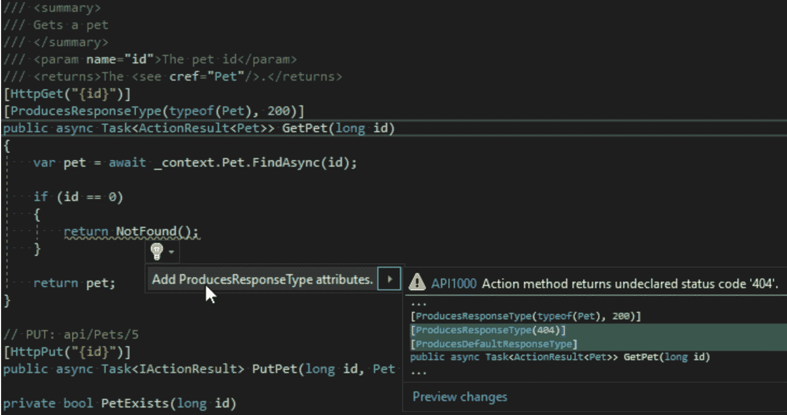
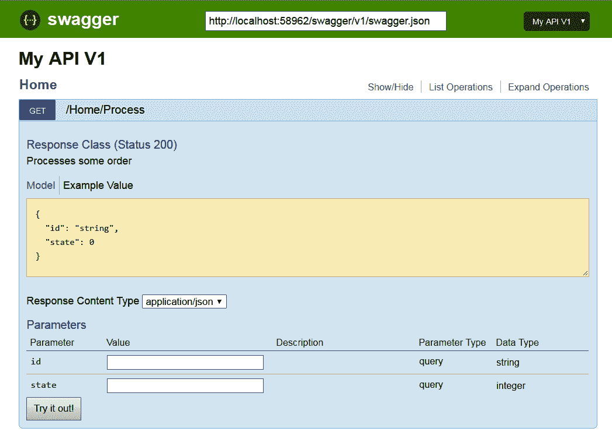
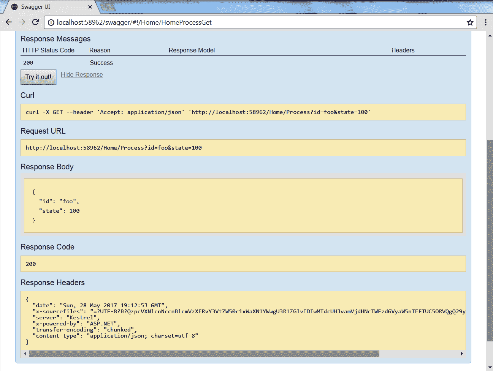
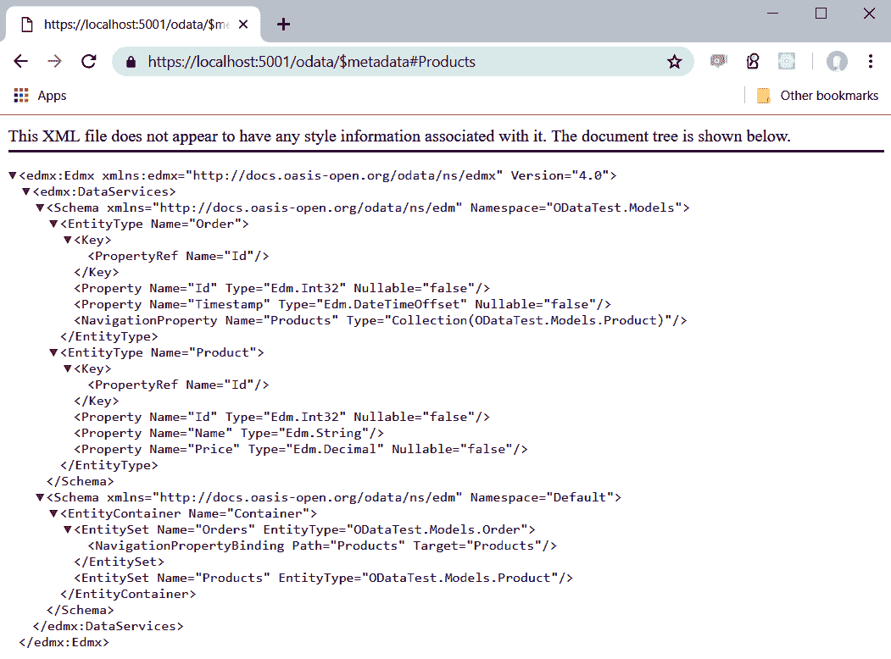

# 八、API 控制器

本章介绍 API 控制器。API 控制器只是一个 MVC 控制器，它不返回 UI，而是处理请求和有效负载，并以机器可读的格式（如 JSON 或 XML）返回响应。我们将讨论与 API 控制器相关的许多方面，从安全性到版本控制。

本章将介绍以下主题：

*   休息导论
*   模型绑定
*   授权访问资源
*   应用 OpenAPI 约定
*   返回验证结果
*   执行内容协商
*   处理错误
*   理解 API 版本控制
*   生成 API 文档
*   小田

到本章结束时，我们将能够在不需要太多人工交互的情况下，全面使用身份验证和验证。

# 技术要求

为了实现本章中介绍的示例，您需要.NET Core 3 SDK 和文本编辑器。当然，VisualStudio2019（任何版本）满足所有要求，但您也可以使用 VisualStudio 代码。

本章的源代码可从[的 GitHub 中检索 https://github.com/PacktPublishing/Modern-Web-Development-with-ASP.NET-Core-3-Second-Edition](https://github.com/PacktPublishing/Modern-Web-Development-with-ASP.NET-Core-3-Second-Edition) [。](https://github.com/PacktPublishing/Modern-Web-Development-with-ASP.NET-Core-3-Second-Edition)

# web API 入门

并非所有操作都要返回 HTML（如视图）。某些返回内容仅适用于非人工处理，例如某些客户端 API。在这种情况下，其他内容比 HTML 更合适，即一种**表示**语言，如 JSON 或 XML。有时，只需要返回 HTTP 状态码或一些响应头。在过去，这是通过 ASP.NET MVC 之外的 API 实现的，比如微软的**ASP.NET Web API**（[）https://www.asp.net/web-api](https://www.asp.net/web-api) 、**南希**（[http://nancyfx.org](http://nancyfx.org) 或**服务栈**（[https://servicestack.net](https://servicestack.net) 。

让我们看看 ASP.NET web API。它与 MVC 有许多相同的概念和类似的命名（和用途）API，但它是一个完全不同的项目，使用不同的程序集和不同的引导机制，如**Open Web Interface for.NET**（**OWIN**）。毫不奇怪，微软决定用 ASP.NET Core统一 MVC 和 web API；现在，不再有 web API，只有 MVC。但是，可以在 MVC 上找到 API 的所有功能。

有一个称为**代表性状态转移**（**REST**的概念，它是*事实上的*标准，用于编写完全包含 HTTP 的 web 服务和 API，包括其动词、头和 URL。NET Core允许我们编写符合 REST 建议的 web 服务。

API 控制器不同于非 API 控制器，因为前者不返回 UI-HTML 或其他，而是消耗和返回数据。这些数据基本上是机器可读的，并使用企业标准格式，如 XML 和 JSON。有时，可以协商可接受和返回的协议是什么。在任何情况下，无论何时收到数据，都应该对其进行验证。

ASP.NET Core 的 API 功能构建在 MVC 功能的基础上，但并不需要所有功能。信息技术因此，您可能需要添加 MVC 功能，如下所示：

```cs
services.AddMvc();
```

或者，您可以只使用 API 的最小值，这可能足以满足您的需要，并且使用更少的内存：

```cs
services.AddControllers();
```

现在我们已经了解了一些基本知识，让我们进一步深入了解 REST。

# 理解休息

**REST**是一种风格，而不是规定使用有意义的 URL 和 HTTP 动词的架构模式。

动词表示操作。以以下为例：

| **HTTP 动词** | **意思是** |
| `GET` | 阅读 |
| `PUT` | 更新或替换 |
| `POST` | 创造 |
| `PATCH` | 部分更新 |
| `DELETE` | 删除 |

正如您所看到的，这类似于我们在 ASP.NET MVC 中所做的，但是 HTML 表单只使用`POST`和`GET`。

另一方面，URL 公开实体和标识符。举以下例子：

*   `http://store.com/products/1`
*   `http://profile.net/users/rjperes`
*   `http://search.pt/term/rest+api`

所有这些 URL 都有不同的含义；例如，如果使用`GET`动词调用每个 URL，它应该返回结果，并且不会产生任何副作用。对于`POST`，应创建新记录。`PUT`更新现有记录并`DELETE`删除基础记录。

可以想象，`POST`、`PUT`和`PATCH`所需的实际内容不能总是通过 URL 发送；如果内容复杂，则需要将其作为有效负载发送。`GET`和`DELETE`通常不采用复杂参数。

REST 对于创建**创建、检索、更新和删除**（**CRUD**）样式的应用特别有用。这些应用用于添加记录，例如博客文章。

最后，HTTP 状态代码表示操作的结果，例如：

*   `200 OK`：已成功检索实体。
*   `201 Created`：已成功创建实体。
*   `202 Accepted`：接受删除或更新实体。
*   `204 No Content`：请求已成功处理，但未返回任何内容。

*   `404 Not Found`：请求的实体不存在。
*   `409 Conflict`：保存与持久化版本冲突的实体。
*   `422 Unprocessable Entity`：实体验证失败。
*   `501 Bad Request`：发出了错误的请求。

For more information about the REST and RESTful APIs, please read [https://searchmicroservices.techtarget.com/definition/RESTful-API](https://searchmicroservices.techtarget.com/definition/RESTful-API).

在本节中，我们了解了 REST，它本质上是一种同意机制。现在让我们看一看 ASP.NET Core，特别是如何将请求转换为.NET 类。

# 模型绑定

通常，在使用 RESTAPI 时，我们使用`POST`、`PUT`或`PATCH`动词将内容作为有效负载发送。然后将该内容转换为 POCO 类，这些类被定义为动作方法的参数。

事实证明，如果从请求主体或查询字符串绑定，ASP.NET Core 可以将有效负载绑定到 POCO，但不能使用`[Bind]`、`[BindNever]`和`[BindRequired]`属性排除（或包括）特定属性。典型示例如下所示：

```cs
[ApiController]
public class PetController : ControllerBase
{
    [HttpPost]
    public IActionResult Post([FromBody] Pet pet) { ... }
}
```

这是因为 ASP.NET Core 使用输入格式化程序将请求绑定到模型，并且由于这些请求可能会更改，因此由它们决定是否应跳过哪些属性。例如，某个 JSON 序列化程序可能使用某些属性来配置属性序列化，而其他人可能会忽略这些属性。

# 授权访问资源

虽然表单通常使用用户名和密码对来实施身份验证，但 API 通常不是这样。然而，认证和授权的概念也适用；授权通过角色、声明或自定义规则来确保，但身份验证通常通过**JSON Web 令牌**（**JWTs**来实现。JWT 与 Cookie 类似，但 Cookie 存储在浏览器中，web API 通常不是由浏览器调用的，而是由 API 客户端调用的。ASP.NET Core 提供了一种机制，用于检查请求的身份验证以及检查请求者是否有权执行其想要执行的操作。本章的目的是解释如何做到这一点。

## 使用 JWTs

JWT 是 RFC 7519 中定义的开放标准，安全地表示使用 HTTP 进行通信的两个连接方之间的声明。该规范可在[上获得 https://tools.ietf.org/html/rfc7519](https://tools.ietf.org/html/rfc7519) 。

使用 JWTs 类似于使用 Cookie 进行身份验证，但 Cookie 通常与人机交互相关，而 JWTs 在机器对机器的场景（如 web 服务）中更常见。使用 cookie 需要一个 cookie 容器，该容器可以容纳 cookie 并在每次请求时发送 cookie。正常情况下，浏览器会为我们这样做。但是，对于 web API，请求通常不是由浏览器发出的。

让我们看一个完整的例子。在深入研究代码之前，请确保将`Microsoft.AspNetCore.Authentication.JwtBearer`NuGet 包添加到代码中。

让我们看看如何通过查看一个简单的`GenerateToken`方法来生成令牌，例如，为给定用户名生成令牌：

```cs
private string GenerateToken(string username)
{
    var claims = new Claim[]
        {
            new Claim(ClaimTypes.Name, username),
            new Claim(JwtRegisteredClaimNames.Nbf,
                new DateTimeOffset(DateTime.UtcNow).ToUnixTimeSeconds()
                .ToString()),
            new Claim(JwtRegisteredClaimNames.Exp,
                new DateTimeOffset(DateTime.UtcNow.AddDays(1))
                .ToUnixTimeSeconds().ToString()),
        };

    var token = new JwtSecurityToken(
        new JwtHeader(new SigningCredentials(
            new SymmetricSecurityKey(Encoding.UTF8.GetBytes("<at-least-16-
            character-secret-key>")), 
            SecurityAlgorithms.HmacSha256)),
        new JwtPayload(claims));

    return new JwtSecurityTokenHandler().WriteToken(token);
}
```

此代码允许任何拥有有效用户名/密码对的人请求持续 1 天的 JWT（`DateTime.UtcNow.AddDays(1)`。当然，密钥（`<at-least-16-character-secret-key>`可以通过配置生成，不应该真正硬编码。

现在，要设置认证，我们需要进入`ConfigureServices`；这是它在 ASP.NET Core 2.x 及更高版本中的外观：

```cs
services
    .AddAuthentication(options =>
    {
        options.DefaultAuthenticateScheme = JwtBearerDefaults.
        AuthenticationScheme; 
        options.DefaultChallengeScheme = JwtBearerDefaults.
        AuthenticationScheme; 
    })
    .AddJwtBearer(JwtBearerDefaults.AuthenticationScheme, options =>
    {
        options.TokenValidationParameters = new TokenValidationParameters
        {
            ValidateAudience = false,
            ValidateIssuer = false,
            ValidateIssuerSigningKey = true,
            IssuerSigningKey = new SymmetricSecurityKey(
                Encoding.UTF8.GetBytes("<at-least-16-character
                -secret-key>")),  
                ValidateLifetime = true,
                ClockSkew = TimeSpan.FromMinutes(5)
        };
    });
```

`ClockSkew`允许服务器与连接到服务器的任何客户端之间的时钟同步存在差异。在这种情况下，我们允许 5 分钟的容差，这意味着令牌过期时间少于 5 分钟的客户端仍将被接受。需要进入`Configure`将认证中间件添加到管道中：

```cs
app.UseAuthentication();
```

现在，JWT 将检查对具有`[Authorize]`属性的操作方法的任何请求，并且只有在该请求有效时才会被接受。为了确保实现这一点，您需要在所有请求（包括 AJAX 调用）中发送授权令牌；这是`Authorization`标题，看起来像这样：

```cs
Authorization: Bearer <my-long-jwt-authorization-token>
```

`<my-long-jwt-authorization-token>`值是根据前面显示的`GenerateToken`方法生成的值。

您可以使用多个公共站点（如【T0）】使用并生成有效的 JWT 令牌 https://jwt.io 。当然，您需要找到在请求期间存储令牌的方法（HTML 本地存储，例如参见[https://developer.mozilla.org/en-US/docs/Web/API/Window/localStorage](https://developer.mozilla.org/en-US/docs/Web/API/Window/localStorage) 了解更多信息）。如果令牌被篡改或达到其超时，您将获得授权错误。

如果愿意，可以指示 ASP.NET Core 使用不同的身份验证提供程序。例如，可以同时使用基于 cookie 和 JWT 的授权提供程序。对于 JWT，您只需要使用`[Authorize]`属性的`AuthenticationSchemes`属性，如下所示：

```cs
[Authorize(AuthenticationSchemes = JwtBearerDefaults.AuthenticationScheme)]
```

以下内容可用于使用 cookie：

```cs
[Authorize(AuthenticationSchemes = CookieAuthenticationDefaults.AuthenticationScheme)]
```

您可以在同一 ASP.NET Core应用上混合使用不同的身份验证方案。

现在我们已经完成了身份验证，让我们看看 VisualStudio 提供的强制 REST 约定的机制。

# 应用 OpenAPI REST 约定

ASP.NET Core 2.2 将 API web 分析器引入 Visual Studio。这些分析器用于强制执行 REST 约定。简单地说，我们声明一个程序集或类应该遵循某种约定；然后，VisualStudio 检查其方法是否为 OpenAPI（Swagger）声明了正确的响应类型和状态代码，并在需要时通过添加正确的属性来修复此问题。这纯粹是一个设计时特性，而不是为更改而编写的代码。

`Microsoft.AspNetCore.Mvc.Api.Analyzers`NuGet 包以`DefaultApiConventions`类的形式包含 RESTAPI 的一些标准约定。如果要确保当前程序集中的所有类型都遵循这些约定，我们将在程序集级别应用以下属性：

```cs
[assembly: ApiConventionType(typeof(DefaultApiConventions))]
```

如果我们只想在类级别上执行此操作，我们将去掉`assembly`修饰符，并将其应用于类，通常是控制器，如下所示：

```cs
[ApiConventionType(typeof(DefaultApiConventions))]
public class PerController : ControllerBase { }
```

或者，我们可以在方法级别执行此操作：

```cs
[ApiConventionMethod(typeof(DefaultApiConventions), nameof(DefaultApiConventions.Put))]
[HttpPut("{id}")]
public async Task<ActionResult<Pet>> PutPet(int id, Pet pet) { ... }
```

请注意，在本例中，我们指定了方法的名称（`Put`，该方法包含我们希望用于此方法的约定。在所有其他情况下，VisualStudio 都会查找约定方法的提示，这些方法被指定为属性，用于匹配当前上下文中的方法。

`DefaultApiConventions`类对以下几种方法有约定（与 HTTP 谓词相同）：

*   `Get`或`Find`
*   `Post`或`Create`
*   `Put`、`Edit`或`Update`
*   `Delete`

对于其中的每一个，VisualStudio 都提供添加适当的状态代码（`[ProducesResponseType]`属性。所以，它是这样的：

| **方法** | **命令** |
| `GET` | `200 OK`：找到内容，返回成功。`404 Not Found`：未找到内容。 |
| `POST` | `201 Created`：内容创建成功。`400 Bad Request`：发出错误或无效的请求。 |
| `PUT` | `204 No Content`：未发布内容。`404 Not Found`：未找到要更新的内容。`400 Bad Request`：发出了错误或无效的请求。 |
| `DELETE` | `200 OK`：内容删除成功。`404 Not Found`：未找到内容。`400 Bad Request`：发出了错误或无效的请求。 |

以下是使用 Visual Studio 添加与`GET`约定匹配的方法缺少的响应类型的示例：



我们可以推出自己的约定，但这些约定是 RESTAPI 的默认约定，因此我们可能应该坚持这些约定。如果您想了解更多信息，请查看[https://docs.microsoft.com/en-us/aspnet/core/web-api/advanced/conventions](https://docs.microsoft.com/en-us/aspnet/core/web-api/advanced/conventions) [。](https://docs.microsoft.com/en-us/aspnet/core/web-api/advanced/conventions)

# 返回验证结果

在 ASP.NET 2.1 之前，您需要明确查看模型验证结果，例如，通过检查`ModelState.IsValid`-并相应地采取行动，例如返回`BadRequestResult`。此后，对于任何具有`[ApiController]`属性的控制器，ASP.NET Core 将添加一个名为`ModelStateInvalidFilter`的操作过滤器，该过滤器在实际运行操作方法之前，检查模型的有效性并为我们返回`BadRequestResult`。伪代码如下所示：

```cs
public void OnActionExecuting(ActionExecutingContext context)
{
    if (!context.ModelState.IsValid)
    {
        context.Result = new BadRequestObjectResult(context.ModelState);
    }
}
```

发送给客户端的响应包括模型验证错误，默认情况下，还包括一个特殊的内容类型`application/problem+json`。在本章后面讨论错误处理时，我们将更详细地讨论这一点。

您可以通过将`ApiBehaviorOptions.SuppressModelStateInvalidFilter`属性的值设置为`false`来完全禁用此行为：

```cs
services.Configure<ApiBehaviorOptions>(options =>
{
    options.SuppressModelStateInvalidFilter = true; 
});
```

您只需隐藏验证详细信息，从安全角度看，这可能很有用：

```cs
options.SuppressUseValidationProblemDetailsForInvalidModelStateResponses = true;
```

另一种选择是明确说明如何将模型验证错误转换为响应。`ApiBehaviorOptions`类提供了一个名为`InvalidModelStateResponseFactory`的属性，该属性的委托仅用于此目的。它以`ActionContext`为唯一参数，我们可以从中检查`ModelState`以及其他可能有用的属性。下面的代码示例显示了如何根据模型验证错误的数量返回不同的结果：

```cs
options.InvalidModelStateResponseFactory = (ctx) =>
{
    if (ctx.ModelState.ErrorCount > 1)
    {
        return new JsonResult(new { Errors = ctx.ModelState.ErrorCount });
    }
    return new BadRequestObjectResult(ctx.ModelState);
};
```

在本例中，如果错误计数大于`1`，则返回一个 JSON 结果；否则，我们将返回默认的错误请求。

现在，让我们看看当客户端请求时内容协商是如何工作的。

# 执行内容协商

内容协商是应用以客户端请求的格式返回数据的过程。这通常用于 API 样式的调用，而不是服务于 HTML 的请求。例如，某个客户机可能希望以 JSON 格式返回数据，而其他客户机可能更喜欢 XML。ASP.NET Core支持这一点。

基本上有两种方法可以实现这一点：

*   通过路由或查询字符串参数
*   通过`Accept`请求头

第一种方法允许您在 URL 上指定感兴趣的格式。让我们先看看它是如何工作的：

1.  假设您有以下操作方法：

```cs
public Model Process() { ... }
```

2.  让我们忘记`Model`实际上是什么，因为它只是一个包含您感兴趣的属性的 POCO 类。可以这么简单：

```cs
public class Model
{
    public int A { get; set; }
    public string B { get; set; }
}
```

3.  开箱即用的 ASP.NET Core 包含一个 JSON 格式设置程序，但您也可以添加一个 NuGet 包，该包也来自 Microsoft，它增加了对 XML 的支持-`Microsoft.AspNetCore.Mvc.Formatters.Xml`。除了将其添加到服务中，您还需要告诉 ASP.NET 要使用什么映射；在这种情况下，`.xml`格式转换为`application/xml`内容类型：

```cs
services
    .AddMvc(options =>
    {
        options.FormatterMappings.SetMediaTypeMappingForFormat("xml", 
        "application/xml");
    })
    .AddXmlSerializerFormatters();
```

呼叫`AddXmlSerializerFormatters`已执行以下操作：

```cs
services
    .AddMvc()
    .AddXmlSerializerFormatters();
```

4.  已经有一个从`json`到`application/json`的映射，因此不需要添加它，因为它将是默认值。然后，您需要使用指定`format`参数的路由来装饰您的操作方法：

```cs
[Route("[controller]/[action]/{format}")]
public Model Process() { ... }
```

5.  您还需要使用`[FormatFilter]`属性装饰控制器类，如下所示：

```cs
[FormatFilter]
public class HomeController { }
```

6.  现在，如果您使用`json`或`xml`作为`format`路由值来调用您的操作，您将得到一个按照您指定的格式正确格式化的答案，例如对于 XML：

```cs
<Model xmlns:xsi="http://www.w3.org/2001/XMLSchema-instance" xmlns:xsd="http://www.w3.org/2001/XMLSchema">
    <A>1</A>
    <B>two</B>
</Model>
```

7.  对于 JSON，您将获得以下信息：

```cs
{"a":1,"b":"two"}
```

8.  另一种方法是使用请求的`Accept`头，这是指定我们感兴趣接收的内容的标准方法。API 客户端通常不使用此功能，但浏览器使用。在`AddMvc`调用中，您需要激活`RespectBrowserAcceptHeader`属性：

```cs
services
    .AddMvc(options =>
    {
        options.RespectBrowserAcceptHeader = true;
    })
    .AddXmlSerializerFormatters();
```

现在，如果您发送一个`application/xml`或`application/json`的`Accept`头（这是默认值），您将获得所需格式的结果。

For more information about the `Accept` header, please consult [https://developer.mozilla.org/en-US/docs/Web/HTTP/Headers/Accept](https://developer.mozilla.org/en-US/docs/Web/HTTP/Headers/Accept).

为了完整起见，JSON 格式化程序允许我们通过使用`AddJsonOptions`扩展方法指定其他选项：

```cs
services
    .AddMvc()
    .AddJsonOptions(options =>
    {
        options.JsonSerializerOptions.PropertyNamingPolicy = 
        JsonNamingPolicy.CamelCase;
    });
```

这将解析程序配置为使用`camelCasing`而不是默认选项。这里有太多的选项需要讨论，因为它们实际上并不相关，我们将不讨论它们。

现在我们已经了解了请求接受，现在让我们看看响应格式。

## 输出格式化程序

在 HTTP 响应中返回对象意味着什么？嗯，这个物体需要转换成可以通过电线传输的东西。一些典型的响应类型如下：

*   `text/html`：用于 HTML 内容
*   `text/plain`：针对一般文本内容
*   `application/json`：用于 JSON 内容
*   `application/xml`：用于 XML 内容
*   `binary/octet-stream`：对于任何二进制内容

因此，您返回的对象需要转换为可以使用这些内容类型之一发送的内容。为此，ASP.NET Core使用了输出格式化程序的概念。输出格式化程序本质上是`IOutputFormatter`的一个实现。

现成的 ASP.NET Core 包括以下输出格式化程序：

*   `HttpNoContentOutputFormatter`根本不写任何内容；仅返回一个`204`HTTP 状态码。
*   `StringOutputFormatter`按原样输出字符串。
*   `StreamOutputFormatter`将流写入一系列字节。
*   `JsonOutputFormatter`将对象序列化为 JSON。

还有几种类型的 XML 格式化程序可以使用`Microsoft.AspNetCore.Mvc.Formatters.Xml`NuGet 包安装，并通过`AddXmlDataContractSerializerFormatters`（对于`DataContractSerializer`）或`AddXmlSerializerFormatters`（对于`XmlSerializer`）注册。

Data contracts and XML serializers use different approaches; for example, different attributes to control the output.

可以使用`AddMvc`扩展方法重载来配置输出格式化程序，该方法采用一个参数，如下所示：

```cs
services.AddMvc(options =>
{
    options.OutputFormatters.Insert(0, new MyOutputFormatter());
});
```

那么，如何选择输出格式化程序呢？ASP.NET Core 迭代已配置格式化程序的列表并调用其`IOutputFormatter.CanWriteResult`方法。返回`true`的第一个格式化程序是用于将对象序列化到输出流的格式化程序（即`WriteAsync`方法）。

### 处理空值

当 ASP.NET Core API 控制器返回通常包装在`IActionResult`中的`null`值并获取值时，ASP.NET Core 会自动将返回值切换到`NoContentResult`（HTTP 204 无内容）。这种行为在大多数情况下可能是正常的，但在其他情况下可能是不可取的。幸运的是，它可以被我们控制；这实际上是通过`HttpNoContentOutputFormatter`输出格式化程序完成的，默认情况下，该格式化程序已注册。

因此，如果要禁用它，只需删除此格式化程序：

```cs
services.AddMvc(options =>
{
    options.OutputFormatters.RemoveType<HttpNoContentOutputFormatter>();
});
```

在这种情况下，请注意，如果您不验证返回的响应，您可能会返回一个响应`200 OK`和一个`null`响应。如果您愿意，您可以实现一个结果过滤器，在响应为`null`的情况下返回其他内容，例如`NotFoundResult`。这将如下所示：

```cs
public sealed class NoResultToNotFoundFilterAttribute : Attribute, IAlwaysRunResultFilter
{
    public void OnResultExecuting(ResultExecutingContext context)
    {
        if ((context.Result is ObjectResult result) && (result.Value
         == null))
        {
            context.Result = new NotFoundResult();
        }      
    }

    public void OnResultExecuted(ResultExecutedContext context) { }
}
```

请注意，我们将其实现为一个`always run result`过滤器，如[第 10 章](10.html)*理解过滤器*所述。您只需要将此筛选器注册为全局筛选器，就可以开始了。

内容协商部分到此结束。在下一节中，我们将研究错误处理。

# 处理错误

当我们谈论 API 时，错误处理意味着返回非人工端点在发生错误时可能使用的信息，这些信息可以提供有用的信息。W3C（即万维网联盟）在 RFC 7807（[上）上对此进行了说明 https://tools.ietf.org/html/rfc7807](https://tools.ietf.org/html/rfc7807) ），作为“<q>一种在 HTTP 响应</q>中携带机器可读的错误详细信息的方式”。

这里的想法是，当错误发生时，我们收集所有有用的信息并返回一个响应，该响应以适当的详细程度描述发生的情况。

截获 web 请求上发生的任何异常的一种方法是通过异常处理程序—通过调用`UseExceptionHandler`添加的中间件。让我们看一个例子：

```cs
app.UseExceptionHandler(errorApp =>
{
    errorApp.Run(async context =>
    {
        var errorFeature = context.Features.Get
        <IExceptionHandlerPathFeature>();
        var exception = errorFeature.Error;
        var path = errorFeature.Path;
        var problemDetails = new ProblemDetails
        {
            Instance = $"urn:my:error:{Guid.NewGuid()}",
            Detail = exception.Message 
        };

        if (exception is BadHttpRequestException badHttpRequestException)
        {
            problemDetails.Title = "Invalid request!";
            problemDetails.Status = StatusCodes.Status400BadRequest;
        }
        else
        {
            problemDetails.Title = "An unexpected error occurred!";
            problemDetails.Status = StatusCodes
            .Status500InternalServerError;
        }

        context.Response.ContentType = "application/problem+json";
        context.Response.StatusCode = problemDetails.Status.Value;

        await context.Response.WriteAsync(JsonSerializer.
        Serialize(problemDetails));
    });
});
```

我们这里有一个在异常事件中调用的处理程序；我们通过`IExceptionHandlerPathFeature`检索当前异常并检查它是什么。还有另一个要素类`IExceptionHandlerFeature`，但`IExceptionHandlerPathFeature`对其进行了扩展，并将`Path`属性添加到现有的`Error`属性中。

然后，我们构建一个`ProblemDetails`类的实例（由.NETCore 提供；如果您希望提供自己的属性，您可以从中继承），并填写适当的属性。然后，我们将响应内容类型设置为 RFC 接口定义的`application/problem+json`，并将该实例序列化为响应流的 JSON。

`ProblemDetails`类的属性具有以下含义（来自 RFC）：

*   `Type`（`string`）：标识问题类型的 URI 引用（`RFC3986`）。如果未提供，则默认为`about:blank`。
*   `Title`（`string`：问题类型的简短易读摘要。这不应随着问题的出现而改变，除非出于本地化的目的。
*   `Detail`（`string`）：一种人类可读的解释，专门针对该问题的发生。
*   `Instance`（`string`）：标识问题具体发生情况的 URI 引用。如果取消引用，它可能会或可能不会产生进一步的信息。
*   `Status`（`int`：HTTP 状态码。

当然，具体的细节级别取决于所发生的消息和您想向客户端公开的内容，因此必须仔细检查异常、请求 URL 和任何其他可能的参数。

由于 ASP.NET Core 3，我们还可以在控制器操作方法中创建这样一个`ProblemDetails`对象：

```cs
var problemDetails = ProblemDetailsFactory.CreateProblemDetails(HttpContext);
```

这包括有关发生的异常的一般信息，如果发生更具体的模型验证错误（不是服务器端错误，通常不会引发任何异常），我们可以这样做：

```cs
var validationProblemDetails = ProblemDetailsFactory.
 CreateValidationProblemDetails(HttpContext, ModelState);
```

这包括生成的对象中的所有验证错误。控制器中可能有如下代码：

```cs
if (!this.ModelState.IsValid)
{
    var validationProblemDetails = ProblemDetailsFactory
     .CreateValidationProblemDetails(HttpContext,   
        ModelState);

    return BadRequest(validationProblemDetails); 
}
```

这就是错误处理的全部内容；下一节将解释如何拥有多个 API 版本，并让客户选择他们感兴趣的版本。

# 理解 API 版本控制

与 API（web 服务）风格的方法调用相关的还有版本控制。通过对 API 进行版本控制，您可以同时获得多个版本的 API，方法可能是获取不同的有效负载并返回不同的结果。ASP.NET Core通过`Microsoft.AspNetCore.Mvc.Versioning`库支持 API 版本控制。

开箱即用，您可以应用以下技术来指定您感兴趣的版本：

*   URL 查询字符串参数
*   标题
*   前面的任何选项都可以是查询字符串或标题

假设在两个不同的命名空间中有两个同名的控制器类：

```cs
namespace Controllers.V1
{
    [ApiVersion("1.0")]
    public class ApiController
    {
        [ApiVersion("1.0", Deprecated = true)]
        [HttpGet("[controller]/[action]/{version:apiversion}")]
        public Model Get() { ... }

        [ApiVersion("2.0")]
        [ApiVersion("3.0")]
        public Model GetV2() { ... }
    ]
}
```

在这里，您可以看到我们对每个应用了几个`[ApiVersion]`属性，每个属性都指定了控制器支持的 API 版本。让我们看看如何实现版本控制，从路由方法开始。

## 使用标题值

我们将配置 API 版本控制以从标题字段推断所需的版本。我们在`ConfigureServices`方法中配置版本控制。注意`HeaderApiVersionReader`类：

```cs
services.AddApiVersioning(options =>
{
    options.ApiVersionReader = new HeaderApiVersionReader("api-version");
});
```

在这里，我们说版本应该来自名为`api-version`的头字符串。这不是一个标准值；只是我们捡到的一些绳子。

现在，当在`/Api/Get`调用 API 时，在传递一个值为`1.0`的`api-version`头时，请求将由`Controllers.V1.ApiController`类处理。但是，如果传递的值为`2.0`或`3.0`，则`Controllers.V2.ApiController`类将拾取该值。

使用标题是最透明的技术，但也不能轻易强制使用，例如，使用浏览器。让我们看看另一种技术。

## 使用查询字符串

为了从 URL 推断版本，我们需要使用`QueryStringApiVersionReader`类，如下所示：

```cs
services.AddApiVersioning(options =>
{
    options.ApiVersionReader = new QueryStringApiVersionReader("api-
    version");
});
```

我们还需要配置一个考虑到这一点的路由：

```cs
[Route("[controller]/{version:apiversion}")]
public Model Get() { ... }
```

现在，如果我们向`/api/1.0`发出请求，我们会得到版本`1.0`，同样的版本也适用于`2.0`和`3.0`。

If we want to be more flexible, we can use the `QueryStringOrHeaderApiVersionReader` class as `ApiVersionReader`; both approaches will work.

我们已经了解了如何使用查询字符串或标题指定版本。现在让我们看看如何将版本标记为已弃用。

## 弃用版本

通过设置`Deprecated`属性的标志，可以说某个版本已过时：

```cs
[ApiVersion("1.0", Deprecated = true)]
```

现在，如果您将`ReportApiVersions`标志设置为`true`，您将收到响应中支持和不支持的版本：

```cs
services.AddApiVersioning(options =>
{
    options.ReportApiVersions = true;
    options.ApiVersionReader = new QueryStringApiVersionReader("
     api-version");
});
```

这将生成以下响应头：

```cs
api-deprecated-versions: 1.0
api-supported-versions: 2.0, 3.0
```

现在，让我们继续了解默认版本是如何工作的。

## 默认版本

您还可以指定默认版本：

```cs
services.AddApiVersioning(options =>
{
    options.AssumeDefaultVersionWhenUnspecified = true;
    options.DefaultApiVersion = new ApiVersion(2, 0);
    options.ApiVersionReader = new QueryStringApiVersionReader("
     api-version");
});
```

在这种情况下，如果您没有指定版本，它将假定您想要版本`2.0`。

## 版本映射

正如我们所看到的，`Controllers.V2.ApiController`类被映射到两个版本——`2.0`和`3.0`。但如果您想单独处理版本`3.0`，会发生什么？那么，您只需向新方法添加一个`[MapToApiVersion]`属性：

```cs
[MapToApiVersion("3.0")]
public Model GetV3() { ... }
```

此后，所有版本`3.0`的请求都将通过此方法处理。

## 无效版本

如果请求的是不受支持的版本，而不是不推荐的版本，则会引发异常并将其返回到客户端，如下所示：

```cs
{
  "error":
  {
    "code": "ApiVersionUnspecified",
    "message":"An API version is required, but was not specified."
  }
}
```

这就是 ASP.NET Core web API 的版本控制。正如您所看到的，您有几个选项，从使用 URL 到使用标题，并且您可以同时拥有多个 API 版本。这有望帮助您将运行旧版本的客户端迁移到新版本。

接下来，我们将看到如何为 API 生成文档，甚至创建一个 UI，以便从浏览器中调用它。

# 生成 API 文档

Web API 有一个最初称为**Swagger**的规范，但现在改名为**OpenAPI**（[https://github.com/OAI/OpenAPI-Specification](https://github.com/OAI/OpenAPI-Specification) ）。它用于描述某些 API 提供的端点和版本。Swagger v3.0 规范为 OpenAPI 计划做出了贡献，因此 Swagger 与 OpenAPI 合并。

在一些地方，它仍然通俗地被称为 Swagger，还有一个名为**swashback**的.NET 开源实现，在 NuGet 上作为`Swashbuckle.AspNetCore`（[提供 https://github.com/domaindrivendev/Swashbuckle.AspNetCore](https://github.com/domaindrivendev/Swashbuckle.AspNetCore) ）。这个包的作用是检查控制器的操作方法，并生成一个描述它们的 JSON 文档。它还提供了一个简单的 web 界面来调用这些操作方法，这有多酷？

为了使用`Swashbuckle.AspNetCore`，我们需要添加几个 NuGet 包——`Swashbuckle.AspNetCore`、`.SwaggerGen`、`Swashbuckle.AspNetCore.SwaggerUI`和`Microsoft.OpenApi`。后者由前者自动添加。要使用 Swashback，就像大多数 ASP.NET Core API 一样，我们首先需要将所需的服务注册到依赖项注入框架（`ConfigureServices`。具体做法如下：

```cs
services.AddSwaggerGen(c =>
{
    c.SwaggerDoc("v1", new OpenApiInfo {
        Title = "My API V1", 
        Version = "v1",
        OpenApiContact = new Contact { 
            Email = "rjperes@hotmail.com",
            Name = "Ricardo Peres",
            Url = "http://weblogs.asp.net/ricardoperes"
        }
    });
});
```

我们通过`Configure`方法将 Swagger 中间件添加到管道中：

```cs
app.UseSwagger();
app.UseSwaggerUI(options =>
{
    options.SwaggerEndpoint("/swagger/v1/swagger.json", "My API V1");
});
```

两个调用`UseSwagger`和`UseSwaggerUI`表示两种不同的功能；第一个用于实际的 API 文档，第二个用于调用控制器操作的 UI。

您可以使用不同的 API 名称或版本向`AddSwaggerGen`添加任意多个调用。每个版本将生成不同的 API 版本文档。

Swashback 通过内省所有控制器及其操作方法来工作，但它只会找到您明确希望它找到的那些控制器，例如：

*   用`[Route]`属性标记的控制器
*   标有`[Route]`、`[HttpGet]`、`[HttpPost]`、`[HttpPut]`、`[HttpDelete]`、`[HttpOptions]`、`[HttpPatch]`或`[HttpMethod]`且带有明确路线模板的动作方式

Swashback 还将介绍以下内容：

*   `[Produces]`：可能由动作方法生成的 POCO 类的内容类型和契约。
*   `[ProducesResponseType]`：可以通过动作方式返回的合同和状态码。对于不同的状态代码，您可以有任意数量的代码。
*   `[ProducesDefaultResponseType]`：针对`[ProducesResponseType]`属性未明确提及的任何状态代码返回的合同。
*   `[ProducesErrorResponseType]`：发生错误时返回的合同。
*   `[Consumes]`：动作方法将接受的内容类型

这些属性可以应用于类（控制器）或方法（操作）级别；因此，例如，如果控制器中的所有操作都使用并生成 JSON，那么您可以有：

```cs
[Produces("application/json")]
[Consumes("application/json")]
public class HomeController : Controller { }
```

当您访问`/swagger/v1/swagger.json`URL 时，您会得到如下内容：

```cs
    {
      "swagger": "2.0",
      "info": {
        "version": "v1",
        "title": "My API V1",
        "contact": {
            "name": "Ricardo Peres",
            "url": "http://weblogs.asp.net/ricardoperes",
            "email": "rjperes@hotmail.com"
        }
      },
      "basePath": "/",
      "paths": {
        "/Home": {
          "get": {
            "tags": [ "Home" ],
            "operationId": "HomeIndexGet",
            "consumes": ["application/json"],
            "produces": ["application/json"],
            "responses": {
              "200": {
                "description": "Success"
              }
            }
          }
        }
      },
      "definitions": {},
      "securityDefinitions": {}
    }
```

由于空间限制，我们在这个示例输出中只包含了`Home`控制器的一种动作方法`Index`。但是，您可以看到一个名为`My API V1`版本`V1`的文档。对于每个操作方法，Swashback 描述了它接受的 HTTP 方法、它接受的任何内容类型（可以通过使用`[Consumes]`属性指定）和返回（由`[Produces]`设置）以及返回状态代码（`[ProducesResponseType]`属性）。如果未指定，则使用默认值，即状态代码、无接受或返回内容类型的`200`。

This version has nothing to do with the versioning schema discussed in the previous topic.

如果单个方法可以返回多个文档类型或状态代码，则可以根据需要应用任意多个`[Produces]`和`[ProducesResponseType]`属性：

```cs
[ProducesResponseType(typeof(Model), StatusCodes.Status201Created)]
[ProducesResponseType(typeof(Model), StatusCodes.Status202Accepted)]
[ProducesResponseType(typeof(Model), StatusCodes.Status304NotModified)]
[ProducesDefaultResponseType]
public IActionResult AddOrUpdate(Model model) { ... }
```

在这种情况下，我们的意思是：

*   如果模型已经存在，那么我们返回`HTTP 303 Not Modified`。
*   如果模型改变了，我们返回`HTTP 202 Accepted`。
*   如果添加了模型，则返回`HTTP 201 Created`。

请注意，所有这些都是根据其他惯例推断出来的！

A word of caution—the difference between `[Produces]` and `[ProducesResponseType]` is that the former is a result filter that sets the response type to be of a specific value and the latter only declares it! This may be relevant if you wish to use content negotiation, so it's something that you must keep in mind!

对于使用`AddSwaggerGen`添加的每个文档，您都会得到不同的 URL，例如`/swagger/v1/swagger.json`、`/swagger/v2/swagger.json`等等。

更有趣的是生成的 UI，可以通过`/swagger`端点访问：


在这里，我们可以看到两个动作（称为**操作**）-`/Home`和`/Home/Process`。它们是`Home`控制器中的两种动作方式，这些是访问每种方式的路径。为了清楚起见，让我们考虑一下 AutoT3A.Action 方法有以下签名：

```cs
[HttpGet("Process")]
[ProducesResponseType(typeof(Model), StatusCodes.Status200OK)]
public IActionResult Process(string id, int state) { ... }
```

现在，扩展操作将产生以下结果：



在这里，您会得到一个表单，该表单要求将参数设置为`Process`，甚至会向您显示一个格式为 JSON 的示例响应。明亮的此示例响应来自应用于`[Produces]`属性的`Type`属性。如果您填写此表格并单击“试用”！，这就是你得到的：



在这里，您可以得到响应负载和所有响应头。很酷吧？

剩下要展示的是我们如何定制 JSON 文档和 UI 的 URL。我们通过`UseSwagger`和`UseSwaggerUI`扩展方法实现，如下所示：

```cs
app.UseSwagger(options =>
{
    options.RouteTemplate = "api-doc/{documentName}/swagger.json";
});
```

`RouteTemplate`属性只需要取一个`{documentName}`令牌，默认为`swagger/{documentName}/swagger.json`。此令牌将替换为您在`AddSwaggerGen`lambda 中作为`SwaggerDoc`调用的第一个参数添加的任何内容。不要忘记，如果更改一个，则需要同时更改两个，如图所示：

```cs
app.UseSwaggerUI(options =>
{
    options.SwaggerEndpoint("/api-doc/v1/swagger.json", "My API V1");
});
```

There are lots of other configuration options, so we advise you to take a look at the documentation available at [https://github.com/domaindrivendev/Swashbuckle.AspNetCore](https://github.com/domaindrivendev/Swashbuckle.AspNetCore).

生成之后，让我们看看如何添加文档。

## 添加 API 文档

Swashback 可以添加随代码提供的文档，只要我们让 MSBuild 为其生成 XML 文件。使用 Visual Studio，这只是在`.csproj`文件上设置属性的问题：

```cs
<PropertyGroup>
    <GenerateDocumentationFile>true</GenerateDocumentationFile>
    <NoWarn>$(NoWarn);1591</NoWarn>
</PropertyGroup>
```

这将导致代码中的每个文档注释都包含在一个 XML 文件中，该文件适合输入 Swashback。要加载此文件，我们需要执行以下操作：

```cs
services.AddSwaggerGen(options =>
{
    options.SwaggerDoc("v1", new OpenApiInfo {
        Title = "My API V1", 
        Version = "v1",
        Contact = new OpenApiContact { 
            Email = "rjperes@hotmail.com",
            Name = "Ricardo Peres",
            Url = "http://weblogs.asp.net/ricardoperes"
        }
    });
    //assume that the XML file will have the same name as the current 
    //assembly
    var xmlFile = $"{Assembly.GetExecutingAssembly().GetName().Name}.xml";
    var xmlPath = Path.Combine(AppContext.BaseDirectory, xmlFile);
    options.IncludeXmlComments(xmlPath);
});
```

现在，公共类型及其公共成员和参数的所有注释都将显示在 Swashback 用户界面上。

# 小田

**OData**是一个通过 web 查询数据的开放标准。它允许我们公开关于域模型的元数据，并只使用 HTTP 动词和查询字符串查询它。例如，它可以用于将任何数据模型公开为 RESTAPI。

早期版本的 ASP.NET 已经支持它，从 2.0 版开始，ASP.NET Core通过`Microsoft.AspNetCore.OData`NuGet 包也支持它。

For additional information about the OData spec, please check out [https://www.odata.org](https://www.odata.org).

对于 ASP.NET Core，OData 允许我们通过 URL 查询实现`IQueryable<T>`或`IEnumerable<T>`的任何集合；在第一种情况下，这意味着查询不会在内存中执行，但会被转换为数据源特定的方言。对于对象关系映射器，例如**实体框架**（**EF**）核心或 NHibernate，这是 SQL。

在以下各节的整个过程中，我们将了解如何使用 OData 向 web 公开对象模型，以便只需使用浏览器即可轻松查询对象模型。让我们从设置开始。

## 建立 OData

因此，在添加`Microsoft.AspNetCore.OData`NuGet 包之后，我们需要注册所需的服务并声明我们将公开的模型。让我们看看一些代码：

```cs
private static IEdmModel GetEdmModel()
{
    var builder = new ODataConventionModelBuilder();
    //register an entity set of type Order and call it Orders
    builder.EntitySet<Order>("Orders");
    //same for products
    builder.EntitySet<Product>("Products");
    //add other entity sets here
    return builder.GetEdmModel();
}

public void ConfigureServices(IServiceCollection services)
{
    //rest goes here
    services.AddOData();
    services
        .AddControllers()
        .SetCompatibilityVersion(CompatibilityVersion.Latest);
}

public void Configure(IApplicationBuilder app)
{
    //rest goes here
    app.UseRouting();
    app.UseEndpoints(endpoints =>
    {
        endpoints.MapControllers();
        //add a route named odata for an endpoint /odata using the EDM 
        //model
        endpoints.MapODataRoute("odata", "odata", GetEdmModel());
    });
}
```

请注意，`GetEdmModel`方法返回将在本例中提供给 OData 端点的实体集`Products`和`Orders`，作为**实体数据模型**（**EDM**）。还有更高级的功能，例如声明函数，但是我们在这里不讨论它们。

我们必须通过调用`ConfigureServices`中的`AddOData`扩展方法来注册服务，然后在`Configure`中，当我们包含 MVC 中间件时，我们需要在本例中声明 OData 端点将侦听的路由，这是`odata`。

`MapODataRoute`扩展方法将路由名称作为第一个参数，实际 URL 路径作为第二个参数，最后是 EDM 模型。

现在，我们需要添加一个控制器来实际返回集合或单个项目；该控制器必须继承自`ODataController`，该类继承自`ControllerBase`，因此继承其方法（不需要`Controller`类，因为该类基本上添加了与视图相关的方法）：

```cs
[ODataRoutePrefix("Products")]
public class ProductsController : ODataController
{
    private readonly ProductContext _ctx;

    public ProductsController(ProductContext ctx)
    {
        this._ctx = ctx;
    }

    [EnableQuery]
    public IQueryable<Product> Get() => _ctx.Products;

    public async Task<Product> Get(int id) => await _ctx.Products.
     FindAsync(id);
}
```

`[ORouteDataPrefix]`属性表示如果我们不希望使用控制器名称减去`Controller`后缀的默认约定，那么该控制器将使用的前缀。否则，可以安全地忽略它。

注意返回集合的方法中的`[EnableQuery]`属性；这是一个属性，它通过允许通过 URL 查询来实现真正的魔力。另外，名为`Get`的两个方法也有一个`ODataRoute`属性，但是接受`id`参数的重载也在其构造函数中提到它；这样就可以将其映射到参数。

此设置允许以下 HTTP 调用：

*   `GET /odata/$metadata#Product`：用于获取元数据，`Product`实体的一组公共属性
*   `GET /odata/Products`至`ProductController.Get()`：返回所有产品，允许查询
*   `GET/ odata/Products(1)`至`ProductController.Get(1)`：返回单个产品

现在我们已经了解了如何为 OData 准备 ASP.NET Core，让我们看看如何查询我们的模型。

## 获取元数据

不需要声明返回类型`IQueryable<T>`，只要实际返回值是这种类型，例如`IActionResult`、`ActionResult<IQueryable<T>>`甚至`Task<IQueryable<T>>`，其中`T`是实际类型。如果您不返回`IQueryable<T>`类型，而是返回实现`IEnumerable<T>`的内容，那么也可以进行查询，但查询不是在服务器端（如数据库服务器中），而是在内存中。

### 列表集合

调用 OData 端点（`odata`，如前所述），我们可以看到公开的实体列表。在我们的示例中，这是`Products`和`Orders`集合：


前面的屏幕截图显示了我们的模型在我们定义的端点中公开的集合。现在让我们看看这些实体的元数据。

### 实体元数据

实体的元数据显示该实体的所有属性，并可在以下端点处使用：

```cs
/odata/$metadata
```

以下是我们运行此操作时得到的输出：



这将显示所有实体属性及其所有集合。

现在让我们看看如何过滤元数据。

## 质疑

查询实体只需访问该实体的端点：

```cs
/odata/Products
```

这将返回该实体的所有记录，但如果我们只需要其中的一部分呢？

### 过滤实体

通过添加一个名为`$filter`的查询参数，可以实现对 URL 的查询，如下所示：

```cs
/odata/Products?$filter=Price gt 100
```

以下是我们在运行查询时得到的输出：


对于不同的属性类型，可以使用常规运算符，例如：

*   大于/小于：`gt`或`lt`
*   大于或等于/小于或等于：`gte`或`lte`
*   等于/不等于：`eq`或`ne`
*   和/或/或非：`and`、`or`或`not`
*   枚举标志：`has`

如您所见，我们可以使用`and`、`or`和`not`组合表达式，甚至包括括号来分组条件。

对于字符串属性，我们可以使用其他运算符：

*   `concat`
*   `contains`
*   `endswith`

*   `indexof`
*   `length`
*   `startswith`
*   `substring`
*   `tolower`
*   `toupper`
*   `trim`

使用字符串文字时，请确保用`'`括起来，如下所示：

```cs
/odata/Products?$filter=Name eq 'Expensive Product'
```

对于集合，我们有以下内容：

*   `in`
*   `hassubset`
*   `hassubsequence`

我们还有一些日期和时间功能：

*   `date`
*   `day`
*   `fractionalseconds`
*   `hour`
*   `maxdatetime`
*   `mindatetime`
*   `minute`
*   `month`
*   `now`
*   `second`
*   `time`
*   `totaloffsetminutes`
*   `totalseconds`
*   `year`

可用的一些数学函数如下所示：

*   `ceiling`
*   `floor`
*   `round`

一些类型函数如下所示：

*   `cast`
*   `isof`

一些地理功能（底层数据访问层支持该功能）如下所示：

*   `geo.distance`
*   `geo.intersects`
*   `geo.length`

一些 lambda 运算符如下所示：

*   `any`
*   `all`

我不会试图解释所有这些。有关每个功能的详细说明，请参阅 OData 规范参考文档，可在[上获得 https://www.odata.org/documentation](https://www.odata.org/documentation) 。

### 投影

投影允许您仅检索感兴趣的属性。例如，对于`Products`，您可能只需要`Name`和`Price`属性。您可以通过在查询字符串上包含一个`$select`参数来实现：

```cs
/odata/Products?$select=Price
```

以下是查询的输出：


可以为投影指定多个字段，每个字段用逗号分隔。

### 寻呼

我们可以通过添加`$top`和`$skip`来指定页面大小和可选起始位置：

```cs
/odata/Products?$top=2&$skip=2
```

以下是输出：


从 21 日开始，最多可返回 10 条记录。但是，千万不要忘记，在没有显式排序顺序的情况下不应该应用分页，否则结果可能不是您所期望的。

### 分类

通过`$orderby`实现分拣：

```cs
/odata/Products?$orderby=Price
```

以下是输出：


要按降序查看这些结果，请使用`desc`：

```cs
/odata/Products?$orderby=Price desc
```

以下是降序结果的输出：


也可以按几个属性进行排序：

```cs
/odata/Products?$orderby=Price desc,Name asc
```

`asc`值为默认值，可以省略。

### 膨胀

使用扩展，我们可以通过导航属性强制遍历相关实体。在本例中，我们要使用的是`$expand`参数：

```cs
/odata/Orders?$expand=Products
```

请注意，这与为子集合调用 EF Core LINQ 查询中的`Include`扩展方法相同，强制 EF Core 将其包括在查询中，并将其所有记录实例化为实体。

### 计数

即使使用过滤器，我们也可以通过包含一个值为`true`的`$count`关键字来返回记录总数：

```cs
/odata/Products?$count=true
```

之后，让我们看看配置选项。

## 配置选项

OData 选项在`UseMVC`扩展方法中配置。默认情况下，不允许任何选项，因此必须显式设置它们。可允许的可用操作如下所示：

*   实体选择（`Select`）
*   子属性和集合的扩展（`Expand`
*   过滤（`Filter`）
*   排序（`OrderBy`）
*   计数（`Count`）

多个选项可以链接在一起，如下所示：

```cs
public void Configure(IApplicationBuilder app)
{
    //rest goes here
    app.UseMvc(options =>
    {
        options.Select().Expand().Filter().OrderBy().Count();
        options.MapODataServiceRoute("odata", "odata", GetEdmModel());
 });
}
```

这告诉 OData 允许选择、扩展、筛选、排序和计数。

## 限制

通常建议您对查询设置一些限制，以最小化资源消耗。

### 最大可返回记录数

可以并建议设置查询返回的最大记录数。这样做是为了节省资源。我们可以在使用`MaxTop`扩展方法配置 OData 选项时执行此操作：

```cs
app.UseMvc(options =>
{
    options.MaxTop(10);
    options.MapODataServiceRoute("odata", "odata", GetEdmModel());
});
```

这将要检索的最大实体数定义为 10。

### 膨胀

您还可以配置`$expand`命令是否允许扩展：

```cs
options.Expand();
```

如果提供了此选项，查询可能会更复杂，并且可以返回更多的结果，因为它们可以将子实体和主实体结合在一起。

If you wish to play with OData with a complex model, please go to [https://www.odata.org/odata-services](https://www.odata.org/odata-services).

# 总结

在本章中，我们了解了如何使用 JWTs 来验证端点，而无需人工交互。

现在我们知道了如何使用数据验证 API 来执行自动模型验证。然后，我们了解到，如果您希望以不同的格式返回数据，内容协商可能非常有用；但是，在现实中，JSON 是当今网络上数据交换的*事实上的*标准。

OpenAPI 规范在开发模式下也有助于检查端点并针对它们发出请求。

接下来，我们看到 OData 是对 ASP.NET Core 的一个很好的补充，尤其是与 EF Core 或任何其他将数据公开为`IQueryable<T>`的数据提供程序集成时。

在本章中，我们还学习了如何在 ASP.NET Core中实现 REST 以公开 API。在此之前，我们研究了如何执行模型绑定和验证数据。我们还介绍了用于授权端点的 JWT 机制，以及如何执行版本控制和内容协商。最后，我们研究了如何利用 OData 向 web 公开数据模型。

在下一章中，我们将介绍创建可重用组件的方法。

# 问题

您现在应该能够回答以下问题：

1.  什么是小田？
2.  什么是内容协商？
3.  为什么不适合在 web API 中使用 cookie 进行身份验证？
4.  对于特定版本的 API，我们可以采用哪些不同的方式？
5.  关于行动方法的公约的目的是什么？
6.  问题的细节是什么？
7.  什么是休息？