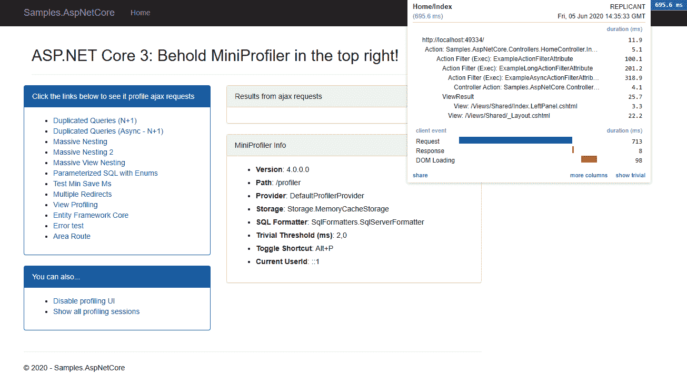
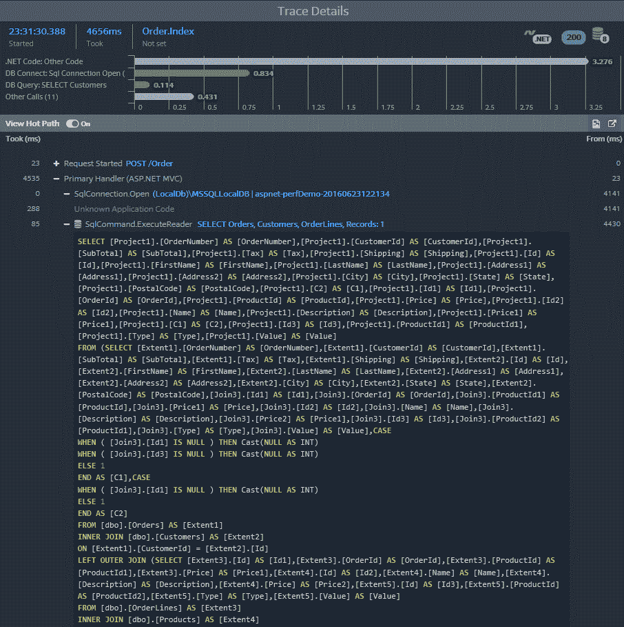

Improving Performance and Scalability

本章讨论我们可以应用于 ASP.NET 核心应用程序的不同优化，以便它们执行得更快，能够处理更多的并发连接。我们将关注的性能和可伸缩性这两个概念是不同的，事实上，它们在某种程度上相互冲突。您必须应用正确的优化级别才能找到最佳点。

阅读本章后，您应该能够应用技巧，首先要了解应用程序中出现的错误或可以改进的地方，其次是如何改进。在接下来的章节中，我们将介绍一些可用的技术。

本章将介绍以下主题：

*   分析如何深入了解应用程序正在做什么
*   主机选择和调整主机以获得最佳性能
*   捆绑和最小化
*   使用异步操作
*   缓存
*   压缩响应

# 技术要求

为了实现本章中介绍的示例，您需要.NET Core 3 SDK 和文本编辑器。当然，VisualStudio2019（任何版本）满足所有要求，但您也可以使用 VisualStudio 代码。

源代码可在[从 GitHub 检索 https://github.com/PacktPublishing/Modern-Web-Development-with-ASP.NET-Core-3-Second-Edition](https://github.com/PacktPublishing/Modern-Web-Development-with-ASP.NET-Core-3-Second-Edition) 。

# 开始

正如开尔文勋爵曾经说过的一句名言：“如果你不能测量它，你就无法改善它。”。考虑到这一点，我们需要衡量我们的应用程序，看看它的问题在哪里。有一些被称为**分析器**的应用程序可以为我们提供实现这一点的方法。让我们看看我们的一些选择。

## 微型剖面仪

一个开源分析器是**MiniProfiler**，可从[获得 http://miniprofiler.com/dotnet/AspDotNetCore](http://miniprofiler.com/dotnet/AspDotNetCore) 和来自 NuGet 的`MiniProfiler.AspNetCore.Mvc`。还有其他软件包，如实体框架核心 SQL Server 提供程序的`Microsoft.EntityFrameworkCore.SqlServer`和`Microsoft.EntityFrameworkCore.Sqlite for SQLite`，您也应该添加这些软件包。

以下屏幕截图显示了控制台，以及有关请求和数据库调用的详细信息：



此屏幕显示加载页面后的一些指标，包括响应时间、加载 DOM 所用的时间以及执行 action 方法所用的时间。要使用 MiniProfiler，您需要注册其服务（`ConfigureServices`：

```cs
services
    .AddMiniProfiler()
    .AddEntityFramework();
```

添加中间件组件（`Configure`：

```cs
app.UseMiniProfiler()
```

然后，添加客户端 JavaScript 代码：

```cs
<mini-profiler position="@RenderPosition.Right" max-traces="5" color-scheme="ColorScheme.Auto" />
```

由于这是标记帮助器，您需要先注册它（`_ViewImports.cshtml`：

```cs
@addTagHelper *, MiniProfiler.AspNetCore.Mvc
```

还有其他选项，例如格式化 SQL 查询和着色，等等，所以我建议您看看 GitHub 上提供的示例应用程序。

## 堆叠前缀

**Stackify Prefix**不是开源产品，而是由知名的**Stackify**（[维护的产品 https://stackify.com](https://stackify.com) ）。可从[下载 https://stackify.com/prefix](https://stackify.com/prefix) ，目前，NuGet 不提供。它提供了比其他两个更多的功能，因此可能值得一看：



此屏幕截图显示了调用操作方法（POST to order）的结果，并显示了在其中执行的 SQL。我们可以看到.NET 代码、数据库连接和`SQL SELECT`执行所花的时间。

现在让我们看看 ASP.NET Core 中可用的托管选项。

# 托管 ASP.NET 核心

托管是用于运行 ASP.NET 核心应用程序的进程。在 ASP.NET Core 中，您有两种现成的托管选择：

*   **红隼**：跨平台主机，默认设置
*   **HTTP.sys（ASP.NET 核心 pre-2.x**中的 WebListener**：仅限 Windows 的主机**

 **如果您希望应用程序在不同的平台上运行，而不仅仅是在 Windows 上，那么 Kestrel 应该是您的选择，但是如果您只需要针对 Windows，那么 WebListener/HTTP.sys 可能会提供更好的性能，因为它使用本机 Windows 系统调用。你必须做出这个选择。默认情况下，VisualStudio 模板（或`dotnet`命令使用的模板）使用 Kestrel，这适用于大多数常见场景。让我们了解如何选择最适合我们的目标。

## 选择最佳主持人

你应该比较这两位主持人，看看他们在紧张的情况下表现如何。Kestrel 是默认的，包含在`Microsoft.AspNetCore.Server.Kestrel`NuGet 包中。如果您想尝试 HTTP.sys，您需要添加对`Microsoft.AspNetCore.Server.HttpSys`包的引用。

Kestrel 是默认主机，但如果您希望明确说明，它如下所示：

```cs
public static IHostBuilder CreateWebHostBuilder(string[] args) =>
    Host
        .CreateDefaultBuilder(args)
        .ConfigureWebHostDefaults(builder =>
        {
            builder
                .ConfigureKestrel((KestrelServerOptions options) =>
                {
                    //options go here
                })
                .UseStartup<Startup>();
        });
```

要在 ASP.NET Core 3.x 中使用 HTTP.sys，则应使用以下命令：

```cs
public static IHostBuilder CreateWebHostBuilder(string[] args) =>
    Host
        .CreateDefaultBuilder(args)
        .ConfigureWebHostDefaults(builder =>
        {
            builder
                .UseHttpSys((HttpSysOptions options) =>
                {
                    //options go here
                })
               .UseStartup<Startup>();
       });
```

此示例显示如何启用 HTTP.sys 主机，以及可以在其中定义一些与性能相关的设置。

## 配置调整

Kestrel 和 HTTP.sys 这两个主机都支持对其某些参数进行调优。让我们看看其中的一些。

### 同时连接的最大数量

对于红隼来说，它看起来是这样的：

```cs
.ConfigureKestrel(options =>
{
    options.Limits.MaxConcurrentConnections = null;
    options.Limits.MaxConcurrentUpgradedConnections = null;
})
```

`MaxConcurrentConnections`指定可接受的最大连接数。如果设置为`null`，则没有限制，当然，系统资源耗尽除外。`MaxConcurrentUpgradedConnections`是可以从 HTTP 或 HTTPS 迁移到 WebSocket 的最大连接数（例如）。`null`是默认值，表示没有限制。

对该代码的解释如下：

*   `MaxAccepts`：相当于`MaxConcurrentConnections`。默认为`0`，表示没有限制。
*   `RequestQueueLimit`：也可以在 HTTP.sys 中指定最大排队请求数。

对于 ASP.NET Core 3.x 中 WebListener 的替代品 HTTP.sys，类似于：

```cs
.UseHttpSys(options =>
{
    options.MaxAccepts = 40;
    options.MaxConnections = null;
    options.RequestQueueLimit = 1000;
})
```

此代码为 HTTP.sys 主机设置一些常见的性能相关选项，如下表所示：

*   `MaxAccepts`指定并发接受的最大数量。
*   `MaxConnections`是使用注册表中的机器全局设置的最大并发接受次数（默认为`null`。`-1`表示有无限多个连接。
*   `RequestQueueLimit`是 HTTP.sys 可以排队的最大请求数。现在让我们看看限制是如何起作用的。

### 限制

与 HTTP.sys 类似，Kestrel 还允许设置一些限制，甚至比 HTTP.sys 多一点：

```cs
.ConfigureKestrel(options =>
{
    options.Limits.MaxRequestBodySize = 30 * 1000 * 1000;
    options.Limits.MaxRequestBufferSize = 1024 * 1024;
    options.Limits.MaxRequestHeaderCount = 100;
    options.Limits.MaxRequestHeadersTotalSize = 32 * 1024;
    options.Limits.MaxRequestLineSize = 8 * 1024;
    options.Limits.MaxResponseBufferSize = 64 * 1024;
    options.Limits.MinRequestBodyDataRate.BytesPerSecond = 240;
    options.Limits.MaxResponseDataRate.BytesPerSecond = 240
})
```

解释此代码很简单：

*   `MaxRequestBodySize`：请求正文允许的最大大小
*   `MaxRequestBufferSize`：请求缓冲区的大小
*   `MaxRequestHeaderCount`：请求头的最大数量
*   `MaxRequestHeadersTotalSize`：请求头的总可接受大小

*   `MaxRequestLineSize`：请求中的最大行数
*   `MaxResponseBufferSize`：响应缓冲区的大小
*   `MinRequestBodyDataRate.BytesPerSecond`：最大请求吞吐量
*   `MaxResponseDataRate.BytesPerSecond`：最大响应吞吐量

### 超时

每当一个应用程序正在等待一个外部事件等待一个完整的请求到达、一个表单被提交、一个连接被建立等等，它只能等待一段时间；这样就不会影响应用程序的全局功能。当它过去时，我们有一个超时，在此之后，应用程序要么放弃并失败，要么重新启动。Kestrel 允许指定若干超时：

```cs
.ConfigureKestrel(options =>
{
    options.Limits.KeepAliveTimeout = TimeSpan.FromMinutes(2);
    options.Limits.RequestHeadersTimeout = TimeSpan.FromSeconds(30);
})
```

对于正在设置的两个属性，以下是一些信息：

*   `KeepAliveTimeout`keep alive connections 中的客户端连接超时；`0`为默认值，表示无限期。
*   `RequestHeadersTimeout`等待接收报头的时间；默认值也是`0`。

对于 HTTP.sys，属性如下所示：

*   `DrainEntityBody`keep alive connections 中允许读取所有请求主体的时间。
*   `EntityBody`是每个个体到达的最长时间。
*   `HeaderWait`是解析所有请求头的最长时间。
*   `IdleConnection`是空闲连接关闭前的时间。
*   `MinSendBytesPerSecond`是以字节/秒为单位的最小发送速率。
*   `RequestQueue`是允许排队请求留在队列中的时间。

下面是一个示例代码，演示了这些选项：

```cs
.UseHttpSys(options =>
{
    options.Timeouts.DrainEntityBody = TimeSpan.FromSeconds(0);
    options.EntityBody = TimeSpan.FromSeconds(0);
    options.HeaderWait = TimeSpan.FromSeconds(0);
    options.IdleConnection = TimeSpan.FromSeconds(0);
    options.MinSendBytesPerSecond = 0;
    options.RequestQueue = TimeSpan.FromSeconds(0);
})
```

在本节中，我们探讨了 ASP.NET 核心主机中的一些调整，这些调整可以提高资源利用率，并最终提高性能和可扩展性。在下一节中，我们将研究改进静态资源传输的技术。

# 理解捆绑和缩小

捆绑意味着可以组合多个 JavaScript 或 CSS 文件，以尽量减少浏览器发送到服务器的请求数量。缩小是一种从 CSS 和 JavaScript 文件中删除不必要的空白并更改函数和变量名的技术，使其更小。当这两种技术结合使用时，传输的数据会少得多，这将导致更快的加载时间。

Visual Studio 创建的默认项目在运行或部署应用程序时自动执行绑定。实际流程由`bundleConfig.json`文件配置，其结构类似于：

```cs
[
  {
    "outputFileName": "wwwroot/css/site.min.css",
    "inputFiles": [
      "wwwroot/css/site.css"
    ]
  },
  {
    "outputFileName": "wwwroot/js/site.min.js",
    "inputFiles": [
        "wwwroot/js/site.js"
    ],
    "minify": {
      "enabled": true,
      "renameLocals": true
    },
    "sourceMap": false
  }
]
```

我们可以看到两个不同的组，一个用于 CSS，另一个用于 JavaScript，每个组生成一个文件（`outputFileName`。每个文件都有一组文件，其中可以包含通配符（`inputFiles`），并且可以指定是否缩小结果（`enabled`），以及重命名函数和变量以使其更小（`renameLocals`）。对于 JavaScript 文件，可以自动生成源映射文件（`sourceMap`。您可以在[上阅读源地图 https://developer.mozilla.org/en-US/docs/Tools/Debugger/How_to/Use_a_source_map](https://developer.mozilla.org/en-US/docs/Tools/Debugger/How_to/Use_a_source_map) 。请注意，这种行为实际上不是 Visual Studio 固有的，而是由 Mads Kristensen 的`Bundler & Minifier`扩展生成的，可从 Visual Studio 图库的[获取 https://marketplace.visualstudio.com/items?itemName=MadsKristensen.BundlerMinifier](https://marketplace.visualstudio.com/items?itemName=MadsKristensen.BundlerMinifier) 。

还存在其他选项，例如添加同样来自 Mads Kristensen 的`BuildBundlerMinifier`NuGet 包，它向`dotnet`添加了一个命令行选项，允许我们在构建时从命令行执行绑定和缩小。还有一种选择是使用 Gulp、Grunt 或 WebPack，但由于这些是 JavaScript 解决方案，而不是 ASP.NET 核心解决方案，因此我将不在这里讨论它们。网页包、吞咽、咕噜请参考[第 14 章](14.html)、*客户端**开发*。

接下来，我们将学习异步操作如何帮助应用程序。

# 使用异步操作

异步调用是提高应用程序可伸缩性的一种方法。通常，处理请求的线程在处理过程中被阻塞，这意味着该线程将无法接受其他请求。通过使用异步操作，来自不同池的另一个线程被分配请求，侦听线程返回到池中，等待接收其他请求。控制器、Razor 页面、标记帮助程序、视图组件和中间件类可以异步执行。每当您有执行**输入/输出**（**IO**的操作时，始终使用异步调用，因为这可以带来更好的可伸缩性。

对于控制器，只需将动作方法的签名更改为如下所示（注意`async`关键字和`Task<IActionResult>`返回类型）：

```cs
public async Task<IActionResult> Index() { ... }
```

在 Razor 页面中，它是类似的（注意`Async`后缀、`Task<IActionResult>`返回类型和`async`关键字）：

```cs
public async Task<IActionResult> OnGetAsync() { ... }
```

对于标记帮助器和标记帮助器组件，重写`ProcessAsync`方法而不是`Process`：

```cs
public override async Task ProcessAsync(TagHelperContext context, TagHelperOutput output) { ... }
```

针对组件，实现一个`InvokeAsync`方法，如下所示：

```cs
public async Task<IViewComponentResult> InvokeAsync(/* any parameters */) { ... }
```

还要确保在视图中异步调用它：

```cs
@await Component.InvokeAsync("MyComponent", /* any parameters */)
```

最后，在中间件类中，执行以下操作：

```cs
public async Task Invoke(HttpContext httpContext) { ... }
```

或者，在 lambdas 中，执行以下代码：

```cs
app.Use(async (ctx, next) =>
{
    //async work
    await next();
});
```

更好的是，对于控制器操作，包括一个`CancellationToken`参数，并将其传递给在其内部调用的任何异步方法。这将确保，如果客户端取消请求（通过关闭浏览器或以任何其他方式终止呼叫），所有呼叫也将关闭：

```cs
public async Task<IActionResult> Index(CancellationToken token) { ... }
```

请注意，此参数与您从`HttpContext.RequestAborted`获得的参数相同。

这还不是全部；您还应该更喜欢异步 API 方法，而不是阻塞 API 方法，尤其是那些执行 I/O、数据库或网络调用的方法。例如，如果需要发出 HTTP 调用，请始终查找其方法的异步版本：

```cs
var client = new HttpClient();
var response = await client.GetStreamAsync("http://<url>");
```

如果您想传递取消令牌，它会稍微复杂一些，但不会太复杂：

```cs
var client = new HttpClient();
var request = new HttpRequestMessage(HttpMethod.Get, "<url>");
var response = await client.SendAsync(request, token);
```

或者，如果您需要上传可能较大的文件，请始终使用以下代码（安装`Microsoft.AspNetCore.WebUtilities`NuGet 软件包）：

```cs
app.Use(async (ctx, next) =>
{
    using (var streamReader = new HttpRequestStreamReader
    (ctx.Request.Body, Encoding.UTF8))
    {
        var jsonReader = new JsonTextReader(streamReader);
        var json = await JObject.LoadAsync(jsonReader); 
    }
});
```

这样做的好处是，在读取所有有效负载内容时不会阻止 post，在本例中，它也异步构建 JSON 对象。

在 ASP.NET3 中，主机现在一直是异步的，这意味着默认情况下禁用同步 API，调用它们会导致异常。如果您不希望这样做，您需要通过使用中间件组件打开功能上的标志来更改此行为：

```cs
var synchronousIOFeature = HttpContext.Features.Get<IHttpBodyControlFeature>(); 
synchronousIOFeature.AllowSynchronousIO = true;
```

或者，单独针对 Kestrel 和 HTTP.sys，您可以在服务配置上执行此操作：

```cs
//Kestrel
services.Configure<KestrelServerOptions>(options =>
{
    options.AllowSynchronousIO = true;
});

//HTTP.sys
services.Configure<HttpSysOptions>(options =>
{
    options.AllowSynchronousIO = true;
});

//if using IIS
services.Configure<IISServerOptions>(options =>
{
    options.AllowSynchronousIO = true;
});
```

在这里，我们看到了如何使用异步操作来提高解决方案的可伸缩性。在下一节中，我们将研究一种提高性能的解决方案：缓存。

Keep in mind, however, that asynchronicity is not a panacea for all your problems; it is simply a way to make your application more responsive.

# 通过缓存提高性能

缓存是可以对站点性能产生更大影响的优化之一。通过缓存响应和数据，您不必再次获取它们、处理它们并将它们发送给客户端。让我们看看实现这一目标的两种方法。

## 缓存数据

通过缓存数据，您无需在需要时反复检索数据。你需要考虑一些方面：

*   它将在缓存中保存多长时间？
*   如果需要，如何使缓存无效？
*   您是否需要将其分布到不同的机器上？
*   需要多少内存？它会永远成长吗？

通常有三种方法指定缓存持续时间：

*   **绝对**：缓存将在预定义的时间点过期。
*   **相对**：缓存将在创建后一段时间过期。
*   **滑动**：缓存创建后会过期一段时间，但如果被访问，这段时间会延长相同的时间。

### 内存缓存

实现缓存的最简单方法是使用内置的`IMemoryCache`实现，可在`Microsoft.Extensions.Caching.Memory`NuGet 包中获得（它也在`Microsoft.AspNetCore.All`元包中提供）。正如您所猜测的，它是一个仅内存的缓存，适用于单服务器应用程序。为了使用它，您需要在`ConfigureServices`中注册它的实现：

```cs
services.AddMemoryCache();
```

之后，您可以将`IMemoryCache`实现注入到任何类控制器、中间件、标记帮助器、视图组件等中。基本上有三个操作：

*   向缓存中添加一个条目（`CreateEntry`或`Set`。
*   从缓存中获取条目（`Get`、`GetOrCreate`或`TryGetValue`。
*   从缓存中删除条目（`Remove`。

添加条目需要您为其指定名称、优先级和持续时间。名称可以是任何对象，持续时间可以指定为相对时间、滑动到期时间或绝对时间。下面是一个例子：

```cs
//relative expiration in 30 minutes
cache.Set("key", new MyClass(), TimeSpan.FromMinutes(30));

//absolute expiration for next day
cache.Set("key", new MyClass(), DateTimeOffset.Now.AddDays(1));

//sliding expiration
var entry = cache.CreateEntry("key");
entry.SlidingExpiration = TimeSpan.FromMinutes(30);
entry.Value = new MyClass();
```

您还可以将这两种策略结合起来：

```cs
//keep item in cache as long as it is requested at least once every 5 
//minutes
// but refresh it every hour
var options = new MemoryCacheEntryOptions()
    .SetSlidingExpiration(TimeSpan.FromMinutes(5))
    .SetAbsoluteExpiration(TimeSpan.FromHours(1));

var entry = cache.CreateEntry("key");
entry.SetOptions(options);
```

使用滑动过期选项时，每当访问缓存项时，它都将被续订。使用`Set`将创建一个新项目或用相同的密钥替换任何现有项目。如果不存在具有给定密钥的项，您也可以使用`GetOrCreate`添加一个，或者按如下方式返回现有项：

```cs
var value = cache.GetOrCreate("key", (entry) =>
{
    entry.AbsoluteExpirationRelativeToNow = TimeSpan.FromMinutes(30);
    return new MyClass();
});
```

优先级控制从缓存中逐出项的时间。只有两种方法可以从缓存中删除项：手动或在内存不足时删除。术语*优先级*是指当机器内存不足时应用于项目的行为。可能的值如下所示：

*   `High`：尽可能长时间地保存该项目。
*   `Low`：必要时可以从内存中删除该项。
*   `NeverRemove`：除非达到项目的持续时间，否则切勿从内存中逐出该项目。
*   `Normal`：使用默认算法。

可以传递到期令牌集合；这本质上是一种拥有缓存依赖项的方法。您可以通过多种方式创建缓存依赖项，例如通过取消令牌：

```cs
var cts = new CancellationTokenSource();
var entry = cache.CreateEntry("key");
entry.ExpirationTokens.Add(new CancellationChangeToken(cts.Token));
```

您还可以通过配置更改创建一个：

```cs
var ccts = new ConfigurationChangeTokenSource<MyOptions>(this.Configuration);
var entry = cache.CreateEntry("key");
entry.ExpirationTokens.Add(ccts.GetChangeToken());
```

您甚至可以通过文件（或目录）中的更改创建一个：

```cs
var fileInfo = new FileInfo(@"C:\Some\File.txt");
var fileProvider = new PhysicalFileProvider(fileInfo.DirectoryName);
var entry = cache.CreateEntry("key");
entry.ExpirationTokens.Add(fileProvider.Watch(fileInfo.Name));
```

如果您想要组合多个，以便在任何更改令牌过期时缓存项过期，您可以使用`CompositeChangeToken`：

```cs
var entry = cache.CreateEntry("key");
entry.ExpirationTokens.Add(new CompositeChangeToken(new List<IChangeToken> {
    /* one */, 
    /* two */, 
    /* three */
}));
```

您还可以注册一个回调，该回调将在从缓存中逐出项时自动调用，如下所示：

```cs
var entry = cache.CreateEntry("key");
entry.RegisterPostEvictionCallback((object key, object value, EvictionReason reason, object state) =>
{
    /* do something */
}, "/* some optional state object */");
```

这可以用作一种简单的调度机制：您可以使用相同的回调添加另一个项，以便当该项过期时，它将一次又一次地添加该项。`key`和`value`参数明显；`reason`参数将告诉您项目被逐出的原因，这可能是由于以下原因之一：

*   `None`：原因不明。
*   `Removed`：该项目已明确删除。
*   `Replaced`：该项目已被替换。

*   `Expired`：已达到到期时间。
*   `TokenExpired`：已触发过期令牌。
*   `Capacity`：已达到最大容量。

`state`参数将包含您传递给`RegisterPostEvictionCallback`的任意对象，包括`null`。

为了从缓存中获取项目，存在两个选项：

```cs
//return null if it doesn't exist
var value = cache.Get<MyClass>("key");

//return false if the item doesn't exist
var exists = cache.TryGetValue<MyClass>("key", out MyClass value);
```

至于删除，再简单不过了：

```cs
cache.Remove("key");
```

这将从缓存中永久删除命名缓存项。

A side note: it is not possible to iterate through the items in the cache from the `IMemoryCache` instance, but you can count them by downcasting to `MemoryCache` and using its `Count` property.

### 分布式缓存

ASP.NET Core 附带两个分布式缓存提供程序：

*   **Redis:**在`Microsoft.Extensions.Caching.Redis`提供 NuGet 套餐
*   **SQL Server**：可从`Microsoft.Extensions.Caching.SqlServer`获取

核心功能通过`IDistributedCache`接口提供。您需要在`ConfigureServices`中注册其中一个实现。对于 Redis，请使用以下命令：

```cs
services.AddDistributedRedisCache(options =>
{
    options.Configuration = "serverName";
    options.InstanceName = "InstanceName";
});
```

对于 SQL Server，请使用以下命令：

```cs
services.AddDistributedSqlServerCache(options =>
{
    options.ConnectionString = @"<Connection String>";
    options.SchemaName = "dbo";
    options.TableName = "CacheTable";
});
```

完成后，您将能够注入一个`IDistributedCache`实例，该实例提供四个操作：

*   添加或删除项目（`Set`、`SetAsync`）
*   检索项目（`Get`、`GetAsync`）
*   刷新项目（`Refresh`、`RefreshAsync`）
*   移除一个项目（`Remove`、`RemoveAsync`）

如您所见，它类似于`IMemoryCache`，但有一点不同，它为所有操作提供异步和同步版本。此外，它并不具有内存缓存的所有选项，例如优先级、过期回调和过期令牌。但最重要的区别是，所有项都需要存储为字节数组，这意味着您必须事先序列化要存储在缓存中的任何对象。一种特殊情况是字符串，其中有直接处理字符串的扩展方法。

因此，要添加项目，您需要执行以下操作：

```cs
using (var stream = new MemoryStream())
{
    var formatter = new BinaryFormatter();
    formatter.Serialize(stream, new MyClass());

    cache.Set("key", formatter.ToArray(), new DistributedCacheEntryOptions
    {
        //pick only one of these
        //absolute expiration
        AbsoluteExpiration = DateTimeOffset.Now.AddDays(1),
        //relative expiration
        AbsoluteExpirationRelativeToNow = TimeSpan.FromMinutes(60),
        //sliding expiration
        SlidingExpiration = TimeSpan.FromMinutes(60)
    });
}
```

如您所见，它确实支持绝对、相对和滑动过期。如果要使用字符串，则更简单：

```cs
cache.SetString("key", str, options);
```

要检索项目，还需要随后对其进行反序列化：

```cs
var bytes = cache.Get("key");
using (var stream = new MemoryStream(bytes))
{
    var formatter = new BinaryFormatter();
    var data = formatter.Deserialize(stream) as MyClass;
} 
```

对于字符串，使用以下代码：

```cs
var data = cache.GetString("key");
```

提神容易；如果项目使用滑动过期，则会续订：

```cs
cache.Refresh("key");
```

删除以下内容也是如此：

```cs
cache.Remove("key");
```

异步版本是相同的，只是它们以`Async`后缀结尾并返回一个`Task`对象，您可以等待它。

您可能知道，`BinaryFormatter`仅在.NET Core 2.0 之后可用，因此，对于在此之前的.NET Core 版本，您需要提出自己的序列化机制。一个好的可能是`MessagePack`，可从 NuGet 获得。

Both distributed caches and in-memory caches have their pros and cons. A distributed cache is obviously better when we have a cluster of machines, but it also has a higher latency—the time it takes to get results from the server to the client. In-memory caches are much faster, but they take up memory on the machine on which it is running.

在本节中，我们讨论了缓存数据的替代方案，无论是在内存中还是在远程服务器中。下一节解释如何缓存操作方法执行的结果。

## 缓存操作结果

通过缓存操作结果，可以指示浏览器在第一次执行后将提供的结果保留一段时间。这可以导致显著的性能改进；由于不需要运行代码，因此响应直接来自浏览器的缓存。该过程在[的 RFC 中规定 https://tools.ietf.org/html/rfc7234#section-5.2](https://tools.ietf.org/html/rfc7234#section-5.2)。我们可以通过将`[ResponseCache]`属性应用于控制器或动作方法，将缓存应用于动作方法。它可以采用以下一些参数：

*   `Duration`（`int`：缓存持续时间，以秒为单位；映射到`Cache-control`头中的`max-age`值
*   `Location`（`ResponseCacheLocation`）：缓存的存储位置`Any`、`Client`或`None`中的一个）
*   `NoStore`（`bool`）：不缓存响应
*   `VaryByHeader`（`string`）：使缓存发生变化的标头，例如，`Accept-Language`导致针对每个请求的语言缓存响应（请参见[https://www.w3.org/International/questions/qa-accept-lang-locales](https://www.w3.org/International/questions/qa-accept-lang-locales) ）
*   `VaryByQueryKeys`（`string[]`）：使缓存发生变化的任意数量的查询字符串键
*   `CacheProfileName`（`string`：缓存配置文件的名称；稍后再谈

缓存位置具有以下含义：

*   `Any`：缓存在客户端和任何代理中；将`Cache-control`标题设置为`public`
*   `Client`：仅缓存在客户端；`Cache-control`设置为`private`
*   `None`：未缓存任何内容；`Cache-control`和`Pragma`均设置为`no-cache`

但在使用之前，我们需要在`ConfigureServices`中注册所需的服务：

```cs
services.AddResponseCaching();
```

可以通过传递委托来配置某些选项：

```cs
services.AddResponseCaching(options =>
{
    options.MaximumBodySize = 64 * 1024 * 1024;
    options.SizeLimit = 100 * 1024 * 1024;
    options.UseCaseInsensitivePaths = false;
});
```

可供选择的方案如下：

*   `MaximumBodySize`（`int`）：最大可缓存响应；默认值为 64 KB
*   `SizeLimit`（`int`：所有缓存响应的最大大小；默认值为 100 MB
*   `UseCaseInsensitivePaths`（`bool`：路径是否应区分大小写；默认值为`false`

为了做到这一点，以及注册服务，我们需要添加响应缓存中间件（方法`Configure`）：

```cs
app.UseResponseCaching();
```

与其传递持续时间、位置等参数，不如使用**缓存配置文件**。缓存配置文件是在我们注册 MVC 服务时通过添加以下条目定义的：

```cs
services
    .AddMvc(options =>
    {
        options.CacheProfiles.Add("Public5MinutesVaryByLanguage",
         new CacheProfile
        {
            Duration = 5 * 60,
            Location = ResponseCacheLocation.Any,
            VaryByHeader = "Accept-Language"
        });
    });
```

这里，我们正在注册名为`Public5MinutesVaryByLanguage`的缓存配置文件的一些选项，如下所示：

*   `Duration`（`int`：缓存项的持续时间，以秒为单位
*   `Location`（`ResponseCacheLocation`：缓存项的存放位置；它可以在服务器上，也可以在客户端（浏览器）上
*   `VaryByHeader`（`string`：可选的请求头，可根据需要改变缓存；在本例中，我们使用浏览器的语言更改缓存

如果愿意，可以从配置文件加载配置。假设你有这样的结构：

```cs
{
  "CacheProfiles": {
    "Public5MinutesVaryByLanguage": {
      "Duration": 300,
      "Location": "Any",
      "VaryByHeader" : "Accept-Language"
    }
  }
}
```

您可以使用配置 API 在`ConfigureServices`中加载它：

```cs
services
    .Configure<Dictionary<string, CacheProfile>>(this.Configuration.
     GetSection("CacheProfiles"))
    .AddMvc(options =>
    {
        var cacheProfiles = this.Configuration.GetSection<Dictionary
        <string, CacheProfile>();
        foreach (var keyValuePair in cacheProfiles)
        {
            options.CacheProfiles.Add(keyValuePair);
        }
    });
```

使用缓存配置文件可以让我们拥有一个集中的位置，在那里我们可以更改将在所有应用程序中使用的配置文件设置。简单如下：

```cs
[ResponseCache(CacheProfileName = "Public5MinutesVaryByLanguage")]
public IActionResult Index() { ... }
```

响应缓存还取决于默认启用的 HTTP.sys 设置。它被称为`EnableResponseCaching`：

```cs
.UseHttpSys(options =>
{
    options.EnableResponseCaching = true;
})
```

这将为 HTTP.sys 主机启用响应缓存。请记住，如果没有此选项，`[ResponseCache]`属性将无法工作。这是发送适当的缓存响应头所必需的。

在本节中，我们看到了如何缓存来自动作方法的响应。现在让我们看看如何缓存视图标记。

## 缓存视图

通过使用附带的标记帮助程序`<cache>`和`<distributed-cache>`，您将能够缓存部分视图。从他们的名字可以推断，`<cache>`需要一个`IMemoryCache`的注册实例，`<distributed-cache>`需要`IDistributedCache`。我已经在[第 9 章](09.html)、*可重用组件*中谈到了这两个标签助手，所以我不再重复。我们只看两个例子。这一个用于内存缓存：

```cs
<cache expires-sliding="TimeSpan.FromMinutes(30)">
    ...
</cache>
```

这一个用于分布式缓存：

```cs
<distributed-cache name="redis" expires-sliding="TimeSpan.FromMinutes(30)">
    ...
</distributed-cache>
```

放置在`<distributed-cache>`中的任何内容都将存储在命名的分布式缓存（在本例中为`redis`）中，存储时间为从第一次渲染视图开始的一段时间（`30`分钟），在随后的情况下，它将直接从那里来，而无需任何额外处理。

Do not forget that you need to register an instance of either `IMemoryCache` or `IDistributedCache`. These tag helpers, unfortunately, cannot take cache profiles.

缓存是任何真实 web 应用程序的必备工具，但必须仔细考虑，因为它可能会给系统带来内存压力。在接下来的两部分中，我们将学习如何优化响应。

# 压缩响应

响应压缩可从`Microsoft.AspNetCore.ResponseCompression`包获得。本质上，对于支持它的浏览器，它可以在通过网络发送响应之前对响应进行压缩，从而最大限度地减少将要发送的数据量，但需要花费一些时间来压缩响应。

如果浏览器支持响应压缩，则应发送`Accept-Encoding: gzip, deflate`头。让我们看看如何：

1.  我们首先需要在`ConfigureServices`中注册响应压缩服务：

```cs
services.AddResponseCompression();
```

2.  更详细的版本允许您指定实际的压缩提供程序（`GzipCompressionProvider`包括在内）和可压缩文件类型：

```cs
services.AddResponseCompression(options =>
{
    options.EnableForHttps = true;
    options.Providers.Add<GzipCompressionProvider>(); 
    options.MimeTypes = ResponseCompressionDefaults.
    MimeTypes.Concat(new[] { "img/svg+xml" });   
});

services.Configure<GzipCompressionProviderOptions>(options =>
{
    options.Level = CompressionLevel.Fastest;
});
```

`GzipCompressionProviderOptions`的唯一选项是压缩级别，其中有三个选项：

您可以看到，还可以配置要压缩的文件类型。请注意，以下内容类型将自动压缩：

3.  最后，您需要将响应压缩中间件添加到`Configure`方法中：

```cs
app.UseResponseCompression();
```

现在，只要响应是配置的 mime 类型之一，它就会被自动压缩，并且响应头将包括一个`Content-Encoding: gzip`头。

请注意，您可以通过实现`ICompressionProvider`接口并将其注册到采用 lambda 的`AddResponseCompression`方法重载中来推出自己的压缩实现。除了 GZip，微软还有一个基于**Brotli**的实现（`BrotliCompressionProvider`和`BrotliCompressionProviderOptions`类）。Brotli 是一种开源压缩算法，受多个浏览器支持，提供比 GZip 更好的压缩。

The Deflate compression method is not supported in ASP.NET Core 2.x,—only GZip. Read about Deflate at its RFC ([https://tools.ietf.org/html/rfc1951](https://tools.ietf.org/html/rfc1951)) and about GZip at [https://tools.ietf.org/html/rfc1952](https://tools.ietf.org/html/rfc1952). Read about Brotli in RFC 7932 ([https://tools.ietf.org/html/rfc7932](https://tools.ietf.org/html/rfc7932)) and see the list of supported browsers at [https://www.caniuse.com/#feat=brotli](https://www.caniuse.com/#feat=brotli).

压缩可以极大地提高响应的延迟，但需要在服务器上进行一些额外的处理。现在我们已经了解了压缩，让我们看看如何通过使用缓冲来提高响应时间。

# 缓冲响应

我们将在这里介绍的最后一种技术是响应缓冲。通常，web 服务器流式传输响应，这意味着一旦有了块，它就会发送响应。另一种选择是获取所有这些块，组合它们，并立即发送它们：这称为*缓冲*。

缓冲提供了一些优势：它可以带来更好的性能，并提供在内容（包括标题）发送到客户端之前更改内容的能力。

微软通过`Microsoft.AspNetCore.Buffering`NuGet 软件包提供缓冲功能。使用它很简单例如，您可以在中间件 lambda 中使用它：

```cs
app.UseResponseBuffering();

app.Run(async (ctx) =>
{
    ctx.Response.ContentType = "text/html";
    await ctx.Response.WriteAsync("Hello, World!);

    ctx.Response.Headers.Clear();
    ctx.Response.Body.SetLength(0);

    ctx.Response.ContentType = "text/plain";
    await ctx.Response.WriteAsync("Hello, buffered World!");
});
```

在本例中，我们首先注册响应缓冲中间件（基本上是包装响应流），然后在中间件 lambda 上，您可以看到我们可以写入客户端，通过将其长度设置为`0`来清除响应，然后再次写入。如果没有响应缓冲，这是不可能的。

如果您想禁用它，可以通过其功能`IHttpBufferingFeature`：

```cs
var feature = ctx.Features.Get<IHttpBufferingFeature>();
feature.DisableResponseBuffering();
```

在本节中，我们学习了缓冲、它的优点以及如何启用它，并以此结束本章。

# 总结

在本章中，我们了解到在操作方法和视图中使用响应缓存是必要的，但必须谨慎使用，因为您不希望内容过时。缓存配置文件是操作方法的首选配置文件，因为它们提供了一个集中的位置，从而更容易进行更改。您可以拥有所需的任意多个配置文件。

如果需要在服务器集群之间共享数据，分布式缓存可能会有所帮助，但需要注意的是，通过有线传输数据可能需要一些时间，例如，即使它比从数据库检索数据快得多。它还可能占用大量内存，因此可能导致其他不可预见的问题。

然后，我们看到捆绑和缩小也非常方便，因为它们可以大大减少要传输的数据量，这对于移动浏览器来说更为重要。

异步操作也应该是您的首选；一些现代 API 甚至不允许您有任何其他选择。这可以大大提高应用程序的可伸缩性。

最后，我们看到需要使用分析器来识别瓶颈。Stackify 前缀是一个很好的选择。

主机的选择在很大程度上取决于部署需要。如果是非 Windows 主机，那么除了 Kestrel 之外，我们别无选择。在 Kestrel 和 HTTP.sys 上，有大量的参数可以根据需要进行调整，但请注意，使用这些参数可能会导致性能低下。

在本章中，我们介绍了一些提高应用程序性能和可伸缩性的方法。这不是一个详尽的列表，在代码中可以做很多事情，特别是在获取数据时。在将其应用于生产之前，请使用您的最佳判断并进行试验。

在下一章中，我们将介绍实时通信。

# 问题

因此，在本章结束时，您应该知道以下问题的答案：

1.  ASP.NET Core 3 可用的两台主机是什么？
2.  有哪两种缓存可用？
3.  压缩响应的好处是什么？
4.  缓存响应的目的是什么？
5.  异步操作是否提高了性能？
6.  什么是捆绑？
7.  剖析器有什么好处？**