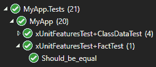
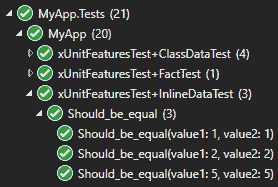
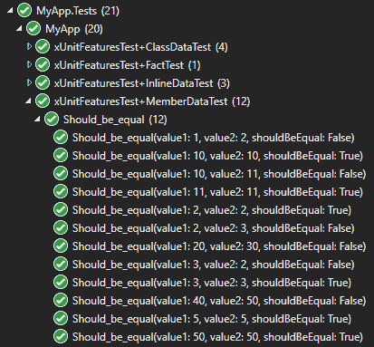
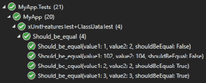
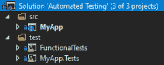
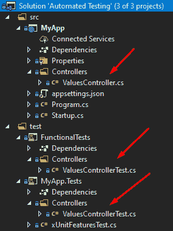

# *第 2 章*：测试您的 ASP.NET Core应用

本章重点介绍自动测试，以及它对制作更好的软件有多大帮助。它还涵盖了几种不同类型的测试，以及测试驱动开发 To1 T1（Po.T2A.TDD AutoT3）的基础。我们还概述了 ASP.NET Core的可测试性，以及与旧的 ASP.NET MVC 应用相比，测试 ASP.NET Core应用要容易得多。

在本章中，我们将介绍以下主题：

*   自动测试概述及其如何应用于 ASP.NET Core
*   测试驱动开发（TDD）
*   通过 ASP.NET Core简化测试

# 自动测试概述及其如何应用于 ASP.NET Core

测试是开发过程中不可分割的一部分，从长远来看，自动化测试变得至关重要。您始终可以运行 ASP.NET 网站，打开浏览器，然后单击任意位置以测试您的功能。这是合法的，但以这种方式测试单个代码单元更难。另一个缺点是缺乏自动化；当您第一次使用包含几个页面、几个端点或几个功能的小应用时，手动运行这些测试可能会很快。然而，随着你的应用的增长，它会变得更加乏味，需要更长的时间，而且测试人员出错的可能性也会增加。不要误解我的意思，你总是需要真正的用户来测试你的应用，但你可能希望这些测试集中在用户体验、功能内容或你正在构建的一些实验性功能上，而不是自动化测试可能在早期发现的 bug 报告。

有多种类型的测试，开发人员在寻找新的测试方法方面非常有创造力。下面列出了三大类，它们代表了我们如何划分自动化测试；让我们称这三个家庭为：

*   单元测试
*   集成测试
*   功能测试

单元测试关注于单个单元，就像测试方法的结果一样。单元测试应该是快速的，不应该依赖于任何基础设施，比如数据库。这些是您最想要的测试，因为它们运行得很快，并且每个测试都应该测试精确的代码路径。它们还应该帮助你更好地设计你的应用，因为你在测试中使用了你的代码，所以你成为了它的第一个消费者，这会导致你发现一些设计缺陷并使你的类变得更好。如果您不喜欢在测试中使用系统的方式，这是一个很好的指标，其他人都不会喜欢。

集成测试关注组件交互，例如当一个组件查询数据库时会发生什么，或者当两个组件相互交互时会发生什么。集成测试通常需要与一些基础设施进行交互，这使得它们运行速度较慢。您需要集成测试，但是您需要的集成测试比单元测试少。

笔记

我们以后会打破这条规则，所以要始终对规则和原则持批评态度；有时，折断或弯曲它们会更好。

功能测试关注应用范围内的行为，例如当用户单击特定按钮、导航到特定页面、发布表单或向某个 web API 端点发送`PUT`请求时会发生什么。功能测试的重点是从用户的角度，从功能的角度测试整个应用，而不是像单元测试和集成测试那样只测试部分代码。通常，功能测试应该在内存中运行，使用内存中的数据库或任何其他资源；这有助于加快速度，但您也可以在真实基础设施上运行**端到端**（**e2e**）测试，以测试您的应用和部署。

还有其他类型的自动化测试和一些我们可以称之为子类型的测试。例如，我们可以进行负载测试、性能测试、**e2e**测试、回归测试、契约测试、渗透测试等等。您可以为几乎任何您想要验证的内容自动化测试，但是某些类型的测试更难自动化，或者比其他类型的测试更脆弱，例如 UI 测试。这就是说，如果您可以在合理的时间范围内自动化测试，那就去做吧！从长远来看，这应该是值得的。

还有一件事，不要盲目依赖代码覆盖率等指标。这些指标在你的 GitHub 项目的`readme.md`文件中有着可爱的徽章，但会让你偏离编写无用测试的轨道。不要误解我的意思，正确使用代码覆盖率是一个很好的衡量标准，但请记住，一个好的测试可能比一个坏的测试套件覆盖 100%的代码库要好。

编写好的测试并不容易，需要实践。

笔记

一条建议：通过添加缺失的测试用例和删除过时或无用的测试来保持测试套件的健康。考虑用例覆盖率，而不是测试覆盖了多少行代码。

既然我们已经探索了自动化测试，现在是探索 TDD 的时候了，这是一种应用这些测试概念的方法，从考虑测试开始。

# 测试驱动开发（TDD）

TDD 是一种开发软件的方法，它规定您应该在编写实际代码之前编写测试。因此，您可以通过遵循**红-绿重构**技术来反转您的开发流程。

什么是**红绿重构**？

事情是这样的：

1.  您编写了一个失败的测试（红色）。
2.  您只需编写足够的代码即可通过测试（绿色）。
3.  通过确保所有测试仍然通过，您可以重构代码以改进设计。

好的，但是**重构**意味着什么？

我将重构定义为（持续）改进代码而不改变其行为。

拥有一个自动化测试套件应该可以帮助你实现这个目标，并且应该可以帮助你发现什么时候你打破了某些东西。无论您是否使用 TDD，我都建议您尽可能频繁地进行重构；这有助于清理您的代码库，同时还应该帮助您摆脱一些技术债务。

好的，但是什么是**技术债务**？

技术债务代表了您在开发功能或系统过程中缩短的所有角落。不管你怎么努力，这都会发生，因为生命就是生命，有延迟、截止日期、预算，还有各种各样的对手，比如经理、高层管理人员和驱动系统开发的外部资源；不仅仅是开发人员。好吧，老实说，我们也应该把开发人员添加到这个列表中——我们也创造了技术债务。

首先，你必须明白你不能完全避免技术债务，所以接受事实并接受它比与之抗争更好。从那时起，您可以尝试限制所产生的技术债务的数量。

限制技术债务堆积的一种方法是经常进行重构。因此，在特性评估中考虑重构时间。

另一种方法是学会与每个人合作，并将利益相关者包括在项目的构建过程中。帮助他们了解你的现实，并努力了解他们的现实。如果你想让你的项目成功，每个人都必须朝着同一个目标努力。

您可能需要不时缩短最佳实践的使用，但稍后会回来尽快修复它们。你知道，在那个重要的日期发布了关键特性之后，供应商告诉客户在咨询开发团队之前会发生什么？不幸的是，根据我的经验，这种情况确实经常发生。但是，有一些方法可以限制这些情况发生的次数。例如，参与者、部门和团队之间的高水平协作应该有所帮助，而适当的项目管理技术和善政也应该有所帮助。

提示

我意识到其中一些事情可能超出了你的控制，因此你可能不得不承受比你所希望的更多的技术债务。你也可以一直努力改变你所工作的企业文化，成为先锋；那就交给你了。

所有这些都表明，如果市场营销部门不能销售软件，那么开发它是毫无意义的，你可能最终会失业，所以让我们接受这样一个事实：妥协是强制性的。另一方面，自动化测试应该可以帮助您重构代码并优雅地摆脱债务。但是，不要让技术债务堆积得太高，否则你可能无法偿还，在某个时候，项目就开始崩溃和失败。别搞错了；生产中的项目可能会失败。交付产品并不能保证成功，我在这里谈论的是代码的质量，而不是产生的收入（我将把这一点留给您的会计部门）。

还有其他的方法，如**行为驱动开发**（**BDD**）和**验收测试驱动开发**（**ATDD**）。DevOps 带来了一种专注于在其持续集成和部署思想中采用自动化测试的思维方式。然而，我不会在书中写一本书，而是让你自己去写。我在这一章的末尾留下了一些参考资料，以获取关于其中一些主题的更多信息。

# 通过 ASP.NET Core简化测试

ASP.NET Core团队通过设计 ASP.NET Core 的可测试性使我们的生活更轻松；大多数测试都比 ASP.NET Core时代之前简单得多。在内部，他们使用 xUnit 测试.NET Core和 EF 内核，我们在本书中也使用 xUnit。xUnit 是我最喜欢的测试框架；多好的巧合啊。我们不会对所有样品采用完全 TDD 模式，因为这会使我们的重点偏离关键问题，但我尽了最大努力将尽可能多的自动化测试带到桌面上！为什么？因为可测试性通常是良好设计的标志，它允许我通过使用测试而不是文字来证明一些概念。

此外，在许多代码示例中，测试用例是使用者，使程序更轻，而无需在其上构建完整的用户界面。这使我们能够将注意力集中在正在探索的模式上，而不是分散在一些样板代码上。

## 如何创建 xUnit 测试项目？

要创建一个新的xUnit 测试项目，您可以运行`dotnet new xunit`命令，CLI 通过创建一个包含`UnitTest1`类的项目来为您完成这项工作。该命令的作用与从 Visual Studio 创建新的 xUnit 项目的作用相同，如下所示：


图 2.1–创建一个 xUnit 项目

## 迅特的基本特征

在 xUnit 中，`[Fact]`属性是创建唯一测试用例的方式，`[Theory]`属性是创建数据驱动测试用例的方式。

任何没有参数的方法都可以通过使用`[Fact]`属性进行装饰而成为测试方法，如下所示：

```cs
public class FactTest
{
    [Fact]
    public void Should_be_equal()
    {
        var expectedValue = 2;
        var actualValue = 2;
        Assert.Equal(expectedValue, actualValue);
    }
} 
```

从 Visual Studio 测试资源管理器中，该测试用例如下所示：



图 2.2–试验结果

然后，对于更复杂的测试用例，xUnit 提供了三个选项来定义`[Theory]`应该使用的数据：`[InlineData]`、`[MemberData]`和`[ClassData]`。你不仅限于一个人；你可以使用尽可能多的数据来为理论提供数据。必须确保值的数量与测试方法中定义的参数数量匹配。

`[InlineData]`最适合常量、文字值，如下所示：

```cs
public class InlineDataTest
{
    [Theory]
 [InlineData(1, 1)]
 [InlineData(2, 2)]
 [InlineData(5, 5)]
    public void Should_be_equal(int value1, int value2)
    {
        Assert.Equal(value1, value2);
    }
}
```

这将在测试资源管理器中生成三个测试用例，每个测试用例可以单独通过或失败：



图 2.3–试验结果

`[MemberData]`和`[ClassData]`可以用于简化测试方法的声明，在多个测试方法中重用数据，或者封装远离测试类的数据。以下是一些`[MemberData]`用法的示例：

```cs
public class MemberDataTest
{
    public static IEnumerable<object[]> Data => new[]
    {
        new object[] { 1, 2, false },
        new object[] { 2, 2, true },
        new object[] { 3, 3, true },
    };
    public static TheoryData<int, int, bool> TypedData =>new TheoryData<int, int, bool>
    {
        { 3, 2, false },
        { 2, 3, false },
        { 5, 5, true },
    };
    [Theory]
 [MemberData(nameof(Data))]
 [MemberData(nameof(TypedData))]
 [MemberData(nameof(ExternalData.GetData), 10, MemberType = typeof(ExternalData))]
 [MemberData(nameof(ExternalData.TypedData), MemberType = typeof(ExternalData))]
    public void Should_be_equal(int value1, int value2, bool shouldBeEqual)
    {
        if (shouldBeEqual)
        {
            Assert.Equal(value1, value2);
        }
        else
        {
            Assert.NotEqual(value1, value2);
        }
    }
    public class ExternalData
    {
        public static IEnumerable<object[]> GetData(int start) => new[]
        {
            new object[] { start, start, true },
            new object[] { start, start + 1, false },
            new object[] { start + 1, start + 1, true },
        };
        public static TheoryData<int, int, bool> TypedData => new TheoryData<int, int, bool>
        {
            { 20, 30, false },
            { 40, 50, false },
            { 50, 50, true },
        };
    }
}
```

该测试用例应该产生 12 个结果。如果我们将其分解，代码首先从`IEnumerable<object[]> Data`属性加载三组数据，方法是使用**[MemberData（nameof（data））]**属性装饰测试方法。

然后，为了更清楚，我们用一个`TheoryData<…>`类替换`IEnumerable<object[]>`，使其更可读，这是我定义成员数据的首选方法。我们通过使用**【MemberData（nameof（TypedData））】**属性将这三组数据添加到测试方法中。

然后，又有三组数据被传递给测试方法。这些源于外部类型上的一个方法，该方法以`10`为参数（参数`start`。我们指定了方法所在的`MemberType`，因此 xUnit 知道在哪里查找，它由`[MemberData(nameof(ExternalData.GetData), 10, MemberType = typeof(ExternalData))]`属性表示。

最后，我们对由`[MemberData(nameof(ExternalData.TypedData), MemberType = typeof(ExternalData))]`属性表示的`ExternalData.TypedData`属性执行相同的操作。

运行测试时，这些`[MemberData]`属性在测试浏览器中产生以下结果：



图 2.4–试验结果

这些只是我们可以使用`[MemberData]`属性的几个例子。

现在转到`[ClassData]`属性。该类从实现`IEnumerable<object[]>`的类或从`TheoryData<…>`继承的类获取数据。以下是一个例子：

```cs
public class ClassDataTest
{
 [Theory]
 [ClassData(typeof(TheoryDataClass))]
 [ClassData(typeof(TheoryTypedDataClass))]
    public void Should_be_equal(int value1, int value2, bool shouldBeEqual)
    {
        if (shouldBeEqual)
        {
            Assert.Equal(value1, value2);
        }
        else
        {
            Assert.NotEqual(value1, value2);
        }
    }
    public class TheoryDataClass : IEnumerable<object[]>
    {
        public IEnumerator<object[]> GetEnumerator()
        {
            yield return new object[] { 1, 2, false };
            yield return new object[] { 2, 2, true };
            yield return new object[] { 3, 3, true };
        }
        IEnumerator IEnumerable.GetEnumerator() => 
        GetEnumerator();
    }
    public class TheoryTypedDataClass : TheoryData<int, int, bool>
    {
        public TheoryTypedDataClass()
        {
            Add(102, 104, false);
        }
    }
}
```

这些与`[MemberData]`非常相似，但我们没有指向成员，而是指向类型。以下是测试资源管理器中的结果：



图 2.5–测试浏览器

既然`[Fact]`和`[Theory]`已经过时，xUnit 提供了**测试夹具**，允许开发人员将依赖项作为参数注入到测试类构造函数中。fixture 通过实现`IClassFixture<T>`接口，允许测试类的所有测试方法重用这些依赖关系。本章的最后一个代码示例显示了这一点。这对于访问数据库等代价高昂的依赖项非常有用；创建一次，使用多次。

您还可以使用`ICollectionFixture<T>`、`[Collection]`和`[CollectionDefinition]`在多个测试类之间共享一个夹具（依赖项）。我们不会在这里深入讨论细节，但是如果你需要类似的东西，你会知道去哪里找。

最后，如果您使用其他测试框架，您可能会遇到**设置**和**拆卸**方法。在 xUnit 中，没有特定的属性或机制来处理设置和拆卸代码。相反，xUnit 使用现有的 OOP 概念：

*   要设置测试，请使用类构造函数。
*   要拆除（清理）您的测试，请实施`IDisposable`，并在那里处置您的资源。

就是这样，xUnit 非常简单，但功能强大，这就是几年前我采用它作为主要测试框架的主要原因，也是我在本书中选择它的原因。现在让我们看看如何组织这些测试。

## 如何组织考试

在解决方案中组织测试项目有很多方法。我喜欢的一个方法是为解决方案中的每个项目创建一个单元测试项目、一个或多个集成测试项目和一个功能测试项目。由于我们大多数时候都有更多的单元测试，并且单元测试与单个代码单元直接相关，所以将它们组织成一对一的关系是有意义的。然后，我们应该有较少的集成和功能测试，因此单个项目应该足以保持代码的条理化。

笔记

有些人可能会建议为每个解决方案创建一个单独的单元测试项目，而不是为每个项目创建一个。这种方法可以节省发现时间。我认为，对于大多数解决方案来说，这只是偏好的问题。如果你有一个更喜欢的方式来组织你的，无论如何，用那个方法代替！也就是说，我发现每个组件一个单元测试项目更便于移植和导航。

大多数时候，在解决方案级别，我在`src`目录中创建我的应用及其相关库，并在`test`目录中创建我的测试项目，如下所示：



图 2.6–自动测试解决方案资源管理器，显示了项目的组织方式

在*自动测试*解决方案中，我没有任何集成测试，所以我没有创建集成测试项目。根据我的方法，我可以命名一个*集成测试*或*MyApp.IntegrationTests*。

我发现有助于使测试和代码完美对齐的另一个细节是，在与测试主题相同的命名空间中创建单元测试。为了在 Visual Studio 中更方便，您可以在测试项目中创建新类时更改 Visual Studio 使用的默认命名空间，方法是向测试项目文件（`*.csproj`的`PropertyGroup`中添加`<RootNamespace>[Project under test namespace]</RootNamespace>`，如下所示：

```cs
<PropertyGroup>  <TargetFramework>net5.0</TargetFramework>  <IsPackable>false</IsPackable>  <RootNamespace>MyApp</RootNamespace></PropertyGroup>
```

然后我将我的测试类命名为`[class under test]Test.cs`，并在与原始项目相同的目录中创建它们，如下所示：



图 2.7–自动测试解决方案资源管理器，显示了测试的组织方式

当你遵循这个简单的规则时，发现测试是微不足道的。有时，集成测试或功能测试不可能做到这一点；在这些情况下，请使用规范帮助您创建对测试有意义的清晰命名约定。记住，我们正在测试用例。

最后，对于每个类，我为从嵌套类的父类继承的每个方法嵌套一个测试类，然后使用`[Fact]`和`[Theory]`属性在其中创建测试用例。这有助于通过方法高效地组织测试，并以如下所示的测试层次结构结束：

```cs
namespace MyApp.Controllers {    public class ValuesControllerTest     {        public class Get : ValuesControllerTest         {            [Fact]            public void Should_return_the_expected_strings()            {                // Arrange                 var sut = new ValuesController();                // Act                 var result = sut.Get();                // Assert                 Assert.Collection(result.Value,                    x => Assert.Equal("value1", x),                    x => Assert.Equal("value2", x)                );            }        }    }}
```

该技术允许您逐步设置测试。例如，您可以创建顶级私有模拟；然后，对于每个方法，您可以修改设置或创建其他私有测试元素，然后您可以在测试方法内部对每个测试用例执行相同的操作。不过，不要过于强调可重用性；它会使测试很难被外部的人理解，比如评审员或其他需要在那里进行测试的开发人员。单元测试应该保持清晰、小且易于阅读。

## 怎么比较容易？

微软从头开始构建.NETCore（现在的.NET5），所以他们修复和改进了很多东西，我无法在此一一列举，包括可测试性。并不是每件事都是完美的，但它比以往任何时候都要好。

让我们从讨论`Program`和`Startup`类开始。这两个类是定义应用如何引导及其组成的地方。基于该模型，ASP.NET Core团队创建了一个测试服务器类，允许您在内存中运行应用。

他们还在.NETCore2.1 中添加了`WebApplicationFactory<TEntry>`，使集成和功能测试更加容易。使用该类，您可以在内存中启动 ASP.NET Core应用，并使用提供的`HttpClient`查询它。所有这些都只需要几行代码。有一些扩展点可以配置它，比如用 mock、stub 或您可能需要的任何其他特定于测试的元素替换实现。`TEntry`泛型参数应该是测试项目的`Startup`或`Program`类。

我在`Automated Testing`项目中创建了几个测试用例，公开了这个功能：

```cs
namespace FunctionalTests.Controllers
{
    public class ValuesControllerTest : IClassFixture<WebApplicationFactory<Startup>>
    {
        private readonly HttpClient _httpClient;
        public ValuesControllerTest(WebApplicationFactory<Startup> webApplicationFactory)
        {
            _httpClient = webApplicationFactory.CreateClient();
        }
```

在这里，我们通过实现`IClassFixture<T>`接口将`WebApplicationFactory<Startup>`对象注入构造函数。我们可以使用工厂来配置测试服务器，但由于这里不需要它，我们只能在配置为连接到运行应用的内存中测试服务器的`HttpClient`上保留一个引用。

```cs
        public class Get : ValuesControllerTest
        {
            public Get(WebApplicationFactory<Startup> webApplicationFactory) : base(webApplicationFactory) { }
            [Fact]
            public async Task Should_respond_a_status_200_OK()
            {
                // Act
                var result = await_httpClient.GetAsync("/api/values");
                // Assert
                Assert.Equal(HttpStatusCode.OK, result.StatusCode);
            }
```

在前面的测试用例中，我们使用测试`HttpClient`来查询 http://localhost/api/values URI，可通过内存服务器访问。然后我们测试 HTTP 响应的状态代码以确保它是成功的（`200 OK`。

```cs
            [Fact]
            public async Task Should_respond_the_expected_strings()
            {
                // Act
                var result = await_httpClient.GetAsync("/api/values");
                // Assert
                var contentText = await result.Content.ReadAsStringAsync();
 var content = JsonSerializer.Deserialize<string[]> (contentText);
                Assert.Collection(content,
                    x => Assert.Equal("value1", x),
                    x => Assert.Equal("value2", x)
                );
            }
        }
    }
}
```

最后一个测试执行相同的操作，但将主体内容反序列化为`string[]`，以确保值与我们预期的值相同。如果您以前使用过`HttpClient`，您应该非常熟悉它。

运行这些测试时，内存中的 web 服务器启动；然后，HTTP 请求被发送到该服务器，测试整个应用。在这种情况下，测试很简单，但是您也可以创建更复杂的测试用例。

您可以在 Visual Studio 中运行.NET 5 测试，也可以通过运行`dotnet test`命令来使用 CLI。在 VS 代码中，您可以使用 CLI 或查找扩展来帮助您完成测试运行。

# 总结

在本章中，我们介绍了自动化测试，如单元测试、集成测试和功能测试。我们快速查看了 xUnit，这是我们在本书中使用的测试框架，以及一种组织测试的方法。然后，我们了解了 ASP.NET Core 如何通过允许我们在内存中装载和运行 ASP.NET Core 应用，使测试 web 应用比以往任何时候都更容易。

本书中有许多 xUnit 测试，因此您将在此过程中变得更加熟悉。如果你觉得有必要的话，我还建议你深入研究一下。

现在，我们已经讨论了测试，我们准备探索一些架构原则，这些原则将导致单元测试和 TDD，同时增强程序的可测试性。这些是现代软件工程的一个关键部分，与自动化测试结合得很好。

# 问题

让我们来看看几个练习题：

1.  在 TDD 中，您在要测试的代码之前编写测试，这是真的吗？
2.  单元测试的作用是什么？
3.  单元测试能有多大？
4.  当受试者必须访问数据库时，通常使用哪种类型的测试？
5.  是否需要进行 TDD？

# 进一步阅读

以下是我们在本章学到的一些链接：

*   许妮特：[https://xunit.net/](https://xunit.net/)
*   如果您使用 VisualStudio，我有一些方便的代码片段可以帮助您提高工作效率。它们可在 GitHub 上获得：[https://net5.link/5TbY](https://net5.link/5TbY)
*   什么是 DevOps？[https://net5.link/BPcr](https://net5.link/BPcr)
*   下面这本书是我信任的人向我推荐的 DevOps/DevSecOps 资源。我自己没有读过，但已经浏览了一下内容，这似乎是一个开始的好资源：[https://net5.link/X6bW](https://net5.link/X6bW) 。