# 十五、垂直切片架构入门

在本章中，我们将探讨垂直切片体系结构，它将一个特性的所有元素移回到一起。这几乎与分层相反，但并非完全相反。垂直切片体系结构还为我们提供了请求之间的清晰分离，导致隐式的**命令查询责任分离（CQRS）**设计。我们使用 MediatR 将所有这些整合在一起，我们在上一章中对此进行了探讨。

本章将介绍以下主题：

*   垂直切片结构
*   一个使用垂直切片架构的小项目
*   继续你的旅程：一些提示和技巧

# 垂直切片架构

正如在上一章开头所说的，垂直切片将所有水平关注点组合在一起，以封装一个特性，而不是水平地分离一个应用。以下是一个图表，说明了：

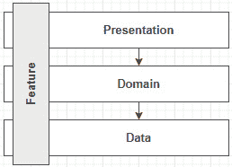

图 15.1–表示穿过所有层的垂直切片的示意图

吉米·博加德（Jimmy Bogard）是这类架构的先驱，他经常推广这类架构，他说：

[目标是]最小化片之间的耦合并最大化片内的耦合。

这是什么意思？让我们把这句话分成两个不同的点：

*   “最大限度地减少片之间的耦合”（改进的可维护性、松散耦合）
*   “最大化切片内的耦合”（内聚）

我们可以将前者视为：与其将代码分散在多个层次上，沿途可能会有多余的抽象，不如将代码重新组合在一起。这有助于将紧密耦合保持在一个垂直切片中，以创建一个内聚的代码单元，用于一个目的：处理特性的逻辑。

我们可以将后者视为：一个垂直切片不应依赖于另一个。记住这一点，当您修改垂直切片时，您不必担心对其他切片的影响，因为耦合是最小的。

然后，我们可以围绕您试图解决的业务问题来创建软件，而不是围绕您的客户不感兴趣的开发人员的问题（例如数据访问）。

## 有哪些优点和缺点？

从正面来看，我们有以下几点：

*   我们减少了特性之间的耦合，使得在这样的项目上工作更容易。我们只需要考虑单个垂直切片，而不是*N*层，通过将代码集中在一个共享关注点周围来提高**可维护性**。
*   我们可以选择每个垂直切片如何与它们所需的外部资源交互，而不必考虑其他切片。这增加了**灵活性**，因为一个片可以使用 T-SQL，而另一个片使用 EF 核心。
*   我们可以从几行代码（Martin Fowler 的*企业应用架构模式*中描述为**事务脚本**开始，而无需过度设计或过度工程。然后，当需要时，我们可以重构我们的方式以获得更好的设计，模式开始出现，从而加快上市时间。
*   每个垂直切片应该精确地包含正确所需的代码量，而不是更多，也不是更少。这导致了一个更健壮的代码库（更少的代码意味着更少的无关代码）。
*   新用户更容易在现有系统中找到自己的方法，因为每个功能都是独立的，其代码都是分组的，从而加快了**的登录时间**。
*   All that you already know still applies.

    提示

    根据我的经验，功能往往从小事做起，并随着时间的推移而增长。在使用软件时，用户通常会发现他们真正需要什么，更新他们认为最初需要的工作流程，从而导致软件的更改。我希望有许多项目是使用垂直切片架构而不是分层构建的。

现在有一些缺点：

*   如果你已经习惯了分层，那么你可能需要花一些时间来思考它，从而进入一个适应期，学习一种新的思考软件的方式。
*   It is a "newer" type of architecture, and people don't like change.

    笔记

    另一件我通过艰苦的方式学到的事情是拥抱变化。我认为我没有看到一个项目像预期的那样结束。每个人在使用软件时都会找出业务流程中缺失的部分。这就引出了以下建议：尽快发布，并让您的客户尽快使用该软件。使用垂直切片体系结构可以更容易地实现这一建议，因为您正在为客户构建价值，而不是或多或少有用的抽象和层。

    在我职业生涯的开始，当规格发生变化时，我很沮丧，我认为更好的计划可以解决这个问题。有时更好的计划会有所帮助，但有时，客户只是不知道，不得不尝试应用来解决它。我在这里的建议是，当规范发生变化时，不要感到沮丧，即使这意味着要重新编写软件的一部分，而这一部分最初花了你几天或更多的时间编写代码；这将一直发生。相反，要学会接受这一点，并通过帮助客户了解他们的需求，找到减少这种情况发生次数的方法。

以下几点是可能成为正面的负面因素：

*   如果您习惯于在筒仓中工作，那么根据关注点分配任务可能会比较困难（例如，数据员在做数据工作）。但最终，这应该是一种优势；团队中的每一个人（或多个团队）都应该更紧密地合作，从而带来更多的学习和协作，并可能建立一个新的跨职能团队（这绝对是一件好事）。
*   Refactoring: You need refactoring skills. Over time, most systems need some refactoring. That can be caused by changes in the requirements, or due to technical debt. No matter the reason, if you don't, you may very well end up with a **Big Ball of Mud**. Writing isolated code at first then refactoring to patterns is a crucial part of Vertical Slice Architecture. That's one of the best ways to keep cohesion high inside a slice and coupling as low as possible between slices.

    笔记

    开始重构业务逻辑的一种方法是将逻辑推入**域模型**，创建一个**丰富的域模型**。您还可以使用其他设计模式和技术来微调代码并使其更易于维护，例如通过创建服务甚至层。层不必穿过所有垂直切片；它只能跨越其中的一个子集。与其他应用级模式（如分层）相比，垂直切片体系结构规则更少，从而使您的终端有更多的选择。*您可以在垂直切片中使用所有设计模式、原则和最佳实践，而无需将这些选择导出到其他垂直切片。*

如何将项目组织到垂直切片体系结构中？不幸的是，没有明确的答案；这就像设计软件时的一切：这取决于。我们将在下一个项目中探索一种方法，但您可以根据自己的需要组织项目。然后我们将深入研究重构和组织。在此之前，让我们快速了解一下**大泥球**反模式。

## 反模式：大泥球

**Big Ball of Mud**描述了一个系统，结果很糟糕，或者从未设计过。有时一个系统一开始很好，但由于压力、不稳定的需求、不可能的截止日期、糟糕的做法或任何其他原因而演变成一个大泥球。大泥球通常被称为**意大利面代码**，意思几乎相同。

这就是这个反模式；它只是一个不可维护的代码库或一个很难维护的代码库。接下来，我们将进入垂直切片体系结构项目。

# 项目：垂直切片架构

**上下文**：我们对分层越来越厌倦，我们被要求使用垂直切片架构重建我们的小型演示店。

下面是一个更新的图表，显示了项目在概念上是如何组织的：

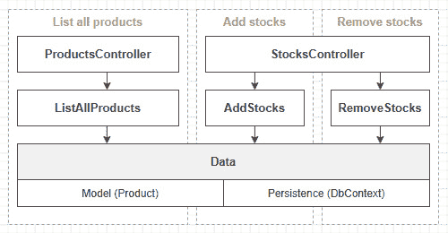

图 15.2——代表项目组织的图表

每个垂直框是一个用例（或切片），而每个水平箭头是一个横切关注点或一些共享组件。这是一个小项目，因此数据访问代码（`DbContext`和`Product`模型在所有用例之间共享。这种共享与垂直切片架构无关，但作为一个小项目，很难将其进一步拆分。我将在本节末尾详细介绍。

以下是演员：

*   `ProductsController`是管理产品的 web API 入口点。
*   `StocksController`是管理库存（添加或删除库存）的 web API 入口点。
*   `AddStocks`、`RemoveStocks`和`ListAllProducts`是我们在项目中复制的相同用例。
*   **持续**层由一个 EF 核心`DbContext`组成，该核心持续`Product`模型。

我们可以在垂直切片的基础上添加其他横切关注点，例如授权、错误管理和日志记录等。我们将在此示例中只探讨验证。

接下来，让我们来看看项目是如何组织的。

### 项目组织

以下是我们组织项目的方式：

*   `Data`目录包含 EF 核心相关类。
*   `Features`目录包含这些功能。每个子文件夹都包含其底层用例（垂直切片）。
*   Each use case is self-contained and exposes the following classes:

    a） `Command`表示 MediatR 请求。

    b） `Result`是该请求的返回值。

    c） `MapperProfile`指示 AutoMapper 如何映射与用例相关的对象。

    d） `Validator`包含验证`Command`对象的验证规则。

    e） `Handler`包含用例逻辑：如何处理请求。

*   `Models`目录包含域模型。

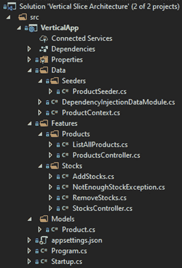

图 15.3–文件组织的解决方案资源管理器视图

在这个项目中，每个用例都有一个`MapperProfile`类，但是我们可以为每个特性共享一个，将`MapperProfile`类移动到与控制器相同的级别。

在这个项目中，我们添加了请求验证。为了实现这一点，我们正在使用**FluentValidation**。您也可以使用`System.ComponentModel.DataAnnotations`或任何其他您想要的验证系统。FluentValidation 的优点在于，它很容易将验证保持在垂直部分内，但不在要验证的类内（例如，与`DataAnnotations`相比）。而且，它易于测试和扩展。

与其他工具一样，FluentValidation 可以使用以下行（突出显示）扫描程序集以查找验证器：

```cs
var currentAssembly = GetType().Assembly;
services.AddAutoMapper(currentAssembly);
services.AddMediatR(currentAssembly);
services.AddDependencyInjectionModules(currentAssembly);
services
    .AddControllers()
    .AddFluentValidation(config => config.RegisterValidatorsFromAssembly(currentAssembly));
```

验证器本身是每个垂直切片的一部分。接下来我们来看看这些特性。

### 探索特性

在本小节中，我们将探讨`RemoveStocks`特性。我们在前面的示例中使用了相同的逻辑，但组织方式不同（这在很大程度上是一种体系结构风格和另一种体系结构风格之间的差异）。让我们看一下代码，我在每个块后面描述：

```cs
namespace VerticalApp.Features.Stocks
{
    public class RemoveStocks
    {
```

`RemoveStocks`类包含多个嵌套类，以帮助组织我们的功能，并避免命名冲突带来的麻烦。

```cs
        public class Command : IRequest<Result>
        {
            public int ProductId { get; set; }
            public int Amount { get; set; }
        }
```

`Command`类是用例的**输入：请求。请求包含执行操作（即从库存中删除库存）所需的所有内容。`IRequest<TResult>`接口告诉 MediatR`Command`类是一个请求，应该路由到它的处理程序。`Result`类（如下所示）是该处理程序的返回值：**

```cs
        public class Result
        {
            public int QuantityInStock { get; set; }
        }
```

`Result`类表示用例的**输出。这就是处理程序将返回的内容。**

```cs
        public class MapperProfile : Profile
        {
            public MapperProfile()
            {
                CreateMap<Product, Result>();
            }
        }
```

映射器配置文件是可选的，但它允许封装与用例相关的 AutoMapper*映射*。在前面的代码中，我们注册了从`Product`实例到`Result`实例的映射。

```cs
        public class Validator : AbstractValidator<Command>
        {
            public Validator()
            {
                RuleFor(x => x.Amount).GreaterThan(0);
            }
        }
```

验证器是可选的，但允许在输入到达处理程序之前验证输入（`Command`。为了实现这一点，我们需要实现一个添加到 MediatR 管道中的`IPipelineBehavior<TRequest, TResponse>`接口（在完成`RemoveStock`功能之后）。接下来是`Handler`类，它实现了用例逻辑：

```cs
        public class Handler : IRequestHandler<Command, Result>
        {
            private readonly ProductContext _db;
            private readonly IMapper _mapper;
            public Handler(ProductContext db, IMapper mapper)
            {
                _db = db ?? throw new ArgumentNullException(nameof(db));
                _mapper = mapper ?? throw new ArgumentNullException(nameof(mapper));
            }
            public async Task<Result> Handle(Command request, CancellationToken cancellationToken)
            {
                var product = await _db.Products.FindAsync(request.ProductId);
                if (request.Amount > product.QuantityInStock)
                {
                    throw new NotEnoughStockException(product.QuantityInStock, request.Amount);
                }
                product.QuantityInStock -= request.Amount;
                await _db.SaveChangesAsync();
                var result = _mapper.Map<Result>(product);
                return result;
            }
        }
    }
}
```

`Handler`类继承自`IRequestHandler<Command, Result>`，后者将其链接到`Command`类。它实现了与之前实现相同的逻辑，从[*第 12 章*](12.html#_idTextAnchor230)*理解分层*开始。

总之，`RemoveStocks`类包含该特定用例所需的所有子类。作为提醒，现在我们已经阅读了代码，每个用例的片段如下所示：

*   `Command`为输入 DTO。
*   `Result`是输出 DTO。
*   `MapperProfile`是将 DTO 映射到域模型（反之亦然）的 AutoMapper 配置文件。
*   `Validator`验证`Command`DTO（输入）。
*   `Handler`封装了用例逻辑。

现在让我们看一下类，它将 HTTP 请求转换为 MediatR 管道：

```cs
namespace VerticalApp.Features.Stocks
{
    [ApiController]
    [Route("products/{productId}/")]
    public class StocksController : ControllerBase
    {
        private readonly IMediator _mediator;
        public StocksController(IMediator mediator)
        {
            _mediator = mediator ?? throw new ArgumentNullException(nameof(mediator));
        }
```

我们在控制器中注入一个`IMediator`实现，因为我们在接下来的所有操作中都使用它。

```cs
        [HttpPost("add-stocks")]
        public async Task<ActionResult<AddStocks.Result>> AddAsync(
            int productId,
            [FromBody] AddStocks.Command command
        )
        {
            command.ProductId = productId;
            var result = await _mediator.Send(command);
            return Ok(result);
        }
```

在前面的代码中，我们从 body 读取一个`AddStocks.Command`实例的内容，然后根据[*第 12 章*](12.html#_idTextAnchor230)、*理解分层*中讨论的原因设置`ProductId`，最终将`command`对象发送到 MediatR 管道中。从那里，MediatR 将请求路由到我们几页前研究过的处理程序，然后返回带有 HTTP`200 OK`状态代码的操作结果。

```cs
        [HttpPost("remove-stocks")]
        public async Task<ActionResult<RemoveStocks.Result>> RemoveAsync(
            int productId,
            [FromBody] RemoveStocks.Command command
        )
        {
            try
            {
                command.ProductId = productId;
                var result = await _mediator.Send(command);
                return Ok(result);
            }
            catch (NotEnoughStockException ex)
            {
                return Conflict(new
                {
                    ex.Message,
                    ex.AmountToRemove,
                    ex.QuantityInStock
                });
            }
        }
    }
}
```

`remove-stocks`动作与`add-stocks`动作具有相同的逻辑，并添加了`try/catch`块（与此代码之前的实现类似）。

前面的代码和以前的实现之间的一个区别是我们将 DTO 移动到垂直切片本身（突出显示的行）。每个垂直片定义该特性的输入、逻辑和输出，如下所示：

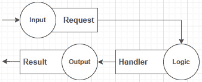

图 15.4–表示垂直切片的三个主要部分的示意图

当我们添加输入验证时，我们有以下内容：

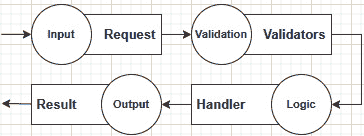

图 15.5——表示垂直切片的三个主要部分的图表，添加了验证

总之，控制器的代码很薄，在 HTTP 和我们的域之间创建了一个很小的层，将 HTTP 请求映射到 MediatR 管道，并将响应映射回 HTTP。对于`productId`和`try/catch`块，我们仍然有额外的行，但是我们可以使用定制的模型绑定器（请参阅本章末尾的一些附加资源）来消除这些行。

有了这些，现在就可以直接向项目中添加新功能了。从视觉上看，我们最终得到以下垂直切片（粗体）、可能的扩展（普通）和共享类（斜体）：

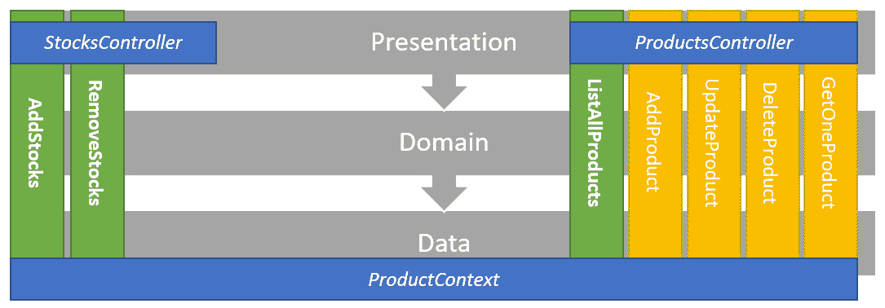

图 15.6–表示项目和与产品管理相关的可能扩展的图表

接下来，我们添加缺少的部分以使用这些`IValidator`实现。

### 请求验证

我们现在有了大部分代码来运行我们的小项目。但是，我们的 MediatR 管道中仍然没有验证，只有验证器。幸运的是，MediatR 有一个`IPipelineBehavior<in TRequest, TResponse>`接口，允许我们扩展请求管道。它的工作原理类似于 MVC 过滤器。说到这里，我们还需要一个过滤器来控制发生验证错误时的 HTTP 响应。这将允许我们将验证逻辑封装在两个小类中。这两个类将拦截并处理任何特性引发的所有验证异常。

让我们从一个高级视图开始：

1.  HTTP 请求通过 ASP.NET MVC 管道到达控制器。
2.  控制器发送通过 MediatR 管道的命令：

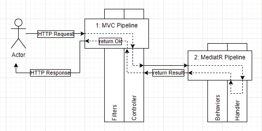

图 15.7–成功 HTTP 请求的高级流

我们要做的是：

1.  在 MVC 管道中（在图的**过滤器**部分）添加一个捕捉`ValidationException`（来自 FluentValidation）的`IExceptionFilter`。
2.  添加一个 MediatR`IPipelineBehavior`来验证请求，并在请求验证失败时抛出一个`ValidationException`（在图的**行为**部分）。

添加这两个部分后，我们的请求流将变成这样：

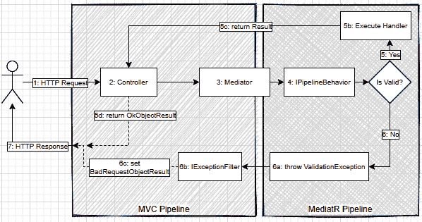

图 15.8–包括请求验证详细信息的请求流

1.  用户发送 HTTP 请求。
2.  控制器通过中介器发送命令。
3.  中介通过其管道运行请求。
4.  `IPipelineBehavior`实现验证请求。
5.  If the request is valid, the following occurs:

    a） 请求继续通过 MediatR 管道，直到到达处理程序。

    b） `Handler`被执行。

    c） `Handler`返回一个`Result`实例。

    d） 控制器将该`Result`对象转换为`OkObjectResult`对象。

6.  If the validation of the request fails, the following occurs:

    a） `IPipelineBehavior`实现抛出一个`ValidationException`。

    b） `IActionFilter`实现捕获并处理异常。

    c） 过滤器将动作结果设置为`BadRequestObjectResult`。

7.  MVC 将生成的转换为`200 OK`（成功）或`400 BadRequest`（验证失败）响应，并将生成的对象序列化到响应体中。

现在我们已经了解了这些变化的理论方面，让我们从编码`IPipelineBehavior`实现开始。我将其命名为`ThrowFluentValidationExceptionBehavior`，因为它抛出一个`ValidationException`（来自 FluentValidation），它是一个 MediatR 行为：

```cs
namespace VerticalApp
{
    public class ThrowFluentValidationExceptionBehavior<TRequest, TResponse> : IPipelineBehavior<TRequest, TResponse>
        where TRequest : IBaseRequest
```

我们从实现`IPipelineBehavior<TRequest, TResponse>`接口开始。我们的类将这两个通用参数转发到`IPipelineBehavior`接口，以服务于所有类型的请求，只要请求实现`IBaseRequest`。`Command`类实现的`IRequest<out TResponse>`接口继承自`IBaseRequest`。

```cs
    {
        private readonly IEnumerable<IValidator<TRequest>> _validators;
        public ThrowFluentValidationExceptionBehavior (IEnumerable<IValidator<TRequest>> validators)
        {
            _validators = validators ?? throw new ArgumentNullException(nameof(validators));
        }
```

这是魔法的一部分；通过注入`IValidator<TRequest>`列表，我们的行为将能够访问当前请求（任何类型的请求）的验证器。

```cs
        public Task<TResponse> Handle(TRequest request, CancellationToken cancellationToken, RequestHandlerDelegate<TResponse> next)
        {
            var failures = _validators
                .Select(v => v.Validate(request))
                .SelectMany(r => r.Errors);
            if (failures.Any())
            {
                throw new ValidationException(failures);
            }
            return next();
        }
    }
}
```

最后，在`Handle`方法中，我们运行所有验证器（参见突出显示的代码），并将错误投射到`failures`变量中。如果有任何失败，它抛出一个包含所有失败的`ValidationException`。如果验证成功，它将返回管道的下一个元素。这个概念类似于我们在[*第 10 章*](10.html#_idTextAnchor196)*行为模式*中探讨的**责任链**模式。

接下来，为了让它工作，我们必须在合成根中注册它。因为我们不想为我们项目中的每个特性注册它，所以我们将它注册为一个**开放泛型类型**，如下所示（在`Startup`类中）：

```cs
services.AddSingleton(
    typeof(IPipelineBehavior<,>),
    typeof(ThrowFluentValidationExceptionBehavior<,>)
);
```

这段代码的意思是：“为所有请求在管道中添加并引用`ThrowFluentValidationExceptionBehavior`的实例。”因此，无论请求的类型如何，我们的行为每次都会运行。

如果我们运行代码，我们会得到以下错误，这是不优雅的：

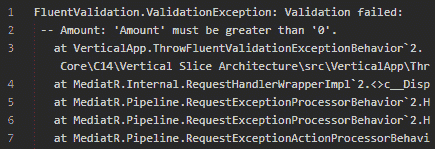

图 15.9–ThrowFluentValidationExceptionBehavior（不带 MVC 过滤器）的结果

为了管理 MVC 输出这些异常的方式，我们可以创建一个`IExceptionFilter`并将其添加到管道中。我决定将其命名为`FluentValidationExceptionFilter`，因为它是一个异常过滤器，用于处理`FluentValidation.ValidationException`类型的异常。该类如下所示：

```cs
namespace VerticalApp
{
    public class FluentValidationExceptionFilter : IExceptionFilter
    {
        public void OnException(ExceptionContext context)
        {
            if (context.Exception is ValidationException ex)
            {
                context.Result = new BadRequestObjectResult(new
                {
                    ex.Message,
                    ex.Errors,
                });
                context.ExceptionHandled = true;
            }
        }
    }
}
```

前面的代码验证`Exception`属性（当前异常）的值是否为`ValidationException`。如果是，则将`Result`属性的值设置为`BadRequestObjectResult`的实例。它创建了一个匿名对象，其两个属性直接取自`ValidationException`对象：`Message`和`Errors`。`Message`是错误消息，`Errors`是`ValidationFailure`对象的集合。

之后，它将`ExceptionHandled`属性设置为 true，这样 MVC 就知道异常已被处理，不再关心它，就像它从未发生过一样。这几行代码相当于从控制器操作返回一个`BadRequest(new {...})`，但对所有控制器的操作都是全局应用的。

最后一步：我们必须将它注册到 MVC 管道中，以便使用它。在`Startup`类中，我们将空的`services.AddControllers()`方法调用替换为以下内容：

```cs
services.AddControllers(options => options
    .Filters.Add<FluentValidationExceptionFilter>())
```

这将我们新的过滤器添加到 MVC 管道中。从现在起，无论何时发生未处理的异常，都将执行我们的筛选器。

现在，如果我们运行一个不应该通过验证的请求（例如*添加 0 个新股票*，我们会得到以下结果：

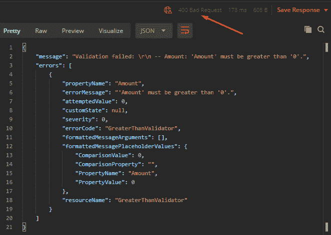

图 15.10–FluentValidationExceptionFilter 处理 ThrowFluentValidationExceptionBehavior 的结果

这更优雅，客户更容易处理。您还可以自定义在`IPipelineBehavior`接口实现中抛出的异常以及在`IExceptionFilter`实现中序列化的对象。您还可以在基于非 MediatR 的项目中利用`IExceptionFilter`接口的自定义实现，因为它是 MVC。还有其他类型的过滤器。过滤器非常擅长处理 MVC 中的横切关注点。

接下来，我们将探讨一些测试。我不会测试整个应用，但我将介绍测试垂直切片体系结构相对于其他体系结构类型的一些优势。

### 测试

对于这个项目，我为每个用例结果编写了一个集成测试，这减少了所需的单元测试数量，同时提高了系统的可信度。为什么？因为我们正在测试特性本身，而不是独立地测试许多抽象部分。我们还可以添加任意数量的单元测试。我不是要你停止编写单元测试；相反，我认为这种方法可以帮助您编写更少但更好的面向特性的测试，从而减少对模拟重型单元测试的需求。

让我们看一下股票的使用情况：用例测试：

```cs
namespace VerticalApp.Features.Stocks
{
    public class StocksTest : BaseIntegrationTest
    {
        public StocksTest()
            : base(databaseName: "StocksTest") { }
```

`BaseIntegrationTest`类封装了依赖注入和数据库种子逻辑的样板代码。出于简洁的原因，我将省略它，但是您可以在 GitHub 存储库（[中）中查阅完整的源代码 https://net5.link/DfSf](https://net5.link/DfSf) 。

```cs
        protected async override Task SeedAsync(ProductContext db)
        {
            await db.Products.AddAsync(new Product
            {
                Id = 4,
                Name = "Ghost Pepper",
                QuantityInStock = 10
            });
            await db.Products.AddAsync(new Product
            {
                Id = 5,
                Name = "Carolina Reaper",
                QuantityInStock = 10
            });
            await db.SaveChangesAsync();
        }
```

在`SeedAsync`方法中，我们在内存测试数据库中插入两个产品。

```cs
        public class AddStocksTest : StocksTest{...}
        public class RemoveStocksTest : StocksTest
        {
            private const int _productId = 5;
            [Fact]
            public async Task Should_decrement_ QuantityInStock_by_the_specified_amount()
            {
                // Arrange
                var serviceProvider = _services.BuildServiceProvider();
                using var scope = serviceProvider.CreateScope();
                var mediator = scope.ServiceProvider. GetRequiredService<IMediator>();
                // Act
                var result = await mediator.Send(new RemoveStocks.Command
                {
                    ProductId = _productId,
                    Amount = 10
                });
                // Assert
                using var assertScope = serviceProvider.CreateScope();
                var db = assertScope.ServiceProvider. GetRequiredService<ProductContext>();
                var peppers = await db.Products.FindAsync(	_productId);
                Assert.Equal(0, peppers.QuantityInStock);
            }
            [Fact]
            public async Task Should_throw_a_NotEnoughStockException_when_the_resulting_QuantityInStock_would_be_less_than_zero()
            {
                // Arrange
                using var scope = _services. BuildServiceProvider().CreateScope();
                var mediator = scope.ServiceProvider. GetRequiredService<IMediator>();
                // Act & Assert
                await Assert.ThrowsAsync<NotEnoughStockException>(() => mediator.Send(new RemoveStocks.Command
                {
                    ProductId = _productId,
                    Amount = 11
                }));
            }
        }
    }
}
```

`RemoveStocksTest`类包含两个测试用例：

*   应按规定数量减少`QuantityInStock`。
*   当结果`QuantityInStock`小于零时，应抛出一个`NotEnoughStockException`。

在**排列**阶段，测试方法从 IoC 容器获取服务，创建`ServiceProvider`实例，然后创建模拟 HTTP 请求范围的范围。从这个范围来看，两个测试用例都得到了一个`IMediator`实例。

然后，在**Act**阶段，两个测试都向`IMediator`发送命令，就像控制器一样，在这个过程中测试整个管道。

在**断言**阶段，第一个测试创建一个新的作用域，以确保它接收到`ProductContext`类的新实例，并且查询不会返回一些未提交的 EF 核心实体。然后验证保存的数据是否正确。第二个测试用例验证了`Handler`抛出了`NotEnoughStockException`。

就这样,；使用少量的代码，我们测试了两个 Stock 用例的三个主要逻辑路径。我们还可以通过向控制器发送 HTTP 请求来测试整个 web API。另一方面，我们可以通过模拟`IMediator`接口对控制器进行单元测试。您的测试策略取决于您的需求，但是从`IMediator`进行测试将适用于使用 MediatR 的任何类型的应用，这就是我选择该策略的原因。

接下来，我们将介绍一些技巧和流程，以开始使用更大的应用。这些都是我找到工作的方法，也很适合你。把对你有用的东西拿走，剩下的留着；我们都不同，工作也不同。

# 继续你的旅程

以前的项目很小。它有一个作为数据层的共享模型，因为该模型只由一个类组成。当你正在构建一个更大的应用时，你很可能会拥有不止一个类，因此我将尝试为你提供一个处理更大应用的良好起点。其思想是创建尽可能小的片段，尽可能限制与其他片段的交互，然后将代码重构为更好的代码。我们不能移除耦合，所以我们需要组织它。

下面是一个我们可以称之为“从小处着手，重构”的工作流：

1.  编写涵盖您的功能（输入和输出）的合同。
2.  使用这些契约编写一个或多个涵盖您的功能的集成测试；`Query`或`Command`类（`IRequest`类）作为输入，`Result`类作为输出。
3.  实现您的`Handler`、`Validator`、`MapperProfile`和任何其他需要编码的位。在这一点上，代码可能是一个巨大的`Handler`；没关系。
4.  一旦你的集成测试通过，通过分解你的巨型`Handler.Handle`方法重构代码（如果需要的话）。
5.  确保你的测试仍然通过。

在*步骤 2*中，您可能还希望将验证规则作为单元测试进行测试。从单元测试中测试多个组合和场景更容易、更快，而且您不需要为此访问数据库。这同样适用于系统中未绑定到外部资源的任何其他部分。

在*步骤 4*中，您可能会发现特征之间存在重复的逻辑。如果是这样的话，现在是时候将这种逻辑封装到其他地方，一个共享的地方。这可以是在模型中创建一个方法，创建一个服务类，或者您知道的任何其他模式和技术，它们可能会解决您的逻辑复制问题。从孤立的特性和提取共享逻辑将帮助您设计应用。您希望将该共享逻辑推到处理程序之外，而不是反过来（一旦您拥有了该共享逻辑，您就可以在需要的地方使用它）。在这里，我想强调*共享逻辑*，这意味着一个业务规则。当业务规则更改时，该业务规则的所有使用者也必须更改其行为。避免共享*类似代码*，但要共享业务规则。

设计软件时，最重要的是关注功能需求，而不是技术需求。你的客户和用户不关心技术方面的东西；他们需要结果、新功能、错误修复和改进。同时，当心技术债务，不要跳过重构步骤，否则您的项目可能会陷入麻烦。该建议也适用于所有类型的体系结构。

另一条建议是让所有代码尽可能靠近垂直切片。您不必将用例的所有类都保存在一个文件中，但我觉得这很有帮助。您还可以创建一个文件夹层次结构，其中较深的级别共享以前的级别。例如，我最近在一个与发货相关的 MVC 应用中实现了一个工作流。创建过程分为多个步骤。因此，我最终得到了如下层次结构（目录为粗体）：

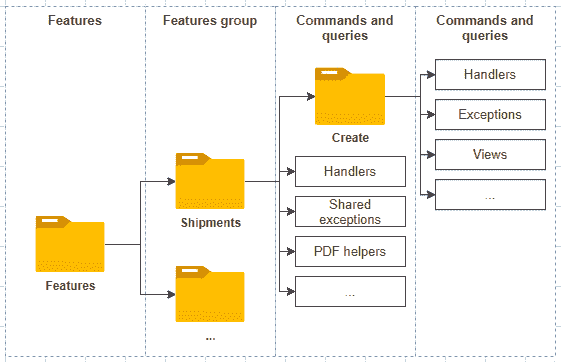

图 15.11–目录和元素的组织层次结构

最初，我只是一个接一个地编写所有处理程序，然后我看到模式出现，所以我采用了共享逻辑并将其封装到共享类中。然后我开始在上层重用一些异常，所以我将它们从`Features/Shipments/Create`文件夹/名称空间上移到`Features/Shipments`文件夹/名称空间。我还提取了一个服务类来管理多个用例和更多用例之间的共享逻辑（我将跳过所有细节，因为它们是不相关的）。最后，我只有我需要的代码，没有重复的逻辑，协作者（类、接口）彼此非常接近。我只在 IoC 容器中注册了三个接口，其中两个与 PDF 生成相关。特性之间的耦合是最小的，而系统的某些部分是协同工作的（内聚）。此外，与系统的其他部分几乎没有耦合。如果我们将这一结果与另一种类型的架构（如分层）进行比较，我很可能需要更多的抽象，如存储库、服务等；垂直切片架构的最终结果更简单。

这里的关键点是独立编写处理程序，尽可能地组织它们，关注共享逻辑和新兴模式，提取和封装该逻辑，并尝试限制用例和切片之间的交互。

现在，什么是切片？就我个人而言，我将切片视为复合材料。每个`Features/Shipments/Create/[*]Handler`都是一片。当放在一起时，它们组成`Features/Shipments/Create`切片（一个更大的切片）。然后，`Features/Shipments`中的所有切片都变成另一个大切片，导致如下结果：

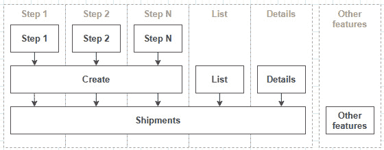

图 15.12–一个显示自上而下耦合结构的图，其中较小的组件（顶部）依赖于复杂特征（底部）的较大组件（中间），这是基于它们彼此之间的粘合力（垂直）

**步骤 1**内部存在强耦合，其他步骤之间耦合有限；他们共享一些创建代码作为**创建**片段的一部分。**创建**、**列表**、**明细**也共享一些代码，但方式有限；它们都是**装运**切片的一部分，并访问或操作同一实体：一个或多个装运。最后，**发货**切片与**其他功能**没有代码共享（或很少共享）。

好的，这是我对切片的定义和我对切片的看法；也许其他人对此有其他观点，这很好。我发现通过遵循我刚才描述的模式，我最终得到了有限的耦合和最大的内聚。

# 总结

在本章中，我们概述了垂直切片体系结构，它将层翻转 90°。垂直切片体系结构是通过依赖开发人员的技能和判断，从等式中获取多余的抽象和规则，编写最小的代码以产生最大的价值。

重构是垂直切片体系结构项目中的一个关键因素；成功或失败很可能取决于它。所有模式（包括层）都可以与垂直切片体系结构结合使用。与分层相比，它有很多优点，几乎没有缺点。在筒仓中工作的团队（水平团队）可能需要重新考虑这一点，然后再切换到垂直切片架构，并创建多功能团队（垂直团队）。

使用垂直切片架构，我们用命令和查询（CQR）取代了低值抽象。然后使用中介模式（由 MediatR 帮助）将它们路由到各自的`Handler`。这允许封装业务逻辑并将其与调用方（示例中的控制器）分离。这些命令和查询确保域逻辑的每一位都集中在一个位置。

我们可以使用经典的 MVC 过滤器、ASP.NET 中间件或 MediatR`IPipelineBehavior`封装横切关注点，具体取决于我们希望在何处处理该关注点。我们还可以使用其中的许多选项实现复合解决方案，就像我们在处理验证的代码示例中所做的那样。

通过使用集成测试测试每个垂直切片，我们可以显著减少测试所需的模拟数量。这还可以显著减少单元测试的数量，测试特性而不是模拟的代码单元。我们的重点应该放在生成特性上，而不是查询基础设施或代码本身背后的细节（好的，这也很重要）。

笔记

需要注意的是，您仍然可以根据需要编写尽可能多的单元测试；垂直切片架构中的任何内容都不会阻止您这样做。这是优点之一：使用您正在处理的切片中的所有知识，而无需将其全局导出到其他切片。

总而言之，我们探索了一种现代的方法来设计一个与敏捷开发很好结合的应用，并帮助您的客户创造价值。

现在，让我们看看垂直切片架构如何帮助我们遵循**坚实的**原则：

*   **S**：每个垂直层面（特征）成为一个整体变化的内聚单元，导致每个特征的责任分离。基于 CQRS 启发的方法，每个特性将应用的复杂性分解为命令和查询，从而产生多个小部分。每一件都处理一部分过程。例如，我们可以定义一个输入、一个验证器、一个映射器配置文件、一个处理程序、一个结果、一个 HTTP 网桥（控制器），以及我们制作切片所需的任意多个片段。
*   **O**：我们可以通过扩展 ASP.NET、MVC 或 MediatR 管道来全面增强系统。这些特性本身可以设计为一体式，对 OCP 的直接影响有限。
*   **L**：不适用。
*   **I**：通过以领域为中心的用例单元来组织特征，我们最终得到了许多特定于客户端的组件，而不是像层这样的通用元素。
*   **D**：一个片的所有部分都只依赖于接口，并通过依赖注入绑定在一起。此外，通过从系统中删除不太有用的抽象，我们简化了它，使它更易于维护和简洁。通过让如此多的功能片段彼此靠近，系统变得更易于维护，同时提高了可发现性。

在下一章中，我们将探讨另一种体系结构风格，并讨论微服务。

# 问题

让我们来看看几个练习题：

1.  我们可以在垂直切片中使用哪些设计模式？
2.  当使用垂直切片体系结构时，您必须选择一个 ORM 并坚持使用它，例如数据层，这是真的吗？
3.  如果你不重构你的代码并长期支付技术债务，那么会发生什么？
4.  我们是否可以在其他类型的应用中使用行为和 MVC 过滤器来处理横切关注点，或者它们是由垂直切片体系结构启用的？
5.  衔接意味着什么？
6.  紧密耦合意味着什么？

# 进一步阅读

以下是我们在本章中所学内容的几个链接：

*   For UI implementations, you can look at how Jimmy Bogard upgraded ContosoUniversity:

    a） 基于 ASP.NET Core与.NET Core的 ContosoUniversity[https://net5.link/UXnr](https://net5.link/UXnr)

    b） ASP.NET Core 上的 Contosuniversity 3.1.NET Core 和 Razor 页面[https://net5.link/6Lbo](https://net5.link/6Lbo)

*   FluentValidation[https://net5.link/xXgp](https://net5.link/xXgp)
*   ExceptionMapper 是我的一个开源项目，它是一个 ASP.NET Core中间件，可以响应**异常**。您可以将某些异常类型映射到 HTTP**状态码**，自动序列化为 JSON`ProblemDetails`，以此类推：[https://net5.link/dtRi](https://net5.link/dtRi)
*   自动制版机[https://net5.link/5AUZ](https://net5.link/5AUZ )
*   MediatR[https://net5.link/ZQap](https://net5.link/ZQap)
*   To avoid setting `ProductId` manually in the Vertical Slice project, you can use the open source **HybridModelBinding** project, or read the official documentation about custom model binding and implement your own:

    a） ASP.NET Core中的自定义模型绑定[https://net5.link/65pb](https://net5.link/65pb)

    b） 杂交模式结合[https://net5.link/EyKK](https://net5.link/EyKK)