# *第 16 章*：微服务架构简介

本章是关于应用设计的最后一章。它涵盖了一些基本的微服务体系结构概念。本章旨在让您了解这些原则，并让您对微服务体系结构有一个很好的了解。

本章的目的是为您概述有关微服务的概念，这将有助于您做出明智的决定，决定是否应采用微服务体系结构。单片体系结构模式，如垂直切片和干净体系结构，仍然值得了解，因为您可以将它们应用于单个微服务。别担心——从本书开始，你所学到的所有知识都不会被放弃，仍然是值得的。

本章将介绍以下主题：

*   什么是微服务？
*   开始使用消息队列
*   事件概述
*   实现发布-订阅模式
*   介绍网关模式
*   重温 CQRS 模式
*   容器概述

让我们开始吧！

# 什么是微服务？

除了作为一个时髦词，微服务还代表一个被划分为多个较小应用的应用。每个应用或微服务都和其他应用交互以创建一个可扩展的系统。

以下是构建微服务时需要牢记的几个原则：

*   每个微服务都应该是一个有凝聚力的业务单元。
*   每个微服务都应该拥有自己的数据。
*   每个微服务都应该独立于其他微服务。

此外，到目前为止，我们所研究的一切——也就是设计软件的其他原则——都适用于微服务，但规模有所不同。例如，您不希望微服务之间紧密耦合（通过微服务独立性解决），但这种耦合是不可避免的（就像任何代码一样）。有许多方法可以解决这个问题，例如发布-订阅模式。

关于如何设计微服务、如何划分它们、它们应该有多大以及将什么放在哪里，没有硬性规定。话虽如此，我将为您奠定一些基础，帮助您开始并将您的旅程定位到微服务。

## 有凝聚力的业务单位

微服务应该承担单一的业务责任。始终在设计系统时考虑域，这将有助于将应用划分为多个部分。如果你知道**领域驱动设计**（**DDD**），一个微服务很可能代表一个**有界上下文**，这反过来就是我所说的*内聚业务单元*。

即使一个**微服务**的名称中有*微*，将逻辑操作分组在其下比瞄准微规模更为重要。别误会我的意思；如果你的单位很小，那就更好了。但是，假设您将一个业务单元拆分为多个较小的部分，而不是将其保持在一起（破坏内聚）。

在这种情况下，您可能会在系统中引入无用的聊天（微服务之间的耦合）。这可能会导致性能下降，导致系统更难调试、测试、维护、监视和部署。

尝试将 SRP 应用于您的微服务：微服务应该只有一个更改的理由，除非您有很好的理由这样做。

## 拥有自己的数据

每个微服务都是其业务块（有界上下文；其数据）真实性的来源。它应该拥有这些数据，而不应该直接在数据库级别与其他微服务共享这些数据。微服务应该通过自身（例如 web API/HTTP）或其他机制（例如集成事件）共享其数据。

例如，在关系数据库中，决不能从两个不同的微服务访问表。如果第二个微服务需要一些相同的数据，它可以创建自己的缓存、复制数据或查询该数据的所有者，但不能直接访问数据库；**从未**。

这种数据所有权概念可能是微服务体系结构中最关键的部分，并导致了微服务的独立性。如果做不到这一点，很可能会导致大量问题。

## 独立性

此时，我们有了微服务，它们是拥有数据的内聚业务单元。这定义了**独立性**。

这种独立性为系统提供的是可扩展的能力，同时对其他微服务的影响最小甚至没有影响。每个微服务也可以独立扩展，而不需要扩展整个系统。此外，当业务需求增长时，该领域的每个部分都可以独立增长。

此外，您可以在不影响其他微服务的情况下更新一个微服务，甚至可以在不停止整个系统的情况下使一个微服务脱机。

当然，微服务必须彼此交互，但它们的交互方式应该定义系统运行的好坏。有点像垂直切片架构，您不局限于使用一组架构模式；您可以独立地为每个微服务做出特定的决策。例如，您可以选择两个微服务之间的通信方式，而不是两个其他微服务之间的通信方式。您甚至可以为每个微服务使用不同的编程语言。

提示

我建议小型企业和组织使用一种或几种编程语言，因为开发人员可能较少，而且每种语言都有更多的工作要做。根据我的经验，您希望在人们离开时确保业务连续性，并确保您可以替换他们，而不会因为某些地方使用的模糊技术（或太多的技术）而使船沉没。

现在我们已经定义了基础知识，让我们开始讨论微服务的不同通信方式。我们将首先探索调解微服务之间通信的方法。然后，我们将学习如何屏蔽和隐藏微服务集群的复杂性。之后，我们将深入研究 CQRS 模式，并提供一个概念性的无服务器示例。最后，我们将通过提供容器的概述来结束本文，容器使我们能够更有效地部署整个或部分微服务集群。

# 开始使用消息队列

**消息队列**只不过是我们用来发送有序消息的队列。队列在**先进先出**（**先进先出**的基础上工作。如果我们的应用在单个进程中运行，我们可以使用一个或多个`Queue<T>`在组件之间发送消息，或者使用`ConcurrentQueue<T>`在线程之间发送消息。此外，队列可以由独立的程序管理，以分布式方式（在应用或微服务之间）发送消息。

分布式消息队列可以在混合中添加更多或更少的功能，这对于云程序来说尤其如此，因为云程序必须比单个服务器处理更多级别的故障。其中一个特性是**死信队列**，它将不符合某些条件的消息存储在另一个队列中。例如，如果目标队列已满，则可以将消息发送到**死信队列**。

存在许多消息传递队列协议；一些是专有的，而另一些是开源的。一些消息队列是基于云的，并作为服务使用*，例如 Azure service Bus 和 Amazon Simple Queue service。其他的则是开源的，可以部署到云端或内部部署，比如 ApacheActiveMQ。*

如果您需要按顺序处理消息，并希望每次将每条消息传递给一个收件人，那么**消息队列**似乎是正确的选择。否则，**发布订阅**模式可能更适合您。

下面是一个基本示例，说明了我们刚才讨论的内容：


图 16.1–将消息排队的发布者与将消息排队的订阅者

举一个更具体的例子，假设我们希望我们的用户注册过程是分布式的。当用户注册时，我们要执行以下操作：

1.  发送电子邮件确认。
2.  处理他们的图片并保存一个或多个缩略图。
3.  向他们的应用内邮箱发送入职消息。

为了依次实现这一点，我们可以执行以下操作：

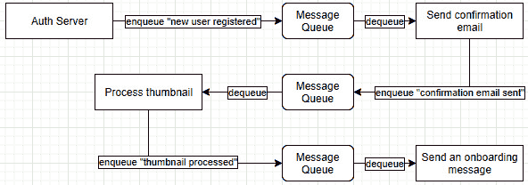

图 16.2–在用户创建帐户后顺序执行三个操作的流程

在这种情况下，如果进程在*进程缩略图*操作期间崩溃，用户将不会收到*入职消息*。另一个缺点是，要在*进程缩略图*和*发送入职消息*之间插入新操作，我们必须修改*进程缩略图*和*发送入职消息*操作（紧密耦合）。

如果顺序不重要，我们可以在用户创建之后，将*身份验证服务器*的所有消息排队，如下所示：

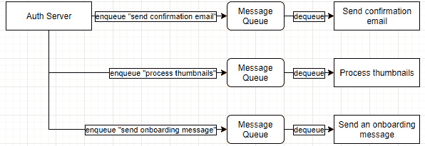

图 16.3–当不同进程并行执行操作时，身份验证服务器按顺序对操作进行排队

这个过程更好，但是*身份验证服务器*现在控制着一旦创建了新用户应该发生的事情。在前面的工作流中，*身份验证服务器*正在排队等待一个事件，该事件告知系统新用户已注册。但是，现在，它必须了解按顺序对每个操作排队的后处理工作流。这样做本身并没有错，而且在深入研究代码时更容易理解，但它会在*身份验证服务器*知道外部进程的服务之间创建更紧密的耦合。根据 SRP，我看不出身份验证/授权服务器除了负责身份验证、授权和管理数据之外，还应该负责其他任何事情。

如果我们从那里继续并希望在两个现有步骤之间添加新操作，我们只需修改*身份验证服务器*，这比前面的工作流更不容易出错。

如果我们想要两全其美，我们可以使用**发布-订阅**模式，我们将在下面介绍。我们将在这里重温这个例子。

## 结论

如果您需要消息按其排队顺序依次传递，那么队列可能是正确的工具。我们探索的示例从一开始就“注定要失败”，但它允许我们探索设计系统背后的思考过程。有时，第一个想法不是最好的，可以通过探索新的做事方式或学习新技能来改进。对他人的想法持开放态度也能带来更好的解决方案。

现在，让我们看看消息队列如何帮助我们在应用规模上遵循**坚实的**原则：

*   **S**：帮助在应用或组件之间集中和划分职责，而不让它们直接相互了解，从而打破紧密耦合。
*   **O**：允许我们在对方不知道的情况下更改消息生产者或订阅者的行为。
*   **L**：不适用。
*   **I**：每一条消息和处理程序都可以根据需要而变小，而在更大的事物方案中，微服务相互作用以解决更大的问题。
*   **D**：由于不知道其他依赖关系（即打破微服务之间的紧密耦合），微服务依赖于消息（抽象），而不是具体化（其他微服务的 API）。

一个缺点是消息排队和处理消息之间存在延迟。我们将在后续章节中更详细地讨论延迟和延迟。

# 事件概述

我们在上一节中讨论了消息。现在，我们将看到这些消息变成事件。所以，在我们了解酒吧子模式之前，让我们先深入了解一下。

**事件是代表过去发生的事情的信息。**

我们可以使用事件将复杂系统划分为更小的部分，或者让多个系统在不产生紧密耦合的情况下相互通信。这些系统可以是子系统或外部应用，如微服务。

我们可以将事件分为两大类：

*   域事件
*   整合活动

让我们详细看看每一个。

## 域事件

域事件是基于 DDD 的术语，表示域中的事件。此事件随后可能触发后续执行的其他逻辑。它允许将一个复杂的过程划分为多个较小的过程。这些事件可以按顺序执行，也可以“触发并忘记”。域事件在干净的体系结构中运行良好，可以用于简化复杂的域。我们可以使用 MediatR 发布域事件。

## 整合活动

集成事件是事件，就像域事件一样，但用于将消息传播到外部系统，很可能是进程外的。例如，可以是一个或多个其他微服务，例如在发送`new user registered`事件消息时。

我们使用 MessageBroker（参见下一节）发布集成事件。我们还可以使用消息队列按顺序发布这些事件。

现在，让我们看看发布-订阅模式是关于什么的。

# 实现发布-订阅模式

**发布-订阅**模式（Pub-Sub）与我们使用**MediatR**和所做的非常相似，我们在*消息队列入门*一节中探讨了。但是，我们不是将一条消息发送给一个处理程序（或将消息排队），而是将一条消息（或事件）发布（发送）给零个或多个订阅者（处理程序）。此外，出版商不知道订阅者；它只发送信息，希望得到最好的结果（也称为**火与忘**）。

我们可以通过**消息代理**在过程中或分布式系统中使用**发布订阅**。消息代理负责将消息传递给订阅者。这是微服务和其他类型的分布式系统的发展方向，因为它们不是在单个进程中运行的。

与其他沟通方式相比，这种模式有许多优势。例如，我们可以通过重放系统中发生的事件（消息）来重新创建数据库的状态，从而产生事件源模式。稍后再谈。

设计取决于用于传递消息的技术和该系统的配置。例如，您可以使用**MQTT**向**物联网**（**物联网**设备发送消息，并将其配置为保留在每个主题上发送的最后一条消息。这样，当设备连接到某个主题时，它会收到最后一条消息。您还可以配置一个**卡夫卡**代理，该代理保存了很长的消息历史记录，并在新系统连接到它时请求所有消息。所有这些都取决于您的需求和要求。

MQTT 与 apachekafka

如果你想知道 MQTT是什么，这里是他们网站[的一段引文 https://net5.link/mqtt](https://net5.link/mqtt) ：

*“MQTT 是物联网（IoT）的 OASIS 标准消息传输协议。它被设计为一种极其轻量级的发布/订阅消息传输[…]”“*

这里有一段引用自阿帕奇·卡夫卡的网站[https://net5.link/kafka](https://net5.link/kafka) ：

*“ApacheKafka 是一个开源的分布式事件流平台[…]”*

---

我们不能涵盖遵循每个协议的每个系统的每个场景。因此，我将重点介绍 Pub-Sub 设计模式背后的一些共享概念，以便您了解如何开始。然后，你可以深入研究你想要（或需要）使用的特定技术。

要接收消息，订阅者必须订阅主题（或主题的等效内容）：


图 16.4–订阅者订阅发布子主题

发布子模式的第二部分是发布消息，如下所示：

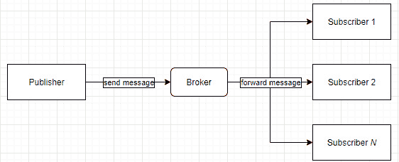

图 16.5–发布者正在向 MessageBroker 发送消息。然后，代理将该消息转发给*N*订户，其中*N*可以是零或更多

这里有许多依赖于代理和协议的抽象细节。但是，以下是发布-订阅模式背后的两个主要概念：

*   发布者将消息发布到主题。
*   Subscribers subscribe to topics to receive messages.

    笔记

    例如，这里没有说明的一个关键实现细节是安全性。在大多数系统中，安全性是强制性的，并且不是每个子系统或设备都可以访问所有主题。

发布者和订阅者可以是任何系统的任何部分。例如，许多 Microsoft Azure 服务都是发布者（例如 Blob 存储）。然后，您可以让其他 Azure 服务（例如 Azure 功能）订阅这些事件以对其作出反应。

您还可以在应用中使用**发布-订阅**模式——无需使用云资源；这甚至可以在同一个过程中完成。

发布-订阅模式最显著的优点是能够打破系统之间的紧密耦合。一个系统可以发布事件，而其他系统则在系统彼此不了解的情况下使用这些事件。

这种松耦合导致了可伸缩性，每个系统都可以独立伸缩，并且可以使用所需的资源量并行处理消息。向工作流中添加新流程也更容易，因为系统不知道其他流程。要添加对事件做出反应的新流程，您只需创建一个新的微服务，部署它，然后开始侦听一个或多个事件并对其进行处理。

另一方面，MessageBroker 可能成为应用的单点故障，必须进行适当的配置。对于每种类型的消息，考虑最佳的消息传递策略也是必不可少的。策略的一个示例是确保关键消息的交付，同时延迟时间敏感度较低的消息，并在负载激增期间丢弃不重要的消息。

如果我们使用**发布-订阅**重温上一个示例，我们将得到以下简化的工作流程：

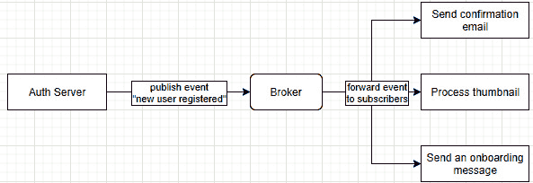

图 16.6–Auth Server 正在发布表示创建新用户的事件。然后，代理将该消息转发给三个订阅者，这三个订阅者随后并行执行其任务

基于此工作流，我们将身份验证服务器与注册后流程解耦。身份验证服务器不知道工作流，各个服务也不知道彼此。此外，如果我们想添加一个新任务，我们只需要创建或更新一个微服务，然后将其订阅到正确的主题（在本例中，是“新用户注册”主题）。

当前系统不支持同步，也不处理进程故障或重试，但这是一个良好的开端，因为我们结合了消息队列示例的优点，而忽略了缺点。

## 消息代理

消息代理是一个允许我们发送（**发布**消息）和接收（**订阅**消息的程序。它在规模上扮演中介角色，允许多个应用在不相互了解的情况下相互对话（**松散耦合**。消息代理通常是实现发布-订阅模式的任何基于事件的分布式系统的中心部分。

一个应用（**发布者**）通常向主题发布消息，而其他应用（**订阅者**从这些主题接收消息。**主题**的概念可能因协议或系统而异，但我所知道的所有系统都有某种类似主题的概念，可以将消息路由到正确的位置。例如，您可以使用 Kafka 发布到`Devices`主题，但可以使用 MQTT 发布到`devices/abc-123/do-something`。

MessageBroker 负责将消息转发给已注册的收件人。这些消息的生存期可能因代理而异，甚至每个消息的生存期也可能不同。

有多个消息代理使用不同的协议。有些代理是基于云的，比如 Azure 事件网格。其他代理是轻量级的，更适合 IoT，例如 Eclipse Mosquito/MQTT。与 MQTT 相比，其他版本更健壮，并允许高速数据流，如 ApacheKafka。

使用什么 MessageBroker 应该基于您正在构建的软件的需求。此外，您不限于一个经纪人。没有什么能阻止您选择一个 message broker 来处理您的微服务之间的对话，并使用另一个来处理您的系统和外部物联网设备之间的对话。如果您正在 Azure 中构建一个系统，想要实现无服务器，或者更喜欢付费购买可扩展且无需投入维护时间的 SaaS 组件，那么您可以利用 Azure 服务，如事件网格、服务总线和队列存储。

## 事件来源模式

现在我们已经探索了发布-订阅模式，了解了什么是事件，并讨论了事件代理，现在是探索**如何重播应用**的状态的时候了。为此，我们可以遵循**事件源模式**。

事件来源背后的想法是**存储事件**的时间顺序列表，而不是单个实体，在该实体中，事件集合成为真相的来源。这样，每个操作都以正确的顺序保存，有助于提高并发性。此外，我们可以重播所有这些事件，以在新应用中生成对象的实际状态，从而使我们能够更轻松地部署新的微服务。

不只是存储数据，如果系统使用事件代理进行传播，其他系统可以将部分数据缓存为一个或多个**物化视图**。

物化视图

物化视图是为特定目的而创建和存储的模型。数据可以来自一个或多个源，从而在查询该数据时提高了性能。例如，应用返回物化视图，而不是查询多个其他系统以获取数据。您可以将物化视图视为缓存实体，微服务将其存储在自己的数据库中。

事件源的缺点之一是数据一致性。从服务向存储添加事件到所有其他系统更新其物化视图之间，存在不可避免的延迟。这导致了**最终的一致性**。

最终一致性

最终一致性意味着数据将在未来某个时间点保持一致，但不会完全一致。延迟可以从几毫秒到更长的时间，但目标通常是使延迟尽可能小。

另一个缺点是，与查询单个数据库的单个应用相比，创建这样一个系统非常复杂。与微服务体系结构一样，事件来源不仅仅是彩虹和独角兽。它的价格是：**操作复杂性**。

操作复杂性

在微服务体系结构中，每一块都更小，但将它们粘合在一起需要成本。例如，支持微服务的基础设施比一块巨石（一个应用和一个数据库）更复杂。活动来源也是如此；所有应用都必须订阅一个或多个事件、缓存数据（物化视图）、发布事件等。这种操作复杂性表示复杂性从应用代码转移到操作基础架构。换句话说，与包含所有代码的单个应用相比，它需要更多的工作来部署和维护多个微服务和数据库，以及应对这些外部系统之间可能存在的网络通信不稳定性。巨石很简单：它们可以工作，也可以不工作；他们很少部分工作。

事件源的一个关键方面是将新事件追加到存储中，并且从不更改现有事件（仅追加）。简而言之，使用 Pub-Sub 模式进行通信的微服务发布事件、订阅主题并生成物化视图以服务于其客户机。

## 示例

让我们来探索一个例子，看看如果我们把刚学过的东西混在一起会发生什么。**上下文**：我们需要构建一个管理物联网设备的软件。我们首先创建两个微服务：

*   处理物联网设备 twin 的数据（即设备的数字表示）的设备，我们将其命名为`DeviceTwin`。
*   管理我们命名为`Networking`的物联网设备（即如何到达设备）的网络相关信息的一个。

作为视觉参考，最终系统可以如下所示：

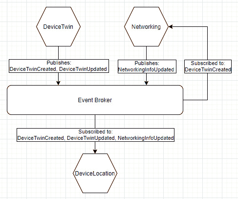

图 16.7–使用发布-订阅模式进行通信的三个微服务

以下是用户交互和发布的事件：

1.  A user creates a twin in the system named *Device 1*. `DeviceTwin` saves the data and publishes the `DeviceTwinCreated` event with the following payload:

    ```cs
    {
        "id": "some id",
        "name": "Device 1",
        "other": "properties go here..."
    }
    ```

    同时，`Networking`微服务需要知道设备是何时创建的，因此它订阅了`DeviceTwinCreated`事件。创建新设备时，它会在其数据库中为该设备创建默认网络信息；默认值为`unknown`。通过这种方式，`Networking`微服务知道哪些设备存在或不存在：

    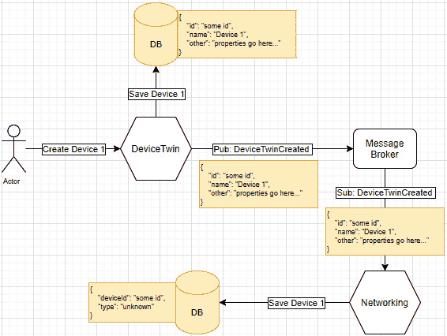

    图 16.8–表示创建双设备及其默认网络信息的工作流

2.  A user then updates the networking information of that device and sets it to `MQTT`. `Networking` saves the data and publishes the `NetworkingInfoUpdated` event with the following payload:

    ```cs
    {
        "deviceId": "some id",
        "type": "MQTT",
        "other": "networking properties..."
    }
    ```

    如下图所示：

    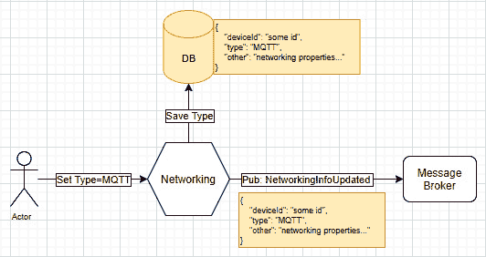

    图 16.9–表示更新设备网络类型的工作流

3.  A user changes the display name of the device to `Kitchen Thermostat`, which is more relevant. `DeviceTwin` saves the data and publishes the `DeviceTwinUpdated` event with the following payload. The payload uses **JSON patch** to publish only the differences instead of the whole object (see the *Further reading* section for more information):

    ```cs
    {
        "id": "some id",
        "patches": [
            { "op": "replace", "path": "/name", "value": "Kitchen Thermostat" },
        ]
    }
    ```

    如下图所示：

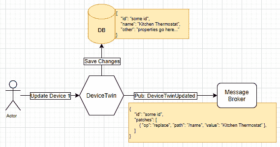

图 16.10–表示用户将设备名称更新为厨房恒温器的工作流

比如说，一个团队设计并完成了一项新的微服务，该服务在物理位置组织设备。这允许用户在地图上可视化他们设备的位置，比如他们家的地图。

团队将该微服务命名为`DeviceLocation`。`DeviceLocation`订阅所有三个事件来管理其物化的视图，如下所示：

*   接收到`DeviceTwinCreated`事件时，保存其唯一标识符和显示名称。
*   接收到`NetworkingInfoUpdated`事件时，保存通信类型（HTTP、MQTT 等）。
*   当接收到`DeviceTwinUpdated`事件时，更新设备的显示名称。

当服务第一次部署时，设置为从头开始回放所有事件（**事件来源**；发生的情况如下：

1.  `DeviceLocation` receives the `DeviceTwinCreated` event and creates the following model for that object:

    ```cs
    {
        "device": {
            "id": "some id",
            "name": "Device 1"
        },
        "networking": {},
        "location": {...}
    }
    ```

    下图显示了这一点：

    

    图 16.11–DeviceLocation microservice 重播 DeviceWinCreated 事件以创建设备的物化视图

2.  `DeviceLocation` receives the `NetworkingInfoUpdated` event, which updates the networking type to `MQTT`, leading to the following:

    ```cs
    {
        "device": {
            "id": "some id",
            "name": "Device 1"
        },
        "networking": {
            "type": "MQTT"
        },
        "location": {...}
    }
    ```

    下图显示了这一点：

    

    图 16.12–DeviceLocation microservice 重播 NetworkingInFounded 事件以更新其设备的物化视图

3.  `DeviceLocation` receives the `DeviceTwinUpdated` event, updating the device's name. The final model looks like this:

    ```cs
    {
        "device": {
            "id": "some id",
            "name": "Kitchen Thermostat"
        },
        "networking": {
            "type": "MQTT"
        },
        "location": {...}
    }
    ```

    下图显示了这一点：


图 16.13–DeviceLocation microservice 重播 DeviceWinUpdate 事件以更新设备的物化视图

从那里，`DeviceLocation`微服务被初始化并准备就绪。用户可以在地图上设置厨房恒温器的位置，或者继续玩系统的其他部分。当用户向`DeviceLocation`微服务查询`Kitchen Thermostat`相关信息时，显示**物化视图**，该视图包含所有需要的信息，无需发送外部请求。

考虑到这一点，我们可以生成`DeviceLocation`或其他微服务的新实例，它们可以从过去的事件生成物化视图——所有这些都非常有限，甚至不知道其他微服务。在这种类型的体系结构中，微服务只能了解事件，而不能了解其他微服务。微服务处理事件的方式应该只与该微服务相关，而不与其他微服务相关。这同样适用于出版商和订阅者。

此示例演示了事件源模式、集成事件、物化视图、消息代理的使用以及发布-订阅模式。

相比之下，使用直接通信（HTTP、gRPC 等）将如下所示：

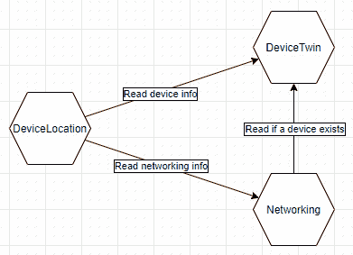

图 16.14–三个相互直接通信的微服务

如果我们比较两种方法，通过查看第一个图（*图 16.7*，我们可以看到 MessageBroker 扮演**中介**的角色，打破了微服务之间的直接耦合。通过查看前面的图（*图 16.14*，我们可以看到微服务之间的紧密耦合，`DeviceLocation`需要直接调用`DeviceTwin`和`Networking`来构建其物化视图的等价物。此外，`DeviceLocation`将一个呼叫转换为三个，因为`Networking`还必须与`DeviceTwin`通话。

假设最终一致性不是一个选项，或者发布-订阅模式无法应用，或者很难应用于您的场景。在这种情况下，微服务可以直接相互调用。他们可以使用 HTTP、RPC 或最适合特定系统需要的任何其他方法来实现这一点。

在这本书中我不会涉及这个话题，但是当直接调用微服务时，有一件事要小心，那就是间接调用链可能会快速冒泡。你不希望你的微服务创建一个超深的呼叫链，否则你的系统很可能会变得非常慢，非常快。这里有一个抽象的例子，说明我的意思。图表通常比文字更好：

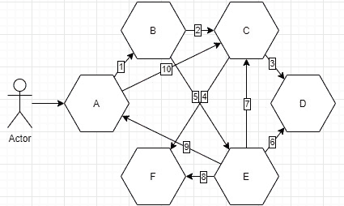

图 16.15–用户调用 microservice A，然后触发后续调用的连锁反应，导致灾难性性能

根据前面的图，让我们考虑一下失败。如果 microservice C 脱机，整个请求将以错误结束。当然，我们可以设置重试策略来创建更健壮、更稳定的系统，但这也意味着初始调用和响应之间的延迟更长。这比系统崩溃要好，但仍远未达到最佳状态。

## 结论

发布-订阅模式使用事件来解耦应用的各个部分。在微服务体系结构中，我们可以使用消息代理和集成事件来允许微服务相互通信。然后，我们可以利用事件源模式来持久化这些事件，允许新的微服务通过重播过去的事件来填充其数据库。

这些模式在一起可能非常强大，但也可能需要时间来实现。云提供商也提供类似的服务。与构建自己的基础设施相比，这些可以更快地开始。如果构建服务器是您的事情，那么您可以使用开源软件“经济地”构建堆栈。

现在，让我们看看发布-订阅模式如何帮助我们在应用规模上遵循**坚实的**原则：

*   **S**：帮助在应用或组件之间集中和划分职责，而不让它们直接相互了解，从而打破紧密耦合。
*   **O**：允许我们改变发布者和订阅者的行为方式，而不会直接影响其他微服务（打破它们之间的紧密耦合）。
*   **L**：不适用。
*   **I**：每个事件（抽象/契约）都可以根据需要设置为最小。
*   **D**：微服务依赖于事件（抽象）而不是具体化（其他微服务），打破了它们之间的紧密耦合。

正如您可能已经注意到的，它们与消息队列非常相似；唯一的区别在于信息的读取方式：

*   一次一个，排队。
*   Up to multiple at the same time with the Pub-Sub pattern.

    观测器设计模式

    我自愿将观察者模式保留在本书之外，因为我们在.NET 中很少需要它。C#提供多播事件，在大多数情况下，这些事件能够很好地替代观察者模式。如果你不知道观察者模式，别担心——很可能你永远都不会需要它。不过，如果您已经知道 Observer 模式，那么下面是它与 Pub-Sub 模式之间的区别。

    在观察者模式中，主体保留其观察者的列表，从而直接了解其存在。具体的观察者也经常了解这个主题，这会导致对其他实体的更多了解，从而导致更多的耦合。

    在 Pub-Sub模式中，发布者不知道订阅者；它只知道 MessageBroker。订阅者也不知道发布者，只知道消息代理。发布者和订阅者仅通过其发布或接收的消息的数据契约进行链接。

    我们可以将发布子模式视为观察者模式的分布式演化，或者更准确地说，就像向观察者模式添加中介一样。

接下来，我们将通过访问一种新的**Façade**：即**网关**，探索一些直接调用其他微服务的模式。

# 引入网关模式

在构建面向微服务的系统时，服务的数量随着功能的数量而增长；系统越大，您将拥有越多的微服务。当您考虑必须与这样一个系统交互的用户界面时，这可能会变得单调、复杂和低效（从开发角度和速度角度）。网关可以帮助我们实现以下目标：

*   通过将请求路由到适当的服务来隐藏复杂性。
*   通过聚合响应隐藏复杂性，将一个外部请求转换为多个内部请求。
*   通过仅公开客户端需要的功能子集来隐藏复杂性。
*   将外部请求转换为内部使用的另一个协议。

网关还可以集中不同的进程，例如记录和缓存请求、验证和授权用户和客户端、强制执行请求速率限制以及其他类似的策略。

您可以将网关视为立面，但它不是程序中的一个类，而是自己的程序，屏蔽其他程序。网关模式有多种变体，我们将探讨其中的许多变体。

无论您需要哪种类型的网关，您都可以自己编写或利用现有工具来加快开发过程。

提示

请注意，自制网关版本 1.0 很有可能比经验证的解决方案有更多的缺陷。本技巧不仅适用于网关，也适用于大多数复杂系统。也就是说，有时候，没有一个经过验证的解决方案可以完全满足我们的需求，我们必须自己编写代码，这才是真正的乐趣开始！

一个可以帮助你的开源项目是 Ocelot（[https://net5.link/UwiY](https://net5.link/UwiY) 。它是一个用.NET Core编写的应用网关，支持我们期望从网关获得的许多东西。您可以使用配置或编写自定义代码来路由请求，以创建高级路由规则。因为它是开源的，所以如果需要的话，您可以对它进行贡献、分叉和探索源代码。

网关是一个**反向代理**，用于获取客户端请求的信息。这些信息可能来自一个或多个资源，可能位于一个或多个服务器上。微软正在开发一个名为 YARP 的反向代理，它也是开源的（[https://net5.link/](https://net5.link/BUkP) 雅普）。在撰写本文时，它处于预览阶段，但我建议您看一看，因为他们似乎在为微软的内部团队构建它，所以它很可能会随着时间的推移而不断发展和维护。

现在，让我们探讨几种类型的网关。

## 网关路由模式

我们可以使用这种模式通过网关将请求路由到适当的服务来隐藏系统的复杂性。

例如，假设我们有两个微服务：一个保存设备数据，另一个管理设备位置。我们希望显示特定设备的最新已知位置（`id=102`，并显示其名称和型号。

为了实现这一点，用户请求 web 页面，然后 web 页面调用两个服务（参见下图）。`DeviceTwin`微服务可从 service1.domain.com 访问，位置微服务可从 service2.domain.com 访问。从那时起，web 应用必须跟踪哪些服务使用哪些域名。当我们添加更多的微服务时，UI 必须处理更多的复杂性。此外，如果在某个时刻，我们决定将`service1`更改为`device-twins`，将`service2`更改为`location`，我们还需要更新 web 应用。如果只有一个用户界面，它仍然没有那么糟糕，但是如果您有多个用户界面，这意味着每个用户界面都必须处理这种复杂性。

此外，如果我们想在专用网络中隐藏微服务，除非所有用户界面也是该专用网络的一部分，否则是不可能的：

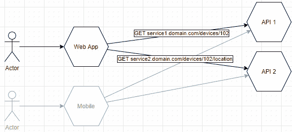

图 16.16–直接调用两个微服务的 web 应用和移动应用

为了解决其中一些问题，我们可以实现一个网关来为我们进行路由。这样，用户界面不需要知道哪些服务可以通过哪些 DNS 访问，而只需要知道网关：


图 16.17–通过网关应用调用两个微服务的 web 应用和移动应用

当然，这会带来一些可能的问题，因为您的网关可能会成为单点故障。您可以考虑使用负载均衡器确保您有足够强的可用性和足够快的性能。由于所有请求都通过网关，因此您可能需要在某个点上对其进行放大。

您还应该通过实现不同的弹性模式，例如**重试**和**断路器**，确保您的网关支持故障。随着您部署的微服务数量和发送到这些微服务的请求数量的增加，在网关的另一端发生错误的可能性也会增加。

您还可以使用路由网关来重新路由 URI，以创建更易于使用的 URI 模式。您还可以重新路由端口；添加、更新或删除 HTTP 头；还有更多。让我们探讨相同的示例，但使用不同的 URI。让我们假设如下：


UI 开发人员很难记住什么端口导致了什么微服务，什么在做什么（谁会责怪他们？）。此外，我们不能像以前那样传输请求（只路由域）。我们可以使用网关作为一种方式，为开发人员创建令人难忘的 URI 模式，供他们使用，如下所示：


如您所见，我们将端口从等式中去掉，以创建可用、有意义且易于记忆的 URI。

但是，我们仍然向网关发出两个请求以显示一条信息（设备的位置及其名称/型号），这将引导我们进入下一个网关模式。

## 网关聚合模式

我们可以赋予网关的另一个角色是允许它聚合请求，以向系统消费者隐藏复杂性。

继续前面的示例，我们有两个 UI 应用，它们包含一个功能，在使用设备名称/型号识别设备之前，在地图上显示设备的位置。要实现这一点，他们必须调用设备 twin 端点以获取设备的名称和型号，以及位置端点以获取其最后一个已知位置。因此，显示一个小方框的两个请求乘以两个 UI，意味着一个简单功能需要维护四个请求。如果我们进行推断，我们最终可能会为一些功能管理几乎无穷无尽的 HTTP 请求。

下图显示了我们当前状态下的功能：


图 16.18–通过网关应用调用两个微服务的 web 应用和移动应用

为了解决这个问题，我们可以应用网关聚合模式来简化 UI，并将管理这些细节的责任转移到网关上。

通过应用网关聚合模式，我们最终得到以下简化流程：

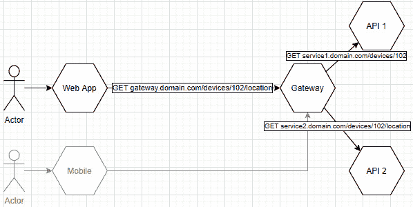

图 16.19–一个网关，聚合两个请求的响应，以服务来自 web 应用和移动应用的单个请求

接下来，让我们按顺序探讨发生的步骤。在这里，我们可以看到 Web 应用发出一个请求，而网关发出两个调用。在下图中，请求是串行发送的，但我们可以并行发送它们以加快速度：

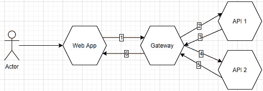

图 16.20–请求发生的顺序

与路由网关一样，聚合网关可能会成为应用的瓶颈和单点故障，因此要小心这一点。

另一个需要注意的要点是网关和内部 API 之间的延迟。如果延迟太高，您的客户端将等待每个响应。因此，在与之交互的微服务附近部署网关可能对系统的性能至关重要。

网关可以实现缓存以提高性能，从而使子请求每隔一段时间只发送一次。

## 前端图案的后端

前端模式的后端是网关模式的另一个变体。使用后端作为前端，而不是构建通用网关，您可以为每个用户界面（或与系统交互的应用）构建网关，从而降低复杂性。此外，它允许细粒度地控制暴露的端点。它消除了在对应用 A 进行更改时应用 B 被破坏的可能性。这种模式可以实现许多优化，例如只发送每次呼叫所需的数据，而不发送只有少数应用正在使用的数据，从而节省了一些带宽。

假设我们的 Web 应用需要显示更多关于设备的数据。为了实现这一点，我们需要更改端点，并将额外的信息发送到移动应用。然而，移动应用不需要这些信息，因为它的屏幕上没有空间显示这些信息。这是一个更新的图表，它将单个网关替换为两个网关，每个前端一个。

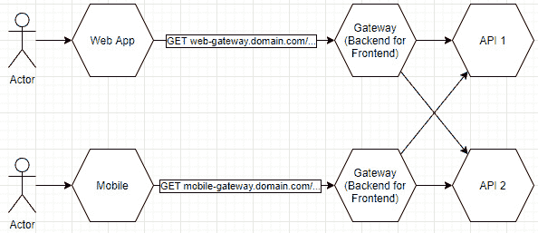

图 16.21–前端网关的两个后端；一个用于 Web 应用，一个用于移动应用

通过这样做，我们现在可以为每个前端开发特定的功能，而不会影响其他前端。每个网关现在都将其特定前端与系统的其余部分和另一个前端隔离开来。

同样，前端的后端模式是一个网关。与网关模式的其他变体一样，它可能成为其前端和单点故障的瓶颈。好消息是，前端网关的一个后端中断将影响限制在单个前端，从而保护其他前端不受停机的影响。

## 混合匹配网关

现在我们已经探索了网关模式的三种变体，重要的是要注意，我们可以在代码库级别或作为多个微服务进行混合和匹配。

例如，可以为单个客户端构建网关（前端为后端），执行简单路由，并聚合结果。

我们还可以将它们作为不同的应用进行混合，例如，将多个前端网关后端放在更通用的网关前面，以简化前端后端的开发和维护。

注意每一跳都有代价。在客户端和微服务之间添加的内容越多，这些客户端接收响应所需的时间（延迟）就越长。当然，您可以将机制放在适当位置以降低开销，例如缓存或非 HTTP 协议（如 GRPC），但您仍然必须考虑它。这适用于一切，而不仅仅是大门。

下面是一个示例，说明了这一点：

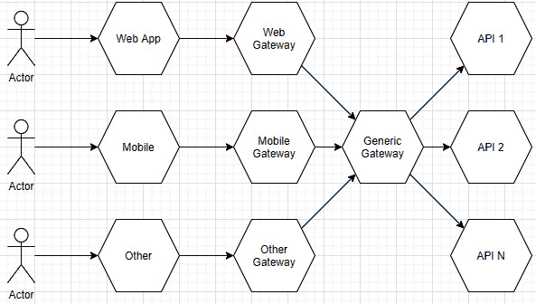

图 16.22——网关模式的组合

正如您可能猜到的，通用网关是所有应用的单一故障点，而同时，前端网关的每个后端都是其特定客户端的故障点。

服务网

服务网格是帮助微服务相互通信的替代方案。它是应用之外的一个层，代理服务之间的通信。这些代理被注入每个服务的顶部，称为**侧车**。服务网格还可以帮助实现分布式跟踪、检测和系统弹性。如果您的系统需要服务到服务的通信，那么服务网格将是一个很好的查找位置。

## 结论

网关是一个外表或反向代理，屏蔽或简化对一个或多个其他服务的访问。在本节中，我们探讨了以下内容：

*   **路由**：将请求从 a 点转发到 B 点。
*   **聚合**：将多个子请求的结果合并成一个响应。
*   **前端后端**：用于与前端的一对一关系。

我们可以像任何其他模式一样使用微服务模式，并将其混合和匹配。只需考虑优点，也可以考虑它们带来的缺点。如果你能和他们一起生活，那么，你就有了自己的解决方案。

网关往往是单一的故障点，所以这是一个需要考虑的问题。此外，我们还必须考虑调用另一个服务的服务所添加的延迟，因为这样会减慢响应时间。

总而言之，网关是简化消费微服务的绝佳工具。它们还允许隐藏其背后的微服务拓扑，甚至可能隔离在专用网络中。他们还可以处理跨领域的问题，如安全问题。

现在，让我们看看网关如何帮助我们在应用规模上遵循**坚实的**原则：

*   **S**：网关可以处理路由、聚合和其他逻辑，否则这些逻辑将在不同的组件或应用中实现。
*   **O**: I see many ways to attack this one, but here are two takes on this:

    a） 在外部，网关可以将其子请求重新路由到新的 URI，而其消费者不知道，只要其契约不变。

    b） 在内部，网关可以从配置中加载其规则，从而允许它在不更新代码的情况下进行更改。

*   **L**：我们可以看到前面的点（b）是*没有改变应用*的正确性。
*   **I**：因为前端网关的后端服务于单个前端系统。这意味着每个前端系统有一个合同（接口），从而产生多个较小的接口，而不是一个大型通用网关。
*   **D**：我们可以将网关视为一种抽象，隐藏了真正的微服务（实现）。

现在，让我们在分布式规模上重温 CQR。

# 重温 CQRS 模式

**命令查询责任分离**（**CQRS**），在[*第 14 章*](14.html#_idTextAnchor261)*中探讨，中介和 CQRS 设计模式*，应用了**命令查询分离**（【T13 CQS】原则。与我们在[*第 14 章*](14.html#_idTextAnchor261)*、Mediator 和 CQR 设计模式*中看到的相比，我们可以使用微服务或无服务器计算进一步推动 CQR。我们可以通过使用多个微服务和数据源来进一步划分命令和查询，而不是简单地在命令和查询之间创建明确的分隔。

**CQS**是一个原则，说明方法应该返回数据或修改数据，但不能同时返回数据和修改数据。另一方面，**CQRS**建议使用一个模型读取数据，使用一个模型变异数据。

**无服务器计算**是一种云执行模型，云提供商根据使用情况管理服务器并按需分配资源。无服务器资源属于平台即服务（PaaS）产品。

让我们再次以物联网为例；在前面的示例中，我们查询的是设备的最后一个已知位置，但是更新该位置的设备又如何呢？这可能意味着每分钟推送许多更新。为了解决这个问题，我们将使用 CQR。我们将重点关注两项业务：

*   正在更新设备位置。
*   读取设备的最后一个已知位置。

简单地说，我们有一个`Read Location`微服务、一个`Write Location`微服务和两个数据库。请记住，每个微服务都应该拥有自己的数据。这样，用户可以通过读取微服务（查询模型）访问最后一个已知的设备位置，而设备可以准时将其当前位置发送到写入微服务（命令模型）。通过这样做，我们将读取和写入数据的负载分开，因为这两种数据都以不同的频率出现：

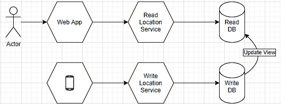

图 16.23–应用 CQR 划分设备位置读写的微服务

这是一个简化版本，但基本上，读取是查询，而写入是命令。向写数据库添加新值后，我们更新读数据库的方式取决于我们正在使用/构建的系统。这种体系结构中的一个基本要素是，根据 CQRS 模式，命令不应返回值，从而启用“触发并忘记”场景。有了这条规则，消费者不必等到命令完成后再做其他事情。

一种方法是利用现有的云基础设施，如 Azure 功能和表存储。让我们使用以下组件重新讨论此示例：


图 16.24–使用 Azure 服务管理 CQRS 实现

上图说明了以下内容：

1.  设备每隔*T*次将其位置发送到 Azure 功能 1。
2.  Azure 函数 1 然后将`LocationAdded`事件发布到事件代理，它也是一个事件存储（Write DB）。
3.  `LocationAdded`事件的所有订阅者现在都可以适当地处理该事件；在本例中，Azure 函数 2。
4.  Azure Function 2 更新设备在 Read DB 中的最后一个已知位置。
5.  任何后续查询都将导致获取新位置。

这是**最终一致性**的一个很好的示例。在*步骤 1*和*4*之间读取最后一个已知位置的任何调用都将获取旧值（系统正在处理新值）。

在前面的示例中，MessageBroker 也是事件存储区，但我们可以将事件存储在其他位置，例如 Azure 存储表或时间序列数据库中。此外，出于多种原因，我抽象了这个组件，包括有多种方式在 Azure 中发布事件，以及有多种方式使用第三方组件（开源和专有）。

时间序列数据库

时间序列数据库针对临时查询和存储数据进行了优化，您总是在不更新旧记录的情况下追加新记录。这种 NoSQL 数据库对于时间密集型的使用非常有用。

我们再次使用发布-订阅模式来启动另一个场景。假设事件永远保持不变，前面的示例也可以支持事件源。此外，新服务可以订阅`LocationAdded`事件，而不会影响已部署的代码。例如，我们可以创建一个 signarmicroservice，将更新推送到客户端。它与 CQRS 无关，但它与我们迄今为止所探索的一切都很好地结合在一起，因此这里是一个更新的图表：

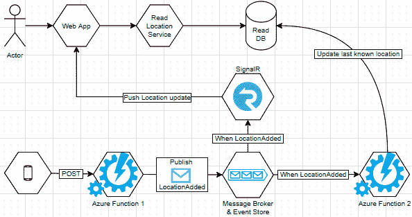

图 16.25-在不影响系统其他部分的情况下，将信号服务添加为新用户

信号器微服务可以是自定义代码或 Azure 信号器服务（由另一个 Azure 功能支持）；没关系。这一想法是为了说明，将新服务与 pub-sub 模型混合使用更容易，而不是通过一个整体或更传统的方式在微服务之间提供通信。

正如您所看到的，微服务系统添加了越来越多的小部件，这些部件通过一个或多个消息代理间接地相互连接。维护、诊断和调试此类系统比使用单个应用更困难；这就是我们前面提到的**操作复杂性**。然而，容器可以帮助部署和维护这样的系统，这是我们的下一个主题。

从 ASP.NET Core 3.0 开始，ASP.NET 团队在**分布式跟踪**上投入了大量精力。分布式跟踪对于发现与从一个程序流向另一个程序（如微服务）的事件相关的故障和瓶颈是必要的。如果出现错误，跟踪用户是如何隔离错误、重现错误，然后修复错误的，这一点很重要。独立的部分越多，就越难实现这种追踪。这超出了本书的范围，但现在您又了解了一个 ASP.NET Core 5 特性。

## 结论

CQRS 有助于明确划分查询和命令，并有助于独立封装和隔离每个逻辑块。当我们将这一概念与无服务器计算或微服务体系结构相结合时，它允许我们独立扩展读写。我们还可以使用不同的数据库，为我们提供系统每个部分所需的数据速率所需的工具（例如，频繁写入和偶尔读取）。

现在，让我们看看 CQRS如何帮助我们在应用规模上遵循**坚实的**原则：

*   **S**：将应用划分为较小的读写应用（或函数）倾向于将单个职责封装到不同的程序中。
*   **O**：CQRS 与无服务器计算或微服务相结合，有助于扩展软件，而无需我们通过添加、删除或替换应用来修改现有代码。
*   **L**：不适用。
*   **I**：命令和查询之间有明确的区别，创建多个小接口（或程序）应该比创建一个更大的接口更容易。
*   **D**：不适用。

接下来，我们将探索容器，它帮助我们开发和部署微服务。

# 集装箱概述

容器是虚拟化的一种演进。使用容器，我们可以虚拟化应用而不是机器。为了共享资源，我们可以利用虚拟机或物理机。容器包含容器化应用运行所需的所有内容，包括操作系统。

容器可以帮助我们设置环境，确保应用在环境（本地、暂存和生产）之间移动时的正确性，等等。通过将所有内容打包到单个容器映像中，我们的应用变得比以往任何时候都更具可移植性；容器的另一个好处是可以配置容器之间的网络和关系。此外，容器是轻量级的，允许我们在几秒钟内创建一个新的容器，从而实现按需提供资源，这些资源可以随着流量峰值而增大，然后在需求减少时缩小。

容器可能非常抽象，乍一看似乎非常复杂。然而，如今，这些工具已经成熟和改进，使得理解和调试容器比以往任何时候都更容易，但这仍然是一条陡峭的学习曲线。好处是，一旦掌握了它，就很难回到非容器化应用。

在本节中，我们将探讨与容器相关的以下主题：

*   Docker，这是一个容器引擎。
*   Docker Compose，它允许我们编写复杂的 Docker 应用。
*   编排，这是管理复杂的容器化应用的概念。在本节中，我们将探讨两个编排器。
*   最后，我们将讨论扩展，这是使用容器和微服务的一个关键点，其中每个微服务都可以独立扩展。

让我们从 Docker 开始。

## 码头工人

Docker 是迄今为止最受欢迎的集装箱引擎。现在开始很容易，而掌握它则是另一回事。您可以在 Linux 或 Windows 上使用 Docker，甚至在 Windows 上的 Linux 上使用 WSL 或 WSL2。入门页面（请参阅进一步阅读）介绍了如何安装 Docker 以及 Docker Hub 是什么。

以下是我们将要讨论的内容：

*   Docker 桌面
*   码头中心
*   Docker 图像
*   码头集装箱
*   `Dockerfile`
*   . `dockerignore`

**Docker Desktop**是允许您在本地运行容器的运行时（您必须先安装它）。它还附带了`docker`和`docker-compose`CLI。

**Docker Hub**是一个基于的网络存储库，您可以在其中发布、共享和下载**Docker 图片**。

**码头形象**是计划建造**码头集装箱**。对于熟悉 Norton ghost 或虚拟机映像的人来说，它类似于鬼映像。

**Docker 容器**为运行的**Docker 镜像**；基本上，正在运行的应用。您可以运行一个映像的多个实例（容器）。

`Dockerfile`是描述**Docker 图像**构建过程的文本文件。

A*。*`dockerignore`文件的工作方式类似于`.gitignore`文件，允许您通过`ADD`和`COPY`指令排除某些文件被复制到图像中。

**Docker Compose**是一个实用程序，允许您构建复杂的拓扑结构，包括多个 Docker 映像、公用和专用网络、卷等。**Docker Compose**使用 YAML 文件作为配置（默认为`docker-compose.yml`，并使用`docker-compose`CLI 运行。

关于这些概念，VisualStudio 和 VisualStudio 代码都有非常有用的工具来帮助 Docker。此外，较新的 Docker 桌面用户界面非常方便，包括仪表板和设置。2020 年对于 Docker 工具来说是伟大的一年。

基本思路如下：

1.  安装 Docker 和其他先决条件（只需执行一次）。
2.  为每个应用创建一个`Dockerfile`。
3.  创建一个`docker-compose.yml`文件，将多个应用作为一个整体进行管理（可选）。
4.  将图像部署到图像存储库（本地、Docker Hub 或任何云提供商）。
5.  将图像作为容器运行（使用 Docker、容器即服务、Kubernetes 或其他工具）。

要从 Visual Studio 创建Dockerfile，请执行以下操作：

1.  右键单击要停靠的项目。
2.  在上下文菜单中，选择**添加>Docker 支持**。
3.  选择 Linux 或 Windows。

在 Ubuntu-18.04（WSL2）上运行的名为 WebApp 的 web 项目生成的 Dockerfile 如下所示：

```cs
FROM mcr.microsoft.com/dotnet/aspnet:5.0-buster-slim AS base
WORKDIR /app
EXPOSE 80
EXPOSE 443
FROM mcr.microsoft.com/dotnet/sdk:5.0-buster-slim AS build
WORKDIR /src
COPY ["WebApp/WebApp.csproj", "WebApp/"]
RUN dotnet restore "WebApp/WebApp.csproj"
COPY . .
WORKDIR "/src/WebApp"
RUN dotnet build "WebApp.csproj" -c Release -o /app/build
FROM build AS publish
RUN dotnet publish "WebApp.csproj" -c Release -o /app/publish
FROM base AS final
WORKDIR /app
COPY --from=publish /app/publish .
ENTRYPOINT ["dotnet", "WebApp.dll"]
```

在 Docker 工具上工作的微软工程师利用 Docker 功能名为**多级构建**来生成优化层，确保最终图像尽可能小，同时在构建过程中仍然可以访问.NET SDK（请参见突出显示的行，并找到**基础**、**建造**、**发布**、**最终**阶段）。

VisualStudio 提示

当使用 Visual Studio 工具运行和调试 Docker 容器时，Visual Studio 只使用第一个阶段，因此，如果在启动期间必须运行逻辑或任何其他依赖项，例如需要在 micro Linux 发行版中安装的字体，则必须将该逻辑放入`base`层。

Dockerfile 的一个重要部分是`FROM [base image] AS [alias]`指令。`FROM`加载现有 Docker 映像作为其基础映像。它类似于从类继承；我们从整个基础图像继承。然后，我们可以向该图像添加更多内容，创建我们自己的新图像。此外，每个`FROM`定义了多阶段构建的新阶段。

.NET SDK 与运行时映像

在前面的 Dockerfile 中，第一阶段包含.NET 运行时（`mcr.microsoft.com/dotnet/aspnet:5.0-buster-slim`，第二阶段包含SDK（[mcr.microsoft.com/dotnet/SDK:5.0-buster-slim](http://mcr.microsoft.com/dotnet/sdk:5.0-buster-slim)）。这打开了使用 SDK 在 Docker 内部构建应用并在仅包含运行时的映像（stage）中发布应用的可能性。运行时比完整的 SDK 轻得多。生成的图像越小，下载和启动新容器的速度就越快。

`WORKDIR`指令指定执行上下文的目录，其他指令从该目录执行，如`RUN`、`COPY`和`ENTRYPOINT`。`COPY`做你认为它做的事；它将文件从计算机复制到映像。

`RUN`在容器的操作系统中执行指定的命令。例如，它可以是一个简单的`dotnet build`命令，也可以是一个更复杂的命令，或者是一系列下载并安装.NETSDK 的命令。

`EXPOSE`告诉 Docker 应用正在侦听哪些端口。还必须使用`-p`（一个端口）或`-P`（所有暴露端口）标志打开这些端口。不要忘记，您的应用必须侦听您公开的端口；否则，在查询容器时不会发生任何事情。我们还可以打开并映射`docker-compose.yml`文件中的端口。

`ENTRYPOINT`表示启动容器时运行的可执行文件。在本例中，它是`dotnet WebApp.dll`，它使用.NET CLI 运行 web 应用。

更多信息

有关 Microsoft 构建 DockerFile 的方式的更多信息，请参阅[https://net5.link/L2PD](https://net5.link/L2PD) 。

有关 Dockerfiles 语法的更多信息，请参阅[https://net5.link/j1Kv](https://net5.link/j1Kv) 。

Docker 附带了一个 CLI，这可能需要一本书来描述，但这里有一些有用的命令。我认为这些片段将帮助您开始学习 Docker。

`docker build`允许您创建图像。`--rm`标志删除中间容器，`-f`标志指向 Dockerfile，`-t`标志允许您指定标记（用于识别和运行图像）。下面是一个例子（结尾的`.`很重要，代表当前目录）：

```cs
docker build --rm -f "WebApp/Dockerfile" -t webapp:latest .
```

`docker run`允许您基于图像启动容器。如果不希望附加外壳，可以使用`-d`标志在后台运行容器（分离模式）。当容器退出时，`--rm`标志将移除容器，这在开发时非常有用。以下是一个例子：

```cs
docker run --rm -d -p 443:8443/tcp -p 80:8080/tcp webapp:latest
```

指定`tcp`是可选的，是映射端口时的默认值。也可以用另一个值代替，如`udp`。`--name`标志可以方便以后按名称访问容器；例如：

```cs
docker run --rm -d -p 8080:80 --name MyWebApp webapp:latest
```

`docker image ls`列出所有 Docker 图像，`docker ps`列出所有正在运行的图像（容器）。`docker stop`停止运行的容器，而`docker rm`移除停止的容器。例如，我们可以使用以下命令启动、停止并移除容器：

```cs
docker run -d -p 8080:80 --name MyWebApp webapp:latest
docker stop MyWebApp
docker rm MyWebApp
```

对于一个未命名的容器，我们需要使用它的 ID（运行`docker ps`来查找正在运行的容器的 ID）。我们可以通过`ID`停止并移除容器，如下所示：

```cs
docker stop 0d5bffe4071f
docker rm 0d5bffe4071f
```

您可以使用`docker`CLI 和`docker-compose`标记您的容器。然后，您可以将这些标签用于许多有用的事情，例如过滤。我们可以在执行`docker build`标记容器时使用`-l`选项。我们还可以在执行`docker ps`命令时使用`--filter "label=[label to filter here]"`选项来过滤共享标签的运行容器；例如：

```cs
docker run -d -p 8080:80 --name MyWebApp -l webapp webapp:latest
docker ps --filter "label=webapp"
```

在这里，我们将介绍`docker ps`命令的另外两个选项。第一个是`-a`标志，它可以方便地列出已停止的容器（例如当它们崩溃或未正确启动时）。第二个是`-q`标志，它只输出 ID（这对于链接命令很有用）。例如，如果要停止所有标记为`webapp`的容器，可以运行以下命令（在 bash 和 PowerShell 中）：

```cs
docker stop $(docker ps --filter "label=webapp" -a -q)
```

现在已经有足够的 Docker CLI 命令了；让我们窥视一下吧。

## 码头工人

Docker Compose允许您创建一个复杂的系统，并通过创建一个或多个 YAML 文件将多个应用链接在一起。VisualStudio 和 VisualStudio 代码都提供了可以帮助您创建和编辑`docker-compose`文件的工具，这在您刚开始工作时非常有用。VisualStudio 创建两个补充文件：默认的`docker-compose.yml`文件和一个用于本地重写的文件`docker-compose.override.yml`。在使用`docker-compose`CLI 时，您可以使用任意数量的文件，以便为*暂存*、*生产*等定义覆盖。以下是该`docker-compose.yml`文件的一个稍加修改的版本：

```cs
version: '3.4'
services:
    webapp:
        image: ${DOCKER_REGISTRY-}webapp
        build:
            context: .
            dockerfile: WebApp/Dockerfile
        container_name: MyWebApp
        ports:
            - '8080:80'
        labels:
            - webapp
```

这个文件与我们运行容器时执行的上一个命令相同；它映射端口，添加`webapp`标签，将容器命名为`MyWebApp`，并使用`WebApp/Dockerfile`。

要构建图像，我们可以使用`docker-compose build`命令。`--no-cache`标志便于确保我们重建图像；缓存有时是一种痛苦。`--force-rm`标志的作用类似于`docker build --rm`标志，可移除中间容器。下面的命令使用`docker-compose.yml`文件和`compose.override.yml`文件（如果存在）组合来构建图像：

```cs
docker-compose build --no-cache --force-rm
```

要指定某些文件及其应用顺序，我们可以使用`-f`选项，如下所示：

```cs
docker-compose -f docker-compose.yml build --no-cache --force-rm
```

需要注意的是，`-f`选项必须位于`build`之前的**，而不是之后，就像其他选项一样。也可以指定多个文件，如下所示：**

```cs
docker-compose -f docker-compose.yml -f another-docker-compose-file.yml build --no-cache --force-rm
```

要运行（启动）系统，我们可以使用`docker-compose up`。与`build`命令一样，我们可以使用`up`命令之前的`-f`选项指定一个或多个文件。您还可以使用`-d`标志在分离模式下运行容器，并在启动之前使用`--build`标志构建图像。以下是一个例子：

```cs
docker-compose -f docker-compose.yml up --build -d
```

最后，要取下系统，我们可以使用`docker-compose down`命令，它也支持`-f`选项，如下所示：

```cs
docker-compose -f docker-compose.yml down
```

现在我们已经研究了所有这些命令，让我们向`docker-compose.yml`文件添加一个 SQL Server 实例，并使我们的 Web 应用依赖于它。实现这一点非常简单，只需将服务添加到`docker-compose.yml`文件中，并指定我们的 WebApp`depends_on`即可：

```cs
version: '3.4'
services:
    webapp:
        image: webapp:latest
        build:
            context: .
            dockerfile: WebApp/Dockerfile
        container_name: MyWebApp
        ports:
            - '8080:80'
        labels:
            - webapp
        depends_on:
            - sql-server
    sql-server:
        image: 'mcr.microsoft.com/mssql/server'
        ports:
            - '1433:1433'
        environment:
            SA_PASSWORD: Some_Super_Strong_Password_123
            ACCEPT_EULA: 'Y'
        labels:
            - db
```

WebApp可以使用以下连接字符串：

```cs
Server=sql-server;Database=[database name here];User=sa;Password=Some_Super_Strong_Password_123;
```

连接字符串中的服务器名称（**突出显示的**）与`docker-compose.yml`文件中的服务名称（**突出显示的**）匹配。这是因为`Docker Compose`会根据服务名称自动创建 DNS 条目。这些 DNS 可以从其他容器访问。

现在我们已经创建了一个连接字符串，我们不想在`docker-compose.yml`文件中输入密码，这样我们就不会意外地将该值提交到 Git 中。我们可以通过多种方式来实现这一点，比如通过将环境变量传递给`docker`/`docker-compose`命令，但我们将创建一个`.env`文件。

提示

使用 Git 时，将`.env`文件添加到`.gitignore`文件中，这样就不会将其提交到存储库中。此外，不要忘记记录应该放在某个地方的值，没有秘密值，这样您的同事就可以创建和更新他们的个人`.env`文件。例如，您可以创建一个包含键但不包含敏感值的`.env.template`文件，并将该文件签入 Git。

在`docker-compose.yml`文件的同一级别，如果我们添加`.env`文件，我们可以重用我们在其中定义的环境变量，如下所示：

.env:

```cs
# Don't commit this file in Git
SQL_SERVER_SA_PASSWORD=Some_Super_Strong_Password_123
SQL_SERVER_CONNECTION_STRING=Server=sql-server;Database=webapp;User=sa;Password=Some_Super_Strong_Password_123;
```

docker-compose.yml：

```cs
version: '3.4'
services:
    webapp:
        image: webapp:latest
        build:
            context: .
            dockerfile: WebApp/Dockerfile
        container_name: MyWebApp
        ports:
            - '8080:80'
        environment:
 - ConnectionString=${SQL_SERVER_CONNECTION_STRING}
        labels:
            - webapp
        depends_on:
            - sql-server
    sql-server:
        image: 'mcr.microsoft.com/mssql/server'
        ports:
            - '1433:1433'
        environment:
 SA_PASSWORD: ${SQL_SERVER_SA_PASSWORD}
            ACCEPT_EULA: 'Y'
        labels:
            - db
```

使用这两个文件，当运行`docker-compose up`时，两个容器启动：一个 SQL Server 和一个连接到该 SQL Server 的 ASP.NET Core 5 web 应用。此外，我们打开并将端口`1433`映射到自身，允许我们使用 SQL Management Studio 或您选择的工具连接到该容器。

提示

端口`1433`是默认的 SQL Server 端口。在生产过程中，不要让端口`1433`处于打开状态。打开的攻击向量越少，入侵者入侵系统的难度就越大。

从.NET 5 的角度来看（在 web 应用内部），我们可以访问连接字符串，就像我们可以访问任何其他设置一样（`_configuration`属于注入`Startup`类的`IConfiguration`：

```cs
var connectionString = _configuration.GetValue<string>("ConnectionString");
```

我们也可以从那里加载实体框架核心上下文，如下所示：

```cs
services.AddDbContext<MyDbContext>(options => options.UseSqlServer(connectionString))
```

现在我们更详细地研究了 DOCKER，让我们来看看一个可以用来管理生产环境的工具。

## 编曲

一旦我们有了集装箱化的微服务应用，我们就需要部署它。挑战从单个应用中的功能数量转移到要部署、维护和协调的应用数量。

每个云提供商都有自己的产品，可以是无服务器的，比如**Azure 容器实例**（**ACI**）和**Azure Kubernetes 服务**（**AKS**）。您还可以在云中或本地维护自己的**虚拟机**（**VM**）。

Kubernetes是最受欢迎的容器编曲。它允许您部署、管理和扩展容器。Kubernetes 可以帮助您管理多个虚拟机、添加负载平衡、监视容器、根据需求自动扩展等等。

K8s

**Kubernetes**也称为**K8s**，是“K”的缩写，其他 8 个字母，然后是“s”。K8s 发音为*K-eights*。

使用 Docker Compose 时，可以帮助您开始使用 K8s 的工具是**Kompose**（[https://net5.link/NKqu](https://net5.link/NKqu) ）。这是一个开源项目，将 docker compose YAML 文件转换为 K8s YAML 文件。通过运行以下命令，此过程也可以在**连续集成**（**CI**管道）中实现自动化：

```cs
kompose convert -f docker-compose.yaml
```

有很多工具可以帮助编排和部署容器，但我们不能在这里全部介绍。这也是为什么我一直保持这个部分尽可能的精简；我不想让你被那些可能变得无关紧要或你永远不会使用的工具的信息淹没。相反，我认为重要的是奠定一些基础来帮助你开始。在探索 K8s 术语之前，让我们先从 Tye 项目开始。

### Tye 项目

项目类型（[https://net5.link/tye](https://net5.link/tye) 是一个开源项目，由微软员工 David Fowler、Glenn von Breadmeister、Justin Kotalik 和 Ryan Nowak 发起。NET 基金会现在赞助这个项目。以下是他们的自述说明：

“Tye 是一种开发人员工具，它使微服务和分布式应用的开发、测试和部署变得更加容易。Tye 项目包括一个本地编排器，使微服务的开发更加容易，并且能够以最少的配置将微服务部署到 Kubernetes。”

如果你不看 Build2020，很多人都会称赞这个工具，所以我想我会在这本书中加入一个简短的介绍，让你知道它的存在。

简而言之，Tye 是另一个基于 YAML 的工具，它允许您为分布式应用编写多个程序（这是我最初的想法）。现在，我将 Tye 视为一种用于简化分布式.NET 应用开发、初始安装成本及其部署的工具。

在其功能中，Tye 提供以下功能：

*   显示应用和服务的仪表板。
*   允许您加载 Docker 图像。
*   代理服务器，允许您轻松配置**入口**，完成**路由网关**的工作。
*   启用**分布式跟踪**。
*   启用**服务发现**。
*   允许您连接到**日志聚合系统**，如**弹性堆栈**和**序列**。
*   允许您部署到 Kubernetes。
*   允许您部署到云提供商，如 AKS。
*   还有更多！

我只和泰伊玩了一点，但听起来很有希望。例如，我启动了一个现有的解决方案，只执行了`dotnet tye`命令，没有任何额外的配置（`tye`是通过 NuGet 安装的全局工具）。该解决方案包含大约 15 个 docker compose 文件、15 个 docker 文件和大多数已启动的容器。自从 Tye 成立以来，我就一直在远处看着它，但我的目标是尝试更多。很有可能当你读到这篇文章的时候，Tye 项目已经更加成熟了，所以我想告诉你这是一个好主意。它正在积极开发中。

接下来，让我们看看库伯内特斯！

### 库伯内特斯

在本节中，我们将讨论与Kubernetes 相关的一些概念，以便您知道，如果您开始阅读更多关于 K8s 的内容，那么最基本的情况是什么。**集群**是一组节点。**节点**是包含豆荚的机器（物理或虚拟）。集装箱在**吊舱**内运行。豆荚易挥发；引用官方文件：

“[豆荚]是生的，死了也不会复活。”

**服务**通过识别为资源提供服务的一组吊舱来进行救援，比如*设备定位微服务*。服务是 Kubernetes 内部运行的应用的概念标识符，因此外部客户机不必知道 POD 一直在生成和销毁。**入口**暴露集群之外的服务。**卷**是存储文件的目录。它们的寿命比容器长，但与相关的荚一起死亡。**持久卷**（**PV**是用于在集群中存储文件的专用资源。PVs 可以在**网络文件系统**（**NFS**）、iSCSI 或云存储系统上进行配置。请注意，保存在容器中的文件的生存期与该容器的生存期相关联。

提示

容器随时可能被销毁，因此不要在容器内存储重要文件；否则，你将失去它们。每个容器都有自己的文件系统，因此文件不会在它们之间共享，即使两个容器来自同一个映像。根据需要使用卷或 PV。

我知道这一小节包含许多概念，同时也没有太多的信息。然而，我认为这个关于库伯内特斯的高级概述足以节省您阅读和破译来自不同来源的信息的时间。你可以在以后再回到这一章。

## 结垢

每个人都在谈论缩放；所有的云提供商都在出售自动扩展和几乎无限的扩展功能，但这意味着什么呢，微服务？

让我们回到我们的物联网示例。假设有如此多的设备发送有关其位置的实时信息，服务器需要更多的电源来运行*位置微服务*。我们在这里可以做的是给服务器（CPU 和 RAM）注入更多的能量，这就是所谓的垂直伸缩。然后，在某一点上，当单个服务器不够时，我们可以添加更多服务器，这称为**水平扩展**。然而，更多的服务器意味着在所有这些服务器上运行应用的多个实例。使用容器和编排器（如 Kubernetes）可以在需求足够高时创建容器，然后在需求恢复正常时删除它们。此外，我们可以运行最少数量的实例，以便在一个实例崩溃时，在崩溃的实例重新启动时（更准确地说，在新实例启动时，它将被删除），始终有一个或多个其他实例运行以服务请求。

当同一应用的多个实例同时运行时，需要将请求路由到正确的节点（服务器）。为了实现这一点，托管该应用的所有节点都必须有一个公共入口点。没有一个使用者可以负责到达他们想要的实例，否则会造成混乱（并且无法管理）。为了解决这个问题，我们可以使用负载平衡器来平衡运行在不同服务器上的不同nt 应用之间的负载。

负载平衡器是一种路由网关；它接受请求并将其路由到正确的服务器，同时管理服务器之间的负载。我们将不详细介绍所有这些的实现细节，但这里有一个上下文关系图来表示这一点：

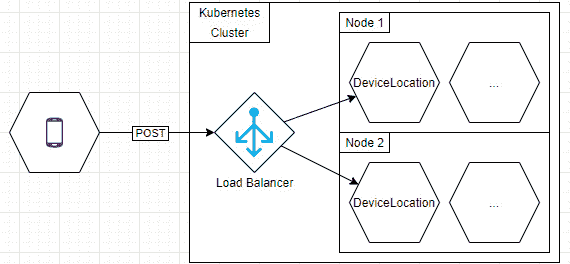

图 16.26–将其位置发送到 Kubernetes 群集的设备。然后，负载平衡器将请求发送到 DeviceLocation microservice 的正确实例

这有点简化，但它显示了负载平衡背后的思想：

1.  请求进入集群并到达负载平衡器。
2.  负载平衡器将请求发送到*DeviceLocation microservice*的相应实例。

一些负载平衡器还可以在后续调用后将同一服务器服务于同一客户机，从而使有状态应用更加可靠。

## 结论

容器对于创建可移植应用非常有用。Docker Compose 和 orchestration 程序在编写和部署复杂应用时非常方便。所有这些都导致比以往任何时候都更容易扩展系统的各个部分。

现在，让我们看看容器如何帮助我们在应用规模上遵循**固体**原则：

*   **S**：他们帮助我们协调、测试和部署更小的微服务，并承担一项责任。
*   **O**：它们通过添加和移除容器而不停止应用来帮助我们改变系统的行为。
*   **L**：不适用。
*   **I**：它们帮助我们协调、测试和部署更小的微服务（更小的应用公开更小的公共契约/接口）。
*   **D**：不适用。

# 总结

微服务架构与我们在本书中介绍的其他内容以及我们如何构建巨石有所不同。我们将其拆分为多个较小的应用，称之为微服务，而不是一个大型应用。微服务必须彼此分离；否则，我们将面临与紧耦合类（乘以无穷大）相关的可能问题。

我们可以利用发布-订阅设计模式来解耦微服务，同时通过事件保持它们的连接。消息代理是发送这些消息的软件。我们可以使用事件源在任何时间点重新创建应用的状态，包括生成新容器时。我们可以使用应用网关来保护客户端不受微服务集群复杂性的影响，并且只公开服务的一个子集。

我们还研究了如何在 CQRS 设计模式的基础上实现对相同实体的读写分离，从而允许我们独立地扩展查询和命令。我们还研究了如何使用无服务器资源来创建这种系统。

然后，我们概述了有关容器、Docker、Kubernetes 和缩放的概念。因为我们可以写很多关于这些的书，所以我们只看了一下微服务可以做什么。

另一方面，微服务是有成本的，并不打算取代现有的一切。对于许多项目来说，建造一座独石仍然是一个好主意。另一个解决方案是从一个整体开始，并在扩展时将其迁移到微服务。这使我们能够更快地开发应用（monolith）。与将新功能添加到微服务应用相比，向一块巨石添加新功能也更容易。大多数情况下，整体式应用中的错误成本低于微服务应用中的错误成本。您还可以计划将来向微服务的迁移，这将实现两个方面的最佳效果，同时保持较低的操作复杂性。例如，您可以通过 monolith 中的 MediatR 通知来利用发布-订阅模式，并在稍后将系统迁移到 microservices 体系结构时（如果需要的话）将事件调度责任迁移到 message broker。

我不想让你放弃微服务架构，但我只是想确保你在盲目投入之前权衡一下这样一个系统的利弊。您的团队的技能水平以及他们学习新技术的能力也可能会影响加入微服务行列的成本。

**DevOps**（开发[Dev]和 IT 运营[Ops]）和**DevSecOps**（为 DevOps 组合添加安全性）在构建微服务时是必不可少的，我们在本书中没有介绍。它们带来了部署自动化、自动化质量检查、自动合成等功能。否则，您的项目将很难部署和维护。

当您需要扩展、想要无服务器或在多个团队之间分担责任时，微服务非常有用，但请记住运营成本。

本章总结了本书的应用范围部分。接下来，我们将探讨 ASP.NETCore5 提供的用户界面选项，包括 Blazor 和 MVU 模式。

# 问题

让我们来看看几个练习题：

1.  **消息队列**和**发布子**模型之间最显著的区别是什么？
2.  什么是**事件来源**？
3.  一个**应用网关**可以同时是**路由网关**和**聚合网关**吗？
4.  真正的 CQR 需要使用无服务器云基础设施，这是真的吗？
5.  构建 MicroService 应用时是否需要使用容器？

# 进一步阅读

以下几个链接将帮助您在本章所学知识的基础上进一步发展：

*   *码头工人入门*：[https://net5.link/1zfM](https://net5.link/1zfM  )
*   *学习库伯内特基础*：[https://kubernetes.io/docs/tutorials/kubernetes-basics/](https://kubernetes.io/docs/tutorials/kubernetes-basics/)
*   马丁·福勒的事件来源模式：[https://net5.link/oY5H](https://net5.link/oY5H  )
*   微软的事件来源模式：[https://net5.link/ofG2](https://net5.link/ofG2  )
*   Microsoft 发布者-订阅者模式：[https://net5.link/amcZ](https://net5.link/amcZ  )
*   微软的事件驱动架构：[https://net5.link/rnck](https://net5.link/rnck  )
*   Microservices.io 上的微服务架构和模式：[https://net5.link/41vP](https://net5.link/41vP)
*   Martin Fowler 的微服务架构和模式：[https://net5.link/Mw97](https://net5.link/Mw97)
*   微软的微服务架构和模式：[https://net5.link/s2Uq](https://net5.link/s2Uq)
*   JSON 补丁：[https://net5.link/PsqU](https://net5.link/PsqU)
*   RFC 6902（JSON 补丁）：[https://net5.link/bGGn](https://net5.link/bGGn )
*   ASP.NET Core web API 中的 JSON 补丁：[https://net5.link/u6dw](https://net5.link/u6dw )