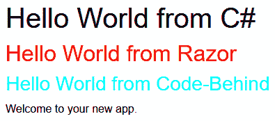
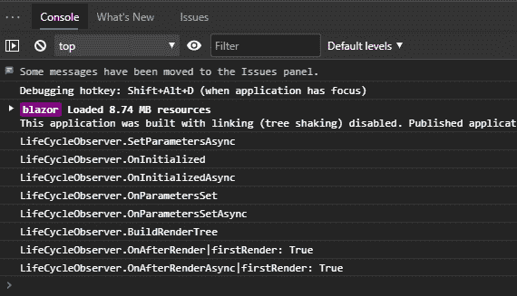
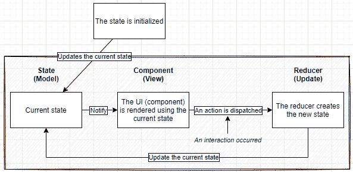
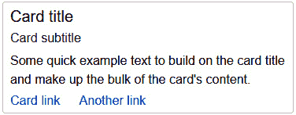

# 十八、Blazor简介

在本章中，我们将介绍 Blazor。Blazor 是街区中启用完整堆栈.NET 的新成员。Blazor 是一项伟大的技术。它仍然相对较新，但在实验阶段、首次正式发布和当前状态之间有了显著的改进。在大约两年的时间里，它从遥远的未来变成了现实。丹尼尔·罗斯很可能是那个时期最狂热的布道者。有一段时间，Blazor 是我唯一听说的东西（或者可能是互联网在监视我）。

有趣的事实

回到过去，我们可以将服务器端 JavaScript 与经典 ASP 结合使用，使经典 ASP 成为第一个完整堆栈技术（据我所知）。

Blazor 是两件事：

*   它是一个客户端**单页应用**（**SPA**框架，将.NET 编译到**WebAssembly**（**Wasm**）。
*   It is a client-server link over SignalR that acts as a modern `UpdatePanel` with superpowers.

    一点历史

    如果你不知道什么是`UpdatePanel`，你就不会错过太多。它是与.NET Framework 3.5 一起发布的 ASP.NET Web 表单控件，帮助“自动”运行 AJAX 调用

Blazor 还附带了和**剃须刀组件**（Blazor 组件为什么没有？我不知道）。它有一些围绕着它的实验项目，还有一个不断增长的图书馆生态系统，可以通过 NuGet 访问。

现在我已经介绍了 Blazor 的高级概述，本章将介绍以下主题：

*   Blazor 服务器概述
*   Blazor WebAssembly 概述
*   熟悉剃须刀组件
*   模型视图更新模式
*   一个混合的 Blazor 特征

# Blazor 服务器概述

Blazor 服务器是一个 ASP.NET Core web 应用，最初向浏览器发送页面。然后，浏览器通过信号器连接更新部分 UI。该应用成为一个自动化的 AJAX 客户端服务器应用。它是经典 web 应用和 SPA 模型的混合体，客户端从服务器加载要更新的 UI 片段。因此，客户端的处理更少，服务器的处理更多。由于您必须等待服务器响应（*步骤 2*到*4*），因此也可能存在短暂的延迟（延迟）；例如：

1.  单击浏览器中的按钮。
2.  该操作通过信号器发送到服务器。
3.  服务器处理该操作。
4.  服务器将 HTML 差异返回到浏览器。
5.  浏览器使用该差异更新 UI。

为了进行区分（*步骤 4*，服务器保存应用状态图。它使用组件构造该图，组件转换为文档对象模型（DOM）节点。

Blazor 服务器生成有状态的应用，这些应用必须跟踪所有访问者的当前状态。它可能很难扩展，或者在云托管方面会花费很多钱。我不想你现在就放弃这个选择；该模型可能适合应用的需要。此外，根据许多因素，支付更多的主机费用可以节省开发成本。

免责声明

我还没有使用 Blazor 服务器部署任何应用。这让我想到了一个改进的网页表单重拍太多，我害怕进入。这可能只是我的问题，但有状态服务器中的“神奇”信号器连接、延迟和处理的所有事情对我来说都不太好。我可能错了。我建议你自己做实验、研究和判断。我甚至可能在将来改变主意；这项技术还很年轻。

要创建 Blazor 服务器项目，可以运行`dotnet new blazorserver`命令。Blazor 服务器就是这样。

接下来，我们将研究 Blazor WebAssembly，这是一种更具前景的方式（我的观点也是如此）。

# Blazor WebAssembly 概述

在进入**Blazor WebAssembly**之前，让我们先看看**WebAssembly**本身。WebAssembly（Wasm）允许浏览器运行非 JavaScript 代码（如 C#和 C++）。Wasm 是一个开放标准，所以它不是微软唯一的产品。Wasm 在客户端机器上的沙盒环境中运行，接近本机速度（这是目标），强制执行浏览器安全策略。Wasm 二进制文件可以与 JavaScript 交互。

正如您在最后一段中“预见到”的那样，Blazor WebAssembly 就是要在浏览器中运行.NET！最酷的是它遵循标准。这不像在 Internet Explorer 中运行 VBScript（哦，我不怀念那段时间）。我认为，从长远来看，微软拥抱开放标准、开放源代码和世界其他地区的新愿景将对我们开发者非常有益。

但这是怎么回事？像 Blazor 服务器和其他 SPA 一样，我们使用**组件**构建应用。组件是一个 UI，可以小到一个按钮，也可以大到一个页面。然后，当客户端请求我们的应用时，会发生以下情况：

1.  服务器发送一个或多或少的空 shell（HTML）。
2.  浏览器下载外部资源（JS、CSS 和图像）。
3.  浏览器将显示应用。

到目前为止，这与任何其他网页都是一样的体验。区别在于，当用户执行某个操作（例如单击按钮）时，该操作由客户端执行。当然，客户端可以调用远程资源，就像在 React、Angular 或 Vue 中使用 JavaScript 一样。然而，这里重要的一点是你不必这么做。您可以使用 C#和.NET 控制客户端上的用户界面。

Blazor Wasm 的一个显著优势是托管：编译后的 Blazor Wasm 工件只是**静态资源**，因此您可以在云中几乎免费托管您的 web 应用（例如，提供 Azure Blob 存储和内容交付网络（CDN））。

这带来了另一个优势：可伸缩性。因为每个客户端都运行前端，所以您不需要仅扩展静态资产的交付。

另一方面，如果您愿意，您也可以使用服务器端 ASP.NET 应用预渲染 Blazor Wasm 应用。这导致客户机的初始加载时间加快，但托管成本增加。

然而，有一个明显的缺点：它在.NET 上运行。但我为什么要这么说？那是亵渎神明，对吗？嗯，浏览器必须下载.NET 运行时的 Wasm 版本，这是一个庞大的版本。幸运的是，微软的工作人员正在研究一种修剪未使用部分的方法，因此浏览器只下载所需的部分。Blazor 还支持延迟加载 Wasm 程序集，因此客户端不需要一次下载所有内容。也就是说，总的来说，最小下载大小仍然在 2MB 左右。有了高速互联网，2MB 的容量很小，下载速度也很快，但对于生活在偏远地区的人们来说，下载速度可能会稍长一些。所以，在做出选择之前，先考虑一下你的听众。

要创建 Blazor Wasm 项目，可以运行`dotnet new blazorwasm`命令。

接下来，我们将探索 Razor 组件，看看 Blazor 提供了什么。

# 熟悉剃须刀组件

Blazor Wasm 中的所有内容都是**剃刀组件**，包括应用本身，它被定义为根组件。在`Program.cs`文件中，该根组件注册如下：

```cs
builder.RootComponents.Add<App>("#app");
```

`App`类型来自`App.razor`组件（稍后我们将介绍组件如何工作），字符串`"#app"`是 CSS 选择器。`wwwroot/index.html`文件包含一个`<div id="app">Loading...</div>`元素，一旦应用初始化，该元素将被 Blazor`App`组件替换。`#app`是识别具有`id="app"`属性的元素的 CSS 选择器。`wwwroot/index.html`静态文件是提供给客户端的默认页面；这是 Blazor 应用的起点。它包含页面的基本 HTML 结构，包括脚本和 CSS。这就是 Blazor 应用的加载方式。

`App.razor`文件定义了一个`Router`组件，将请求路由到正确的页面。当页面存在时，`Router`组件呈现`Found`子组件。当页面不存在时，显示`NotFound`子组件。以下是`App.razor`文件的默认内容：

```cs
<Router AppAssembly="@ typeof(Program).Assembly">
    <Found Context="routeData">
        <RouteView RouteData="@routeData" DefaultLayout="@typeof(MainLayout)" />
    </Found>
    <NotFound>
        <LayoutView Layout="@typeof(MainLayout)">
            <p>Sorry, there's nothing at this address.</p>
        </LayoutView>
    </NotFound>
</Router>
```

**页面**为**剃须刀组件**，顶部有`@page "/some-uri"`指令，类似于剃须刀页面。您可以使用与 Razor 页面相同的大部分（如果不是全部的话）来组成这些路由。

**Razor 组件**是实现`IComponent`接口的 C#类。您也可以从`ComponentBase`继承，它为您实现了以下接口：`IComponent`、`IHandleEvent`、`IHandleAfterRender`。所有这些都存在于`Microsoft.AspNetCore.Components`名称空间中。

接下来，我们将了解如何创建 Razor 组件。

## 创建剃须刀组件

与 Razor 页面和视图组件不同，您可以在项目中的任何位置创建组件。我喜欢在`Pages`目录下创建我的页面，这样更容易找到页面。然后，您可以在任何适合的地方创建非页面组件。

有三种方法可以创建组件：

*   仅使用 C#。
*   只使用剃须刀。
*   混合使用 C#（代码隐藏）和 Razor。

您不必为整个应用只选择一种方式；您可以根据每个组件进行选择。不管怎样，这三种方法最终都被编译成一个 C#类。让我们来看一下组织组件的三种方法。

### C#-仅限

C#-只有组件与创建类一样简单。在下面的示例中，我们继承自`ComponentBase`，但我们只能实现我们需要的接口。

这是我们的第一部分：

CSharpOnlyComponent.cs

```cs
namespace WASM
{
    public class CSharpOnlyComponent : ComponentBase
    {
        [Parameter]
        public string Text { get; set; }
```

`Parameter`属性允许在使用组件时设置`Text`属性的值。正式成为一个**组件参数**。一旦我们完成了这个课程，我们就会看到它的作用。

接下来，`BuildRenderTree`方法负责呈现我们的组件：

```cs
        protected override void BuildRenderTree(RenderTreeBuilder builder)
        {
            builder.OpenElement(0, "h1");
            builder.AddAttribute(1, "class", "hello-world");
            builder.AddContent(2, Text);
            builder.CloseElement();
        }
    }
}
```

通过重写此方法，我们控制渲染树。这些更改最终转化为 DOM 更改。在这里，我们用一个`hello-world`类创建一个`H1`元素。其中是一个文本节点，包含`Text`属性的值。

序列号

序列号（`BuildRenderTree`方法中的`0`、`1`和`2`在内部用于生成差异树，.NET 用于更新 DOM。建议手动编写这些代码，以避免更复杂的代码（如条件逻辑块）中的性能下降。更多信息，请参见*进一步阅读*部分中的*ASP.NET Core Blazor advanced scenarios*链接。

现在，在`Pages/Index.razor`页面中，我们可以使用如下组件：

Pages/Index.razor

```cs
@page "/"
<CSharpOnlyComponent Text="Hello World from C#" />
```

类的名称成为其标记的名称。这是自动的；我们没有办法让它发生。我们可以将用`Parameter`属性标识的属性的值设置为 HTML 属性。在本例中，我们将`Text`属性的值设置为`Hello World from C#`。我们可以使用该属性标记多个属性，并像使用任何普通 HTML 属性一样使用它们。

呈现页面时，我们的组件呈现为以下 HTML：

```cs
<h1 class="hello-world">Hello World from C#</h1>
```

通过这几行代码，我们创建了第一个 Razor 组件。接下来，我们将使用 Razor-only 语法创建一个类似的组件。

### 只有剃刀

仅 Razor 组件在`.razor`文件中创建。它们被编译成一个 C#类。该类的默认名称空间取决于创建它的目录结构。例如，在`./Dir/Dir2/MyComponent.razor`文件中创建的组件在`[Root Namespace].Dir.Dir2`命名空间中生成`MyComponent`类。让我们看一些代码：

RazorOnlyComponent.razor

```cs
<h2 class="hello-world">@Text</h2>
@code{
    [Parameter]
    public string Text { get; set; }
}
```

如果你喜欢剃须刀，你可能已经喜欢这个了。该清单非常简单，允许我们编写与前一个相同的组件，但更加精简。在`@code{}`块中，我们可以添加属性、字段、方法，以及我们在普通类中所能添加的几乎任何东西，包括其他类。如果需要，我们也可以覆盖那里的`ComponentBase`方法。我们可以像使用其他组件一样使用组件；参数也是如此。

接下来是使用`RazorOnlyComponent`的页面：

Pages/Index.razor

```cs
@page "/"
<CSharpOnlyComponent Text="Hello World from C#" />
<RazorOnlyComponent Text="Hello World from Razor" />
```

渲染也非常相似，但我们选择了`H2`而不是`H1`：

```cs
<h2 class="hello-world">Hello World from Razor</h2>
```

通过这几行代码，我们创建了第二个组件。接下来，我们将创建这两种样式的混合。

### 代码隐藏

这个第三个模型可以将 C#代码（称为代码隐藏）与 Razor 代码分开。这种混合的对应物利用**部分类**实现与其他类相同的功能，并生成一个 C#类。

为此，我们需要两个文件：

*   `[component name].razor`
*   `[component name].razor.cs`

让我们第三次重做上一个组件，但这次呈现一个`H3`。让我们从 Razor 代码开始：

CodeBehindComponent.razor

```cs
<h3 class="hello-world">@Text</h3>
```

这段代码几乎不能再精简了；我们有一个`H3`标记，其内容是`Text`属性。此模型中的`.razor`文件取代了`BuildRenderTree`方法。编译器将 Razor 代码翻译成 C#，为我们生成`BuildRenderTree`方法的内容。

`Text`参数是在以下代码隐藏文件中定义的：

CodeBehindComponent.razor.cs

```cs
public partial class CodeBehindComponent
{
    [Parameter]
    public string Text { get; set; }
}
```

它与前两个示例的代码相同–我们只是将其分为两个文件。关键是`partial class`。它允许从多个文件中编译单个`class`。在本例中，有我们的`partial class`和自动生成的`CodeBehindComponent.razor`文件。我们可以像其他两个一样使用`CodeBehindComponent`。

接下来是使用`CodeBehindComponent`的页面：

Pages/Index.razor

```cs
@page "/"
<CSharpOnlyComponent Text="Hello World from C#" />
<RazorOnlyComponent Text="Hello World from Razor" />
<CodeBehindComponent Text="Hello World from Code-Behind" />
```

呈现方式与其他方式相同，但内容不同的`H3`：

```cs
<h3 class="hello-world">Hello World from Code-Behind</h3>
```

在以下两方面使用代码隐藏非常有用：

*   保持你的`.razor`文件没有 C 代码。
*   获得更好的工具支持。

`.razor`文件的工具往往会不时在我们身上爆炸，包括奇怪的 bug，或者提供一半的支持。似乎在单个文件中处理 HTML、C#和 Razor 并不像听起来那么容易。更积极的方面是，它正在变得更好，因此我只能看到未来更稳定的工具。我可以看到我自己写一个组件的所有代码在一个单一的 Tyt1 文件中，如果该工具是与 C.*工具（在许多情况下）相当。这将导致更少的文件和更接近组件的所有部分（导致更好的可维护性）。

接下来，我们将看一看如何使用 CSS 对组件进行蒙皮，但有一点扭曲…

## CSS 隔离

与其他 SPA 一样，Blazor 允许我们创建范围为组件的CSS 样式。这意味着我们不必担心命名冲突。

不幸的是，这似乎不适用于仅使用 C#的组件，因此我们将仅对三个组件中的两个进行蒙皮。它们都有相同的 CSS 类（`hello-world`。我们将通过定义简单的`.hello-world`CSS 选择器来改变他们文本的颜色，这两个选择器都是如此。

为了实现这一点，我们必须创建一个以我们的组件命名的`.razor.css`文件。以下两个文件表示我们刚刚构建的`RazorOnlyComponent`和`CodeBehindComponent`的一个 CSS 文件：

RazorOnlyComponent.razor.css

```cs
.hello-world {
    color: red;
}
```

CodeBehindComponent.razor.css

```cs
.hello-world {
    color: aqua;
}
```

从这两个文件中可以看出，它们使用不同的颜色定义了相同的`.hello-world`选择器。

在`wwwroot/index.html`文件中`dotnet new blazorwasm`模板增加了以下行：

```cs
<link href="[name of the project].styles.css" rel="stylesheet" />
```

该行将捆绑组件特定样式链接到页面中。是的，你读过**捆绑的**。Blazor CSS 隔离功能还将所有这些样式捆绑到一个`.css`文件中，因此浏览器只加载一个文件。

如果我们加载页面，我们会看到以下内容（没有布局）：



图 18.1–加载页面后的输出

所以成功了！但是怎么做呢？Blazor 在每个 HTML 元素上自动生成随机属性，并在生成的 CSS 中使用这些属性。让我们首先看看 HTML 输出：

```cs
<h1 class="hello-world">Hello World from C#</h1>
<h2 class="hello-world" b-cjkj1dpci4>Hello World from Razor</h2>
<h3 class="hello-world" b-0gygcymdih>Hello World from Code-Behind</h3>
```

这两个突出显示的属性是“神奇”链接。现在，使用以下 CSS 代码，您应该了解它们的用法以及生成它们的原因：

```cs
/* /CodeBehindComponent.razor.rz.scp.css */
.hello-world[b-0gygcymdih] {
    color: aqua;
}
/* /RazorOnlyComponent.razor.rz.scp.css */
.hello-world[b-cjkj1dpci4] {
    color: red;
}
```

如果您不太熟悉 CSS，`[...]`是一个**属性选择器**。它允许您执行各种操作，包括选择具有指定属性的元素（如本例所示）。这就是我们需要的。第一个选择器意味着具有`hello-world`类和名为`b-0gygcymdih`的属性的所有元素的颜色都应更新为`aqua`。第二个选择器是相同的，但用于名为`b-cjkj1dpci4`的属性的元素。

有了这种模式，我们就可以定义组件范围的样式，并且具有很高的可信度，即它们不会与其他组件的样式冲突。

接下来，让我们探讨这些组件的生命周期。

## 组件生命周期

组件（包括根组件）必须呈现为 DOM 元素，以便浏览器显示它们。随后发生的任何更改也是如此。组件的生命周期由两个不同的阶段组成：

1.  首次渲染组件时的初始渲染。
2.  重新渲染，当组件因更改而需要渲染时。

在第一次渲染期间，如果我们去掉重复的同步/异步方法，Razor 组件的生命周期如下所示：


图 18.2–剃须刀组件的生命周期

1.  创建组件的实例。
2.  调用`SetParametersAsync`方法。
3.  调用`OnInitialized`方法。
4.  调用`OnInitializedAsync`方法。
5.  调用`OnParametersSet`方法。
6.  调用`OnParametersSetAsync`方法。
7.  调用`BuildRenderTree`方法（渲染组件）。
8.  调用`OnAfterRender(firstRender: true)`方法。
9.  调用`OnAfterRenderAsync(firstRender: true)`方法。

在重新渲染期间，如果我们去掉重复的同步/异步方法，Razor 组件的生命周期将更加精简，如下所示：


图 18.3–剃须刀组件生命周期的重新呈现版本

1.  `ShouldRender`方法被调用为。如果返回`false`，则流程在此停止。如果为`true`，则循环继续。
2.  调用`BuildRenderTree`方法（组件被重新渲染）。
3.  调用`OnAfterRender(firstRender: false)`方法。
4.  The `OnAfterRenderAsync(firstRender: false)` method is called.

    笔记

    如果您以前使用过 Web 表单，并且害怕 Blazor 生命周期的复杂性，请不要担心。它更精简，不包含任何回发。它们是两种不同的技术。Microsoft 试图将 Blazor 作为从 Web 表单迁移的下一个逻辑步骤（这在.NET 的实际状态下是有意义的），但我看到的唯一显著相似之处是 Blazor 的组件模型，它接近 Web 表单的控制模型。因此，如果您不再使用 Web 表单，请不要害怕查看 Blazor；它们不一样–Blazor>Web 表单。

我在 WASM 项目中创建了一个名为`LifeCycleObserver`的组件。该组件将其生命周期信息输出到控制台。这让我想到了以下技巧：`Console.WriteLine`在浏览器控制台中写入，如下所示：



图 18.4–显示 LifeCycleObserver 组件生命周期的浏览器调试控制台

接下来，我们将了解事件处理以及如何与组件交互。

## 事件处理

到目前为止，我们已经展示了使用三种不同技术构建的相同组件。现在是时候与组件交互并了解其工作原理了。HTML 中有多个事件可以使用 JavaScript 处理。在 Blazor 中，我们可以使用 C#来处理大多数问题。

我稍微修改了生成的项目附带的`FetchData.razor`页面组件，向您展示了两种不同的事件处理程序模式：

*   没有经过辩论。
*   有争论。

这两种方法都调用`async`方法，但同步方法也可以这样做。现在让我们来研究一下这段代码。我将跳过一些不相关的标记，例如`H1`和`P`标记，只关注真正的代码，首先是：

```cs
@page "/fetchdata"
@inject HttpClient Http
```

在文件的顶部，我留下了`HttpClient`和`@page`指令的注入。这些允许我们分别在导航到`/fetchdata`URL 和通过 HTTP 查询资源时访问页面。`HttpClient`在`Program.cs`文件（合成根目录）中配置。然后，我添加了几个按钮进行交互。以下是第一点：

```cs
<button class="btn btn-primary mb-4" @onclick="RefreshAsync">Refresh</button>
```

此代码示例的所有按钮都有一个`@onclick`属性。该属性用于对点击事件做出反应，比如 HTML`onclick`属性和 JavaScript`"click"``EventListener`。该按钮将点击事件委托给`RefreshAsync`方法：

```cs
private Task RefreshAsync() => LoadWeatherAsync();
private async Task LoadWeatherAsync(int? index = null)
{
    var uri = index == null ? _uriList.Next() : _uriList[index.Value];
    forecasts = await Http.GetFromJsonAsync<WeatherForecast[]>(uri);
}
```

然后刷新方法调用`LoadWeatherAsync(index: null)`方法，该方法反过来查询返回`WeatherForecast`数组的资源。预测是位于`wwwroot/sample-data`目录中的三个静态 JSON 文件。`_uriList`是`Cycle`类的一个实例，该类循环遍历一系列字符串。其代码很简单，但有助于以面向对象的方式简化页面的其余部分：

```cs
private class Cycle
{
    private int _currentIndex = -1;
    private string[] _uris;
    public Cycle(params string[] uris) => _uris = uris;
    public string Next() => _uris[++_currentIndex % _uris.Length];
}
```

当天气预报发生变化时（当我们点击**刷新**按钮时），组件将自动重新加载，从而更新天气预报表。

我们还可以像在 JavaScript 中一样访问事件参数。如果单击，我们可以访问与事件关联的`MouseEventArgs`实例。下面是一个显示可能用法的快速示例：

```cs
<button class="btn btn-primary mb-4" @onclick="DisplayXY">Display (X, Y)</button>
public void DisplayXY(MouseEventArgs e)
{
    Console.WriteLine($"DOM(x, y): ({e.ClientX}, {e.ClientY}) | Button(x, y): ({e.OffsetX}, {e.OffsetY}) | Screen(x, y): ({e.ScreenX}, {e.ScreenY})");
}
```

在该代码中，`@onclick`属性的使用方式与前面相同，但`DisplayXY`方法需要一个`MouseEventArgs`作为参数。`MouseEventArgs`参数由 Blazor 自动提供。然后，该方法将在浏览器的 DevTools 控制台（*F12*基于 Chromium 的浏览器）中输出鼠标位置，如下所示：

```cs
DOM(x, y): (921, 175) | Button(x, y): (119, 4) | Screen(x, y): (-999, 246)
DOM(x, y): (809, 197) | Button(x, y): (7, 26) | Screen(x, y): (-1111, 268)
```

为了生成这些坐标，我单击了按钮的右上角，然后单击了左下角。从 x 屏的负位置可以推断，我的浏览器在我的左显示器上。

另一种可能是使用 lambda 表达式作为内联事件处理程序。这些 lambda 表达式也可以调用方法。以下是一个例子：

```cs
<button class="btn btn-primary mb-4" @onclick="@(e => Console.WriteLine($"DOM(x, y): ({e.ClientX}, {e.ClientY})"))">Lamdba (X, Y)</button>
```

该按钮仅输出客户端（x，y）坐标，以提高可读性。

下面是我们对事件处理的概述。接下来，我们将研究另一种方法来管理组件的状态，而不是每个组件做自己的事情。

# 模型视图更新模式

除非你从未听说过 React，否则你很可能听说过 Redux。Redux 是一个遵循**模型视图更新**（**MVU**模式）的库。MVU 来自 Elm 体系结构。如果您不了解 Elm，请引用他们的文档：

Elm 是一种编译为 JavaScript 的函数式语言。

接下来，让我们看看 MVU 背后的目标是什么。不管我们叫它什么，它都是相同的模式。

## 目标

MVU 的目标是简化应用的**状态管理**。如果您在过去构建了一个有状态的 UI，您可能知道管理应用的状态会变得很困难。MVU 从等式中去掉了双向绑定的复杂性，并将其替换为线性单向流。它还通过用不可变状态替换突变，将状态更新移动到纯函数，从而消除突变。

## 设计

MVU模式是一个**单向数据流**，将**动作**路由到**更新功能**。更新功能必须是**纯**。纯函数是**确定性**且**无副作用**。模型为**状态**。状态是不可变的。一个状态必须有一个**初始状态**。**视图**是知道如何显示状态的代码。

根据技术的不同，有许多同义词。让我们深入了解更多细节。一开始听起来可能让人困惑，但别担心，没那么糟糕。

一个**动作**在 MediatR 中被称为**命令**或**请求**。它在 Redux 中称为**动作**，在Elm 中称为**消息**。我将使用**动作**。**动作**相当于我们在 CQRS 示例中使用的命令。MVU 中没有查询的概念，因为视图总是呈现当前状态。


一个**更新函数**在 MediatR 中被称为**处理程序**。在Redux 中称为**减速器**，在 Elm 中称为**更新**。我将使用**减速器**。**减速机**是一个纯函数，对于任何给定的输入，它总是返回相同的输出（这是确定性的）。纯功能必须对外部参与者没有影响（没有副作用）。因此，外部变量无突变，输入值无突变：无副作用。纯函数的一个显著优点是测试。基于给定的输入很容易断言它们的输出值，因为它们是确定性的。


**视图**是React and Blazor 中的**组件**，是 Elm 中的**视图功能**。我将主要使用**视图**，因为**组件**可能模棱两可，很容易与 Razor 组件、视图组件或简单的 UI 组件概念混淆。


模型或**状态**不能更改，必须是不可变的。每次状态更改时，都会创建状态的更改副本。然后，当前状态变为该副本。Elm 将**状态**称为**模式**；它是 Redux 中的**状态**。我们使用术语**状态**，因为我发现它更好地定义了意图。


以下是表示此**单向数据流**的图表：



图 18.5–单向数据流程图

1.  当应用启动时，状态被初始化。该初始状态成为当前状态。
2.  当前状态更改将触发要呈现的 UI。
3.  当发生交互时，如用户点击按钮，则向**减速器**发送**动作**。
4.  减速器*创建更新状态的实例*。
5.  新状态*取代*当前状态。
6.  事件发生时，返回当前列表的*步骤**2*。

一开始你可能很难理解这一点。像所有的新事物一样，我们必须花时间在大脑中创造新的路径，以充分获得某些东西。别担心；我们即将看到这一行动。

总而言之，这是直截了当的；水流只有一个方向。只要状态发生更改，就会重新渲染组件。由于状态是不可变的，我们不能直接改变它们，所以我们必须经过还原器。

## 项目：柜台

对于这个项目，我们将使用我在 2020 年试验 C#9 记录类时创建的开源库。因为记录是不可变的，所以它是表示 MVU 状态的完美候选。此外，它允许在有限的空间内简化我们的示例。

笔记

有多个类似的库，但它们都是在 C#9 之前创建的，因此没有直接的记录支持。

**上下文**：我们正在构建一个计数器页来递增和递减一个值。

我知道这听起来不是很令人兴奋，但由于许多 MVU 库展示了一个以及 Blazor 本身，我相信这将是一个很好的方式来比较它和其他。

首先，我们需要通过加载`StateR.Blazor`NuGet 包来安装库。在本例中，我们使用的是预发布版本。

Redux 开发工具

我还在项目中安装了`StateR.Blazor.Experiments`NuGet 包。该项目有一些实验性功能，包括 Redux DevTools 连接器。Redux DevTools 是一个允许跟踪状态和操作的浏览器扩展。它还允许州与州之间的时间旅行。

接下来，让我们对`Counter`特性进行编码：

功能/计数器.cs

```cs
using StateR;
using StateR.Reducers;
namespace WASM.Features
{
    public class Counter
    {
        public record State(int Count) : StateBase;
```

`State`记录是我们的**状态**。它暴露了一个`init-only`属性。继承自`StateBase`，为空记录。`StateBase`作为通用约束，直到 C#支持。状态器中的状态必须是记录；这是强制性的。

```cs
        public class InitialState : IInitialState<State>
        {
            public State Value => new(0);
        }
```

`InitialState`类表示`State`记录的**初始状态**。它通过实现`IInitialState<State>`接口告诉 StateR。

```cs
        public record Increment : IAction;
        public record Decrement : IAction;
```

在这里，我们宣布两个**动作**。它们是记录，但也可以是类。成为记录不是一项要求，而是编写更少代码的捷径。在 StateR 中，操作必须实现`IAction`接口。

```cs
        public class Reducers : IReducer<Increment, State>, IReducer<Decrement, State>
```

`Reducers`类实现处理**动作**的**纯函数**。在 StateR 中，减速器必须实现`IReducer<TAction, TState>`接口。`TAction`必须是`IAction`，且`TState`必须是`StateBase`。接口只定义了一个输入`TAction`和`TState`并输出更新后的`TState`的`Reduce`方法：

```cs
        {
            public State Reduce(Increment action, State state)
                => state with { Count = state.Count + 1 };
```

`Increment`**减速机**返回一份`State`的副本，其`Count`递增 1。

```cs
            public State Reduce(Decrement action, State state)
                => state with { Count = state.Count - 1 };
        }
    }
}
```

最后，`Decrement`**减速机**返回一份`State`的副本，其`Count`减 1。

我发现，使用带有表达式的**可以生成非常干净的代码，特别是当`State`记录有多个属性时。此外，记录类强制执行状态的不变性，这与 MVU 模式一致。**

这就是我们需要涵盖模型（状态）和更新（操作/还原器）的全部内容。现在转到视图（组件）部分。该视图是以下 Razor 组件：

功能/反视图.razor

```cs
@page "/mvu-counter"
@inherits StatorComponent
@inject IState<Counter.State> State
<h1>MVU Counter</h1>
<p>Current count: @State.Current.Count</p>
<button class="btn btn-primary" @onclick="() => DispatchAsync(new Counter.Increment())">+</button>
<button class="btn btn-primary" @onclick="() => DispatchAsync(new Counter.Decrement())">-</button>
```

这里只有几行，但有很多事情要讨论。首先，Razor 组件可以通过`/mvu-counter`URL 访问。

然后，它继承自`StatorComponent`。这不是必需的，但很方便。`StatorComponent`类为我们实现了一些功能，包括在`IState<TState>`属性更改时管理组件的重新呈现。

这就引出了下一行，注入一个可以通过`State`属性访问的`IState<Counter.State>`接口实现。该接口封装了`TState`实例，并通过其`Current`属性提供对当前状态的访问。`@inject`指令在剃须刀组件中启用**属性注入**。

接下来，我们显示页面。`@ State.Current.Count`表示当前计数。下面是两个按钮。两者都有一个调用 lambda 表达式的`@onclick`属性。`DispatchAsync`方法来自`StatorComponent`。顾名思义，它**通过 StateR 管道发送动作**。类似于 MediatR`Send`和`Publish`方法。

每个按钮分配不同的动作；一个是`Counter.Increment`，另一个是`Counter.Decrement`。StateR 知道减速器，并将操作发送给相应的减速器。

该代码创建了一个集中式状态，并使用 MVU 模式对其进行管理。如果我们在其他地方需要`Counter.State`，我们只需要注入它，就像我们在这里所做的那样，相同的状态将在多个组件或类之间共享。在本例中，我们在 Razor 组件中注入了状态，但我们也可以在任何代码中使用相同的模式。

还有一件事：我们需要初始化 StateR。为此，在`Program.cs`文件中，我们需要这样注册它：

```cs
using StateR;
using StateR.Blazor.ReduxDevTools; // Optional
// ...
builder.Services
    .AddStateR(typeof(Program).Assembly)
    .AddReduxDevTools() // Optional
    .Apply()
;
```

`builder.Services`属性是`IServiceCollection`属性。`AddStateR`方法创建`IStatorBuilder`并注册 StateR 的静态依赖项。

然后可选的`AddReduxDevTools`方法调用将 StateR 链接到我前面提到的*Redux DevTools*浏览器插件。这有助于从浏览器调试应用。可以在此处添加其他可选机制。开发人员还可以编写自己的扩展来添加缺少的或特定于项目的特性。StateR 是基于 DI 的。

最后，`Apply`方法通过扫描指定的程序集以获取它可以处理的每种类型来初始化 StateR。在本例中，我们只扫描 Wasm 应用集（突出显示）。初始化是一个两阶段的过程，通过`Apply`方法调用完成。

有了它，我们就可以运行应用并使用计数器了。我希望您喜欢这款带有 StateR 的 Redux/MVU。如果有，请随意使用。如果您发现缺少的功能、bug、性能问题，或者希望分享您的想法，请在 GitHub 上打开一个问题（[https://net5.link/Z7Ej](https://net5.link/Z7Ej) ）。

## 结论

MVU 模式使用**模型**来表示应用的当前**状态**。**视图**呈现的是**模型**。为了**更新**模型，一个**动作**被发送到一个**纯函数**（一个**减速机**，该减速机返回新的**状态**。该更改将触发**视图**重新渲染。

MVU 的**单向流**降低了状态管理的复杂性。

现在让我们看看 MVU 模式如何帮助我们遵循坚实的原则：

*   **S**：模式的每个部分（状态、视图和还原器）都有自己的职责。
*   **O**：我们可以在不影响现有元素的情况下添加新元素。例如，添加新操作不会影响现有的减速器。
*   **L**：不适用
*   **I**：通过分离责任，模式的每个部分都隐含着更小的表面（接口）。
*   **D**：这取决于您如何实现它。基于我们使用 StateR 所做的工作，我们只依赖于接口和 DTO（状态和动作）。

接下来，我们将快速浏览一下 Blazor 的其他信息，让您了解如果您想开始使用 Blazor，可以使用哪些工具。

# Blazor 特征的混合

您的 Blazor 之旅刚刚开始，Blazor 的特性比我们介绍的更多。下面是一些更多的可能性，让您对这些选项略知一二。

您可以使用`Component`标记帮助器将 Razor组件与 MVC 和 Razor 页面集成。执行此操作时，您还可以通过将`render-mode`属性设置为`Static`来预渲染应用（“T1”）组件），从而加快初始渲染时间。预渲染还可用于改进搜索引擎优化（SEO）。“缺点”是需要 ASP.NET Core服务器来执行预渲染逻辑。

完整堆栈 C#的另一个有趣之处是在客户端和服务器之间共享代码。假设我们有一个 web API 和一个 Blazor Wasm 应用；我们可以创建第三个项目，一个类库，并在两者之间共享 DTO（API 契约）。

在我们的组件中，我们还可以通过向该组件添加一个名为`ChildContent`的`RenderFragment`参数，在开始标记和结束标记之间允许任意 HTML。我们还可以捕获任意参数并在组件的 HTML 元素上显示它们。下面是结合这两个功能的示例：

剃须刀

```cs
<div class="@($"card {Class}")" @attributes="Attributes">
    <div class="card-body">
 @ChildContent
    </div>
</div>
@code{
 [Parameter]
 public RenderFragment ChildContent { get; set; }
    [Parameter(CaptureUnmatchedValues = true)]
    public Dictionary<string, object> Attributes { get; set; }
    [Parameter]
    public string Class { get; set; }
}
```

`Card`组件呈现引导卡，并允许消费者在其上设置他们想要的任何属性。`<Card>`和`</Card>`标记之间的内容可以是任何内容。该内容在`div.card-body`中呈现。高亮显示的行表示该子内容。

`Class`参数是一个解决方案，允许使用者在强制`card`类存在的同时添加 CSS 类。`Attributes`参数通过将`Parameter`属性的`CaptureUnmatchedValues`属性设置为`true`而成为一个包罗万象的参数。

下面是一个使用`Card`组件的示例：

Pages/Index.razor

```cs
<Card style="width: 25%;" class="mt-4">
    <h5 class="card-title">Card title</h5>
    <h6 class="card-subtitle mb-2 text-muted">Card subtitle</h6>
    <p class="card-text">Some quick example text to build on the card title and make up the bulk of the card's content.</p>
    <a href="#" class="card-link">Card link</a>
    <a href="#" class="card-link">Another link</a>
</Card>
```

我们可以看到，`Card`组件（突出显示的行）填充了任意 HTML（来自官方引导文档）。还指定了两个属性，一个是`style`和一个是`class`。

以下是渲染结果：

```cs
<div class="card mt-4" style="width: 25%;">
 <div class="card-body">
        <h5 class="card-title">Card title</h5>
        <h6 class="card-subtitle mb-2 text-muted">Card subtitle</h6>
        <p class="card-text">Some quick example text to build on the card title and make up the bulk of the card's content.</p>
        <a href="#" class="card-link">Card link</a>
        <a href="#" class="card-link">Another link</a>
    </div>
</div>
```

突出显示的线表示`Card`组件。其他一切都是`ChildContent`。我们还可以注意到属性 splatting 添加了`style`属性。`Class`属性将`mt-4`类追加到`card`。以下是它在浏览器中的外观：



图 18.6–在浏览器中呈现的卡组件

另一个内置组件是`Virtualize`组件。它允许减少渲染项目的数量，使其仅在屏幕上可见。还可以控制渲染的屏幕外元素的数量，以降低滚动时渲染元素的频率。

正如我们在反项目中看到的，Blazor 完全支持依赖注入。对我来说，这是一个要求。这也是为什么我学习 Angular 2 时，它出来，而不是反应或 Vue。Blazor 的 DI 支持比我目前看到的所有 JavaScript IoC 容器都要好得多，所以这是一个主要的好处。

Blazor 中还有许多其他内置功能，包括`EditForm`组件、验证支持和`ValidationSummary`组件，正如您在任何 MVC 或 Razor Pages 应用中所期望的那样，但客户端除外。

作为一个快速提示，如果需要强制渲染组件，可以从`ComponentBase`调用`StateHasChanged`方法。

正如本章前面提到的，.NET 代码可以与 JavaScript 交互，反之亦然。要从 C#执行 JavaScript 代码，请插入并使用`IJSRuntime`接口。要从 JavaScript 执行 C#代码，请使用`DotNet.invokeMethod`或`DotNet.invokeMethodAsync`函数。C#方法必须是`public static`并用`JSInvokable`属性修饰。C#和 JavaScript 还有多种其他交互方式，包括非静态方法。通过支持这一点，人们可以围绕 JavaScript 库构建包装器或按原样使用 JavaScript 库。这也意味着我们可以实现 Blazor 在 JavaScript 中不支持的功能，甚至可以在 Blazor 在某个方面速度较慢的情况下用 JavaScript 编写浏览器优化代码。

您甚至可以在画布上使用 JavaScript 包装器（如*BlazorCanvas*）或成熟的游戏引擎（如*WaveEngine*）编写 2D 和3D 游戏。

我能想到的最后一点附加信息是一个名为*Blazor 移动绑定*的实验项目。该项目是微软的一项实验，它允许 Blazor 在手机应用中运行。它通过使用 Razor 组件包装 Xamarin 表单控件来实现本机性能。它还支持在`WebView`控件中加载 Blazor Wasm，从而在移动和 web 应用之间实现更好的可重用性，但要以性能为代价。

我在*进一步阅读*部分留下了一长串链接，以补充本章的信息。

# 总结

Blazor 是一项伟大的新技术，可以将 C#和.NET 提升到一个全新的水平。在它目前的状态下，用它来开发应用已经足够好了。主要有两种模式；服务器和 WebAssembly。

Blazor 服务器通过信号器连接将客户端与服务器连接起来，允许服务器在需要时（例如当用户执行某个操作时）将更新推送到客户端。BlazorWebAssembly（Wasm）是一个.NETSPA 框架，它将 C#编译成 WebAssembly。它允许.NET 代码在浏览器中运行。我们可以使用`IJSRuntime`与 JavaScript 交互，反之亦然。

Blazor 是基于组件的，这意味着 Blazor 中的每个 UI 都是一个组件，包括页面。我们探索了三种创建组件的方法：仅使用 C#和 Razor，以及将 C#和 Razor 组合在两个不同文件中的混合方法。组件也可以有自己的独立 CSS，而无需担心冲突。

我们探讨了剃须刀组件的生命周期，它非常简单但功能强大。我们还研究了如何处理事件以及如何应对这些事件。

然后我们深入研究了 MVU 模式，它非常适合 Blazor 这样的有状态用户界面。我们使用了一个开源库，并利用 C#9.0 记录类实现了一个基本示例。

最后，我们来看看 Blazor 提供的其他可能性。

我将以个人观点结束本章。我希望看到类似 Blazor 的模型成为在.NET 中构建用户界面的统一方式。我更喜欢用 Razor 的方式编写 UI 代码，而不是用 XAML 编写 UI 代码。

# 问题

让我们来看看几个练习题：

1.  Blazor Wasm 被编译成 JavaScript 是真的吗？
2.  在创建剃须刀组件的三种方法中，哪一种是最好的方法？
3.  MVU 模式的三个部分是什么？
4.  在 MVU 模式中，是否建议使用双向绑定？
5.  Blazor 可以与 JavaScript 交互吗？

# 进一步阅读

以下是我们在本章中所学内容的几个链接：

*   WebAssembly:

    a） WebAssembly.org:[https://net5.link/mRMf](https://net5.link/mRMf)

    b） Mozilla 开发者网络（MDN）：[https://net5.link/PDh5](https://net5.link/PDh5)

*   ASP.NET Core Blazor 托管模型[https://net5.link/N8Do](https://net5.link/N8Do)
*   ASP.NET Core[中的组件标记帮助器 https://net5.link/mjqL](https://net5.link/mjqL)
*   创建和使用 ASP.NET Core剃须刀组件[https://net5.link/iDVh](https://net5.link/iDVh)
*   如何使用 VSTS 连续部署管道在 Azure Blob 存储中部署和托管 Jekyll 网站[https://net5.link/qCCZ](https://net5.link/qCCZ)
*   ASP.NET Core Blazor WebAssembly 性能最佳实践 https://net5.link/HrLJ
*   ASP.NET Core Blazor 高级场景[https://net5.link/nBRc](https://net5.link/nBRc)
*   ASP.NET Core Blazor 组件虚拟化[https://net5.link/6DTq](https://net5.link/6DTq)
*   预呈现客户端 Blazor 应用（Chris Sainty）[https://net5.link/Lwhj](https://net5.link/Lwhj)
*   Blazor Mobile Bindings:

    a） 文件：https://net5.link/yj6T

    b） 源代码（GitHub）：[https://net5.link/shFz](https://net5.link/shFz)

*   从 ASP.NET Core Blazor[中的.NET 方法调用 JavaScript 函数 https://net5.link/Wk9z](https://net5.link/Wk9z)
*   从 ASP.NET Core Blazor 中的 JavaScript 函数调用.NET 方法 https://net5.link/93CZ

我上一次做 2D/3D 开发是在 XNA 还很流行的时候。在学校项目中，我还使用了 OGR3D 在 C++中。也就是说，我在本章中谈到了 2D 和 3D 游戏，因此我为感兴趣的人找到了一些资源：

*   Here are the resources that I found about using HTML5 Canvas in C#:

    a） 大卫·吉达（GitHub）https://net5.link/3ksk

    b） 斯特凡·勒瓦尔德（GitHub）https://net5.link/zJep

    c） Blazor 扩展（GitHub）[https://net5.link/XRAe](https://net5.link/XRAe)

*   For games, WaveEngine supports 2D, 3D, VR, and AR. It is totally free and multiplatform:

    a） GitHub 上的 WaveEngine:[https://net5.link/5qtW](https://net5.link/5qtW)

    b） 官方网站：[https://net5.link/fQZj](https://net5.link/fQZj)

# 结束只是一个新的开始

这可能是本书的结尾，但也是您进入软件架构和设计之旅的开始。无论你是谁，我希望你能发现这是一个关于设计模式和如何设计可靠 web 应用的全新视角。根据您的目标和当前情况，您可能希望更深入地探索一个或多个应用规模的设计模式，开始下一个个人项目，开始一项业务，申请一份新工作，或者同时进行所有这些工作。无论你的目标是什么，请记住，设计软件是技术性的，也是艺术性的。很少有一种实现特性的正确方法，但是有多种可以接受的方法。经验是你最好的朋友，所以继续编程，从错误中吸取教训，继续前进。记住，我们生来几乎一无所知，所以不知道是意料之中的事；我们需要学习。请向您的队友提问，向他们学习，并与他人分享您的知识。

现在这本书已经完成了，我将继续写博客帖子，这样你就可以在那里学到新东西了（[https://net5.link/blog](https://net5.link/blog) 。请随时在社交媒体上联系我，比如 Twitter`@ CarlHugoM`（[）https://net5.link/twit](https://net5.link/twit) ）。我希望你觉得这本书很有教育意义，很平易近人，而且你学到了很多东西。祝你事业成功。