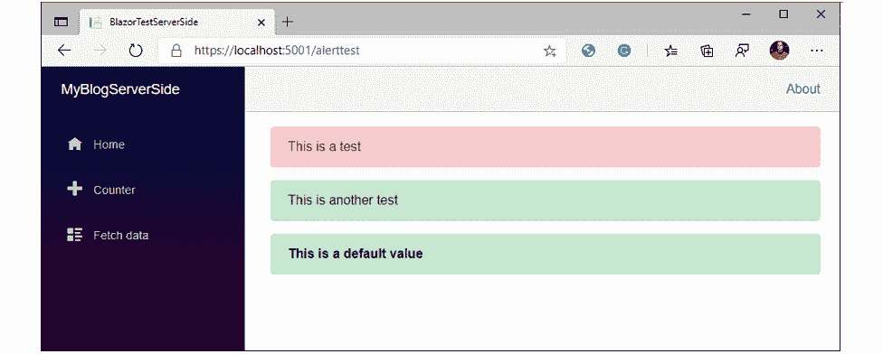
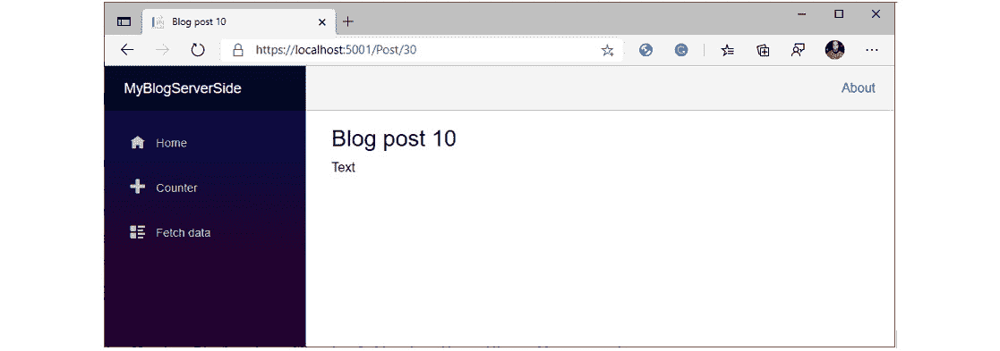

# 五、创建高级Blazor组件

在最后一章中，我们学习了创建组件的所有基础知识。在本章中，我们将学习如何将我们的组件提升到一个新的水平。

这一章将重点介绍一些将使我们的组件可重用的特性，这将使我们节省时间，并让我们了解如何使用他人制造的可重用组件。

我们还将了解一些内置组件，当您构建 Blazor 应用时，这些组件将通过添加额外的功能(与使用 HTML 标记相比)来帮助您。

在本章中，我们将涵盖以下主题:

*   探索绑定
*   添加`Actions`和`EventCallback`
*   使用`RenderFragment`
*   探索新的内置组件

# 技术要求

在本章中，您将开始构建您的组件。为此，您将需要我们在前面的 [*第 4 章*](04.html#_idTextAnchor060)*中开发的代码了解基本 Blazor 组件*。如果你已经按照前几章的说明去做了，那么你就可以走了。如果没有，请确保克隆/下载报告。本章的起点可以在`ch4`文件夹中找到，完成的章节可以在`ch5`中找到。

你可以在[https://github . com/PacktPublishing/Web-Development-wit-Blazor/tree/master/chapter 05](https://github.com/PacktPublishing/Web-Development-with-Blazor/tree/master/Chapter05)找到本章最终结果的源代码。

# 探索绑定

使用绑定，您可以连接组件内的变量(以便它自动更新)或通过设置组件属性。

在 Blazor 中，我们可以将值绑定到组件，有两种不同的方法可以做到这一点。

*   单向绑定
*   双向绑定

通过使用绑定，我们可以在组件之间发送信息，并确保我们可以在需要时更新一个值。

## 单向绑定

**单向绑定**是在 [*第四章*](04.html#_idTextAnchor060)*创建基本 Blazor 组件*中已经讲过的东西。让我们再次看看组件，并在本节中继续以它为基础。

在本节中，我们将结合参数和绑定。

`Counter.razor`的例子是这样的:

```cs
@page "/counter"
<h1>Counter</h1>
<p>Current count: @currentCount</p>
<button class="btn btn-primary" @onclick="IncrementCount">Click me</button>
@code {
    private int currentCount = 0;
    private void IncrementCount()
    {
        currentCount++;
    }
}
```

该组件将显示当前计数和增加当前计数的按钮。这是单向绑定，即使按钮可以改变，`currentcount`的值也只是单向流动。

由于这一部分旨在演示功能和理论，并且不是我们正在构建的已完成项目的一部分，因此您不必编写或运行这些代码。这些组件的源代码可以在 GitHub 上找到。

我们可以给`counter`组件添加一个参数。然后的代码会是这样的:

```cs
@page "/counterwithparameter"
<h1>Counter</h1>
<p>Current count: @CurrentCount</p>
<button class="btn btn-primary" @onclick="IncrementCount">Click me</button>
@code {
    [Parameter]
    public int IncrementAmount { get; set; } = 1;
    [Parameter]
    public int CurrentCount { get; set; } = 0;
    private void IncrementCount()
    {
        CurrentCount+=IncrementAmount;
    }
}
```

代码样本有两个参数，一个用于`CurrentCount`，一个用于`IncrementAmount`。通过给组件添加参数，我们可以改变它们的行为。这个样本当然有点傻。这样的组件可能不会有任何用处，但是它很好地说明了这个想法。

我们现在可以将该组件添加到另一个组件中。这是我们创建可重用组件并通过改变参数值来改变其行为的方法。

我们这样改变它的行为:

```cs
@page "/parentcounter"
<CounterWithParameter IncrementAmount="@incrementamount" CurrentCount="@currentcount"></CounterWithParameter>
The current count is: @currentcount
@code {
    int incrementamount = 10;
    int currentcount = 0;
}
```

在这个样本中，我们有两个变量，`incrementamount`和`currentcount`，我们将其传递到我们的`CounterWithParameter`组件中。

如果我们是来运行这个，我们会看到一个以`10`为增量计数的`counter`组件。然而，`currentcount`变量不会被更新，因为它只是单向绑定(单向)。

为了帮助我们做到这一点，我们可以实现双向绑定，这样我们的父组件将被告知任何更改。

## 双向绑定

**双向绑定**在两个方向绑定值。我们的`counter`组件将能够通知我们的父组件任何变化。在下一章 [*第六章*](06.html#_idTextAnchor093)*带验证的建筑形式*中，我们将更多地讨论双向绑定。

要使我们的`CounterWithParameter`组件在两个方向绑定，我们需要添加`EventCallback`。名称必须由参数名称后跟`Changed`组成。这样，如果值发生变化，Blazor 将确保更新该值。在我们的例子中，我们需要将其命名为`CurrentCountChanged`。代码如下所示:

```cs
[Parameter]
public EventCallback<int> CurrentCountChanged { get; set; }
private void IncrementCount()
{
    CurrentCount += IncrementAmount;
    CurrentCountChanged.InvokeAsync(CurrentCount);
}
```

仅仅通过使用这个命名约定，Blazor就知道`CurrentCountChanged`是当`CurrentCount`发生变化时将被触发的事件。

`EventCallback`不能为空，因此没有理由进行空检查(下一节将详细介绍)。

我们也需要改变我们倾听变化的方式:

```cs
<CounterWithParameterAndEvent IncrementAmount="@incrementamount" @bind-CurrentCount="currentcount"/>
```

我们需要在`CurrentCount`绑定之前添加`@bind-`。您也可以使用以下语法来设置事件的名称:

```cs
<CounterWithParameterAndEvent IncrementAmount="@incrementamount" @bind-CurrentCount="currentcount" @bind-CurrentCount:event="CurrentCountChanged"/>
```

通过使用`:event`，我们可以告诉 Blazor 我们到底要使用什么事件，在本例中是`CurrentCountChanged`事件。

在下一章 [*第 6 章*](06.html#_idTextAnchor093)*用验证*构建表单，我们将继续研究带有输入/表单组件的绑定。

当然，我们也可以使用`EventCallback`创建事件。

# 添加动作和事件回调

要沟通的变化，我们可以使用`EventCallback`，如*双向绑定*部分所示。`EventCallback<T>`与我们可能在. NET 中使用的稍有不同。`EventCallback<T>`是一个专为 Blazor 设计的类，能够将事件回调作为组件的参数公开。

英寸 NET 一般来说，可以给一个事件添加多个监听器(多投)，但是有了`EventCallback<T>`，就只能添加一个监听器(单投)。

值得一提的是，你当然可以用你习惯的方式使用事件.NET 也在 Blazor 中。然而，你可能想使用`EventCallback<T>`，因为使用`EventCallback`比传统的有很多优点.NET 事件。

.NET 事件使用类，`EventCallback`使用结构。这意味着在 Blazor 中，我们不需要在调用`EventCallback`之前执行空检查，因为结构不能为空。

`EventCallback`为异步，可以等待。调用`EventCallback`后，Blazor 会在消费组件上自动执行`StateHasChanged`，确保组件更新(如果需要更新)。

所以，如果需要多个监听器，可以使用`Action<T>`，否则应该使用`EventCallback<T>`。

有些事件类型有我们可以访问的事件参数。它们是可选的，所以在大多数情况下，您不需要添加它们。您可以通过在方法中指定它们来添加它们，也可以使用 lambda 表达式，如下所示:

```cs
<button @onclick="@((e)=>message=$"x:{e.ClientX} y:{e.ClientY}")">Click me</button>
```

`button`会将名为`message`的变量设置为包含鼠标坐标的字符串。λ有一个参数`e`，属于`MouseArgs`类型。但是，您不必指定类型。编译器理解参数的类型。

现在我们已经添加了动作并使用`EventCallback`来传达变更，我们将在下一节中看到如何执行`RenderFragment`。

# 使用渲染片段

为了使我们的组件更加可重用，我们可以为它们提供一段 Razor 语法。在 Blazor 中，可以指定`RenderFragment`，这是 Razor 语法的一个片段，可以执行和显示。

现在我们已经添加了动作并使用`EventCallback`来传达变更，我们将在下一节中看到如何执行`RenderFragment`。

渲染元素有两种类型，`RenderFragment`和`RenderFragment <T>`。`RenderFragment`只是一个没有任何输入参数的 Razor 片段，`RenderFragment <T>`有一个输入参数，您可以使用`context`关键字在 Razor 片段代码中使用。我们现在不会深入讨论如何使用这个，但是在本章后面的中，我们将讨论一个使用`RenderFragment<T>`的组件(`Virtualize`)，并且在下一章 [*第 6 章*](06.html#_idTextAnchor093)*使用验证构建表单*中，我们将使用`RenderFragments<T>`实现一个组件。

我们可以让 RenderFragment 成为组件标签内部的默认内容，并给它一个默认值。我们接下来将探讨这一点，并使用这些特性构建一个组件。

网格组件

如果你想更深入地挖掘渲染片段，请查看 Blazm Components，它有一个大量使用`RenderFragments<T>`的网格组件。在我目前工作的地方，我们使用这个组件，它是使用现实场景开发的。

你可以在 GitHub 这里找到:[https://github.com/EngstromJimmy/Blazm.Components](https://github.com/EngstromJimmy/Blazm.Components)。

## 儿童内容

通过命名渲染片段`ChildContent`，Blazor将自动使用提醒标签之间的任何内容作为内容。然而，这仅在使用单个渲染片段时有效；如果您使用多个标签，您还必须指定`ChildComponent`标签。

## 默认值

我们可以为`RenderFragment`提供一个默认值，或者使用`@`符号在代码中设置它:

```cs
@<b>This is a default value</b>;
```

## 构建警报组件

为了更好地理解如何使用渲染片段，让我们构建一个警报组件。内置模板正在使用 Bootstrap，因此我们将对该组件进行同样的操作。Bootstrap 有很多易于移植到 Blazor 的组件。当与多个开发人员一起处理大型项目时，构建组件是确保团队中的每个人都以相同的方式编写代码的一种简单方法。

让我们基于 Bootstrap 构建一个简单的警报组件:

1.  通过右键单击**我的博客服务器项目** | **添加** | **新文件夹**并命名文件夹`Components`来创建文件夹。
2.  右键单击**组件** | **添加** | **剃刀组件**并命名组件`Alert.razor`，创建新的剃刀文件。
3.  Replace the content with the following code in the `Alert.razor` file:

    ```cs
    <div class="alert alert-primary" role="alert">
        A simple primary alert—check it out!
    </div>
    ```

    代码取自 Bootstrap 的网页[http://getbootstrap.com](http://getbootstrap.com)，它显示了一个类似如下的警告:

    

    图 5.1–引导警报组件的默认外观

    我们可以通过两种方式定制这个`alert`组件。我们可以为消息添加一个`string`参数。然而，由于这是关于渲染片段的部分，我们只是要探索第二个选项，是的，你猜对了，渲染片段。

4.  Add a code section with a `RenderFragment` property called `ChildContent` and replace the alert text with the new property:

    ```cs
    <div class="alert alert-primary" role="alert">
        @ChildContent
    </div>
    @code{
        [Parameter]
        public RenderFragment ChildContent { get; set; }      =@<b>This is a default value</b>;
    }
    ```

    现在我们有了带有默认值的`RenderFragment`，并且我们正在显示`div`标签之间的片段。我们还想为中的不同方式添加`enum`，您可以在其中设置警告框的样式。

5.  在`code`部分，添加包含不同可用样式的【T1:

    ```cs
    public enum AlertStyle
    {
        Primary,
        Secondary,
        Success,
        Danger,
        Warning,
        Info,
        Light,
        Dark
    }
    ```

6.  为`enum`样式添加参数/属性:

    ```cs
    [Parameter]
    public AlertStyle Style { get; set; }
    ```

7.  最后一步是更新`div`的`class`属性。完整的文件如下所示。更改第一行的`class`属性:

    ```cs
    <div class="@($"alert alert-{Style.ToString().ToLower()}")" role="alert">
        @ChildContent
    </div>
    @code{
        [Parameter]
        public RenderFragment ChildContent { get; set; }      =@<b>This is a default value</b>;
        [Parameter]
        public AlertStyle Style { get; set; }
        public enum AlertStyle
        {
            Primary,
            Secondary,
            Success,
            Danger,
            Warning,
            Info,
            Light,
            Dark
        }
    }
    ```

8.  Right-click on the `Pages` folder, select **Add** | **Razor component**, and name it `AlertTest.razor`.

    用以下代码片段替换代码:

    ```cs
    @page "/alerttest"
    @using MyBlogServerSide.Components
    <Alert Style="Alert.AlertStyle.Danger">
        This is a test
    </Alert>
    <Alert Style="Alert.AlertStyle.Success">
        <ChildContent>
            This is another test
        </ChildContent>
    </Alert>
    <Alert Style="Alert.AlertStyle.Success"/>
    ```

    页面显示三个报警组件:

    第一个有`Danger`样式，我们没有指定为`This is a test`文本设置什么属性，但是按照惯例，它将使用名为`ChildContent`的属性。

    在第二个中，我们指定了`ChildContent`属性。如果您在组件中使用了更多的渲染片段，您将不得不像这样设置它们，使用全名。

    在最后一个示例中，我们没有指定任何内容，这将为属性提供我们在组件中指定的默认呈现片段。

9.  运行项目并导航至`/AlertTest`查看测试页面:



图 5.2–测试页面截图

我们已经完成了我们的第一个可重用组件！

创建可重用的组件是我更喜欢创建我的 Blazor 站点的方式，因为我不必两次编写相同的代码。如果你在一个更大的团队中工作，这一点会变得更加明显。这使得所有开发人员更容易生成相同的代码和最终结果，从而获得更高的代码质量和更少的测试。

和.NET 5 带来了一些我们以前没有的新组件。在下一节中，我们将深入探讨它们是什么以及如何使用它们。

# 探索新的内置组件

当 Blazor 第一次出现时，有一些事情很难做，在某些情况下，我们需要使用 JavaScript 来解决这个挑战。在这一节中，我们将看一看我们引入的一些新组件.NET 5。

我们将了解以下新组件或功能:

*   设置用户界面的焦点
*   影响 HTML 头部
*   组件虚拟化

## 设置用户界面的焦点

我的第一篇 Blazor 博客文章是关于如何将焦点放在一个 UI 元素上，但是现在这个被构建到框架中。之前的解决方案涉及 JavaScript 调用来改变用户界面元素的焦点。

通过使用`ElementReference`，您现在可以将焦点设置在元素上。

让我们构建一个组件来测试这个新特性的行为:

1.  右键点击`Pages`文件夹，选择**新增** | **剃须刀组件**，命名为`SetFocus.Razor`。
2.  打开`SetFocus.Razor`并添加`page`指令:

    ```cs
    @page "/setfocus"
    ```

3.  Add an element reference:

    ```cs
    @code {
        ElementReference textInput;
    }
    ```

    这正是它听起来的样子，对一个元素的引用。在这种情况下，它是一个输入文本框。

4.  Add the textbox and a button:

    ```cs
    <input @ref="textInput" />
    <button @onclick="() => textInput.FocusAsync()">Set focus</button>
    ```

    通过使用`@ref`，您可以指定对一个对象的引用，您可以使用该引用来访问输入框。`button onclick`方法将执行`FocusAsync()`方法，并将焦点设置在文本框上。

5.  按 *F5* 运行项目，然后导航至`/setfocus`。
6.  按下**设置焦点**按钮，注意文本框如何获得焦点。

这看起来像是一个愚蠢的例子，因为这只是设置了焦点，但这是一个非常有用的特性，并且`autofocus` HTML 属性对 Blazor 不起作用。

在我的博文中，我有另一种方法。我的目标是在不使用代码的情况下设置元素的焦点。在接下来的章节中， [*第 6 章*](06.html#_idTextAnchor093)*通过验证构建表单*，我们将从我的博客文章中实现`autofocus`功能，但使用新的.NET 特性。

的新版本.NET 5 解决了很多我们以前必须用 JavaScript 编写的东西；设置焦点是一个例子，影响 HTML 头是另一个例子。

## 影响 HTML 头部

有时候，我们想为我们的页面设置标题或者改变社交网络的元标签。`head`标签位于`index.html`(用于 WebAssembly)或`_host.cshtml`(用于服务器端)中，并且页面的该部分不被重新加载/重新渲染(仅应用组件内的组件被重新渲染)。在 Blazor 的早期版本中，您必须使用 JavaScript 自己编写代码。

酪 NET 有几个新的组件可以用来解决这个问题:

*   `Title`
*   `Link`
*   `Meta`

您只需要将这些组件添加到您的组件中，就可以更改标题、链接或元标签。

这项功能从未进入的最终版本.NET 5。它仍在预览中，但这是一个非常大的问题，所以我想把它保留在书中。

为了使用这些组件，我们将创建一个页面来查看我们的一篇博客文章。我们将使用我们学到的许多技术:

1.  首先我们需要添加对**微软的引用。组件扩展包。在**我的博客服务器**节点下的解决方案资源管理器中，右键单击**依赖项**并选择**管理 Nuget 包**。**
2.  搜索**微软。选择**，点击**安装**。该软件包仅在预览版可用，因此请确保选中**包含预发行的**选项。
3.  打开`Pages/Index.razor`。
4.  Change the `foreach` loop to look like this:

    ```cs
    <li><a href="/Post/@p.Id">@p.Title</a></li>
    ```

    我们在标题中添加了一个链接，这样我们就可以查看一篇博客文章。注意我们如何使用`href`属性中的`@`符号来获取帖子的 ID。

5.  右键点击`Pages`文件夹，选择**添加** | **剃须刀组件**，命名组件`Post.razor`。
6.  In the `code` section, add a parameter that will hold the ID of the post:

    ```cs
    [Parameter]
    public int BlogPostId { get; set; }
    ```

    这将保存来自网址的博客帖子的标识。

7.  Add a `page` directive to get the set, the URL, and the ID:

    ```cs
    @page "/post/{BlogPostId:int}"
    ```

    `page`指令会将我们博文的 URL 设置为`/post/`，后面跟着帖子的 ID。我们还指定了`BlogPostId`的类型是整数。如果 URL 包含非整数的内容，那么 Blazor 将找不到有问题的页面。

8.  We don't have to add a `using` statement to all our components. Instead, open `_imports.razor` and add the following namespaces:

    ```cs
    @using MyBlog.Data.Models;
    @using MyBlog.Data.Interfaces;
    @using Microsoft.AspNetCore.Components.Web.Extensions.Head
    ```

    这将确保我们构建的所有组件在默认情况下都会有这些名称空间。

9.  Open `Post.razor` again and, just beneath the page directive, inject the API (the namespace is now supplied from `_imports.razor`):

    ```cs
    @inject IMyBlogApi api
    @inject NavigationManager navman
    ```

    我们的应用编程接口现在将被注入到组件中，我们可以检索我们的博客文章。我们还可以访问导航管理器。

10.  In the `code` section, add a property for our blog post:

    ```cs
    public BlogPost BlogPost { get; set; }
    ```

    这将包含我们想要在页面上显示的博客文章。

11.  To load the blog post, add the following code:

    ```cs
    protected async override Task OnParametersSetAsync()
    {
        BlogPost=await api.GetBlogPostAsync(BlogPostId);
        await base.OnParametersSetAsync();
    }
    ```

    在这种情况下，我们使用`OnParameterSet()`方法。这只是为了确保我们从数据库中获取数据时设置了参数，以及确保参数更改时内容会更新。

12.  We also need to show the post and add the necessary meta tags. To do that, add the following code just above the code section:

    ```cs
    @if (BlogPost != null)
    {
        <Title Value="@BlogPost.Title"></Title>
        <Meta property="og:title"
          content="@BlogPost.Title" />
        <Meta property="og:description" content="@(new
          string(BlogPost.Text.Take(100).ToArray()))" />
        <Meta property="og:image" content=
          "@($"{navman.BaseUri}/pathtoanimage.png")" />
        <Meta property="og:url" content="@navman.Uri" />
        <Meta name="twitter:card" content="@(new
          string(BlogPost.Text.Take(100).ToArray()))" />
        <h3>@BlogPost.Title</h3>
        @((MarkupString)BlogPost.Text)
    }
    ```

    第一次加载页面时，`BlogPost`参数可以为空，所以我们首先需要检查是否应该显示内容。

    通过添加`Title`组件，Blazor 将我们网站的标题设置为，在这个例子中，我们博客文章的标题。

    根据我在**搜索引擎优化**上收集的信息，我们添加的元标签是脸书和推特最少的。我们没有每个博客帖子的图片，但是如果我们愿意，我们可以有一个全网站的图片(适用于所有博客帖子)。只需将`Pathtoanimage.png`改为图片名称，将图片放入`wwwroot`文件夹即可。

    如果博客文章被加载，那么显示一个`H3`标签，标题和下面的文本。你可能还记得 [*第四章*](04.html#_idTextAnchor060)*中的`MarkupString`了解基本Blazor组件*。这将从我们的博客文章中输出字符串，而不改变 HTML(不转义 HTML)。

13.  通过按下 *F5* 运行项目，并导航到一篇博客文章以查看标题更改:



图 5.3–博客文章截图

我们的博客开始成形了。我们有一个博客文章列表，我们可以查看一个博客文章；当然，我们还远未完成，但我们正在努力。

## 组件虚拟化

`Virtualize`是 Blazor 中的一个新组件，它将确保只渲染当前可见的组件或行。如果你有一个很大的项目列表，显示所有的项目会对记忆有很大的影响。许多第三方组件供应商提供具有相同虚拟化功能的网格组件。在我看来，这个组件是.NET 5 版本。

`Virtualize`组件将计算屏幕上可以容纳多少个项目(基于窗口的大小和项目的高度)。如果滚动页面，Blazor 会在内容列表前后添加一个`div`标签，确保滚动条显示的位置正确(即使没有渲染项目)。

`Virtualize`组件就像一个`foreach`循环一样工作。

以下是我们目前在`index.razor`文件中的代码:

```cs
<ul>
    @foreach (var p in posts)
    {
        <li><a href="/Post/@p.Id">@p.Title</a></li>
    }
</ul>
```

现在，它将在一个长列表中显示我们数据库中的所有博客文章。诚然，我们现在没有那么多，但有一天我们可能会有很多帖子。

我们可以通过将更改为以下内容来更改代码(暂时不要更改代码)以使用新的`Virtualize`组件:

```cs
<Virtualize Items="posts" Context="p">
        <li><a href="/Post/@p.Id">@p.Title</a></li>
</Virtualize>
```

代替`foreach`循环，我们使用`Virtualize`组件，并添加一个渲染片段，显示每个项目应该如何渲染。`Virtualize`组件使用`RenderFragment<T>`，默认情况下，它将向渲染片段发送一个类型为`T`的项目。在`Virtualize`组件的情况下，对象将是一篇博文(因为条目是博文的`List<T>`)。我们用名为`context`的变量访问每个帖子。但是，我们可以使用`Virtualize`组件上的`Context`属性来指定另一个名称，所以我们现在使用的不是`context`，而是`p`。

`Virtualize`组件甚至比这更强大，我们将在下一个实现的特性中看到:

1.  打开`Pages/Index.razor`。
2.  删除`OnInitializedAsync`方法和`protected List<BlogPost> posts = new List<BlogPost>();`我们不需要这个。
3.  Change the loading of the post to `Virtualize`:

    ```cs
    <ul>
        <Virtualize ItemsProvider="LoadPosts" Context="p">
            <li><a href="/Post/@p.Id">@p.Title</a></li>
        </Virtualize>
    </ul>
    ```

    在这种情况下，我们使用`ItemsProvider`委托，它将负责从我们的应用编程接口获取帖子。

    我们传入一个名为`LoadPosts`的方法，我们也需要将它添加到文件中。

4.  Now, let's add the `LoadPosts` method by adding the following code:

    ```cs
    public int totalBlogposts { get; set; }
    private async ValueTask<ItemsProviderResult<BlogPost>> LoadPosts(ItemsProviderRequest request)
    {
        if (totalBlogposts == 0)
        {
            totalBlogposts = await           api.GetBlogPostCountAsync();
        }
        var numblogposts = Math.Min(request.Count,
          totalBlogposts - request.StartIndex);
        var employees = await       api.GetBlogPostsAsync(numblogposts,        request.StartIndex);
        return new       ItemsProviderResult<BlogPost>(employees,        totalBlogposts);
    }
    ```

    我们添加了一个`totalBlogposts`属性，在这个属性中我们存储了我们数据库中当前有多少帖子。`LoadPost`方法用`ItemsProviderResult<Blogpost>`返回`ValueTask`。该方法有`ItemsProviderRequest`作为参数，其中包含`Virtualize`组件想要的帖子数量以及想要跳过的帖子数量。

    如果我们不知道总共有多少帖子，我们需要通过调用`GetBlogPostCountAsync`方法从我们的应用编程接口中检索这些信息。然后，我们需要弄清楚我们应该得到多少帖子；要么我们得到我们需要的尽可能多的帖子，要么我们得到所有剩余的帖子(无论哪个值最小)。

    然后，我们通过调用`GetBlogPostsAsync`调用我们的 API 来获取实际的帖子，并返回`ItemsProviderResult`。

现在我们已经实现了一个`Virtualize`组件，它将只加载和渲染填充屏幕所需的博客文章数量。

# 总结

在本章中，我们看了构建组件的更高级的场景。构建组件是 Blazor 的全部。组件还使得沿途进行更改变得容易，因为只有一个点需要实现更改。我们还实现了我们的第一个可重用组件，这将帮助我们在整个团队中保持相同的标准，并减少重复的代码。

我们还在中使用了一些新功能.NET 5 为 Blazor 加载和显示数据。

在下一章中，我们将查看表单和验证，以开始构建博客的管理部分。