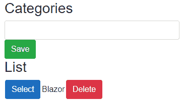
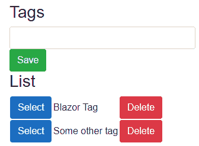
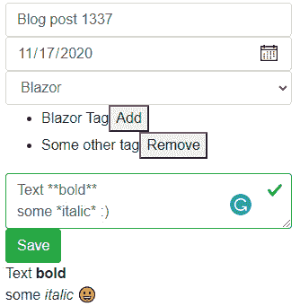

# *第六章*:通过验证构建表单

在这一章中，我们将学习创建表单并验证它们，这是一个很好的机会来构建我们的管理界面，在这里我们可以管理我们的博客文章。我们还将构建多个可重用组件，并了解中的一些新功能.NET 5 for Blazor。

这将会是一个超级有趣的篇章，我们会用到很多我们到现在学到的东西。

在本章中，我们将涵盖以下主题:

*   探索表单元素
*   添加验证
*   自定义验证类属性
*   构建管理界面

# 技术要求

确保您已经阅读了前面的章节，或者使用`Ch5`文件夹作为起点。

你可以在[https://github . com/PacktPublishing/Web-Development-wit-Blazor/tree/master/chapter 06](https://github.com/PacktPublishing/Web-Development-with-Blazor/tree/master/Chapter06)找到本章最终结果的源代码。

# 探索形态元素

HTML 中有很多表单元素，我们可以在 Blazor 中全部使用。最终，Blazor 将输出的是 HTML。

Blazor 确实有可以增加功能的组件，所以我们可以也应该尝试使用这些组件来代替 HTML 元素。这将免费为我们提供强大的功能；我们将在本章的稍后部分回到这一点。

Blazor 提供以下组件:

*   `EditForm`
*   `InputBase<>`
*   `InputCheckbox`
*   `InputDate<TValue>`
*   `InputNumber<TValue>`
*   `InputSelect<TValue>`
*   `InputText`
*   `InputTextArea`
*   `InputRadio`
*   `InputRadioGroup`
*   `ValidationMessage`
*   `ValidationSummary`

让我们从头到尾看一遍。

## 编辑表格

`EditForm`将渲染为`form`标签，但是它有更多的功能。

首先，我们不会有像传统`form`标签那样的动作或方法；布拉佐会处理所有的事情。

`EditForm`将创建一个`EditContext`实例作为级联值，这样您放入`EditForm`的所有组件都将访问相同的`EditContext`。`EditContext`将在编辑过程中跟踪元数据，例如哪些字段已被编辑，并跟踪任何验证消息。

您需要分配一个模型(您想要编辑的类)或一个`EditContext`实例。

对于大多数用例，分配一个模型是可行的方法，但是对于更高级的场景，你可能希望能够触发`EditContext.Validate()`，例如，验证所有连接到`EditContext`的控件。

`EditForm`有以下事件，您可以使用它们来处理表单提交:

*   `OnValidSubmit`在表单中的数据正确验证时被触发(我们稍后将回到验证)。
*   如果表单验证不正确，将触发`OnInvalidSubmit`。
*   `OnSubmit`在表单提交时触发，不管表单是否正确验证。如果您想自己控制验证，请使用`OnSubmit`。

我们来看一个例子。

考虑一个容纳一个人的类；该类有该人的姓名和年龄，如下所示:

```cs
public class Person
{
    public string Name { get; set; }
    public int Age { get; set; }
}
```

这个类的`EditForm`看起来是这样的(现在没有任何其他元素):

```cs
<EditForm Model="personmodel" OnValidSubmit="validSubmit">
    ...
    <button type="submit">Submit</button>
</EditForm>
@code {
    Person personmodel = new Person();
    private Task validSubmit()
    {
        //Do database stuff
        return Task.CompletedTask;
    }
}
```

`EditForm`指定为模型(本例中为`personmodel`)，我们正在收听对`OnValidSubmit`事件的报道。

**提交**按钮是一个普通的 HTML 按钮，不是特定的 Blazor 组件。

## 输入基地< >

所有的 Blazor 输入类都来自`InputBase`类。它有一堆我们可以用来做所有`input`组件的东西；我们将经历最重要的。

`InputBase`处理`AdditionalAttributes`，这意味着如果我们在标签中添加任何其他属性，它们将自动转移到输出中。这意味着从这个类派生的组件可以利用任何 HTML 属性，因为它们将是输出的一部分。

`InputBase`有`Value`的属性，我们可以绑定到这个属性，还有一个值改变时的事件回调，叫做`ValueChanged`。

我们还可以更改`DisplayName`，这样自动验证消息将反映正确的名称，而不是属性的名称，这是默认行为。

并非所有控件都支持`DisplayName`属性。有些属性只在组件内部使用，稍后我们将回到这些属性。

## InputCheckbox

`InputCheckbox`组件将渲染为`<input type="checkbox">`。

## InputDate < TValue >

`InputDate`组件将渲染为`<input type="date">`。我们可以使用`DateTime`和`DateTimeOffset`作为`InputDate`组件的值。

没有可以格式化日期；它将使用 web 浏览器的当前设置。这个行为是设计好的，是 HTML5 规范的一部分。

## 输入号 < T 值 >

`InputNumber`组件将渲染为`<input type="number">`。我们可以使用`Int32`、`Int64`、`Single`、`Double`和`Decimal`作为`InputNumber`组件的值。

## InputSelect < TValue >

`InputSelect`组件将渲染为`<select>`。我们将在本章的后面创建`InputSelect`，所以我在此不再赘述。

## 输入文本

`InputText`组件将渲染为`<input type="text">`。

## InputTextArea

`InputSelect`组件将渲染为`<textarea>`。在本章中，我们将构建我们自己版本的这个控件。

## 输入辐射

`InputRadio`组件会将渲染为`<input type="radio">`。

## 输入组

`InputRadioGroup`组件会将渲染为`<Input type="radio">`。

正如我们所看到的，几乎所有的 HTML 表单控件都有一个 Blazor 组件，它带有一些附加的功能，比如验证，我们将在下一节中看到。

# 添加验证

我们已经谈到了验证的问题；在`input`组件和`EditForm`中有一些内置的功能来处理验证。

在我们的表单中添加验证的一种方法是使用`DataAnnotations`。通过使用数据标注，我们不需要编写任何自定义逻辑来确保表单中的数据是正确的；相反，我们可以给数据模型添加属性，让`DataAnnotationsValidator`来处理剩下的事情。

里面有一堆`DataAnnotations`的实例.NET 已经可以使用了；我们也可以构建自己的注释。

一些内置数据注释如下:

*   `Required`:使字段成为必填字段
*   `Email`:将检查输入的值是否为电子邮件地址
*   `MaxLength`:将检查字符数是否超出
*   `Range`:将检查数值是否在一定范围内

还有更多注释可以帮助我们验证数据。为了测试这一点，让我们向数据类添加数据注释:

1.  在`MyBlog.Data`项目中，打开`Models/BlogPost.cs`。
2.  在文件顶部，添加对`System.ComponentModel.DataAnnotations` :

    ```cs
    using System.ComponentModel.DataAnnotations;
    ```

    的引用
3.  Add the `Required` and `MinLength` attributes to the `Title` property:

    ```cs
    [Required]
    [MinLength(5)]
    public string Title { get; set; }
    ```

    `Required`属性将确保我们不能将标题留空，`MinLength`将确保它至少有`5`字符:

4.  Add the `Required` attribute to the `Text` property:

    ```cs
    [Required]
    public string Text { get; set; }
    ```

    `Required`属性将确保`Text`属性不能为空，这是有道理的——我们为什么要创建一个空的博文？

5.  打开`Models/Category.cs`，在文件顶部添加对`System.ComponentModel.DataAnnotations`的引用。
6.  Add the `Required` attribute to the `Name` property:

    ```cs
    [Required]
    public string Name { get; set; }
    ```

    `Required`属性将确保我们不能将名称留空。

7.  打开`Models/Tag.cs`，在文件顶部添加对`System.ComponentModel.DataAnnotations`的引用。
8.  Add the `Required` attribute to the `Name` property:

    ```cs
    [Required]
    public string Name { get; set; }
    ```

    `Required`属性将确保我们不能将名称留空。

太好了，现在我们的数据模型内置了验证功能。我们需要给我们的用户反馈验证出了什么问题。

我们可以通过使用`ValidationMessage`或`ValidationSummary`组件来做到这一点。

## 验证消息

`ValidationMessage`组件可以为我们显示特定属性的单独错误信息。我们想使用这个组件来显示表单元素下的验证错误。

要添加一个`ValidationMessage`组件，我们必须用我们想要显示验证错误的属性名称来指定`For`属性:

```cs
<ValidationMessage For="@(() => model.Name)"/> 
```

## 有效性摘要

`ValidationSummary`组件将所有验证错误显示为整个`EditContext`的列表。

我更喜欢显示问题附近的错误，这样用户就能清楚问题在哪里。但是我们也可以选择使用`ValidationSummary`将验证错误显示为列表。

为了确保我们的输入控件与 Bootstrap 主题(或者我们可能使用的任何主题)相匹配，我们可以创建自己的自定义验证类。

# 自定义验证类属性

只需使用编辑表单、输入组件和`DataAnnotationValidator`，框架将在组件有效和无效时自动向组件添加类。

默认情况下，这些类是`.valid`和`.invalid`。英寸 NET 5 中，我们可以自己定制这些类名。

使用 Bootstrap 时，默认类名为`.is-valid`和`.is-invalid`，类名也必须有`.form-control`才能获得正确的样式。

我们接下来要构建的组件将帮助我们在所有表单组件上获得正确的 Bootstrap 样式。

我们将创建自己的`FieldCssClassProvider`来定制 Blazor 将使用的类:

1.  在`MyBlogServerSide`项目中，右键点击`Components`文件夹，选择**添加类**，命名类`BootstrapFieldCssClassProvider`。
2.  Open the new class and add the following code:

    ```cs
    using Microsoft.AspNetCore.Components.Forms;
    using System.Linq;
    namespace MyBlogServerSide.Components
    {
        public class BootstrapFieldCssClassProvider :      FieldCssClassProvider
        {
            public override string GetFieldCssClass           (EditContext editContext, in FieldIdentifier              fieldIdentifier)
            {
                var isValid =               !editContext.GetValidationMessages                 (fieldIdentifier).Any();
                var isModified =              editContext.IsModified(fieldIdentifier);
                return (isModified, isValid) switch
                {
                    (true, true) => "form-control modified
                      is-valid",
                    (true, false) => "form-control
                      modified is-invalid",
                    (false, true) => "form-control",
                    (false, false) => "form-control"
                };
            }
        }
    }
    ```

    `BootstrapFieldCssClassProvider`需要一个`EditContext`实例才能工作。

    代码将检查表单(具体来说是`EditContext`)是否有效，是否被修改过。基于此，它返回正确的 CSS 类。

    返回所有元素的表单控件；这样，我们就不必将它添加到表单的每个元素中。我们可以验证一个未被修改的表单是否有效，但是我们不希望它仅仅因为还没有被修改就显示表单是好的。

3.  We need to get the `EditContext` instance from our `EditForm` and then set `FieldCssClassProvider` on `EditContext` as follows:

    ```cs
    CurrentEditContext.SetFieldCssClassProvider(provider);
    ```

    接下来，我们将以更优雅的方式(以我的拙见)用我们接下来将创建的`CustomCssClassProvider`来做这件事。

本章前面我提到`EditForm`正在将其`EditContext`暴露为`CascadingValue`。

这意味着我们将构建一个组件，我们可以将它放入我们的`EditForm`中，并以这种方式访问`EditContext`:

1.  在`MyBlogServerSide`项目中，右键点击`Components`文件夹，选择**添加类**，命名类`CustomCssClassProvider`。
2.  Open the new file and add the following code:

    ```cs
    using Microsoft.AspNetCore.Components;
    using Microsoft.AspNetCore.Components.Forms;
    using System;
    namespace MyBlogServerSide.Components
    {
        public class CustomCssClassProvider<ProviderType>:      ComponentBase where ProviderType:        FieldCssClassProvider,new()
        {
            [CascadingParameter]
            EditContext? CurrentEditContext { get; set; }
            public ProviderType Provider { get; set; } =          new ProviderType();
            protected override void OnInitialized()
            {
                if (CurrentEditContext == null)
                {
                   throw new InvalidOperationException
                    ($"{nameof(DataAnnotationsValidator)}                  requires a cascading " +                 $"parameter of type                   {nameof(EditContext)}.                     For example, you can use                     {nameof(DataAnnotationsValidator)}" +                 $"inside an EditForm.");
                }
               CurrentEditContext.SetFieldCssClassProvider
                (Provider);
            }
        }
    }
    ```

    这是一个接受`type`值的通用组件，在本例中，是`Provider`的类型。

    我们规定`type`必须从`FieldCssClassProvider`继承，并且必须有一个不带参数的构造函数。

    该组件继承自`ComponentBase`，这使得将该组件放入 Blazor 组件成为可能。

    我们有一个`Cascading`参数，将从`EditForm`开始填充。如果由于某种原因`EditContext`丢失，我们抛出一个异常(例如，如果我们将组件放在`EditForm`之外)。

    最后，我们将`FieldCssClassProvider`设置为`EditContext`。

要使用该组件，我们只需在我们的`EditForm`中添加以下代码(别担心，我们很快就会创建一个`EditForm`:

```cs
<CustomCssClassProvider ProviderType="BootstrapFieldCssClassProvider"/>
```

我们只需为我们的`CustomCssClassProvider`组件提供正确的`ProviderType BootstrapFieldCssClassProvider`。

现在，我们有一个组件将使我们的表单控件看起来像 Bootstrap 控件。接下来，是时候将它付诸实践，通过构建我们的管理界面来创建几个表单了。

# 构建管理界面

现在是时候为我们的博客建立一个简单的管理界面了。

我们需要能够做到以下几点:

*   列出类别
*   编辑类别
*   列表标签
*   编辑标签
*   列出博客文章
*   编辑博客文章

如果我们看看前面的列表，我们可能会注意到一些事情看起来很相似——也许我们可以为它们构建组件。类别和标签非常相似；他们有名字，名字是我们唯一能编辑的东西。

让我们为此制作一个组件。组件将负责列出、添加、删除和更新对象。

由于我们使用的对象是`Category`或`Tag`，我们需要能够根据对象调用不同的 API，因此我们的组件需要是通用的:

1.  在`MyBlogServerSide`项目中，右键点击`Components`文件夹，选择**添加** | **剃须刀组件**，然后命名组件`ItemList.razor`。
2.  Open the newly created file and in the `code` section, add the following lines of code:

    ```cs
    [Parameter]
    public List<ItemType> Items { get; set; } = new List<ItemType>();
    [Parameter]
    public RenderFragment<ItemType> ItemTemplate { get; set; }
    ```

    我们需要两个参数:一个我们可以添加所有项目的列表和一个`ItemTemplate`实例，我们可以用它来改变我们想要项目的显示方式。

    在这种情况下，我们使用`RenderFragment<T>`，这将使我们能够访问模板内部的项目(一旦我们实现它，事情就会变得更加清楚)。

3.  We also need a couple of events; add the following code to the `code` section:

    ```cs
    [Parameter]
    public EventCallback<ItemType> DeleteEvent { get; set; }
    [Parameter]
    public EventCallback<ItemType> SelectEvent { get; set; }
    ```

    我们增加了两个事件；首先是当我们删除一个标签或一个类别时。我们将向父组件发送事件，在那里我们可以添加删除该项所需的代码。

    第二种是当我们选择一个项目时，我们可以编辑该项目。

4.  Now it's time to add the UI; replace `<h3>ItemList<h3>` with the following code at the top of the file:

    ```cs
    @typeparam ItemType
    @using System.Collections.Generic
    <h3>List</h3>
    <table>
        <Virtualize Items="@Items" Context="item">
            <tr>
                <td><button class="btn btn-primary"              @onclick="@(()=>                {SelectEvent.InvokeAsync(item); })">                  Select</button>
                 </td>
                <td>@ItemTemplate(item)</td>
                <td><button class="btn btn-danger"              @onclick="@(()=>               {DeleteEvent.InvokeAsync(item);})">                 Delete</button>
                </td>
            </tr>
        </Virtualize>
    </table>
    ```

    带`@typeparam`的第一行是让组件通用，持有通用类型的变量叫做`ItemType`。

    如果我们回顾*第 2 步*，我们会注意到我们使用了列表和`RenderFragment`的变量。

    然后，我们使用新的`Virtualize`组件来列出我们的项目；平心而论，我们可能没有那么多类别或标签，但为什么不在可能的情况下使用它呢？我们将`Items`属性设置为`"Items"`(这是我们列表的名称)，将`Context`参数设置为`"item"`。

    我们可以给它取任何我们想要的名字；我们将只在`Virtualize`渲染模板内部使用它。

    我们添加了两个按钮，简单地调用我们在*步骤 3* 中添加的`EventCallback`实例。在那些按钮之间，我们增加了`@ItemTemplate(item)`；我们希望 Blazor 渲染模板，但我们也在循环中发送当前项目。

    这意味着我们可以访问模板中项目的值。

## 列表和编辑类别

有了我们的新组件，现在是时候创建一个组件来列出和编辑我们的类别了。

1.  在`MyBlogServerSide`项目中，右键点击`Pages`文件夹，选择**添加** | **新文件夹**，命名文件夹`Admin`。
2.  右键点击`Pages/Admin`文件夹，选择**添加** | **剃须刀组件**，然后命名组件`CategoryList.razor`。
3.  At the top of the component, replace `<h3>CategoryList</h3>` with the following code:

    ```cs
    @page "/admin/categories"
    @using MyBlogServerSide.Components
    @inject IMyBlogApi api
    <h3>Categories</h3>
    ```

    我们从`@page`指令开始，告诉 Blazor 如果我们导航到 URL `"admin/categories"`，我们将到达`CategoryList.Razor`组件。

    我们将添加一个`using`语句，然后注入我们的 API。

4.  The next step is to add a form where we can edit the categories. Add the following code under the code from the previous step:

    ```cs
    <EditForm OnValidSubmit="Save" Model="Item">
        <DataAnnotationsValidator />
        <CustomCssClassProvider       ProviderType="BootstrapFieldCssClassProvider" />
        <InputText @bind-Value="@Item.Name" />
        <ValidationMessage For="@(()=>Item.Name)" />
        <button class="btn btn-success"      type="submit">Save</button>
    </EditForm>
    ```

    我们添加了`EditForm`，如果表单验证通过，将执行`Save`方法。为了验证，我们添加了`DataAnnotationsValidator`，它将根据我们添加到`Tag`和`Category`类的注释来验证所提供的数据。

    由于我们正在使用 Bootstrap，我们希望我们的表单控件看起来相同，所以我们添加了我们在本章前面创建的`CustomCssClassProvider`。

    我们添加了`InputText`并将其连接到一个名为`Item`的`Category`对象(我们稍后将添加该对象)。

    在下面，我们添加了`ValidationMessage`，这将显示名称属性的任何错误，然后一个**提交**按钮。

5.  Now it's time to add our `ItemList` component; under the code we added in the previous step, add this code:

    ```cs
    <ItemList Items="Items" DeleteEvent="@Delete" SelectEvent="@Select" ItemType="Category">
        <ItemTemplate>
            @{
                var item = context as Category;
                if (item != null)
                {
                    @item.Name;
                }
            }
        </ItemTemplate>
    </ItemList>
    ```

    我们添加了我们的组件，并将`Items`属性绑定到一个项目列表(我们将在下一步创建该列表)。

    我们将`Select`和`Delete`事件绑定到方法，并在`ItemType`属性中指定列表的类型。然后，我们有`ItemTemplate`。由于我们正在使用`RenderFragment<T>`，我们现在可以访问一个名为`context`的变量。

    我们将该变量转换为一个类别，并打印出类别的名称。这是将在列表中显示的每个项目的模板。

6.  Finally, we add the following code to the `code` section:

    ```cs
    @code {
        private List<Category> Items { get; set; } = new       List<Category>();
        public Category Item { get; set; } = new Category();
        protected async override Task OnInitializedAsync()
        {
            Items = await api.GetCategoriesAsync();
            await base.OnInitializedAsync();
        }
        private async Task Delete(Category category)
        {
            try
            {
                await api.DeleteCategoryAsync(category);
                Items.Remove(category);
            }
            catch { }
        }
        private async Task Save()
        {
            try
            {
                if (Item.Id == 0)
                {
                    Items.Add(Item);
                }
                await api.SaveCategoryAsync(Item);
                Item = new Category();
            }
            catch { }
        }
        private Task Select(Category category)
        {
            try
            {
                Item = category;
            }
            catch { }
            return Task.CompletedTask;
        }
    }
    ```

    我们添加了一个保存所有类别的列表和一个保存一个项目(当前正在编辑的项目)的变量。我们使用`OnInitializedAsync`从 API 加载所有的类别。

    `Delete`和`Save`方法只是调用 API 对应的方法，`Select`方法获取提供的项并将其放入项变量(准备编辑)。

7.  运行项目，导航至`/admin/categories`。
8.  尝试添加、编辑、删除一个类别，如图*图 6.1* :



图 6.1–编辑类别视图

现在我们也需要一个用于列出和编辑标签的组件——这几乎是一回事，但是我们需要使用`Tag`而不是`Category`。

## 列表和编辑标签

我们刚刚创建了一个用于列出和编辑**类别**的组件，现在我们需要创建一个用于列出和编辑**标签**的组件。

1.  右键点击`Pages/Admin`文件夹，选择**添加** | **剃须刀组件**，然后命名组件`TagList.razor`。
2.  At the top of the component, replace `<h3>TagList</h3>` with the following code:

    ```cs
    @page "/admin/tags"
    @using MyBlogServerSide.Components
    @inject IMyBlogApi api
    <h3>Tags</h3>
    ```

    我们从`@page`指令开始，该指令告诉 Blazor，如果我们导航到 URL `"admin/tags"`，我们将到达`TagList.Razor`组件。

    我们添加一个`using`语句，然后注入我们的 API。

3.  The next step is to add a form where we can edit the tags. Add the following code under the code from the previous step:

    ```cs
    <EditForm OnValidSubmit="Save" Model="Item">
        <DataAnnotationsValidator />
        <CustomCssClassProvider
          ProviderType="BootstrapFieldCssClassProvider" />
        <InputText @bind-Value="@Item.Name" />
        <ValidationMessage For="@(()=>Item.Name)" />
        <button class="btn btn-success"      type="submit">Save</button>
    </EditForm>
    ```

    我们添加了`EditForm`，如果表单验证通过，将执行`Save`方法。为了验证，我们添加了`DataAnnotationsValidator`，它将根据我们添加到`Tag`和`Category`类的注释来验证所提供的数据。

    由于我们正在使用 Bootstrap，我们希望我们的表单控件看起来相同，所以我们添加了`CustomCssClassProvider`，这是我们在本章前面创建的。

    我们添加了`InputText`并将其连接到一个名为`Item`的`Tag`对象(稍后我们将添加该对象)。

    下面，我们添加一个`ValidationMessage`实例，它将显示名称属性的任何错误，然后添加一个**提交**按钮。

4.  Now it's time to add our `ItemList` component. Under the code we added in the previous step, add this code:

    ```cs
    <ItemList Items="Items" DeleteEvent="@Delete" SelectEvent="@Select" ItemType="Tag">
        <ItemTemplate>
            @{
                var item = context as Tag;
                if(item!=null)
                {
                @item.Name;
                }
            }
        </ItemTemplate>
    </ItemList>
    ```

    我们添加了我们的组件，并将`Items`属性绑定到一个项目列表(我们将在下一步创建该列表)。我们将`Select`和`Delete`事件绑定到方法，并在`ItemType`属性中指定`List`的类型。

    然后我们有`ItemTemplate`；由于我们正在使用`RenderFragment<T>`，我们现在可以访问一个名为`context`的变量。我们将这个变量转换成一个标签，并打印出标签的名称。

    这是将在列表中显示的每个项目的模板。

5.  Finally, we add the following code under the `code` section:

    ```cs
    @code {
        private List<Tag> Items { get; set; } = new       List<Tag>();
        public Tag Item { get; set; } = new Tag();
        protected async override Task OnInitializedAsync()
        {
            Items = await api.GetTagsAsync();
            await base.OnInitializedAsync();
        }
        private async Task Delete(Tag tag)
        {
            try
            {
                await api.DeleteTagAsync(tag);
                Items.Remove(tag);
            }
            catch { }
        }
        private async Task Save()
        {
            try
            {
                if (Item.Id == 0)
                {
                    Items.Add(Item);
                }
                await api.SaveTagAsync(Item);
                Item = new Tag();
            }
            catch { }
        }
        private Task Select(Tag tag)
        {
            try
            {
                Item = tag;
            }
            catch { }
            return Task.CompletedTask;
        }
    }
    ```

    我们添加了一个保存所有标签的列表和一个保存一个项目(当前正在编辑的项目)的变量。我们使用`OnInitializedAsync`从 API 加载所有标签。

    `Delete`和`Save`方法只需调用 API 的相应方法，`Select`方法获取提供的项目并将其放入`Item`变量(准备编辑)。

6.  运行项目，导航至`/admin/tags`。
7.  尝试添加、编辑、删除标签，如图*图 6.2* :



图 6.2–编辑标签视图

现在我们只剩下两件事:我们需要列出和编辑博客文章的方法。

## 列出并编辑博文

让我们从列出和编辑博文开始:

1.  右键点击`Pages/Admin`文件夹中的，选择**添加** | **剃须刀组件**，命名组件`BlogPostList.razor`。
2.  At the top of the `BlogPostList.razor` file, replace `<h3>BlogPostList</h3>` with the following code:

    ```cs
    @page "/admin/blogposts"
    @inject IMyBlogApi api
    <a href="/admin/blogposts/new">New blog post</a>
    <ul>
        <Virtualize ItemsProvider="LoadPosts" Context="p">
            <li>@p.PublishDate 
             <a href="/admin/blogposts/@p.Id">@p.Title</a>
            </li>
        </Virtualize>
    </ul>
    ```

    我们添加了一个页面指令，注入了我们的 API，并使用`Virtualize`组件列出了博客文章。

    我们还将这些帖子链接到一个带有博客帖子的`Id`实例的网址。

3.  Replace the `code` section with the following code:

    ```cs
    @code{
        public int TotalBlogposts { get; set; }
        private async ValueTask<ItemsProviderResult<BlogPost>>        LoadPosts(ItemsProviderRequest request)
        {
            if (TotalBlogposts == 0)
            {
                TotalBlogposts = await
                  api.GetBlogPostCountAsync();
            }
            var numblogposts = Math.Min(request.Count,          TotalBlogposts - request.StartIndex);
            var posts = await           api.GetBlogPostsAsync(numblogposts,
              request.StartIndex);
            return new ItemsProviderResult<BlogPost>(posts,             TotalBlogposts);
        }
    }
    ```

    我们添加了一个可以从数据库加载帖子的方法。该代码与我们在**索引**页面上的代码相同。现在这一章只剩下一件事:添加我们可以编辑博文的页面。

    一种非常流行的写博文的方式是使用 Markdown 我们的博客引擎将支持这一点。既然布拉佐支持任何.NET 标准 dll，我们将添加一个名为`Markdig`的现有库。

    这与微软用于其文档站点的引擎相同。

我们可以用不同的扩展来扩展`Markdig`(就像微软所做的那样)，但是让我们保持简单，只添加对 Markdown 的支持，而不添加所有花哨的扩展:

1.  在`MyBlogServerSide`项目下，右键单击解决方案资源管理器中的**依赖关系**节点，并选择**管理 NuGet 包**。
2.  Search for `Markdig` and click **Install** as shown in *Figure 6.3*:

    

    图 6.3–添加数字获取对话框

3.  右键单击`components`文件夹中的，选择**添加** | **类**，然后命名组件`InputTextAreaOnInput.cs`。
4.  Open the new file and add the following code:

    ```cs
    using System.Diagnostics.CodeAnalysis;
    using Microsoft.AspNetCore.Components.Rendering;
    namespace Microsoft.AspNetCore.Components.Forms
    {
        public class InputTextAreaOnInput :
         InputBase<string?>
        {
            protected override void           BuildRenderTree(RenderTreeBuilder builder)
            {
                builder.OpenElement(0, "textarea");
                builder.AddMultipleAttributes(1,              AdditionalAttributes);
                builder.AddAttribute(2, "class",              CssClass);
                builder.AddAttribute(3, "value",             BindConverter.FormatValue(CurrentValue));
                builder.AddAttribute(4, "oninput",              EventCallback.Factory.CreateBinder                <string?>(this, __value =>                  CurrentValueAsString = __value,                   CurrentValueAsString));
                builder.CloseElement();
            }
            protected override bool           TryParseValueFromString(string? value,             out string? result, [NotNullWhen(false)]               out string? validationErrorMessage)
            {
                result = value;
                validationErrorMessage = null;
                return true;
            }
        }
    }
    ```

    前面的代码取自微软的 GitHub 资源库；这就是他们如何实现`InputTextArea`组件。

    在他们的构建系统中，他们不能处理`.razor`文件，所以这就是他们以这种方式实现代码的原因。这个文件只有一处改动，那就是`oninput`，用来表示`OnChange`。

    对于大多数情况来说，`OnChange`就可以了，这意味着当我离开文本框时，值将被更新(并触发验证)。但是在我们的例子中，我们希望实时更新 HTML 的预览，这就是为什么我们必须实现自己的预览。

    一种选择可能是不使用`InputTextArea`组件，而是使用`TextArea`标签，但是这样我们就会丢失验证高亮。如果我们需要定制输入控件上的行为，这就是我们要走的路。

    如果你打算对实现进行大量的修改，我建议使用`.razor`文件而不是`.cs`文件。

5.  右键点击`Pages/Admin`文件夹中的，选择**添加** | **剃须刀组件**，命名组件`BlogPostEdit.razor`。
6.  At the top of the `BlogPostEdit.razor` file, replace `<h3>BlogPostEdit</h3>` with the following code:

    ```cs
    @page "/admin/blogposts/new"
    @page "/admin/blogposts/{Id:int}"
    @inject IMyBlogApi api
    @inject NavigationManager manager
    @using MyBlogServerSide.Components
    @using Markdig;
    ```

    我们添加了两个不同的`page`指令，因为我们希望能够创建一个新的博文，并提供一个 ID 来编辑一个已经存在的博文。如果我们不提供标识，`Id`参数将是`null`(或默认值)。

    我们注入了我们的 API 和`NavigationManager`以及添加`using`语句。

7.  Now we need to add the form; add the following code:

    ```cs
    <EditForm Model="Post" OnValidSubmit="SavePost">
        <DataAnnotationsValidator />
        <CustomCssClassProvider      ProviderType="BootstrapFieldCssClassProvider" />
        <InputText @bind-Value="Post.Title"></InputText>
        <InputDate @bind-Value="Post.PublishDate">      </InputDate>
        <InputSelect @bind-Value="selectedCategory">
            <option value="0" disabled>None selected
              </option>
            @foreach (var category in Categories)
        {
        <option value="@category.Id">@category.Name </option>
    }
        </InputSelect>
        <ul>
            @foreach (var tag in Tags)
            {
            <li>
                @tag.Name
                @if (Post.Tags.Any(t => t.Id == tag.Id))
                {
                    <button type="button" @onclick="@(() => {                    Post.Tags.Remove(Post.Tags.Single                     (t=>t.Id==tag.Id)); })">Remove                 </button>
                }
                else
                {
                    <button type="button" @onclick="@(()                  => { Post.Tags.Add(tag); })">Add                 </button>
                }
            </li>
            }
        </ul>
            <InputTextAreaOnInput @bind-Value="Post.Text"          @onkeyup="UpdateHTML">        </InputTextAreaOnInput>
            <button type="submit" class="btn btn-success">                     Save</button>
        </EditForm>
    ```

    我们添加`EditForm`，当提交表单时(如果有效)，我们执行`SavePost`方法。我们添加`DataAnnotationValidator`，它将根据类中的数据注释来验证我们的模型。

    我们添加`customCssClassProvider`以便获得正确的 Bootstrap 类名。然后，我们为标题、发布日期、类别、标签以及最后但同样重要的文本(博客文章的内容)添加框。

    最后，我们使用我们在*步骤 4* 中创建的组件(每次按键都会更新的组件)添加文本。

    我们还连接了`@onkeyup`事件，这样我们就可以更新每次按键的预览。

8.  我们也需要添加我们的`SavePost`方法。在`code`部分添加以下代码:

    ```cs
    public async Task SavePost()
    {
        if (selectedCategory != 0 && Categories != null)
        {
            var category = Categories.FirstOrDefault(c =>          c.Id == selectedCategory);
            if (category != null)
            {
                Post.Category = category;
            }
        }
        await api.SaveBlogPostAsync(Post);
        manager.NavigateTo("/admin/blogposts");
    }
    ```

9.  Now it's time to show the preview. Add the following code just below `EditForm`:

    ```cs
    @((MarkupString)markDownAsHTML)
    ```

    我们使用`MarkupString`来确保 Blazor 在不转义字符的情况下输出 HTML 代码。你可能还记得第 4 章[](04.html#_idTextAnchor060)**了解基本布拉佐组件*中的内容。*

**   We also need some variables. Add the following code in the `code` section:

    ```cs
    [Parameter]
    public int? Id { get; set; }
    BlogPost Post { get; set; } = new BlogPost();
    List<Category>? Categories { get; set; }
    List<Tag>? Tags { get; set; }
    int selectedCategory = 0;
    string? markDownAsHTML { get; set; }
    ```

    我们为博客帖子的 ID 添加了参数(如果我们想编辑一个)，一个变量来保存我们正在编辑的帖子，一个保存所有类别，一个保存所有标签。我们还添加了一个保存当前选择的类别的变量和一个保存转换为 HTML 的标记的变量。

    *   Now it is time to set up `Markdig`. Add the following code somewhere in the `code` section:

    ```cs
    MarkdownPipeline pipeline;
    protected override Task OnInitializedAsync()
    {
        pipeline = new MarkdownPipelineBuilder()
                 .UseEmojiAndSmiley()
                 .Build();
        return base.OnInitializedAsync();
    }
    ```

    要配置`Markdig`，我们需要创建一个管道。正如我在本章前面提到的，这是微软用于其文档站点的引擎。它有许多扩展可用，包括源代码突出显示和表情符号。

    为了让它更有趣一点，我们还在管道中添加了表情符号。

    *   我们还需要添加代码来加载数据(博客文章、类别和标签)。在`code`部分增加以下方法:

    ```cs
    protected void UpdateHTML()
    {
        markDownAsHTML =      Markdig.Markdown.ToHtml(Post.Text, pipeline);
    }
    bool hasTag(MyBlog.Data.Models.Tag tag)
    {
        return Post.Tags.Contains(tag);
    }
    protected override async Task OnParametersSetAsync()
    {
        if (Id != null)
        {
            Post = await api.GetBlogPostAsync(Id.Value);
            if (Post.Category != null)
            {
               selectedCategory = Post.Category.Id;
            }
            UpdateHTML();
        }
        Categories = await api.GetCategoriesAsync();
        Tags = await api.GetTagsAsync();
        base.OnParametersSet();
    }
    ```

    *   Now run the site, navigate to `/admin/blogposts`, click on a blog post to edit it, and test the new Markdown support. *Figure 6.4* shows the edit page with Markdown support:

    

    图 6.4–支持降价的编辑页面

    我们还有一件事要做:我们需要确保博文页面显示的是转换后的 HTML 版本的 Markdown。

    *   打开`/Pages/Post.razor`并在文件顶部添加以下`using`语句:

    ```cs
    @using Markdig;
    ```

    *   将以下代码添加到`code`部分:

    ```cs
    MarkdownPipeline pipeline;
    protected override Task OnInitializedAsync()
    {
        pipeline = new MarkdownPipelineBuilder()
                 .UseEmojiAndSmiley()
                 .Build();
        return base.OnInitializedAsync();
    }
    ```

    *   Replace the following row:

    ```cs
    @((MarkupString)BlogPost.Text)
    ```

    替换为:

    ```cs
    @((MarkupString)Markdig.Markdown.ToHtml(BlogPost.Text, pipeline))
    ```* 

 *干得好！现在我们有了一个管理界面，可以开始写博客了。

# 总结

在本章中，我们学习了如何创建表单。我们进行 API 调用来获取和保存数据。

我们构建了自定义输入控件，并利用了中的一些新功能.NET 5 在我们的控件上获得 Bootstrap 样式。大多数业务应用使用表单，通过使用数据注释，我们可以添加接近数据的逻辑(甚至在创建数据库时使用注释，就像我们在 [*第 3 章*](03.html#_idTextAnchor048)*介绍实体框架核心*中所做的那样)。

Blazor 在验证和输入控制方面提供的功能将帮助我们构建令人惊叹的应用，并给我们的用户带来出色的体验。您可能会注意到，现在管理页面已完全打开，因此下一步将是通过登录来保护我们的博客，但我们将在 [*第 8 章*](08.html#_idTextAnchor122)*身份验证和授权*中回到这一点。

在下一章中，我们将创建一个应用编程接口，以便在我们的 Blazor 网络组装项目中获取数据。*